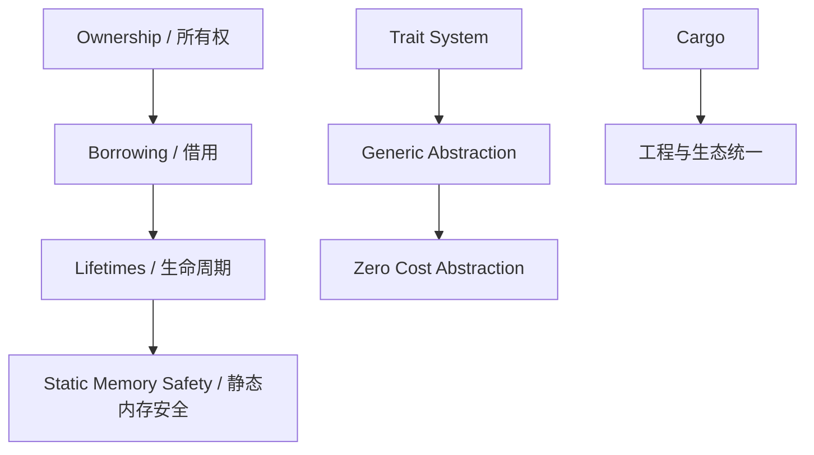
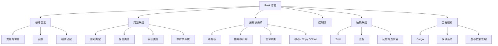
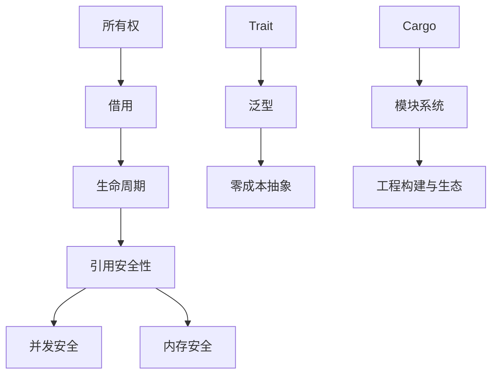
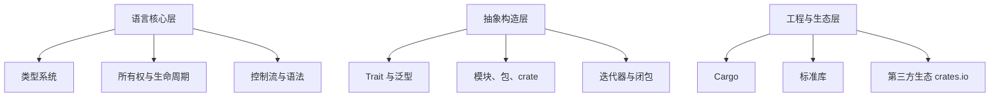
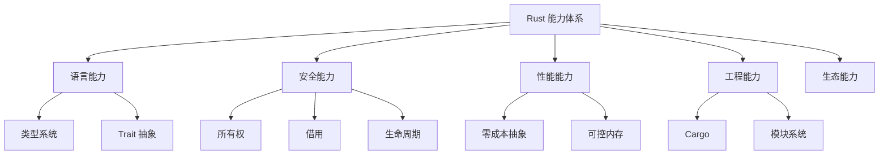
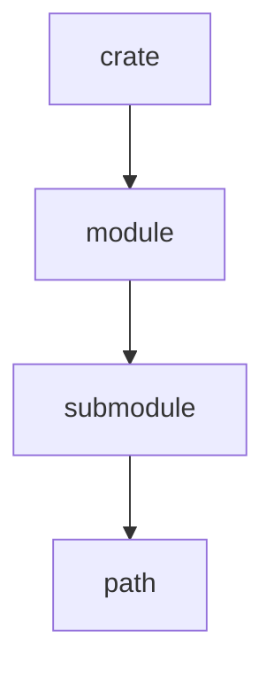

# Rust

---

## 概述

Rust 是一种以 **内存安全、并发安全与零成本抽象** 为核心目标的系统级编程语言。其独特的所有权系统与编译期静态检查让开发者在不依赖垃圾回收器（GC）的前提下获得安全与高性能。

Rust 主要应用于：

* 底层系统开发（操作系统、编译器、浏览器引擎）
* 高性能服务端
* 并发与分布式系统
* 嵌入式与物联网
* WebAssembly 生态

Rust 的核心价值在于使用严格的语言设计保证安全性，使得大量原本可能导致崩溃或未定义行为的问题在编译期即可被拒绝。

---

## 本质 / 定义

Rust 的本质可以抽象为以下几点：

* **安全性本质：所有权 + 借用 + 生命周期形成静态内存分析体系**
* **性能本质：零成本抽象、LLVM 编译、高度可预测的运行时**
* **抽象本质：Trait 系统提供基于行为的通用抽象能力**
* **工程本质：Cargo 作为统一的构建与包管理工具**

简化后的 Rust 本质模型：

Rust 是语言设计、编译器约束与工程体系三者共同构成的整体。

---

## 核心概念（Core Concepts）

Rust 的知识体系可以归纳为以下六大核心概念：

| 核心概念              | 定义                    | 作用          |
| ----------------- | --------------------- | ----------- |
| 所有权（Ownership）    | 每个值唯一所有者              | 静态管理内存生命周期  |
| 借用（Borrowing）     | 不转移所有权的使用权            | 实现引用与并发安全   |
| 生命周期（Lifetime）    | 借用的有效范围               | 编译期防止悬空引用   |
| 类型系统（Type System） | 强类型、显式类型推导            | 提供类型安全和泛型能力 |
| Trait（行为）         | 描述类型间共享行为的抽象          | 支持多态与零成本抽象  |
| 模块系统              | crate / module / path | 构建可组合的大型工程  |

这些核心概念贯穿 Rust 的所有特性。

---

## 分类体系（Taxonomy）

Rust 的语言元素可构造如下分类体系：

---

## 应用场景（Applications）

Rust 的应用场景可以按“安全性要求”与“性能要求”进行双维度分类。

| 类别          | 示例         | Rust 特性贡献       |
| ----------- | ---------- | --------------- |
| 系统级开发       | 内核、驱动、编译器  | 安全 + 无 GC + 高性能 |
| 并发高性能服务     | Web 服务、微服务 | 无数据竞争、异步生态      |
| 嵌入式系统       | IoT、ARM 设备 | 零开销、可靠性         |
| 数据密集系统      | 算法、金融、高频交易 | 内存安全 + 性能可预测    |
| WebAssembly | 前端性能模块     | 可移植 + 编译到 wasm  |

Rust 的核心竞争力在于：**安全性、性能、工程规范 三者同时具备**。

---

## 关联关系（Relations）

Rust 的核心机制形成了紧密的关系网络：

简化为一句话：

**所有权体系解决“安全”，Trait+泛型解决“抽象”，Cargo 解决“生态”。**

---

## 发展趋势（Evolution / Trends）

Rust 的技术演进在稳定性与生态扩张间保持平衡。

主要趋势如下：

| 方向              | 描述                         |
| --------------- | -------------------------- |
| 更强的类型系统         | GATs、类型级计算、specialization  |
| 更完善的异步体系        | async/await 与执行器生态趋于统一     |
| 更好的工具链          | rust-analyzer 稳定化、Cargo 扩展 |
| 更深的嵌入式支持        | no_std、裸机编程能力增强            |
| ABI 稳定与 C 互操作   | FFI、安全边界进一步强化              |
| WebAssembly 原生化 | 跨端运行与 Web 生态扩展             |

Rust 正由“系统编程语言”向“通用多领域语言”演进。

---

## Rust 语言体系的抽象模型（Model）

Rust 的整体语言模型可抽象为三层：

三层共同构成 Rust 的全局知识结构。

---

## Rust 能力体系（Capability System）

Rust 的能力可以拆解为以下五类能力体系：

### 语言能力

* 类型安全
* 控制流表达能力
* 基于行为的抽象（Traits）
* 模式匹配（match）

### 安全能力

* 编译期内存检查
* 数据竞争预防
* 引用规则
* 生命周期推导

### 性能能力

* 零成本抽象
* LLVM 优化
* 内存可控性（栈/堆分配）

### 工程能力

* Cargo 管理
* 单元测试、文档测试
* 包与依赖管理

### 生态能力

* crates.io
* Tokio（异步）
* Serde（序列化）
* WebAssembly 支持

---

## 关键能力树（示意）

---

## Rust 工程体系（Cargo 与模块系统）

### Cargo 的核心作用

* 项目管理（build / run / test）
* 依赖解析
* 工作空间管理
* 版本与发布管理

Cargo 的基本命令组成：

| 命令          | 功能     |
| ----------- | ------ |
| cargo new   | 创建工程   |
| cargo build | 编译     |
| cargo check | 快速类型检查 |
| cargo run   | 构建并运行  |
| cargo test  | 执行测试   |
| cargo doc   | 生成文档   |

### 模块系统结构

Rust 使用 crate → module → path 的三层结构管理代码：

---

## 总结（Conclusion）

Rust 是一个以 **编译期安全机制** 为核心，以 **高性能抽象能力** 为基础，并配备了 **完善工程化工具链** 的现代系统编程语言。

其知识体系可归纳为：

* **所有权体系 = 安全的根**
* **Trait 体系 = 抽象的根**
* **Cargo 体系 = 工程的根**

Rust 的设计哲学可总结为：

* 安全第一
* 性能不妥协
* 抽象零成本
* 工程一致化

## 关联内容（自动生成）

- [/编程语言/并发模型.md](/编程语言/并发模型.md) Rust的所有权系统是第三代并发模型的代表，通过类型系统约束实现内存安全，从根本上防止数据竞争
- [/编程语言/编程语言.md](/编程语言/编程语言.md) Rust体现了现代编程语言设计的多个核心概念，如类型系统、所有权模型、内存管理等
- [/编程语言/typescript.md](/编程语言/typescript.md) 与TypeScript的类型系统对比，Rust的类型系统更注重内存安全和零成本抽象
- [/编程语言/C++.md](/编程语言/C++.md) Rust和C++都关注内存安全和性能优化，但使用不同的方法：Rust通过所有权系统，C++通过RAII
- [/数据技术/数据网格.md](/数据技术/数据网格.md) 数据网格中的分布式类型系统与Rust的类型系统在确保数据一致性和安全性方面有相似理念
- [/DSL/GraphQL.md](/DSL/GraphQL.md) GraphQL的类型系统与Rust的类型系统都强调静态验证和类型安全的重要性
- [/软件工程/架构/架构.md](/软件工程/架构/架构.md) Rust语言特性支持构建具有长期生命周期的稳定系统架构
- [/软件工程/架构/系统设计/高并发.md](/软件工程/架构/系统设计/高并发.md) Rust的并发安全特性使其成为构建高并发系统的重要选择
- [/软件工程/架构/系统设计/缓存.md](/软件工程/架构/系统设计/缓存.md) Rust的内存管理机制在缓存系统设计中能有效防止内存泄漏和悬空指针
- [/编程语言/JAVA/JAVA并发编程/JAVA并发编程.md](/编程语言/JAVA/JAVA并发编程/JAVA并发编程.md) 对比Java的并发模型，Rust在编译时就通过所有权系统防止数据竞争
- [/中间件/数据库/数据库系统/事务管理/事务.md](/中间件/数据库/数据库系统/事务管理/事务.md) Rust的所有权概念在数据库事务管理中也有类似的应用价值，确保数据的一致性
- [/软件工程/微服务/微服务.md](/软件工程/微服务/微服务.md) Rust的零成本抽象和安全性使其适用于构建高性能的微服务系统
- [/计算机网络/IO模型.md](/计算机网络/IO模型.md) Rust的异步生态和所有权系统使其在高性能IO处理中表现优异
- [/软件工程/架构/系统设计/可观测性.md](/软件工程/架构/系统设计/可观测性.md) Rust的内存安全特性在构建可靠的可观测性系统中具有优势
