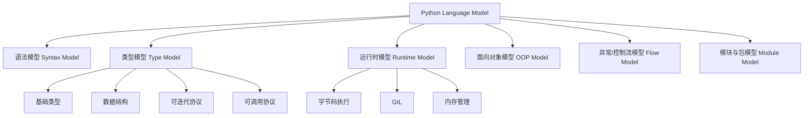
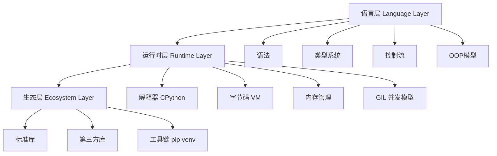
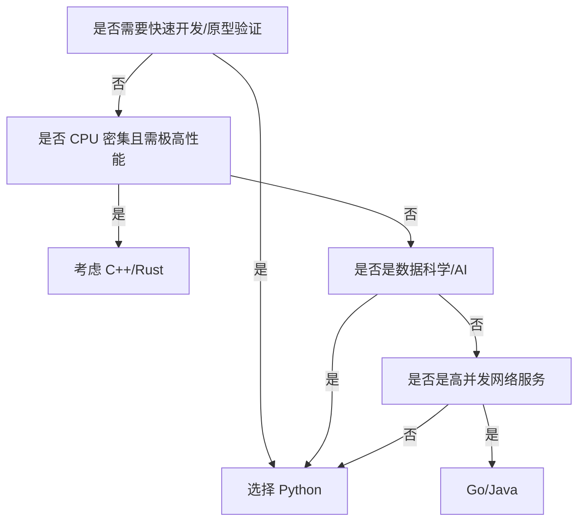

# Python

## 概述（Overview）

Python 是一种以“高可读性、强表达能力、快速开发能力”为核心特征的通用编程语言。其生态丰富、语法简洁、范式灵活，在数据科学、人工智能、系统脚本、Web 服务等领域形成了强势地位。

本知识文档旨在从体系化视角构建 Python 的**本质模型、能力体系、边界生态、治理与选型框架**，帮助技术团队在工程设计、架构规划和技术选型中形成一致的认知框架。

## 本质（Essence）

Python 的本质可归纳为三类特性模型：

### 语言本质模型

| 维度   | Python 的本质                         |
| ---- | ---------------------------------- |
| 语言哲学 | 简洁、可读、显式、优雅（PEP 20: Zen of Python） |
| 执行模型 | 解释执行、字节码虚拟机、动态类型、自动内存管理            |
| 范式支持 | 面向对象、函数式、命令式、元编程                   |
| 运行机制 | GIL（CPython）、即时编译可选（PyPy）、FFI 支持   |

### 抽象本质

Python 不是面向性能设计的语言，而是面向：

* **人类认知最优表达**
* **快速验证与迭代**
* **极高扩展性（C 扩展、反射、动态装载）**
* **生态驱动的生产力**

因此 Python 的核心价值不在于底层表达能力，而在于高层次抽象能力。

---

## 模型（Model）

Python 的抽象体系可以抽象为下图所示的“Python 语言模型树”。

模型结构说明：

* **语法模型** → 语言可读性与表达力
* **类型模型** → 基础类型 + 容器模型 + 动态类型系统
* **运行时模型** → CPython VM 驱动机制
* **OOP 模型** → 统一对象模型
* **控制流模型** → 条件、循环、异常
* **模块模型** → 模块化、包管理、import 机制

---

## 能力体系（Capability System）

从工程角度，Python 提供的开发能力可分为 6 大类：

### 基础表达能力

包括：

* 数据类型模型（int、float、str、bool、None）
* 核心数据结构（list、tuple、set、dict）
* 函数抽象能力（参数模型、返回值模型、闭包）
* 控制流（if、for、while、异常）

这些能力构成 Python 的最小可用开发单元。

---

### 抽象建模能力

Python 提供多种抽象方式：

* 类（Class）
* 对象（Object）
* 模块（Module）
* 函数与闭包（Closure）
* 装饰器（Decorator）
* 迭代器与生成器（Iterator/Generator）
* 上下文管理器（Context Manager）

这些机制共同构成 Python 高级抽象系统。

---

### 数据操作能力

以统一协议支撑，包括：

* 序列协议（切片、长度、遍历）
* 可迭代协议（`__iter__`）
* 可调用协议（`__call__`）
* 容器协议（`in`、`getitem`）

通过这些协议，Python 形成高度一致的数据操作体验。

---

### 执行与运行能力

* 解释执行（CPython）
* 动态加载模块
* 动态绑定属性
* 异常处理模型
* 内存自动管理（GC + 引用计数）
* 多线程/多进程并发模型

---

### 系统与生态能力

* 标准库（文件、网络、协议、进程）
* 包管理生态（pip、PyPI）
* 虚拟环境与依赖治理（venv/conda）
* C 扩展能力（原生性能扩展）

---

### 工程与生产能力

* 类型标注（Typing）
* 单元测试（unittest/pytest）
* 文档化（docstring/Sphinx）
* 打包与发布（setuptools）
* 异常治理能力

---

## 架构模型（Architecture Model）

Python 的架构体系可抽象为三层：

说明：

* **语言层**：定义 Python 的表达能力
* **运行时层**：定义 Python 的执行能力
* **生态层**：定义 Python 的扩展能力

三层相互协作形成完整体系。

---

## 类型体系（Taxonomy）

Python 类型系统可分为以下结构：

### 基础类型（Primitive）

| 类别   | 类型                | 说明      |
| ---- | ----------------- | ------- |
| 数值类型 | int、float、complex | 数学表达能力  |
| 布尔   | bool              | 流控/判断基础 |
| 空类型  | NoneType          | 空语义     |

---

### 序列类型（Sequence）

* list（可变序列）
* tuple（不可变序列）
* str（不可变字符序列）
* bytes/bytearray

特点：

* 有序
* 可切片
* 可迭代

---

### 集合类型（Set）

* set
* frozenset

用于集合运算与数学语义表达。

---

### 映射类型（Mapping）

* dict：Python 最重要的数据结构之一

---

### 协议型类型（Protocol）

由内置方法驱动：

| 协议      | 对应方法                    | 示例       |
| ------- | ----------------------- | -------- |
| 迭代协议    | `__iter__`、`__next__`   | for 循环   |
| 序列协议    | `__getitem__`、`__len__` | 切片       |
| 可调用协议   | `__call__`              | 装饰器、函数对象 |
| 上下文管理协议 | `__enter__`、`__exit__`  | with     |

---

## 边界与生态（Boundary & Ecosystem）

Python 的外部边界定义了其与外部系统的连接方式：

### 运行时边界

* CPython（主流）
* PyPy（JIT）
* Jython、IronPython（跨平台）

---

### 生态边界

| 领域   | 代表库                   |
| ---- | --------------------- |
| 数据科学 | NumPy、Pandas、SciPy    |
| 可视化  | Matplotlib、Plotly     |
| Web  | Django、Flask、FastAPI  |
| AI   | PyTorch、TensorFlow    |
| 分布式  | Celery、Ray            |
| 系统脚本 | subprocess、os、pathlib |

---

### 性能边界

Python 的性能限制主要来自：

* GIL
* 解释执行
* 内存模型

性能优化路径：

* C 扩展
* NumPy 矩阵计算
* PyPy/JIT
* 多进程替代多线程
* 协程（asyncio）

---

## 治理体系（Governance System）

### 风险治理

* 类型风险 → 使用 typing + mypy
* 依赖风险 → 使用 venv/conda + requirements.txt/poetry
* 运行时错误 → 完善异常体系
* 性能风险 → 分析 GIL 与 CPU 密集型场景

---

### 代码治理

* PEP 8 代码规范
* black/isort 自动化格式化
* flake8/pylint 静态检查
* pytest 单元测试
* Sphinx 文档化

---

### 环境治理

* 虚拟环境隔离（venv）
* 多版本管理（pyenv）
* 包管理（pip、poetry）

---

## 演进趋势（Evolution）

Python 的发展呈现以下趋势：

### 类型系统增强

* typing 扩展（PEP 484）
* 类型推断逐步增强
* mypy/pyright 流行

### 性能提升

* Python 3.12 带来显著性能提升
* PEP 703：无 GIL Python（未来版本）
* 更多 JIT 技术（PyPy、Pyjion）

### 并发生态完善

* asyncio 成为标准
* Trio、Curio 等结构化并发框架出现

### 工程化增强

* poetry 成为新主流包管理工具
* CI/CD 深入 Python 项目

---

## 选型方法论（Selection Framework）

### Python 适用场景

| 场景      | 适用度 | 原因            |
| ------- | --- | ------------- |
| 数据科学/AI | 极高  | 生态最强          |
| 快速原型    | 极高  | 语法表达能力强       |
| Web 服务  | 高   | Flask/FastAPI |
| 自动化脚本   | 极高  | 标准库完善         |
| 高性能计算   | 中   | 需结合 C 扩展      |
| 超高并发内核  | 较低  | GIL 限制        |

---

### 语言选型决策树

---

## 总结（Conclusion）

Python 是一种以“表达力”与“生态力”为核心的现代语言。
其体系的核心在于：

* **统一对象模型**
* **高度一致的数据协议**
* **动态运行时的灵活性**
* **强大的生态系统**
* **优秀的工程化工具链**

## 关联内容（自动生成）

- [/编程语言/编程语言.md](/编程语言/编程语言.md) 该文档系统阐述了编程语言的本质模型、类型系统和执行模型，与Python的解释执行、动态类型和多范式支持特性密切相关
- [/编程语言/编程范式/面向对象.md](/编程语言/编程范式/面向对象.md) Python支持面向对象编程范式，该文档深入探讨了面向对象的核心概念和设计原则，与Python的OOP模型直接相关
- [/编程语言/编程范式/函数式编程.md](/编程语言/编程范式/函数式编程.md) Python支持函数式编程范式，该文档详细介绍了函数式编程的核心概念，与Python的函数式编程能力密切相关
- [/数据技术/机器学习.md](/数据技术/机器学习.md) Python在人工智能和机器学习领域应用广泛，该文档介绍了机器学习相关概念，与Python在AI领域的应用紧密关联
- [/数据技术/数据分析.md](/数据技术/数据分析.md) Python是数据科学领域的重要工具，该文档涵盖了数据分析相关概念，与Python的数据处理能力紧密相关
- [/编程语言/JAVA/JVM/字节码执行引擎.md](/编程语言/JAVA/JVM/字节码执行引擎.md) 该文档阐述了基于字节码的解释执行机制，与Python的字节码虚拟机执行模型有相似之处
- [/编程语言/并发模型.md](/编程语言/并发模型.md) Python的并发模型主要通过GIL和asyncio实现，该文档系统探讨了各种并发模型，与Python的并发处理方式相关
- [/软件工程/架构/数据系统.md](/软件工程/架构/数据系统.md) 该文档讨论了函数式编程在数据系统中的应用，与Python在数据科学和系统处理方面有密切关系
- [/中间件/web中间件/web中间件.md](/中间件/web中间件/web中间件.md) Python广泛应用于Web服务开发(Django、Flask)，该文档阐述了Web服务器相关概念，与Python的Web开发能力相关
- [/数据技术/数据仓库.md](/数据技术/数据仓库.md) Python在数据科学和数据处理领域有广泛应用，与数据仓库和数据科学领域密切相关

