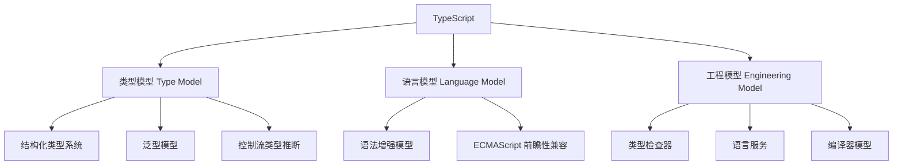
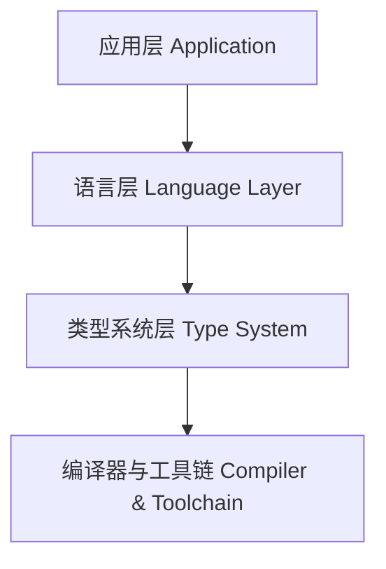

# TypeScript

## 概述（Overview）

TypeScript 是在 JavaScript 之上构建的 **可选静态类型系统** 与 **工程化开发语言**。其使命是通过类型、工具链、编译模型和结构化语义增强，使 JavaScript 开发在规模化、复杂度、协作和生命周期维度具备更高的可控性与可维护性。

文档将从本质、模型、能力体系到生态与趋势，构建一个完整、抽象级别更高的 TypeScript 知识体系。

---

## 本质（Essence）

### TypeScript 的本质由三部分组成：

1. **类型系统本质（Type System Essence）**
   在动态语言 JavaScript 之上构建 **显式、可推断、结构化、可组合** 的类型系统，使程序具有“开发期行为约束”。

2. **语言增强本质（Language Layer Essence）**
   通过语法增强（类、接口、装饰器、模块等）与 ECMAScript 规范保持前瞻性，对 JavaScript 进行“未来式扩展”。

3. **工程化本质（Engineering Essence）**
   通过编译器、IDE 服务、诊断能力、类型检查、代码智能（IntelliSense）等提升大型项目的正确性、可维护性、可演化性。

---

## 模型（Model）

### TypeScript 的核心模型可以从三个维度理解：

---

## 能力体系（Capability System）

TypeScript 的能力可被组织如下：

### 类型能力

| 能力            | 描述                                     |
| ------------- | -------------------------------------- |
| 原始类型          | string、number、boolean、symbol 等         |
| 对象类型          | interface、type、class 结构类型              |
| 可选、必选、只读属性    | `?`、`readonly`                         |
| 联合类型          | A | B                                  |
| 交叉类型          | A & B                                  |
| 类型推断          | 基于赋值、函数返回值、控制流                         |
| 泛型            | 类型参数化能力                                |
| Utility Types | `Partial<T>`、`Pick<T>`、`Record<K,T>` 等 |
| 装饰器类型支持       | 类、方法、属性装饰器                             |

---

### 语言能力

| 范畴     | 内容                        |
| ------ | ------------------------- |
| 函数增强   | 默认值、可选参数、rest 参数、箭头函数、生成器 |
| 类与面向对象 | 构造函数、继承、修饰符、抽象类           |
| 模块系统   | ES Modules（export/import） |
| 结构化赋值  | 数组与对象解构                   |
| 安全访问   | 可选链 `?.`、非空断言 `!`         |

---

### 工程能力

| 能力        | 描述                         |
| --------- | -------------------------- |
| 类型检查      | 编译期全量静态检查                  |
| 编译能力      | 将 TS 转换为目标 JavaScript      |
| SourceMap | 调试映射支持                     |
| 语言服务（LS）  | IDE 智能提示、跳转、重构             |
| 项目化管理     | tsconfig、声明文件 `.d.ts`、项目引用 |

---

## 架构模型（Architecture Model）

TypeScript 的架构由四层组成：

### 各层职责说明

| 层级    | 职责                       |
| ----- | ------------------------ |
| 应用层   | 工程代码、业务逻辑、框架代码           |
| 语言层   | 类、接口、函数、语法糖等语言能力         |
| 类型系统层 | 类型分析、推断、检查、错误诊断          |
| 编译器层  | AST 生成、类型检查、JS 输出、IDE 服务 |

---

## 边界与生态（Boundary & Ecosystem）

### 与 JavaScript 的边界

| 边界       | 说明                      |
| -------- | ----------------------- |
| 类型不参与运行时 | 类型仅在编译期存在，无法用于运行期逻辑     |
| TS 是超集   | 所有合法 JS 都是 TS           |
| 与规范前沿同步  | TS 经常先于 ECMAScript 采纳特性 |

---

### 生态

| 生态组件     | 描述                            |
| -------- | ----------------------------- |
| Node.js  | TS 后端常用运行环境                   |
| 前端框架     | React、Vue、Angular 大规模采用 TS    |
| 构建工具     | ts-node、esbuild、swc、vite      |
| 声明生态     | DefinitelyTyped 提供丰富的 `.d.ts` |
| tsserver | IDE 语言服务的核心                   |

---

## 治理体系（Governance System）

TypeScript 项目的可控性需要治理体系：

### 代码级治理

* 严格模式（strict）
* noImplicitAny
* noUnusedLocals
* noUnreachableCode
* 禁止 any 滥用策略
* 模块边界（public API）约束

### 项目级治理

* 统一 tsconfig 基线
* 项目引用（Project References）
* 声明文件管理
* 版本管理与兼容策略

### 团队协作治理

* 类型约定与命名规范
* interface / type 使用规范
* 泛型使用规范
* 代码审查（Type Review）

---

## 演进趋势（Evolution）

TypeScript 的未来趋势包括：

| 趋势          | 内容                              |
| ----------- | ------------------------------- |
| 更强的类型推断     | 基于控制流图的智能类型分析                   |
| 更轻量的类型系统    | 减少类型系统复杂度，引入 narrower inference |
| 与 JS 规范更趋一致 | Decorator、Records/Tuples 等对齐    |
| 构建链路语言化     | 更快编译、更强增量能力                     |
| 工具化增强       | IDE 中的实时类型分析、错误修复建议             |

---

## 选型方法论（Selection Framework）

当考虑是否采用 TypeScript，可依据以下决策维度：

### 决策表

| 决策维度     | 使用 TS 的价值 | 建议                   |
| -------- | --------- | -------------------- |
| 项目规模     | 中大型       | 强烈建议                 |
| 团队协作人数   | 多人        | 强烈建议                 |
| 代码可维护性要求 | 高         | 强烈建议                 |
| 对运行时性能要求 | 高影响？      | TS 类型不影响运行时，无需担心     |
| 动态场景较多   | 类型不稳定     | 适度使用 union、unknown   |
| 快速实验性项目  | 类型价值低     | 可选 TypeScript 或直接 JS |

---

## 总结（Conclusion）

TypeScript 是一套以 **类型系统** 为核心、以 **语言层增强** 为骨架、以 **工程化工具链** 为支撑的完整开发体系。
它为 JavaScript 世界补足了大型工程最缺失的：**可维护性、可演化性、可控制性、协作效率**。

在当今前端与全栈开发世界，TypeScript 已从“可选技术”演变为“默认技术”。
掌握 TypeScript，本质上是掌握 **如何在动态语言之上构建稳定、清晰、可规模化演进的工程系统**。

## 关联内容（自动生成）

- [/编程语言/JavaScript/JavaScript.md](/编程语言/JavaScript/JavaScript.md) TypeScript 基于 JavaScript 扩展而来，继承了 JavaScript 的所有基础类型、变量声明、类型转换等核心概念，理解 JavaScript 是掌握 TypeScript 的前提
- [/编程语言/JavaScript/React.md](/编程语言/JavaScript/React.md) React 与 TypeScript 结合使用可实现强类型 React 应用开发，TypeScript 提供的类型系统能有效提升 React 组件的可维护性和开发效率，是前端工程化的重要实践
- [/编译原理/编译原理.md](/编译原理/编译原理.md) TypeScript 的编译器实现涉及词法分析、语法分析、语义分析、代码生成等经典编译原理，理解编译原理有助于深入掌握 TypeScript 类型检查与代码转换机制
- [/编程语言/JavaScript/Node/NodeJs.md](/编程语言/JavaScript/Node/NodeJs.md) Node.js 作为 TypeScript 的重要运行环境，使 TypeScript 在后端开发中得到广泛应用，体现了 TypeScript 跨平台的工程化能力
