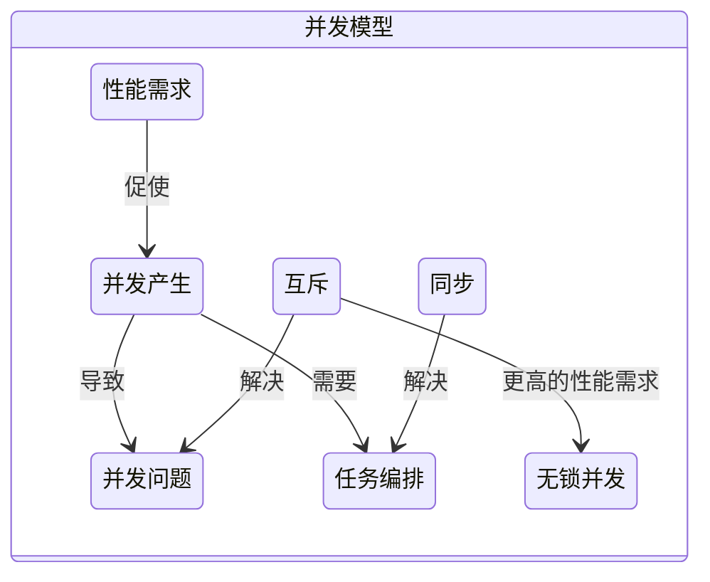
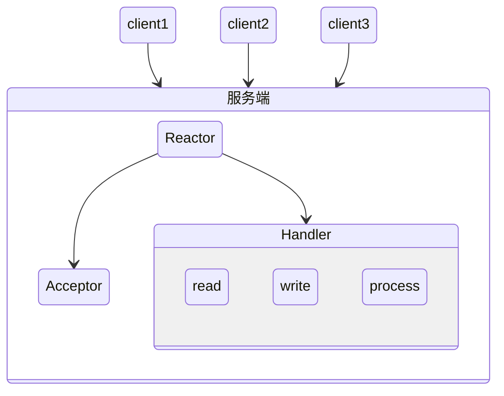
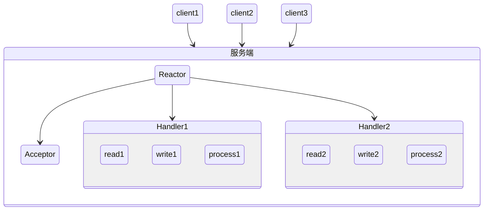
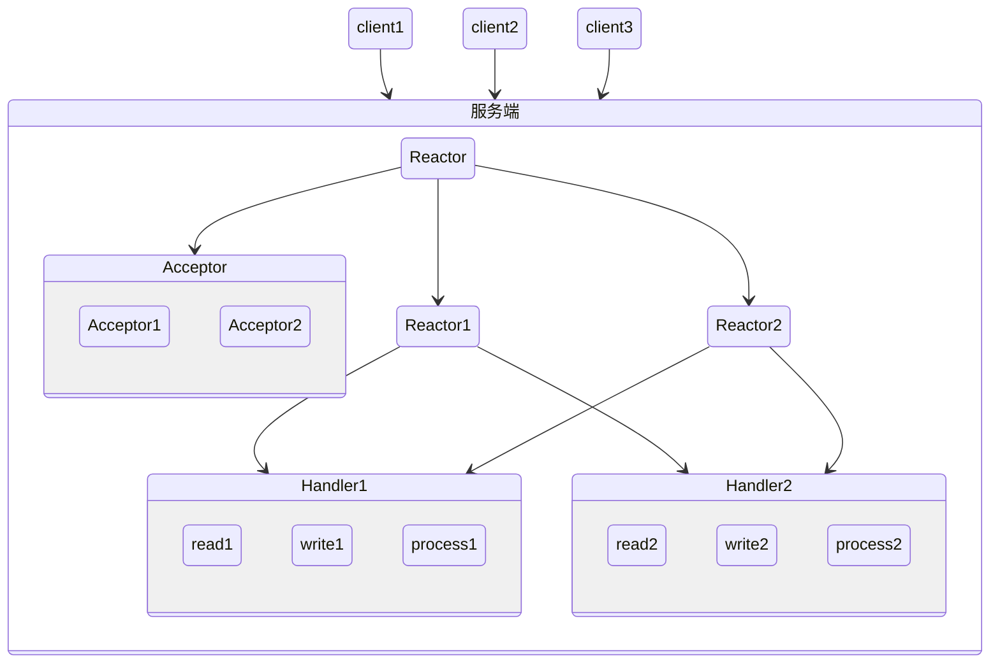

# 并发模型

并发编程可以抽象为：

- 分工
- 同步
- 互斥



- 并发与并行

并行架构：

- bit-level并行：从32位到64位
- 指令级并行：流水线技术、乱序执行
- 数据级并行：GPU的几百个核心并行对图像处理
- 任务级并行：多处理机系统

## 线程与锁

该模型是对底层硬件运行过程的形式化 适用面很广

没有为并行提供直接的支持

- 竞态条件
- 内存可见性
- 死锁

## 函数式编程

- 可变状态造成的风险

函数式代码可以随意改变其执行顺序 所以可以让相互独立的函数并行执行

## 协程

## Actor


- 保留了可变状态 只是不共享（每个Actor只存在于属于自己的线程内）
- 单条不可变消息传输（使用mailbox）
- Actor之间通过消息交互
- 任其崩溃
- 天生分布式

```
Actor 是一种基础的计算单元，包含三种能力：

- 处理能力，处理接收到的消息
- 存储能力，Actor 可以存储自己的内部状态，并且内部状态在不同 Actor 之间是绝对隔离的
- 通信能力，Actor 可以和其他 Actor 之间通信
一个 Actor 接收的一条消息之后，这个 Actor 可以做以下三件事：
1. 创建更多的 Actor
2. 发消息给其他 Actor
3. 确定如何处理下一条消息。
```

### 操作

#### Create

父Actor创建管理子Actor，父Actor需要决定子Actor崩溃时采取的措施


#### Send

- 发送消息

#### Become

- 状态机

## 软件事务内存

借鉴数据库事务，借助 MVCC 等思想，使得能在编程语言层支持 ACI 三种特性，但由于诸如 IO 等操作无法回滚，所以这种模型应用是有局限性的

```java
class Account{
  //余额
  private TxnLong balance;
  //构造函数
  public Account(long balance){
    this.balance = StmUtils.newTxnLong(balance);
  }
  //转账
  public void transfer(Account to, int amt){
    //原子化操作
    atomic(()->{
      if (this.balance.get() > amt) {
        this.balance.decrement(amt);
        to.balance.increment(amt);
      }
    });
  }
}
```

## 通信顺序进程（CSP）

解决了 Actor 模型之间无法共享内存的问题，比如 Go 引入了一个 channel，实现了一个生产者消费者的阻塞通信模型，相较于 Actor 的 mailbox 明确归属于一个特定的 Actor，是 Actor 模型中的内部机制，而 channel 则是 Actor 之间共用的。第二个区别是 Actor 模型中发送消息是非阻塞的，而 CSP 模型中是阻塞的

## 数据并行

- opencl


## Lambda架构

## 并发编程设计模式

### 单线程执行模式（Single Threaded Execution）

- 临界区

通过对代码块进行同步，使之同一时刻只能有一个线程执行，以此确保安全性

### 不可变模式（Immutable）

将对象的所有状态设计成无法变化就可以确保安全性。

达到这个目的的常用手段有final修饰类、变量以及不暴露相关修改状态的接口。

不可变模式所有的修改操作都创建一个新的不可变对象，可以通过享元模式避免创建重复对象提升性能

### 写时复制模式（Copy on Write）

在真正需要复制的时候才复制出一份数据的副本，最大的应用领域在函数式编程，为了减少每次 Write 的性能损耗，Write 可以不 Write 全部，而是只 Write 一部分

### 守卫暂停模式（Guarded Suspension）

本质上是一种等待唤醒机制的实现，通过让线程进行等待来保证对象实例的安全性，只有当状态满足某个条件时，等待的线程才能解除阻塞

锁获取 阻塞队列等都是属于这种模式

等待可以通过Object.wait方法 获取也可以使用自旋锁的忙等待

### Balking

通过维护一个守护条件，当守护条件不满足时，将直接返回，后续的所有操作放弃，值得注意的是这个守护条件要保证内存可见性

与守卫暂停模式的区别在守卫暂停会一直等待守护条件成立，而Balking当不成立时就放弃

在这两者之间可以存在一种等待一段时间放弃的做法，叫做超时

### 生产者-消费者模式（Prdocer-Consumer）

通过加入一个中间层，来消除数据生产者与获取者之间的速度差异带来的安全问题，同时也能支持异步及批量以提升性能

### 读写锁模式（Read-Write Lock）

数据并发读写没有问题，但要想修改它只能有一个线程，并且没有其他线程进行读操作

适合读多写少的场景，可以有效提升性能

### 每消息一线程模式（Thread-Per-Message）

为每个任务分配一个独立的线程。这是一种最简单的分工方法，实现起来也非常简单

传统的socket编程就采用的这种方式 一个请求进来 开启一个新线程来处理

但创建线程是一个重量级的操作，引入协程可以避免创建线程的大量开销

### 工作线程模式（Worker Thread）

为了解决每消息一线程频繁开启新新线程带来的开销，通过维护几个工作线程，任务一来直接交给这些工作线程来处理

线程池就属于该模式

### Future模式

持有一个引用 在等待结果时可以不进行阻塞

### 两阶段终结模式（Tow-Phase-Termination）


通过检查线程中断状态以及自己设计的停止标志配合使用来达到清理与提升吞吐量的目的

检查标志可在进行长时间处理操作之前检查，检查标志也需要保证可见性

是一种实现优雅关闭的手段

```java
volatile stop = false
while(!stop) {
  doSomething()
}

func stop() {
  this.stop = true
}
```

### 线程特有存储模式（Thread-Specific Storage）

为每个线程分配属于线程自己的存储空间 避免竞争带来的数据安全问题

- 存储在线程外：ThreadLocal
- 存储在线程内：Thread成员变量

### 活跃对象模式（Active Object）

- Actor模式

会通过自己特有的线程在合适的时机消费外部接收到的额异步请求

## Reactor 模型

Reactor 模型是一种处理并发服务请求的事件设计模式，当主流程收到请求后，通过多路分离处理的方式，把请求分发给相应的请求处理器处理

- Reactor：负责监听和分配事件。收到事件后分派给对应的 Handler 处理，事件包括连接建立就绪、读就绪、写就绪等
- Acceptor：负责处理客户端新连接。Reactor 接收到客户端的连接事件后，会转发给 Acceptor，Acceptor 接收客户端的连接，然后创建对应的 Handler，并向 Reactor 注册此 Handler
- Handler：请求处理器，负责业务逻辑的处理，即业务处理线程

单 Reactor 单线程模型，特点是 Reactor 和 Handler 都是单线程的串行处理：



单 Reactor 多线程模型，业务逻辑处理 Handler 变成了多线程：



主从 Reactor 多线程模型，在单 Reactor 多线程模型的基础上让 Reactor 也变成多线程：


