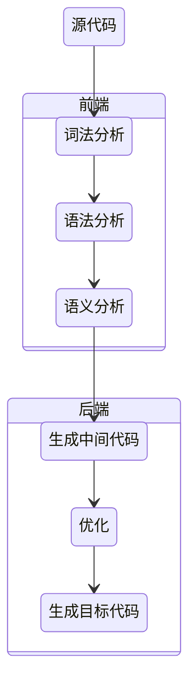
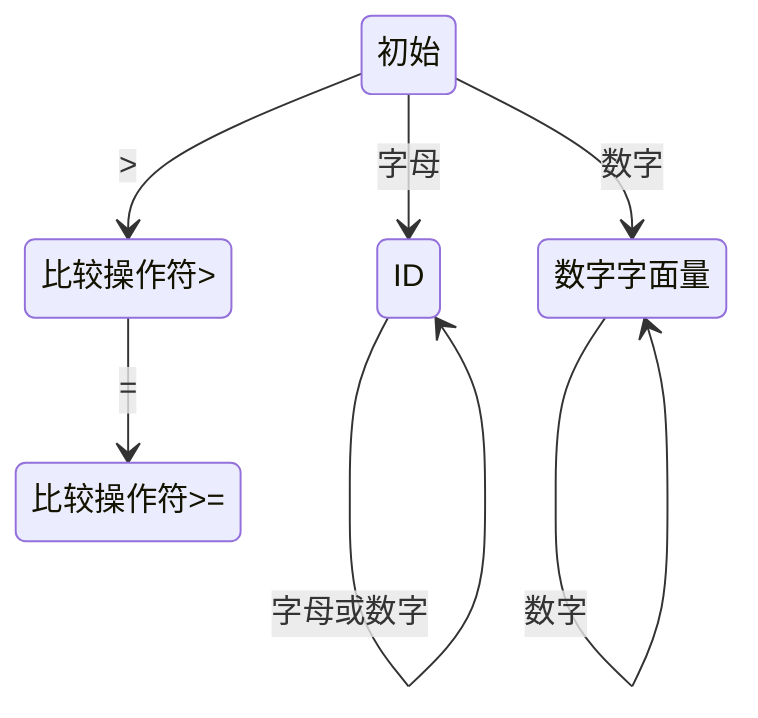

# 编译原理



## 词法分析

### 有限自动机

要实现一个词法分析器，首先需要写出每个词法的正则表达式，并画出有限自动机，之后，只要用代码表示这种状态迁移过程就可以了

age >= 45 的此法解析自动机：



```java
DfaState newState = DfaState.Initial;
if (isAlpha(ch)) {              //第一个字符是字母
    newState = DfaState.Id; //进入Id状态
    token.type = TokenType.Identifier;
    tokenText.append(ch);
} else if (isDigit(ch)) {       //第一个字符是数字
    newState = DfaState.IntLiteral;
    token.type = TokenType.IntLiteral;
    tokenText.append(ch);
} else if (ch == '>') {         //第一个字符是>
    newState = DfaState.GT;
    token.type = TokenType.GT;
    tokenText.append(ch);
}
```

使用正则表达式描述词法：

```js
Id :        [a-zA-Z_] ([a-zA-Z_] | [0-9])*
IntLiteral: [0-9]+
GT :        '>'
GE :        '>='
```
