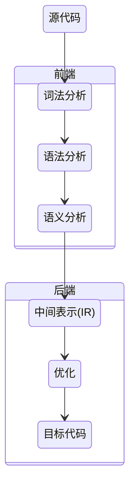
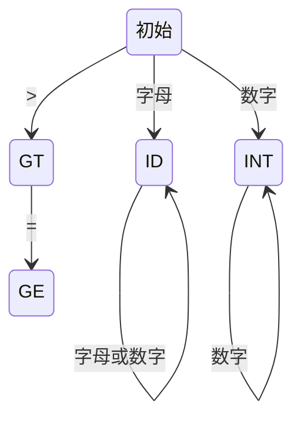

# 编译原理

## 一、编译的第一性原理

### 1. 编译的本质是什么？

**编译的本质，是把不确定的、模糊的人类表达，转换为确定的、可执行的机器结构。**

这一过程解决三个根本问题：

1. **结构识别（Structure Recognition）**
   从字符流中识别“有意义的结构”。
2. **语义约束（Semantic Constraints）**
   判断结构在语义层面是否“合理”。
3. **执行映射（Execution Mapping）**
   将语义映射为某种可执行形式。

所有编译器设计，无论语言、工具、平台如何变化，都围绕这三点展开。

---

## 二、编译器的稳定整体结构

### 1. 经典编译器分层模型



> **分层不是实现习惯，而是复杂性控制手段。**

每一层只解决一个不可回避的本质问题，并向下游提供稳定输出。

---

### 2. 各阶段的输入、输出与不变量

| 阶段   | 输入      | 输出          | 不变量（稳定知识）    |
| ---- | ------- | ----------- | ------------ |
| 词法分析 | 字符流     | Token 流     | 正则语言 / 有限自动机 |
| 语法分析 | Token 流 | AST         | 上下文无关文法      |
| 语义分析 | AST     | 注解 AST / IR | 类型系统、作用域     |
| 中间表示 | AST     | IR          | 语言无关抽象       |
| 优化   | IR      | IR          | 语义等价         |
| 代码生成 | IR      | 目标代码        | 指令模型         |

这张表是**高度稳定的知识资产**，几乎不随语言或工具变化。

---

## 三、词法分析：从字符到符号

### 1. 词法分析解决什么问题？

> **问题本质：字符本身没有语义，必须先被分组成“符号”。**

词法分析的目标不是“理解程序”，而是：

* 把连续字符切分为最小有意义单元（Token）
* 丢弃无语义内容（空白、注释）

---

### 2. 为什么有限自动机可以胜任？

* 编程语言的词法规则 = **正则语言**
* 正则语言 ⇔ 有限自动机（DFA / NFA）

因此：

> **词法分析是一个纯粹的状态迁移问题。**

---

### 3. 示例：`age >= 45`



> 这里不存在“上下文”“嵌套”“优先级”等复杂问题。

---

### 4. 正则表达式只是另一种描述方式

```text
Id          : [a-zA-Z_] ([a-zA-Z_] | [0-9])*
IntLiteral  : [0-9]+
GE          : '>='
```

**正则 ≠ 实现方式，只是规则描述语言。**

---

## 四、语法分析：从符号到结构

### 1. 为什么需要语法分析？

Token 序列本身仍然是线性的，而程序结构是**层次化的**。

语法分析解决的问题是：

> **这些符号是否能组成合法的结构？**

---

### 2. 上下文无关文法（CFG）

上下文无关的含义是：

> 一个产生式的使用，不依赖它所处的位置。

```text
add ::= mul | add + mul
mul ::= pri | mul * pri
pri ::= Id | Num | (add)
```

CFG 是结构化语言的最低必要表达能力。

---

### 3. AST：结构的最终载体

以 `2 + 3 * 5` 为例：

```text
additive
├── Int(2)
└── multiplicative
    ├── Int(3)
    └── Int(5)
```

> AST 不关心如何写，只关心**是什么结构**。

---

### 4. 递归下降与左递归消除

递归下降的本质：

> **文法结构 = 函数调用结构**

左递归问题不是语法问题，而是**实现问题**。

```text
add  -> mul add'
add' -> + mul add' | ε
```

EBNF 本质是对 CFG 的一种工程友好扩展。

---

## 五、语义分析：结构是否“合理”

### 1. 语义分析解决什么？

语法正确 ≠ 语义正确。

```text
int a = "hello";   // 语法正确，语义错误
```

语义分析关注：

* 类型系统
* 作用域
* 符号绑定
* 运算合法性

---

### 2. 语义的结果不是“报错”，而是**信息补全**

语义分析通常产生：

* 类型注解 AST
* 或直接生成 IR

---

## 六、中间表示（IR）：编译器的核心资产

### 1. 为什么一定要 IR？

> **IR 是前端与后端的解耦边界。**

* 前端复杂、多样
* 后端依赖平台

IR 是稳定核心。

---

### 2. IR 的关键特征

* 语言无关
* 明确控制流 / 数据流
* 易于分析与优化

LLVM IR 是经典实践，但 IR 这一思想本身是稳定知识。

---

## 七、优化：在不改变语义的前提下

优化的唯一约束：

> **语义等价**

优化不是“更快”，而是：

* 删除冗余
* 合并等价结构
* 改写执行路径

---

## 八、ANTLR：解析器生成器的工程形态（非稳定层）

### 1. 抽象视角下的 ANTLR

ANTLR ≠ 编译原理本身，而是：

> **形式化文法 + 自动代码生成**

Yacc / Bison / ANTLR 本质相同。

---

### 2. 工程示例的定位

* g4 文件
* Java 代码
* 命令行工具

都属于：

> **工程实现示例（不稳定知识）**

理解思想即可，无需长期记忆细节。

---

## 九、编译思想的泛化应用

编译原理不是“写语言”的专利。

| 场景  | 编译思想          |
| --- | ------------- |
| SQL | 查询 → 执行计划     |
| 前端  | AST → 转译 / 优化 |
| DSL | 规则 → 执行模型     |
| 正则  | 模式 → 自动机      |

> **凡是“表达 → 结构 → 执行”的系统，都是编译问题。**

---

## 十、总结：稳定认知地图

* 编译 ≠ 技术细节
* 编译 = 一种复杂系统拆解方法
* 分层、抽象、约束，是其不变内核

**学会编译原理，真正得到的是：**

> 如何把混乱的问题，拆解为可验证、可演进、可执行的结构。

## 关联内容（自动生成）

- [/编程语言/JAVA/JVM/字节码.md](/编程语言/JAVA/JVM/字节码.md) 这篇文档详细介绍了JVM字节码的结构和指令，与编译原理中的中间表示和代码生成阶段密切相关
- [/编程语言/JAVA/JVM/字节码执行引擎.md](/编程语言/JAVA/JVM/字节码执行引擎.md) 介绍了字节码执行引擎的实现，与编译原理中编译后代码的执行相关联
- [/DSL/正则表达式.md](/DSL/正则表达式.md) 正则表达式与编译原理中的词法分析密切相关，是实现词法分析器的重要工具
- [/编程语言/JAVA/JVM/JAVA内存模型.md](/编程语言/JAVA/JVM/JAVA内存模型.md) 介绍了Java内存模型，与编译器实现和优化中涉及的并发和内存访问问题相关
