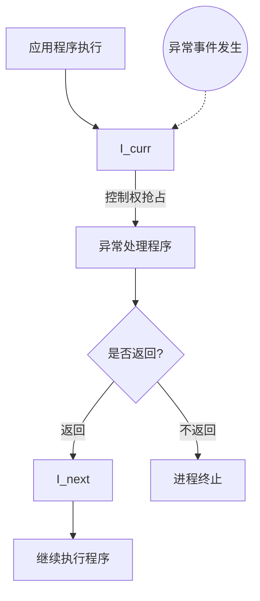
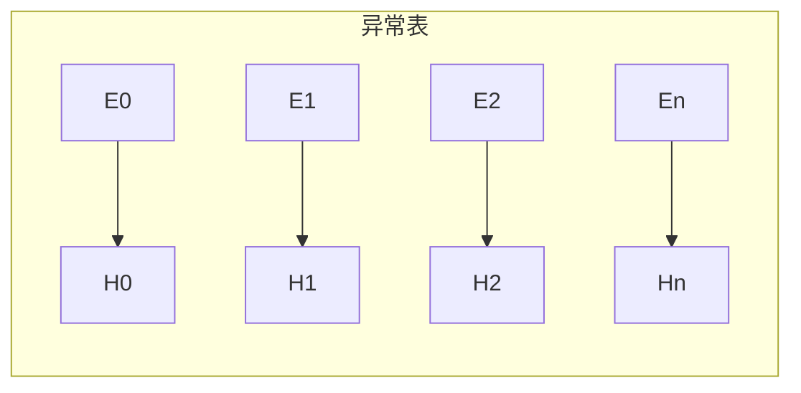

# 异常控制流

## 一、第一性原理：为什么需要异常控制流

### 1. 顺序控制流的假设与局限

经典程序模型假设：

* 指令按程序计数器（PC）**顺序执行**
* 控制流**完全由程序显式决定**
* 所有行为都可通过函数调用与返回表达

但真实计算机系统中，存在大量**无法由顺序控制流表达的情形**：

| 场景       | 顺序控制流的问题   |
| -------- | ---------- |
| I/O 设备完成 | 程序无法轮询所有设备 |
| 外部中断     | 程序无法预测发生时间 |
| 错误与异常    | 错误发生点不可控   |
| 系统调用     | 必须跨越权限边界   |

👉 **结论（第一性原理）**：

> 顺序控制流不足以描述“被动、抢占、跨层”的控制转移。

---

### 2. 异常控制流的本质定义

> **异常控制流（ECF）**
> 是一种由**硬件或系统触发的、非程序显式指定的控制权转移机制**，
> 用于在**不可预测或必须立即处理**的情况下打断当前指令流。

异常不是“错误”，而是：

* **控制权抢占机制**
* **硬件—操作系统—程序之间的协作协议**

---

## 二、统一模型：异常控制流在系统中的位置

### 1. 控制流的完整分类

```text
控制流（Control Flow）
├── 顺序控制流（Normal Flow）
│   └── 函数调用 / 返回
└── 异常控制流（Exceptional Flow）
    ├── 异步异常（中断）
    └── 同步异常
        ├── 陷阱（Trap）
        ├── 故障（Fault）
        └── 终止（Abort）
```

👉 这是**稳定认知模型**，独立于具体 CPU / OS 实现。

---

### 2. 指令级抽象：I_curr 与 I_next

* **I_curr**：当前正在执行的指令
* **I_next**：顺序控制流下的下一条指令

异常的本质差异，体现在：

> **异常返回时，控制权究竟回到哪里？**

---

## 三、异常的系统级执行模型（硬件 → 软件）



### 关键认知点

* **异常的触发与捕获在硬件层完成**
* **异常的语义处理在软件（OS / Handler）层完成**
* 程序本身**无法拒绝异常**

---

## 四、异常 ≠ 函数调用（架构级对比）

异常常被类比为“函数调用”，但这只在**表象层成立**。

| 维度    | 函数调用 | 异常                    |
| ----- | ---- | --------------------- |
| 触发主体  | 程序显式 | 硬件 / OS               |
| 是否可预测 | 可预测  | 不可预测                  |
| 控制权   | 调用方  | 被抢占                   |
| 栈     | 用户栈  | 用户栈 / 内核栈             |
| 返回点   | 唯一   | I_curr / I_next / 不返回 |

👉 **结论**：

> 函数调用是**协作式控制转移**，
> 异常是**抢占式控制转移**。

---

## 五、异常处理的系统机制

### 1. 异常表（Exception Table）

* 异常通过**异常号（Exception Code）**标识
* 异常号由：

  * CPU（算术错误、缺页）
  * OS（I/O 中断）
    分配



👉 异常表是**硬件与操作系统之间的稳定接口**。

---

### 2. 异常发生时，系统必须完成的三件事

1. **保存上下文**

   * 所有通用寄存器
   * 程序计数器
2. **切换执行环境**

   * 用户态 → 内核态
   * 用户栈 → 内核栈
3. **决定返回语义**

   * 是否返回
   * 返回到哪里

---

## 六、异常的四种基本类型（统一抽象）

| 类型 | 触发原因   | 同步性 | 返回行为       | 本质      |
| -- | ------ | --- | ---------- | ------- |
| 中断 | I/O 设备 | 异步  | 总是 I_next  | 外部事件通知  |
| 陷阱 | 程序主动   | 同步  | 总是 I_next  | 服务请求    |
| 故障 | 可修复错误  | 同步  | I_curr 或终止 | 延迟完成    |
| 终止 | 不可修复错误 | 同步  | 不返回        | 系统一致性保护 |

---

## 七、典型异常流程（认知验证）

### 1. 中断：异步抢占

* 当前指令完成后
* 控制权被抢占
* 返回到 **I_next**

👉 用于**响应外部世界**

---

### 2. 陷阱（系统调用）

* 程序主动触发
* 用于跨越**权限边界**
* 返回到 **I_next**

👉 是**受控的异常**

---

### 3. 故障（Fault）

* 当前指令语义暂时无法完成
* 处理程序修复环境
* **重新执行 I_curr**

👉 本质是**“延迟完成”**

---

### 4. 终止（Abort）

* 错误不可恢复
* 为保护系统一致性
* **直接终止进程**

---

## 八、Linux / x86-64 中的异常（概念映射）

| 异常     | 抽象类型 | 是否返回 | 含义       |
| ------ | ---- | ---- | -------- |
| 除法错误   | 终止   | 否    | 指令语义非法   |
| 缺页     | 故障   | 是    | 地址映射延迟   |
| 一般保护故障 | 终止   | 否    | 权限/一致性破坏 |
| 机器检查   | 终止   | 否    | 硬件不可恢复错误 |

👉 这些只是**抽象模型的具体实例**。

---

## 九、用户态的异常控制流：非本地跳转

### 1. setjmp / longjmp 的本质

```c
int setjmp(jmp_buf env);
void longjmp(jmp_buf env, int val);
```

> **setjmp / longjmp 是在用户态模拟异常控制流的机制**

它们实现了：

* 手动保存执行上下文
* 非结构化的控制流跳转

---

### 2. 与硬件异常的本质对比

| 维度    | 硬件异常 | setjmp / longjmp |
| ----- | ---- | ---------------- |
| 触发    | 硬件   | 程序               |
| 上下文保存 | 自动   | 人工               |
| 安全性   | 高    | 低                |
| 可维护性  | 强约束  | 易破坏结构            |

👉 它们揭示了：
**异常控制流是一个通用思想，而不仅是硬件特性。**

## 关联内容（自动生成）

- [/计算机系统/在系统上运行程序/链接.md](/计算机系统/在系统上运行程序/链接.md) 链接过程与异常控制流在系统级执行模型中密切相关，特别是在处理动态链接和运行时符号解析时涉及异常处理机制
- [/操作系统/进程与线程.md](/操作系统/进程与线程.md) 进程与线程的实现中涉及中断和异常处理，操作系统通过异常机制来实现进程调度和线程切换
- [/操作系统/操作系统.md](/操作系统/操作系统.md) 操作系统是异常控制流的主要处理者，提供了中断、异常和系统调用的完整处理框架，与异常控制流的系统级执行模型密切相关
- [/计算机系统/程序结构和执行/处理器体系架构.md](/计算机系统/程序结构和执行/处理器体系架构.md) 处理器体系架构定义了异常和中断的硬件机制，是异常控制流实现的硬件基础
- [/计算机系统/程序结构和执行/总线.md](/计算机系统/程序结构和执行/总线.md) 总线系统在硬件层面支持中断信号的传输，是异常控制流硬件实现的重要组成部分
- [/操作系统/输入输出.md](/操作系统/输入输出.md) I/O系统大量使用中断机制，是异常控制流在设备管理中的典型应用
- [/操作系统/内存管理.md](/操作系统/内存管理.md) 内存管理中的缺页异常是故障类型异常的典型实例，与异常控制流中的故障处理机制密切相关
- [/计算机网络/网络编程.md](/计算机网络/网络编程.md) 网络编程中的异步I/O和事件驱动模型体现了异常控制流的思想，与中断和异步异常处理有相似之处
- [/编程语言/并发模型.md](/编程语言/并发模型.md) 并发模型中的异常处理机制与系统级异常控制流在设计理念上有相通之处，都涉及控制流的非预期转移
- [/软件工程/架构/系统设计/可用性.md](/软件工程/架构/系统设计/可用性.md) 系统可用性设计需要考虑异常处理策略，与异常控制流的系统级处理思想相关
- [/操作系统/安全.md](/操作系统/安全.md) 操作系统安全机制中的异常处理（如保护故障）是异常控制流在安全领域的重要应用
- [/计算机系统/计算机系统.md](/计算机系统/计算机系统.md) 计算机系统概述与异常控制流同属系统级概念，共同构成了对计算机系统运行机制的完整理解
