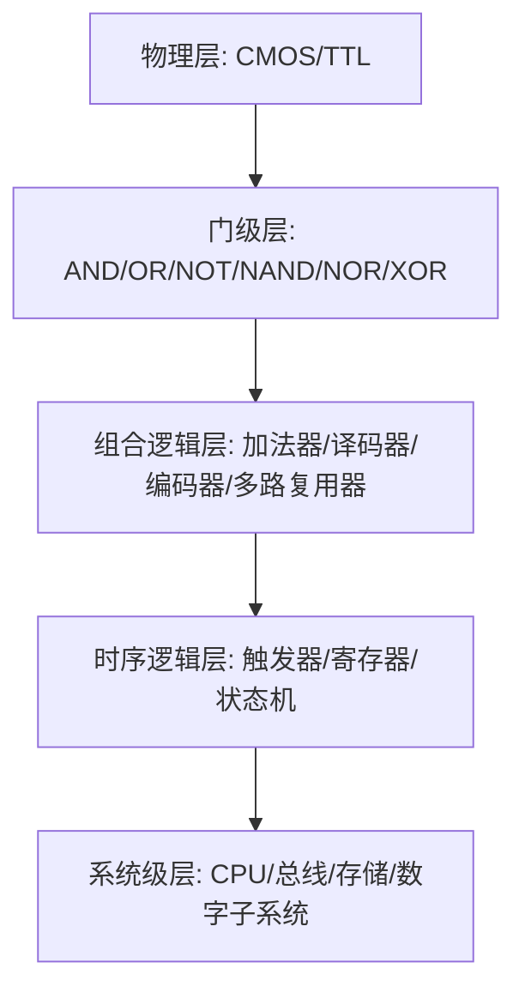

# 数字逻辑电路基础

### 概述（Overview）

数字逻辑电路是现代计算系统的物理—逻辑基础，它将 **物理世界的连续信号** 抽象为 **离散逻辑变量**，并通过逻辑代数、结构组合与时序控制构建出整个数字系统，包括 CPU、存储系统、通信设备与嵌入式硬件。

数字逻辑电路是一种 **数学逻辑 → 电子器件 → 信息处理能力** 的系统化映射。在抽象层面，它是一套使用有限符号进行可靠计算的体系；在工程层面，它是由 CMOS 晶体管构成的门级逻辑网络；在架构层面，它是所有高层计算模型（指令集、编译器、协议）的载体。

---

## 本质（Essence）

数字逻辑电路的本质可归纳为三条：

#### 离散化本质

将连续的电压空间压缩为两个稳定区间（逻辑 0 / 逻辑 1），构建 **抗噪声的二元信息系统**。

#### 逻辑映射本质

使用布尔代数描述输入到输出的可组合、可形式化、可推理的逻辑关系，使硬件具备确定性计算能力。

#### 物理计算本质

通过晶体管控制电流流动构造逻辑门，形成具备 **时序性、延迟性、功率限制与噪声边界** 的实际电子系统。

数字逻辑电路 = **抽象逻辑运算 × 物理可靠实现 × 工程规模化方法**

---

## 模型（Model）

数字逻辑体系建立在三大核心模型之上：

#### 信号模型

将物理电压映射为离散逻辑值：

| 模型   | 含义                  |
| ---- | ------------------- |
| 模拟信号 | 连续变化                |
| 离散信号 | 限定若干区间              |
| 数字信号 | 仅允许有限稳定状态（常为 0 / 1） |

数字体系通过 **阈值 + 噪声容限** 保证可区分性。

#### 代数模型

布尔代数提供逻辑函数的数学描述：

* 基本运算：与、或、非
* 复合运算：与非、或非、异或、同或
* 规则：代入、对偶、反演
* 化简：卡诺图、代数化简

逻辑函数是数字电路设计的核心表达模型。

#### 结构模型

将逻辑函数映射到物理结构：

* 组合逻辑：输出仅依赖当前输入
* 时序逻辑：输出依赖输入 + 状态（寄存器/触发器）
* 门级结构：NAND、NOR、XOR 等
* 层级结构：模块 → 子系统 → 完整系统

---

## 能力体系（Capability System）

数字逻辑电路作为“信息处理系统”的底层，具有以下核心能力：

#### 表示能力

通过不同数制、编码、逻辑变量表示数据：

* 二进制、十六进制、八进制
* BCD、Gray、ASCII
* 奇偶校验码

#### 运算能力

提供基础算术与逻辑运算：

* 加减乘除
* 补码运算
* 逻辑组合与布尔函数化简

#### 决策能力

通过真值表、最小项、最大项定义函数决策空间。

#### 控制能力

通过时序逻辑决定系统状态变化：

* 时钟、门控、选通
* 状态机（Moore/Mealy）

#### 可靠性能力

处理非理想物理环境：

* 噪声容限
* 竞争与冒险（hazards）
* 时序约束（setup/hold）

#### 规模化能力

通过模块化构建复杂电路：

* 加法器、译码器、编码器
* 多路复用器、数据选择器
* ALU、查找表、寄存器文件

---

## 架构模型（Architecture Model）

数字逻辑电路整体架构可分为五层：

每一层都为上一层提供抽象：

* 物理层解决“如何实现 0 与 1”
* 门级层解决“基本逻辑单元如何构建”
* 组合层解决“如何编排逻辑函数”
* 时序层解决“如何产生状态与历史”
* 系统层解决“如何构建可编程计算机”

---

## 类型体系（Taxonomy）

#### 从逻辑功能划分

| 类型   | 特征       | 示例              |
| ---- | -------- | --------------- |
| 组合逻辑 | 没有记忆     | 加法器、编码器、译码器     |
| 时序逻辑 | 有状态、依赖时钟 | 寄存器、计数器、状态机     |
| 混合结构 | 组合 + 时序  | CPU、ALU、数字信号处理器 |

#### 从电路实现划分

| 类型   | 特征        | 描述         |
| ---- | --------- | ---------- |
| CMOS | 低功耗、高噪声容限 | 现代主流       |
| TTL  | 响应早期快、功耗高 | 已被 CMOS 取代 |

#### 从逻辑运算单元划分

* 基本逻辑门（与/或/非）
* 复合逻辑门（与非、或非、异或）
* 可编程逻辑（PLA、FPGA LUT）

---

## 边界与生态（Boundary & Ecosystem）

数字逻辑电路的边界分为三类：

#### 上层边界：抽象计算体系

* ISA（指令集架构）
* 编译器
* 操作系统、程序运行模型
  数字逻辑为这些抽象模型提供物理载体。

#### 下层边界：半导体材料与工艺

* CMOS 制程、FinFET、GAAFET
* 存储器工艺（Flash/SRAM/DRAM）
  其物理特性决定数字逻辑的速度、功耗与集成度。

#### 旁路生态：可编程硬件

* FPGA
* CPLD
* ASIC
  它们让数字逻辑具备可重构能力。

---

## 治理体系（Governance System）

数字逻辑设计需要保证功能正确性、时序安全与工程可扩展性，涉及：

#### 行为治理

* 函数正确性（真值表一致）
* 逻辑化简（降低面积与功耗）
* 消除竞争冒险

#### 时序治理

* 建立时间（setup）
* 保持时间（hold）
* 时钟偏移（clock skew）

#### 可靠性治理

* 噪声容限
* 电源完整性
* 温度漂移

#### 工程治理

* 模块化
* 层级化
* 可综合 RTL 设计（HDL）

---

## 演进趋势（Evolution）

数字逻辑电路的发展沿着三个方向演进：

#### 技术层：晶体管工艺缩放

* 摩尔定律推动更多门、更低功耗、更快速度
* GAAFET、纳米片技术突破传统平面工艺

#### 架构层：从门级设计到可编程逻辑

* PLA / PAL → FPGA → 高层次综合（HLS）
* 数字系统由 HDL 转向“软件化设计”

#### 应用层：从通用计算向专用计算扩展

* 神经网络加速器（NPU）
* DSP
* 低功耗 IoT 芯片
* 安全芯片（加密功能电路）

---

## 选型方法论（Selection Framework）

数字逻辑设计需在以下维度做权衡：

| 决策因素  | 选择方向             |
| ----- | ---------------- |
| 功耗    | CMOS 优先          |
| 延迟    | 工艺/布线优化、逻辑深度削减   |
| 面积    | 逻辑化简、NAND/NOR 实现 |
| 可重构能力 | FPGA、CPLD        |
| 成本    | 采用标准逻辑器件或 MCU 替代 |

决策思路：
**稳定性优先（可靠） → 功耗 → 性能 → 成本 → 灵活性**

---

## 总结（Conclusion）

数字逻辑电路不仅是"电子器件的组合"，更是一整套从逻辑推理到物理实现的 **系统性工程**。

它的稳定知识结构如下：

* **本质层**：离散化、逻辑映射、物理计算
* **模型层**：信号、布尔代数、门级结构
* **能力层**：表达、运算、控制、可靠性、规模化
* **架构层**：组合 → 时序 → 系统级
* **治理层**：正确性、时序完整性、噪声容限
* **演进层**：工艺缩放、可编程逻辑、专用计算

## 关联内容（自动生成）

- [/计算机系统/计算机系统.md](/计算机系统/计算机系统.md) 数字逻辑电路是计算机系统的硬件基础，构成了冯诺依曼计算机的物理实现，与CPU、存储器等部件通过总线连接形成完整计算机系统
- [/计算机系统/程序结构和执行/处理器体系架构.md](/计算机系统/程序结构和执行/处理器体系架构.md) 处理器体系架构基于数字逻辑电路构建，包含运算器、控制器等核心组件，实现指令的取指、译码、执行等过程
- [/计算机系统/程序结构和执行/指令系统.md](/计算机系统/程序结构和执行/指令系统.md) 指令系统的实现依赖于数字逻辑电路，通过操作码、寻址方式等设计实现对硬件的控制，是软硬件接口的桥梁
- [/计算机系统/程序结构和执行/运算方法与运算器.md](/计算机系统/程序结构和执行/运算方法与运算器.md) 运算方法与运算器是数字逻辑电路的重要应用，实现定点数运算及溢出检测等功能，构成CPU运算单元
- [/计算机系统/在系统上运行程序/链接.md](/计算机系统/在系统上运行程序/链接.md) 链接过程将程序代码转化为可在硬件上执行的指令，体现了从软件到硬件的映射，与数字逻辑电路构成的硬件基础密切相关
- [/计算机系统/程序结构和执行/总线.md](/计算机系统/程序结构和执行/总线.md) 总线是数字逻辑电路的实际应用，作为计算机系统各部件间信息传输的通道，实现了处理器、存储器和I/O设备的互连
- [/操作系统/输入输出.md](/操作系统/输入输出.md) I/O系统涉及CPU与外部设备的数据传输，其硬件实现基于数字逻辑电路，通过中断、DMA等方式实现高效数据传输
- [/操作系统/内存管理.md](/操作系统/内存管理.md) 内存管理涉及对物理存储器的访问，其硬件基础是数字逻辑电路构成的存储系统，通过地址映射实现虚拟内存管理
- [/计算机网络/网络安全/网络协议安全.md](/计算机网络/网络安全/网络协议安全.md) 网络安全协议的实现依赖于底层硬件的安全性，数字逻辑电路的可靠性和安全性直接影响网络通信安全
- [/中间件/数据库/数据库优化.md](/中间件/数据库/数据库优化.md) 数据库性能优化涉及对CPU、IO、内存等硬件资源的管理，与数字逻辑电路构成的硬件平台密切相关
- [/中间件/数据库/redis/Redis.md](/中间件/数据库/redis/Redis.md) Redis性能受CPU和内存性能影响，其高并发处理能力依赖于底层硬件的数字逻辑电路设计
- [/编程语言/C.md](/编程语言/C.md) C语言与硬件密切相关，其指针、内存操作等特性直接映射到底层数字逻辑电路构成的硬件资源
- [/计算机系统/程序结构和执行/汇编.md](/计算机系统/程序结构和执行/汇编.md) 汇编语言是机器指令的符号表示，直接对应于数字逻辑电路实现的CPU指令系统
