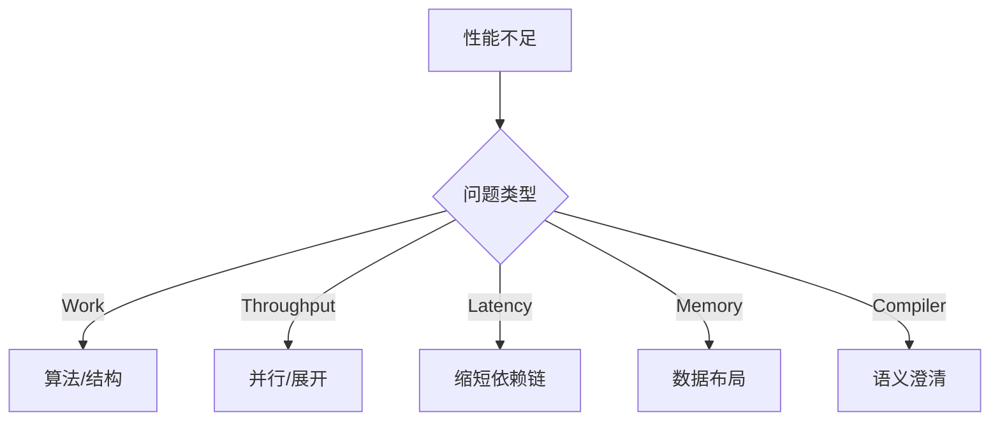

# 程序性能优化

## 一、问题域总览（Performance Problem Space）

一切性能问题，本质上都可归约为以下五类之一或其组合：

| 问题类型               | 核心受限因素 | 典型症状               | 首要优化方向     |
| ------------------ | ------ | ------------------ | ---------- |
| Work‑limited       | 算法工作量  | CPU 时间随输入规模线性/指数增长 | 算法与数据结构    |
| Throughput‑limited | 执行单元吞吐 | IPC 偏低、流水线空泡       | 指令级并行、结构重排 |
| Latency‑limited    | 依赖链长度  | 单核延迟高、乱序空间不足       | 缩短依赖链      |
| Memory‑limited     | 内存层级   | Cache miss 高、带宽打满  | 数据布局与局部性   |
| Compiler‑limited   | 编译器约束  | 优化未生效              | 程序结构与语义澄清  |

> **核心原则**：性能分析必须先完成“问题分类”，否则任何优化都是盲目的。

---

## 二、第一性原理（Essence）

程序性能由四个不可约要素决定：

### 1. Work（工作量）

系统实际执行的计算总量，由算法范式与数据结构决定。

### 2. Constraint（约束）

由编译器规则、处理器微架构与内存体系施加的物理与语义边界。

### 3. Parallelism（并行性）

系统在不同层级可同时推进的计算能力：

* 算法级并行（任务 / 数据）
* 指令级并行（ILP）
* 存储级并行（流水、预取）

### 4. Mapping（映射）

抽象计算如何被映射为真实硬件执行：
程序 → IR → ISA → 微架构执行单元。

> **性能 = 抽象计算结构与物理执行模型的匹配效率**

---

## 三、统一模型体系（Core Models）

### 3.1 计算模型（Computation Model）

* 操作数量（复杂度）
* 依赖图（DAG）决定最小延迟
* 可并行度决定吞吐上限

### 3.2 编译器模型（Compiler Model）

* **安全边界**：别名、副作用、不确定语义
* **优化通道**：内联、循环优化、标量替换
* **阻断因素**：分支、函数调用、内存访问

### 3.3 处理器模型（Processor Model）

* 流水线与乱序执行
* 寄存器重命名
* 多发射与执行端口
* 多级缓存层次

#### 性能统一抽象：

> **Performance = min(Work, Throughput, Dependency Latency, Memory Bandwidth)**

---

## 四、核心抽象到工程能力的映射

| 原理要素        | 模型支撑      | 工程能力 | 典型策略        |
| ----------- | --------- | ---- | ----------- |
| Work        | 计算模型      | 算法能力 | 算法替换、数据结构优化 |
| Constraint  | 编译器 / 硬件  | 结构设计 | 消除别名、简化控制流  |
| Parallelism | DAG / ILP | 并行构造 | 循环拆分、展开、多累积 |
| Mapping     | 全链路       | 协作能力 | 编译器友好结构     |

---

## 五、能力体系（Capability System）

### 5.1 算法与数据能力

* 算法范式选择
* 缓存友好数据布局
* 时间 / 空间局部性设计

### 5.2 程序结构能力

* 控制依赖重构
* 数据依赖最小化
* 可优化循环结构

### 5.3 编译器协作能力

* 内联边界设计
* 别名消除（restrict、局部变量）
* 纯函数与无副作用表达

### 5.4 架构适配能力

* 指令并行利用
* 缩短依赖链
* 分支预测压力控制

### 5.5 性能治理能力

* 瓶颈识别
* 数据驱动决策
* 回归防线建设

---

## 六、程序到硬件的架构映射模型

> **原则**：不同层级的优化必须在对应模型中生效。

---

## 七、优化策略分类（Taxonomy）

1. **减少 Work**：算法、数据结构
2. **提升可优化性**：结构简化、局部性
3. **释放编译器潜力**：语义明确、别名消除
4. **适配微架构**：并行、依赖链、分支
5. **内存体系优化**：访问模式与带宽利用

---

## 八、性能治理：从工具到控制论

### 8.1 监控（Signal Acquisition）

* 时间、带宽、失效率、停顿

### 8.2 诊断（State Estimation）

* Work vs Constraint 判断
* DAG 与缓存行为分析

### 8.3 治理（Feedback Control）

* 成本函数（Latency / Throughput）
* 回归检测与基准体系

> Profiling 工具只是信号采集器，而非优化本身。

---

## 九、反模式与认知误区（Anti‑Patterns）

* 未分类即优化
* 将结构问题当作指令问题
* 期待编译器“理解业务语义”
* 过早微优化

---

## 十、演进趋势（Model‑Driven Evolution）

* 自动化增强：指令级并行、向量化
* 人工主导：数据布局、并行结构设计
* 假设失效：单核性能持续提升
* 新常态：异构计算与专用加速器

> **未来核心能力**：结构化并行性与数据局部性设计。

---

## 十一、统一决策框架（Selection Framework）

---

## 十二、总结

程序性能优化不是代码技巧，而是：

* 对计算本质的理解
* 对执行模型的尊重
* 对结构设计的重视
* 对系统治理的坚持

**优化性能，本质上是重构计算，使其更符合物理执行规律。**

## 关联内容（自动生成）

- [/计算机系统/程序结构和执行/处理器体系架构.md](/计算机系统/程序结构和执行/处理器体系架构.md) 涵盖了超标量、流水线、指令级并行等处理器微架构知识，与本文档中处理器模型和指令级并行概念密切相关
- [/计算机系统/程序结构和执行/存储器层次结构.md](/计算机系统/程序结构和执行/存储器层次结构.md) 详细介绍了缓存优化、存储器层次结构等与性能优化密切相关的知识点，特别是缓存友好数据结构和内存访问模式优化
- [/算法与数据结构/算法策略.md](/算法与数据结构/算法策略.md) 提供了算法优化策略，包括动态规划、分治法、贪心算法等内容，支撑本文档中的算法能力部分
- [/操作系统/linux/Linux性能优化.md](/操作系统/linux/Linux性能优化.md) 从系统层面介绍了性能优化技术，包括CPU绑定、NUMA优化、IO优化等，与程序性能优化的系统性工程视角相关
- [/编程语言/JAVA/JAVA并发编程/Disruptor.md](/编程语言/JAVA/JAVA并发编程/Disruptor.md) 展示了无锁设计、环形队列等高性能并发设计模式，体现了本文档中并行性优化的具体实现
- [/编程语言/JAVA/高级/Stream流.md](/编程语言/JAVA/高级/Stream流.md) 介绍了Java中的并行流处理，展示了算法层面的并行优化技术，与文档中的并行性部分有关
- [/中间件/浏览器/前端性能优化.md](/中间件/浏览器/前端性能优化.md) 从前端角度探讨性能优化，补充了性能优化在不同技术栈的应用
