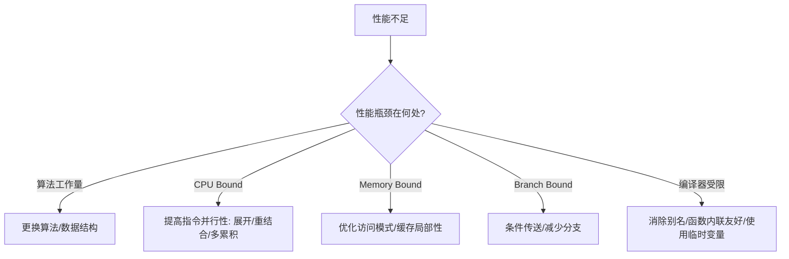

## 程序性能优化

### Overview（概述）

程序性能优化是一门以 **计算模型、体系结构原理、程序语义特性** 为基础，通过 **算法、程序结构、编译器、处理器微架构** 共同驱动的系统性工程。其目标不是写出"更快的代码"，而是构建一种 **面向性能的认知框架**，使工程师能够理解并控制程序在底层系统中的真实行为。

本体系文档将性能优化从零散技巧提升到 **原理层、模型层、架构层、方法论层**，从而得到可迁移、可演化、可复用的知识。

---

## Essence（本质）

程序性能的本质是：

#### **1. 工作量（Work）**

执行“做了多少事”，由算法、数据结构、计算模型决定。

#### **2. 约束（Constraints）**

由编译器规则、处理器微架构、内存体系结构等决定性能边界（吞吐量界限、延迟界限）。

#### **3. 并行性（Parallelism）**

包括：

* 算法层并行（任务/数据并行）
* 指令级并行（ILP）
* 内存访问并行（预取、流水线）

#### **4. 映射（Mapping）**

程序 → 编译器中间表示 → ISA → 微架构执行单元
性能＝逻辑结构如何映射到物理计算资源的效率。

> 优化不是“让代码更快”，而是让 *抽象的计算* 与 *底层执行模型* 更匹配。

---

## Model（模型）

以下三个核心模型构成性能优化的理论基础：

### **计算模型（Computation Model）**

反映算法的操作数量、依赖结构
● 依赖图（DAG）决定最小延迟
● 可并行度决定可达到吞吐量

### **编译器模型（Compiler Model）**

反映编译器可以/不能做的优化
● 安全性约束：别名分析、副作用、不确定语义
● 优化通道：循环优化、内联、标量替换、常量传播
● 阻塞因素：分支、函数调用、内存访问

### **处理器模型（Processor Model）**

现代处理器的核心特征：
● 流水线
● 乱序执行
● 寄存器重命名
● 多发射（superscalar）
● 多级缓存层次

#### 简化抽象：

**性能 = min(算法工作量，计算单元吞吐量，延迟依赖链，内存带宽)**

---

## Capability System（能力体系）

性能优化能力体系包括：

### **算法能力（Algorithmic Capability）**

* 选择最优算法范式
* 构建缓存友好数据结构
* 数据局部性优化（空间局部性/时间局部性）

### **程序结构能力（Program Structure Capability）**

* 控制依赖结构（分支组织）
* 控制数据流结构（减少读写依赖）
* 设计可优化的循环结构

### **编译器协作能力（Compiler Collaboration Capability）**

理解并影响编译器的优化：

* 内联设计
* 循环展开友好结构
* 消除别名风险（restrict、局部变量、临时变量）
* 明确无副作用和纯函数逻辑

### **体系结构适配能力（Architecture Adaptation Capability）**

* 指令级并行利用
* 减少数据依赖链长度
* 缓存访问模式优化
* 减少分支预测压力

### **诊断与治理能力（Profiling & Governance Capability）**

* 性能瓶颈识别（如 gprof）
* 数据驱动优化策略
* 持续性能治理体系

---

## Architecture Model（架构模型）

以下模型展示程序如何映射到底层系统资源：

优化点分布于不同层级，对应不同原理。

---

## Taxonomy（类型体系）

性能优化可分为以下类型：

### **计算量优化（减少 Work）**

* 选择更优算法
* 更高效数据结构

### **结构优化（提高可优化性）**

* 减少函数调用开销
* 去除不必要的内存引用
* 提升局部性

### **编译器友好型优化（让编译器能做更多）**

* 无副作用函数
* 明确的循环边界
* 临时变量替代数组访问
* restrict 断言别名

### **硬件友好型优化（适配微架构）**

* 指令并行性：展开、重结合、多累积变量
* 减少依赖链长度
* 条件传送代替分支

### **内存体系优化**

* DRAM延迟隐藏
* 缓存友好访问模式
* 减少 Read-after-Write 依赖

---

## Boundary & Ecosystem（边界与生态）

### 编译器能做的：

* 内联（条件充分时）
* 循环展开
* 提取公共子表达式
* 常量传播
* 死代码删除
* 自动向量化

### 编译器不能做的：

* 推断函数是否有副作用
* 消除潜在别名
* 确定访问模式是否安全改变
* 自动选择更优算法
* 自动重构程序结构

> 编译器的边界决定需要程序员显式提供结构上的“优化空间”。

---

## Governance System（治理体系）

性能治理体系包括：

#### 监控

* gprof、perf、VTune、FlameGraph 等工具
* 侧重识别 *时间热点*、*内存瓶颈*、*分支失误*、*流水线停顿*

#### 诊断

* 识别 Work vs Constraint 问题
* DAG 分析操作依赖
* 缓存 miss 分析（加载 vs 存储）

#### 治理

* 标准化性能评估方法（CPE、吞吐量、延迟）
* 建立性能回归防线（自动化基准测试）

---

## Evolution（演进趋势）

* 编译器自动优化更强（例如：自动向量化、自动并行）
* 处理器从单核提频 → 多核 → 专用加速器
* 存储层级继续加深（HBM、NVRAM）
* 语言层面更多显式性能语义（如 Rust 的 alias 安全、C++ restrict 等）

未来的性能优化将更加依赖：

* **结构化并行性**
* **数据局部性设计**
* **领域专用计算加速器**

---

## Selection Framework（选型方法论）

在面对性能问题时需采用系统性决策：

### 决策树（示例）

---

## Conclusion（总结）

本体系文档把"优化程序性能"从零碎技巧升维为：

* 以 **原理** 为中心的知识体系
* 以 **计算模型 + 编译器模型 + 处理器模型** 为基础的抽象框架
* 以 **结构优化、编译器协作、体系结构适配** 为核心的方法论
* 以 **性能治理** 为闭环管理体系

**程序性能优化不是改进代码，而是重构计算过程，使其更符合底层执行模型的规律。**

## 关联内容（自动生成）

- [/计算机系统/程序结构和执行/处理器体系架构.md](/计算机系统/程序结构和执行/处理器体系架构.md) 涵盖了超标量、流水线、指令级并行等处理器微架构知识，与本文档中处理器模型和指令级并行概念密切相关
- [/计算机系统/程序结构和执行/存储器层次结构.md](/计算机系统/程序结构和执行/存储器层次结构.md) 详细介绍了缓存优化、存储器层次结构等与性能优化密切相关的知识点，特别是缓存友好数据结构和内存访问模式优化
- [/算法与数据结构/算法策略.md](/算法与数据结构/算法策略.md) 提供了算法优化策略，包括动态规划、分治法、贪心算法等内容，支撑本文档中的算法能力部分
- [/操作系统/linux/Linux性能优化.md](/操作系统/linux/Linux性能优化.md) 从系统层面介绍了性能优化技术，包括CPU绑定、NUMA优化、IO优化等，与程序性能优化的系统性工程视角相关
- [/编程语言/JAVA/JAVA并发编程/Disruptor.md](/编程语言/JAVA/JAVA并发编程/Disruptor.md) 展示了无锁设计、环形队列等高性能并发设计模式，体现了本文档中并行性优化的具体实现
- [/编程语言/JAVA/高级/Stream流.md](/编程语言/JAVA/高级/Stream流.md) 介绍了Java中的并行流处理，展示了算法层面的并行优化技术，与文档中的并行性部分有关
- [/中间件/数据库/mysql/performance.md](/中间件/数据库/mysql/performance.md) 介绍了数据库性能监控与优化方法，扩展了性能优化在数据存储层面的应用
- [/中间件/浏览器/前端性能优化.md](/中间件/浏览器/前端性能优化.md) 从前端角度探讨性能优化，补充了性能优化在不同技术栈的应用
