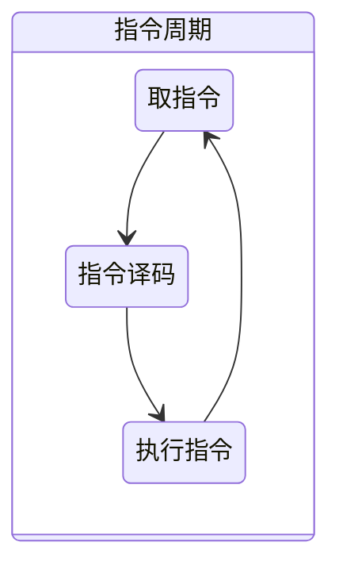

# 处理器体系架构

## 中央处理器

**组成**

-  运算器 数据加工
-  控制器 程序执行/指令执行

**主要功能**


**主要寄存器**


**操作控制器**

取指令，将机器指令译码并生成执行部件控制信号序列 ，建立正确的数据通路，从而完成指令的正确执行

### 数据通路

- 执行部件间传送信息的路径
- 不同指令、同一指令在执行的不同阶段的数据通路不同

**分类**

- 共享通路（总线）
  - 主要部件都连接在公共总线上，各部件间通过总线进行数据传输
  - 结构简单，实现容易，但并发性较差，需分时使用总线，效率低
- 专用通路
  - 并发度高，性能佳，设计复杂，成本高
  - 可以看做多总线结构

#### 数据通路抽象模型（寄存器传输）


- 单总线结构：2个锁存器，3个时钟周期


- 双总线结构：1个锁存器，2个时钟周期


- 三总线结构：0个锁存器，1个时钟周期


总线越多，性能越好

### 指令周期

不同指令功能不同，数据通路不同，执行时间不同，如何安排时序



1. 取指令：从 PC 寄存器里找到对应的指令地址，根据指令地址从内存里把具体的指令，加载到指令寄存器中，然后把 PC 寄存器自增，好在未来执行下一条指令
2. 指令译码：根据指令寄存器里面的指令，解析成要进行什么样的操作
3. 执行指令：根据特定的指令，进行算术逻辑操作、数据传输或者直接的地址跳转

#### 基本概念

时钟周期 = 节拍脉冲 = 震荡周期 能完成一次微操作

机器周期 = CPU周期 从主存读出一条指令的最短时间 可完成 复杂操作

指令周期：从主存取一条指令并执行指令的时间


#### 指令控制同步

- 定长指令周期：早期三级时序系统
- 变长指令周期：现代时序系统

#### 现代时序系统


### 总线结构与CPU指令周期

- 取指令


- LOAD指令


- MOVE指令


- ADD指令


- STORE指令


- JMP指令


### 硬布线控制器设计

- 将控制器看成产生固定时序控制信号的逻辑电路
- 输入信号：指令译码，时钟信号，反馈信号
- 输出信号：功能部件控制信号序列
- 设计目标：最少元件，最快速度
- 理论基础：布尔代数
- 组成器件：门电路，触发器

#### 定长指令周期时序产生器

- 时序产生器状态机


- 硬布线控制器基本架构


- 现代时序系统指令执行状态转换图


### 微程序控制器

- 硬布线：同步逻辑、繁，快，贵，难改
  - 适合RISC计算机，如MIPS，ARM
- 微程序：存储逻辑、简、慢、廉，易改
  - 适合CISC等功能较复杂的系列机 X86、IBM S/360、 DEC VAX
  - 可写控存方便修复出厂故障 Intel Core 2 、Intel Xeon

#### 工作原理

- 微程序是利用软件方法来设计硬件的技术
- 存储技术和程序设计相结合，回避复杂的同步时序逻辑设计


### 微程序设计

用规整的存储逻辑代替不规则的硬接线逻辑来实现计算机控制器功能的技术

### 微指令格式

#### 设计原则

- 有利于缩短微指令字长度
- 有利于减少控制存储器容量
- 有利于提高微程序执行速度
- 有利于对微指令进行修改
- 有利于提高微程序设计的灵活性

#### 水平型微指令

- 并行操作能力强，效率高，灵活性强，
- 微指令字较长，微程序短，控存容量大，性能佳

#### 垂直型微指令

- 字长短，微程序长，控存容量小，性能差
- 垂直型与指令相似，易于掌握
- 基本被淘汰

### 单周期MIPS CPU

#### 指令格式


### 多周期MIPS CPU

#### 数据通路

- 不再区分指令存储器和数据存储器，分时使用部分功能部件
- 主要功能单元输出端增加寄存器锁存数据
- 传输通路延迟变小，时钟周期变短

## 处理器所需的硬件电路

1. ALU：一个没有状态的，根据输入计算输出结果的第一个电路
2. 能够进行状态读写的电路元件，也就是寄存器，锁存器和 D 触发器电路
3. 一个“自动”的电路，按照固定的周期，不停地实现 PC 寄存器自增，自动地去执行“Fetch - Decode - Execute“的步骤

## Y86-64 指令集体系结构

## 程序员可见的状态


## Y86 指令


## Y86-64 异常

- 1 AOK
- 2 HLT
- 3 ADR
- 4 INS

## 逻辑设计和硬件控制语言HCL

### 逻辑门


### 组合电路和HCL布尔表达式

限制：

- 输入必须连接到下列之一：

  - 系统输入
  - 某个存储单元的输出
  - 某个逻辑门的输出

- 逻辑门的输出不能连接到一起

- 网必须无环

多路复用器：


### 字级的组合电路和HCL整数表达式

```hcl
[
    select1:expr1;
    select2:expr2:
    ...
]
```

### 集合关系


### 存储器和时钟

## Y86-64的顺序实现

### 将处理组织成阶段

- 取指
- 译码
- 执行
- 访存
- 写回
- 更新PC

### SEQ硬件结构

### SEQ时序

## 流水线的通用原理


用来同步简单指令与复杂指令的执行时长匹配，让所有步骤需要执行的时间尽量都差不多长，可以解决性能瓶颈来自于最复杂的指令的问题

流水线带来的吞吐率提升，只是一个理想情况下的理论值。在实践的应用过程中，还需要解决指令之间的依赖问题

每一级流水线对应的输出，都要放到流水线寄存器（Pipeline Register）里面，然后在下一个时钟周期，交给下一个流水线级去处理。所以，每增加一级的流水线，就要多一级写入到流水线寄存器的操作，由于这个原因，这个流水线级数也不能无线叠加上去

### 超标量与多发射

可以让 CPU 不仅在指令执行阶段是并行的，在取指令和指令译码的时候，也是并行的


### 冒险与预测

- 流水线所带来的问题

#### 结构冒险

CPU 在同一个时钟周期，同时在运行两条计算机指令的不同阶段。但是这两个不同的阶段，可能会用到同样的硬件电路


对于访问内存数据和取指令的冲突，一个直观的解决方案就是把我们的内存分成两部分，让它们各有各的地址译码器。这两部分分别是存放指令的程序内存和存放数据的数据内存

现代的CPU 没有对主存做划分，而是对内部的高速缓存部分进行了区分，把高速缓存分成了指令缓存（Instruction Cache）和数据缓存（Data Cache）两部分

#### 数据冒险

同时在执行的多个指令之间，有数据依赖的情况：

1. 先写后读

```c
int main() {
  int a = 1;
  int b = 2;
  a = a + 2;
  b = a + 3;
}
```

2. 先读后写

```c
int main() {
  int a = 1;
  int b = 2;
  a = b + a;
  b = a + b;
}
```

3. 写后再写

```c
int main() {
  int a = 1;
  a = 2;
}
```

最简单的一个办法，不过也是最笨的一个办法，就是流水线停顿（Pipeline Stall），或者叫流水线冒泡（Pipeline Bubbling）


另外一个方法就是操作数前推：

通过在硬件层面制造一条旁路，让一条指令的计算结果，可以直接传输给下一条指令，而不再需要“指令 1 写回寄存器，指令 2 再读取寄存器“这样多此一举的操作


对于没有依赖的指令，是完全可以乱序执行的，只需保证结果是有序的就行：


#### 控制冒险

所有的流水线停顿操作都要从指令执行阶段开始。流水线的前两个阶段，也就是取指令（IF）和指令译码（ID）的阶段，是不需要停顿的。CPU 会在流水线里面直接去取下一条指令，然后进行译码

但是如果遇到分支语句，CPU要如何决定取哪个分支的指令加入到流水线？只有等跳转指令执行完成，才能明确程序走的是哪个分支

##### 缩短分支延迟

将条件判断、地址跳转，都提前到指令译码阶段进行，这样就能更快拿到结果，知道怎么执行

##### 分支预测

仍然按照顺序，把指令往下执行。其实就是 CPU 预测，条件跳转一定不发生。这样的预测方法，其实也是一种静态预测技术，有50%的概率猜中，当然如果猜错了，就需要把执行完成或者正在执行的指令清除掉

##### 动态分支预测

根据之前条件跳转的比较结果来预测

- 一级分支预测：用一个比特，去记录当前分支的比较情况
- 双模态预测器

## 超线程

在一个物理 CPU 核心内部，会有双份的 PC 寄存器、指令寄存器乃至条件码寄存器。这样，这个 CPU 核心就可以维护两条并行的指令的状态


超线程的目的，是在一个线程 A 的指令，在流水线里停顿的时候，让另外一个线程去执行指令。因为这个时候，CPU 的译码器和 ALU 就空出来了，那么另外一个线程 B，就可以拿来干自己需要的事情

## SIMD

是一种“数据并行”的加速方案。在处理向量计算的情况下，同一个向量的不同维度之间的计算是相互独立的，就可以并行读取数据，并行计算


## CISC与RISC

CISC               | RISC
------------------ | --------------------
以硬件为中心的指令集设计       | 以软件为中心的指令集设计
通过硬件实现各类程序指令       | 通过编译器实现简单指令组合,完成复杂功能
更高效地使用内存和寄存器       | 需要更大的内存和寄存器，并更频繁地使用
可变的指令长度，支持更复杂的指令长度 | 简单、定长的指令
大量指令数              | 少量指令数

现代的CPU的指令集大多是 RISC 和 CISC 融合的产物

- RISC-V：一个开源的指令集

## GPU

### 图像实时渲染原理

1. 顶点处理：构成多边形建模的每一个多边形，都有多个顶点（Vertex），把这些顶点在三维空间里面的位置，转化到屏幕这个二维空间里面


2. 图元处理：把顶点处理完成之后的各个顶点连起来，变成多边形


3. 栅格化：把做完图元处理的多边形，转换成屏幕里面的一个个像素点


4. 片段处理：计算每一个像素的颜色、透明度等信息，给像素点上色


5. 像素操作：把不同的多边形的像素点“混合（Blending）”到一起。可能前面的多边形可能是半透明的，那么前后的颜色就要混合在一起变成一个新的颜色


这里的1 3 4 都是可以并行操作的

### 早期的GPU


### 现代的GPU

可编程管线：在整个的渲染管线（Graphics Pipeline）的一些特别步骤，能够自己去定义处理数据的算法或者操作


1. 芯片瘦身：本质上CPU核心就是一个GPU核心，但是GPU并不需要CPU核心的一些功能，就可以去掉
2. 多核并行和SIMT：由于核心精简了，所以就可以塞更多的核心提升并行度，并且可以一次取多条，计算多条数据
3. 超线程：提供较多的执行上下文，同样也是为了并行度

## FPGA

- 现场可编程门阵列（Field-Programmable Gate Array）：可重复对电路进行编程

1. 用存储换功能实现组合逻辑，通过 LUT 来实现各种组合逻辑


2. 对于需要实现的时序逻辑电路，使用 D 触发器，作为寄存器，组合了多个 LUT 和寄存器的设备，也被叫做 CLB（Configurable Logic Block，可配置逻辑块）
3. 通过可编程逻辑布线，来连接各个不同的 CLB，最终实现我们想要实现的芯片功能


## ASIC

有专门用途的场景，单独设计一个芯片。称之为 ASIC（Application-Specific Integrated Circuit），也就是专用集成电路

矿机的芯片也是一种ASIC，专用集成电路在某些方面能效比更加出色
