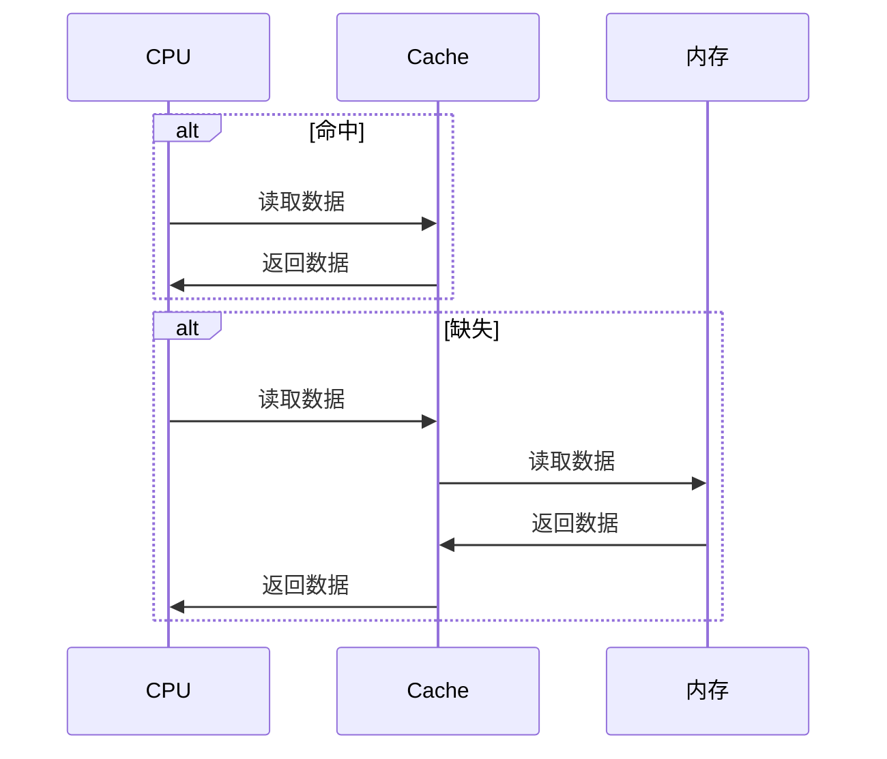
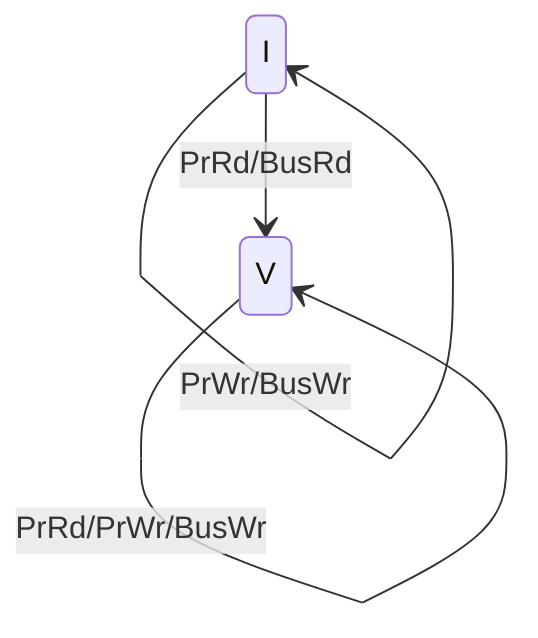
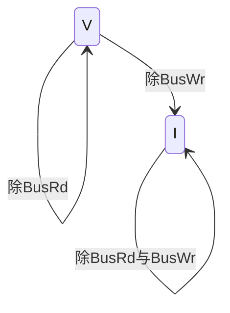
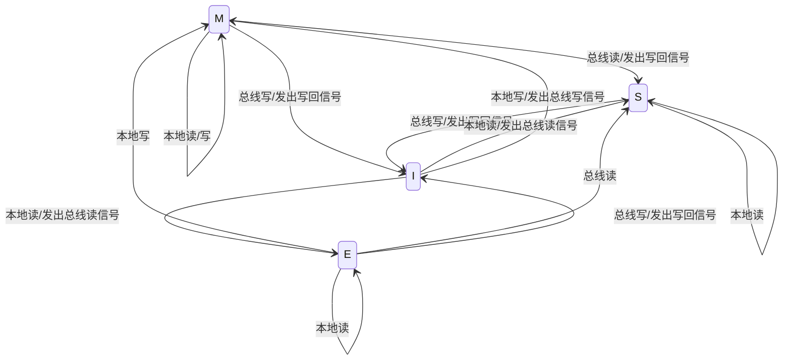
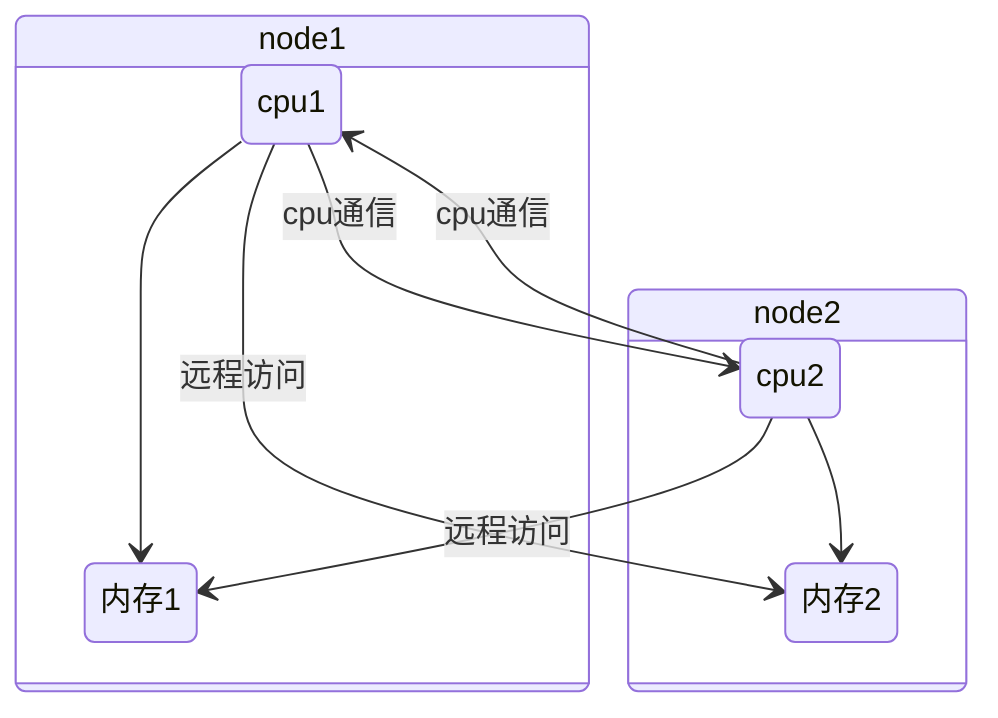

# 存储器层次结构

## 物理介质

- 高速缓冲存储器
- 主存储器
- 快闪存储器
- 磁盘存储器
- 光学存储器
- 磁带存储器

## 存储技术

### 随机访问存储器

- 静态RAM 其可以无限期保存两个电路稳态 主要用在高速缓存
- 动态RAM 其可以在一段时间内保存稳态 主要用在主存
- 非易失性存储器 

## 基本存储体系

1)输入设备将程序与数据写入主存； 2) CPU取指令； 3) CPU执行指令期间读数据； 4) CPU写回运算结果； 5) 输出设备输出结果；

### 主存速度慢的原因

- 主存增速与CPU增速不同步；
- 指令执行期间多次访问存储器；

### 主存容量不足的原因

- 存在制约主存容量的技术因素

  - CPU、主板等相关技术指标确定

- 应用对主存的需求不断扩大
- 价格原因

### 存储体系的层次结构


- L1 Cache集成在CPU中，分数据Cache(D-Cache)和指令Cache(I-Cache）
- 早期L2 Cache在主板上或与CPU集成在同一电路板上。随着工艺的提高，L2Cache被集成在CPU内核中，不分D-Cache和I-Cache

存储器      | 硬件介质      | 单位成本(美元/MB) | 随机访问延时 | 说明
-------- | --------- | ----------- | ------ | --------------------------
L1 Cache | SRAM      | 7           | 1ns    |
L2 Cache | SRAM      | 7           | 4ns    | 访问延时15x L1 Cache
Memory   | DRAM      | 0.015       | 100ns  | 访问延时15X SRAM,价格1/40 SRAM
Disk     | SSD(NAND) | 0.0004      | 150μs  | 访问延时1500X DRAM,价格1/40 DRAM
Disk     | HDD       | 0.00004     | 10ms   | 访问延时70X SSD,价格1/10 SSD

### 局部性

- [缓存](/软件工程/架构/系统设计/缓存.md)

#### 时间局部性

- 现在被访问的信息在不久的将来还将再次被访问
- 时间局部性的程序结构体现： 循环结构

#### 空间局部性

- 现在访问的信息，下一次访问的很有可能是附近的信息
- 空间局部性的程序结构体现：顺序结构

## 主存中的数据组织

- 主存的一个存储单元所包含的二进制位数
- 目前大多数计算机的主存按字节编址，存储字长也不断加大,如16位字长、32位字长和64位字长

**ISA设计时要考虑的两个问题**：

- 字的存放问题
- 字的边界对齐问题

### 数据存储与边界

按边界对齐的数据存储：浪费一些空间


未按边界对齐存放：虽节省了空间，但增加了访存次数


需要在性能与容量间权衡

- 双字长数据边界对齐的起始地址的最末三位为000(8字节整数倍；
- 单字长边界对齐的起始地址的末二位为00(4字节整数倍)；
- 半字长边界对齐的起始地址的最末一位为0(２字节整数倍)。

#### 大端与小端存储

- 小端存储

  - 就是低位字节排放在内存的低地址端，高位字节排放在内存的高地址端

- 大端存储

  - 就是高位字节排放在内存的低地址端，低位字节排放在内存的高地址端

无论是大端还是小端，每个系统内部是一致的，但在系统间通信时可能会发生问题！因为顺序不同，需要进行顺序转换

## 存储技术

## 随机访问存储器

### 静态RAM(SRAM)


**工作原理**

- 读
- 写
- 保持

#### 结构


#### 静态存储器的不足

- 晶体管过多
- 存储密度低
- 功耗大

### 动态RAM(DRAM)


DRAM与SRAM不同的是，需要靠不断地“刷新”，才能保持数据被存储起来

- 读写
- 保持

#### 刷新


#### 其它结构的DRAM存储单元

- 单管


### 传统DRAM

- 内存模块
- 增强DRAM
- 非易失性存储器
- 访问主存

## 存储扩展

- 位扩展

用16K X 8 的存储芯片构建16K X 32的存储器

- 字扩展

用16K X 8 的存储芯片构建128k X 8的存储器

- 字位扩展

用16K X 8 的存储芯片构建128K X 32的存储器


无论哪种类型的存储扩展都要完成CPU与主存间地址线、数据线、控制线的连接

## 磁盘存储


### 构造

- 磁道：盘片上划分出来的一个区域，读写过程中，磁头会沿着磁道移动，以读取或写入磁道上的数据
- 扇区：磁道被划分为若干个扇区，每个扇区包含一个固定大小的数据块
- 读写头：读取或写入磁盘数据的设备
- 磁盘臂：负责控制读写头在磁盘表面上的位置
- 柱面：是一组同心圆上对应的扇区的集合，它们处于磁盘的相同半径位置
- 磁盘控制器：控制磁盘的运行和数据传输的主控，通常包括一个处理器和一些固件

### 性能度量

- 访问时间：发出一个读/写请求到收到响应数据的时间
- 平均寻道时间：读写头移动到磁盘上任意一个磁道的平均时间
- 旋转等待时间：读写头等待目标扇区旋转到磁头下方的时间
- 平均旋转等待时间
- 数据传输率：指从磁盘读取或写入数据的速率。它与磁盘的接口类型、磁盘旋转速度和数据密度有关
- 平均故障时间：给定时间段内，磁盘发生故障的平均时间

### 访问优化

物理结构决定了磁盘更擅长顺序访问，为了优化随机读写的低效率，有一些手段：

- 缓冲：读取的块香时存储在内存级冲区中，以满足梅来的要求
- 预读：利用空间局部性原理，预先读取周围的块数据
- 调度：使用电梯算法
- 文件组织：将会一起访问的文件组织到相邻的柱面上，现代的操作系统都已经对应用隐藏了低层的存放方式了，都由操作系统统一管理了，这意味着文件碎片会越来越多
- 非易失性写缓冲区：在磁盘前再加一块不会断电丢失的快速缓存，先写到缓存，后续再慢慢刷到磁盘里
- 日志磁盘：由于日志都是顺序写，所以速度可以比较快，但是读需要做特殊处理

### 磁盘容量度量

- 记录密度：磁盘表面上每英寸线性长度上存储的磁性转换数目
- 磁道密度：磁盘表面上每英寸线性长度上的磁道数目
- 面密度：每个磁头（读写头）上可用的记录密度

### 连接到磁盘

- 通用串行总线（USB）
- 图形卡
- 主机总线适配器：包括IDE、SATA、SCSI等

### 访问磁盘

**内存映射**：将磁盘文件映射到进程的虚拟地址空间中的技术，这样就可以像访问内存一样访问磁盘文件，从而方便了文件的读写操作

## 固态硬盘

## raid

- 将数据条带化后的存放在不同磁盘上，通过多磁盘的并行操作提高磁盘系统的读写速率
- 使用基于异或运算为基础的校验技术恢复损坏的数据，提升可靠性
- 通过组合多个硬盘来提高存储容量

raid的数据拆分有两种：

- 比特级拆分
- 块级拆分

比特级的粒度较细，所以读写效率相对较低能


RAID级别说明 | 可靠性 | 读性能 | 写性能 | 最少硬盘数量 | 硬盘利用率
-------- | --- | --- | --- | ------ | -------------
RAID0    | 低   | 高   | 高   | 1      | 100%
RAID1    | 高   | 低   | 低   | 2      | 1/N
RAID5    | 较高  | 高   | 中   | 3      | (N-1)/N
RAID6    | 较高  | 高   | 中   | 3      | (N-2)/N
RAID1E   | 高   | 中   | 中   | 3      | M/N
RAID10   | 高   | 中   | 中   | 4      | M/N
RAID50   | 高   | 高   | 较高  | 6      | (N-M)/N
RAID60   | 高   | 高   | 较高  | 6      | (N - M * 2)/N

N为RAID组成员盘的个数，M为RAID组的子组数。

### RAID0

- 块级拆分但没有任何冗余


### RAID1

- 数据采用镜像的冗余方式，同一数据有多份拷贝


### RAID2

在数据盘的基础上，增加了一个磁盘来存放ECC

### RAID 3/4

- 数据按 位/条带 并行传输到多个磁盘上，同时校验数据存放到专用校验盘上


### RAID5

- 数据按条带分布在不同磁盘上，校验信息被均匀分散到各磁盘上


### RAID6

为每4 位数据存储2 位的冗余信息，这样系统可容忍两张磁盘 发生故障

### RAID10

- 结合RAID1和RAID0，先镜像，再条带化


### RAID01

- 结合RAID0和RAID1，先条带化, 再镜像


只能容忍一个磁盘故障，如0号盘损坏，左边RAID0失效，只能使用右边的RAID0，不能再有盘损坏，故冗余度为1

### 实现方式

- 软件RAID
  - 功能都依赖于主机CPU完成,没有第三方的控制处理器和I/O芯片
- 硬件RAID
  - 专门RAID控制处理器和I/O处理芯片处理RAID任务，不占用主机CPU资源

在空闲时期，控制器会对每张磁盘的每一个厨区进行读取，如果发现某个扇区无法读取，会从其余磁盘中进行恢复

一些硬件RAID实现允许热交换：在不切断电濒的情况下梅出错磁盘用新的磁盘替换

### 比较


### 选择考量

- 所需的额外存储代价
- 在IO方面的性能问题
- 磁盘故障时的性能：例如，在RAID 5中，当一个硬盘故障时，RAID控制器需要对数据进行重建，这可能导致性能下降
- 数据重建过程：当一个硬盘故障时，RAID控制器需要将数据从其他硬盘中重建。数据重建可能需要很长时间

## 存储技术的趋势

- 价格和性能折中
- 不同存储技术的价格与属性以不同的速率变化

## 对程序数据引用的局部性

## 取指令的局部性

## 多体交叉存储器

其基本思想是在不提高存储器速率、不扩展数据通路位数的前提下，通过存储芯片的交叉组织，提高CPU单位时间内访问的数据量，从而缓解快速的CPU与慢速的主存之间的速度差异。

### 高位多体交叉存储器


### 低位多体交叉存储器


## 高速缓存存储器

现代的多核处理器大都采用混合式的方式将缓存集成到芯片上，一般情况下，L3 是所有处理器核共享的，L1 和 L2 是每个处理器核特有的

内存中的指令、数据，会被加载到 L1-L3 Cache 中，而不是直接由 CPU 访问内存去拿

CPU 从内存中读取数据到 CPU Cache 的过程中，是一小块 Cache Line 来读取数据的，而不是按照单个数组元素来读取数据的，大部分 Cache Line的大小通常是64个字节，[Disruptor](/编程语言/JAVA/JAVA并发编程/Disruptor.md#Disruptor) 利用了这点

### cache的工作过程



### 缓存写策略

修改什么时候传播到主存：

- 写回（Write Back）：对缓存的修改不会立刻传播到主存，只有当缓存块被替换时，这些被修改的缓存块，才会写回并覆盖内存中过时的数据
- 写直达（Write Through）：缓存中任何一个字节的修改，都会立刻传播到内存

当某个 CPU 的缓存发生变化，其他 CPU 缓存所保有该数据副本的更新策略：

- 写更新（Write Update）：每次缓存写入新的值，该 CPU 都必须发起一次总线请求，通知其他 CPU 将它们的缓存值更新为刚写入的值
- 写无效（Write Invalidate）：一个 CPU 修改缓存时，将其他 CPU 中的缓存全部设置为无效，写无效只需要发起一次总线事件即可

当前要写入的数据不在缓存中时，根据是否要先将数据加载到缓存：

- 写分配（Write Allocate）：写入数据前将数据读入缓存
- 写不分配（Not Write Allocate）

### cache地址映射机制

对于一个地址，可以通过地址得到其应该在哪个组，确定在哪个组后，再将内存地址与组中的每一路缓存块 tag 进行匹配，如果相等，就说明该内存块已经载入到缓存中；如果没有匹配的 tag，就说明缓存缺失，需要将内存块放到该组的一个空闲缓存块上；如果所有路的缓存块都正在被使用，那么需要选择一个缓存块，将其移出缓存，把新的内存块载入


### cache的结构


- Cache被分成若干行，每行的大小与主存块相同
- Cache每行包含四部分，是Cache要保存的信息。Tag从CPU访问主存的地址中剥离得到、Data是与主存交换的数据块、Valid表示Cache中的数据是否有效、 Dirty表示主存中的数据是最新


有效位V|脏位M|是否有tag匹配|缓存操作|说明|状态转换
-|-|-|-|-|-
0|||读/写|缓存缺失，将内存数据载入缓存|tag设置成地址高21位，有效位V置1
1|0|是|读|缓存命中|状态不变
1||否|读/写|同组缓存块已满，选择一个缓存块替换|被替换的缓存块有效位置位V置0，回到第一行状态
1|0|是|写|缓存命中|脏位M置1
1|1|是|读|缓存命中，但缓存和内存数据不一致|缓存状态保持不变
1|1|是|写|缓存命中，继续写|缓存状态保持不变

### 相联存储器

- 如何快速地查找
  - 如何快速地判断数据是否存在

### 缓存缺失

- 强制缺失：第一次将数据块读入到缓存所产生的缺失，也被称为冷缺失（cold miss），因为当发生缓存缺失时，缓存是空的（冷的）
- 冲突缺失：由于缓存的相连度有限导致的缺失，即不同的内存被映射到同一块缓存中
- 容量缺失：由于缓存大小有限导致的缺失

### Cache地址映射与变换方法

- 主存数据如何迁至Cache才能实现快速查找

#### 全相联映射

缓存只有一个组，所有的内存块都放在这一个组的不同路上


- 主存分块，Cache行 （Line），两者大小相同
- 设每块4个字，主存大小为1024个字，则第61个字的主存地址为：
  - 00001111 01 （块号 块内地址）
- 主存分块后地址就从一维变成二维
- 映射算法：主存的数据块可映射到Cache任意行，同时将该数据块地址对应行的标记存储体中保存

**特点**

- Cache利用率高
- 块冲突率低
- 淘汰算法复杂

所以应用在小容量cache

#### 直接映射

缓存只有一个路，一个内存块只能放置在特定的组上


- 主存分块，Cache行 （Line），两者大小相同
- 主存分块后还将以Cache行数为标准进行分区
- 设每块4个字，主存大小为1024个字，Cache分为4行，第61个字的主存地址为
  - 000011 11 01 （区号，区内块号，块内地址）
  - 主存地址从一维变成三维
- 映射算法：Cache共n行，主存第j块号映射到Cache 的行号为 i=j mod n
  - 即主存的数据块映射到Cache特定行

**特点**

- Cache利用率低
- 块冲突率高
- 淘汰算法简单

应用在大容量cache

#### 组相联映射

缓存同时有多个组和多个路


- 主存分块，Cache行 （Line），两者大小相同；
- Cache分组（每组中包k行），本例假定K=4
- 主存分块后还将以Cache组数为标准进行分组；
- 设每块4个字，主存大小为1024个字，Cache分为4行，第61个字的主存地址为：
  - 0000111 1 01 （组号，组内块号，块内地址）
  - 主存地址从一维变成三维；
- 映射算法：
  - Cache共n组，主存第j块号映射到Cache 的组号为：i=j mod n
  - 即主存的数据块映射到Cache特定组的任意行

### 淘汰策略

程序运行一段时间后，Cache存储空间被占满，当再有新数据要调入时，就需要通过某种机制决定替换的数据

#### 先进先出法FIFO


#### 最不经常使用法LFU


#### 近期最少使用法LRU


#### 替换算法的抖动

- 刚刚淘汰的块在下一时刻又被访问...

### 伪共享false sharing

当两个线程同时各自修改两个相邻的变量，由于缓存是按缓存块来组织的，当一个线程对一个缓存块执行写操作时，必须使其他线程含有对应数据的缓存块无效。这样两个线程都会同时使对方的缓存块无效，导致性能下降

经常会看到为了解决伪共享而进行的数据填充

### VI协议

- PrRd: 处理器请求从缓存块中读出
- PrWr: 处理器请求向缓存块写入
- BusRd: 总线侦听到一个来自另一个处理器的读出缓存请求
- BusWr: 总线侦听到来自另一个处理器写入缓存的请求
- V：缓存块有效
- I：缓存块无效

当前 CPU 发起的操作：



总线发起的请求：



### MESI

- 要解决缓存一致性问题，首先要解决的是多个 CPU 核心之间的数据传播问题

是一种写失效协议：只有一个 CPU 核心负责写入数据，在这个 CPU 核心写入 Cache 之后，它会去广播一个“失效”请求告诉所有其他的 CPU 核心。其他的 CPU 核心，只是去判断自己是否也有一个“失效”版本的 Cache Block，然后把这个也标记成失效

相对应的就是写广播协议：一个写入请求广播到所有的 CPU 核心，同时更新各个核心里的 Cache，写广播还需要把对应的数据传输给其他 CPU 核心

- M：代表已修改（Modified）
- E：代表独占（Exclusive），缓存块是干净有效且唯一的
- S：代表共享（Shared），缓存块干净且被多个CPU共享
- I：代表已失效（Invalidated）



### 内存屏障

严格遵守 MESI 协议会导致某个核对缓存的占用比较长，从而影响性能。为此通过放宽 MESI 限制，引入 store buffer、invalid queue 的方式，提升了写缓存核间同步的速度

store buffer 是硬件实现的缓冲区，它的读写速度比缓存的速度更快，所有面向缓存的写操作都会先经过 store buffer，即先收集一些写操作，再批量写到缓存中，但它并不能保证变量写入缓存和主存的顺序

当一个 CPU 向同伴发出 Invalid 消息的时候，它的同伴要先把自己的缓存置为 Invalid，然后再发出 acknowledgement。这个过程是比较慢的，所以引入了 invalid queue ，收到 Invalid 消息的 CPU，立刻回传确认消息，再把这个失效的消息放到一个队列中，等到空闲的时候再去处理失效消息，将缓存设置为 invalid

这两个优化都可能导致变量没有写到缓存前，被其他核给读到过期值

所以引入了内存屏障，屏障的作用是前边的读写操作未完成的情况下，后面的读写操作不能发生

```c
// CPU0
void foo() {
    a = 1;
    smp_wmb(); // 写屏障
    b = 1;
}

// CPU1
void bar() {
    while (b == 0) continue;
    smp_rmb(); // 读屏障
    assert(a == 1);
}
```

除了使用读写对内存屏障进行分类外（alpha 结构），另外一种叫做单向屏障的不是以读写来区分的，而是像单行道一样，只允许单向通行：

- LoadLoad屏障:对于这样的语句`Load1; LoadLoad; Load2`,在Load2及后续读取操作要读取的数据被访问前，保证Load1要读取的数据被读取完毕
- StoreStore屏障:对于这样的语句`Store1; StoreStore; Store2`,在Store2及后续写入操作执行前，保证Store1的写 入操作对其它处理器可见。
- LoadStore屏障:对于这样的语句`Load1; LoadStore; Store2`,在Store2及后续写入操作被刷出前，保证Load1要读取的数据被读取完毕。
- StoreLoad屏障:对于这样的语句`Store1; StoreLoad; Load2`,在Load2及后续所有读取操作执行前，保证Store1的写入对所有处理器可见。

### TSO 模型

处理器对于 store 操作（写操作）的行为有如下规定：

1. Store Buffering（写缓冲）：每个处理器都拥有自己的写缓冲区，store 操作首先被存放在这个缓冲区中，而不是立即写入主存。
2. Write Combining（写合并）：在写缓冲中，如果发现多个 store 操作针对同一个内存地址，那么这些操作可能会被合并成一个较大的写操作。
3. Store Atomicity（写原子性）：store 操作对于其它处理器来说是原子的，即要么全部执行，要么全部不执行。但是，不同的 store 操作之间的顺序可能会被打乱。
4. Store Ordering（写顺序）：每个处理器的 store 操作按照程序中的顺序执行，并且对于其它处理器来说，每个处理器所执行的 store 操作都是有序的

写原子性跟写顺序性就解决了上述内存模型中的一致性问题

## NUMA

内存在物理上被分为了多个节点 node，CPU 可以访问所有节点，但是为了提升访问效率，CPU 可以有选择地优先访问离自己近的内存节点



内存策略|描述
-|-
MPOL_BIND|只在特定节点分配，如果空间不足则进行swap
MPOL_INTERLEAVE|本地和远程节点均可分配
MPOL_PREFERRED|指定节点分配，当内存不足时，优先选择离指定节点近的节点分配
MPOL_LOCAL|优先在本地节点分配，当内存不足时，在其他节点分配

## 虚拟存储器

- 计算机能执行比主存空间大的程序吗？

### 概述

- 处于主存 –辅存存储层次
- 解决主存容量不足的问题，为程序设计者提供比主存空间大的编程空间
- 分类：页式虚拟存储器、段式虚拟存储器 、段页式虚拟存储器

### 必须解决的问题


- CPU访问存储系统的地址属性（采用MMU(Memory Management Unit):管理虚拟存储器与物理存储器）
- 如何判断CPU要访问的信息是否在主存中（采用页表来判断）

### 地址划分

虚拟地址 = 虚页号+页偏移量

### 逻辑地址与物理地址的转换

## TLB (Translation Lookaside Buffer)

### 虚实地址转换过程中存在的问题

- 缺页异常


### 工作原理

TLB类似页表，也是PTE的集合。为实现对TLB的快速访问，类似于Cache中的映射方法，对来自于CPU的虚页号进行逻辑划分，得到相应的标记和索引字段


## 缓存写

## 高速缓存参数的性能影响

- 不命中率
- 命中率
- 命中时间
- 不命中处罚

## 存储器层次结构中的缓存

缓解快速CPU与慢速的主存之间的速度差异

### 工作工程

- 缓存命中
- 缓存不命中

  - 冷不命中
  - 冲突不命中

- 缓存管理

# 编写高速缓存友好的代码

# 高速缓存对程序性能的影响
