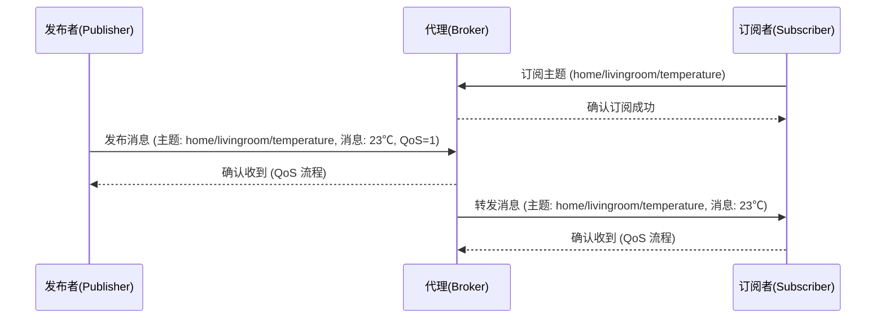

# MQTT

## 角色

- 客户端（Client）： 既可以是发布者（Publisher），也可以是订阅者（Subscriber），或者两者同时是
- 代理（Broker）：核心中间人，负责接收消息、过滤消息、再转发给合适的订阅者

## 通信模型

- 二进制编码格式
- 协议头很紧凑，协议交互也简单

### 主题

层级式路径，用斜杠分隔

如：`home/livingroom/temperature`

- `+` 单层通配，例如 home/+/temperature 匹配 home/livingroom/temperature 和 home/kitchen/temperature
- `#` 多层通配，例如 home/# 匹配 home/livingroom/temperature、home/kitchen/humidity

### 消息

- 内容（Payload）：真正要传递的数据（可以是文本、JSON、二进制）。
- 属性：除内容外，还包括：
  - 主题（Topic）
  - QoS 等级
  - Retain 标志（是否保留为“最新值”）

### 发布订阅机制

## 特性

### Qos

- 支持 3 种 QoS（Quality of Service，服务质量）级别
  - QoS 0，消息只发送一次，消息可能丢失
  - QoS 1 ，发送方会接收反馈，保证消息的送达，但是可能消息会重复
  - QoS 2 ，通过发送方和接收方的多次交互，保证消息有且只有一次

### 会话

- 临时会话：客户端断开 → 状态清空。
- 持久会话：客户端断开 → Broker 仍然记住它的订阅，等它回来继续投递

### 遗嘱消息

客户端异常断开时，Broker 会帮它发一条预先定义的“遗言”

### 保活

#### 保活间隔

由客户端在 CONNECT 报文里指定。在这个时间间隔内，客户端必须和 Broker 至少有一次交互（可以是 PUBLISH、SUBSCRIBE，也可以是专门的 PINGREQ）。如果超过这个时间没有交互，Broker 会认为客户端掉线

#### 心跳报文

- PINGREQ：客户端发给 Broker，表示“我还活着”。
- PINGRESP：Broker 回复，表示“我也在”。

## 安全机制

### 认证

- 用户名 + 密码：最基本的方式，在 CONNECT 报文里携带，明文传输
- 客户端证书：基于 TLS 的双向认证，客户端和 Broker 都有证书

### 加密

- SSL/TLS：基于 TLS 的加密，使用 mqtts:// 或 wss://，消息在网络中是密文
- 数据完整性：TLS 自带的哈希校验

### 授权

- ACL：定义哪些用户/设备可以访问哪些主题
- RBAC：给用户分配角色（管理员、设备、应用），再定义权限
