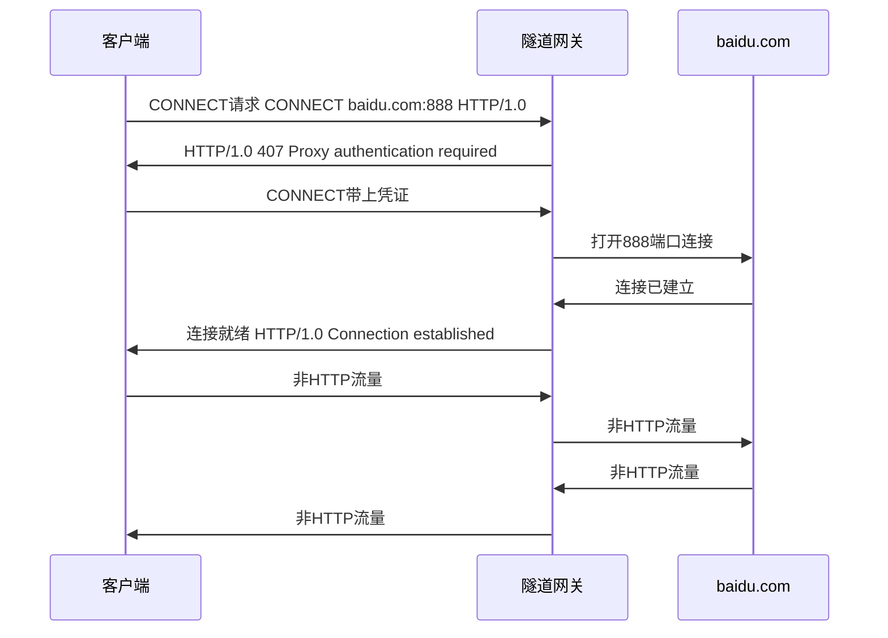
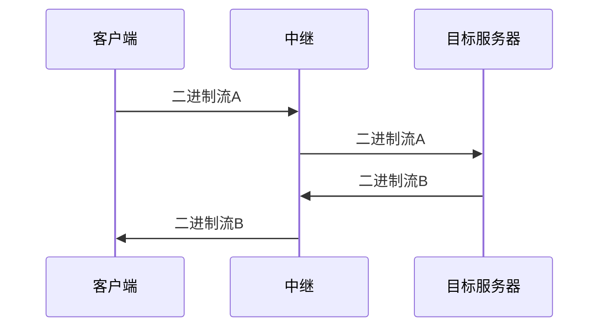

# HTTP协议

- 基于TCP/IP的高级协议
- 默认端口号:80
- 基于请求/响应模型的:一次请求对应一次响应
- 无状态的：每次请求之间相互独立，不能交互数据

## 基础概念

- URI


- 请求报文


- 响应报文


## HTTP方法

- GET

获取资源

- HEAD

与GET类似，但不返回报文的实体主体

- POST

主要用来传输数据

- PUT

上传文件

- PATCH

对资源进行部分修改

- DELETE

删除文件

- OPTIONS

查询指定的 URL 能够支持的方法

- CONNECT

要求在与代理服务器通信时建立隧道

- TRACE

服务器会将通信路径返回给客户端

## 状态码

分类  | 分类描述
--- | -----------------------
1** | 信息，服务器收到请求，需要请求者继续执行操作
2** | 成功，操作被成功接收并处理
3** | 重定向，需要进一步的操作以完成请求
4** | 客户端错误，请求包含语法错误或无法完成请求
5** | 服务器错误，服务器在处理请求的过程中发生了错误

### 1XX

100 Continue ：表明到目前为止都很正常，客户端可以继续发送请求或者忽略这个响应

### 2XX

- 200 OK
- 204 No Content ：请求已经成功处理，但是返回的响应报文不包含实体的主体部分。一般在只需要从客户端往服务器发送信息，而不需要返回数据时使用
- 206 Partial Content ：表示客户端进行了范围请求，响应报文包含由 Content-Range 指定范围的实体内容

### 3XX

- 301 Moved Permanently ：永久性重定向
- 302 Found ：临时性重定向
- 303 See Other ：和 302 有着相同的功能，但是 303 明确要求客户端应该采用 GET 方法获取资源
- 304 Not Modified ：如果请求报文首部包含一些条件，例如：If-Match，If-Modified-Since，If-None-Match，If-Range，If-Unmodified-Since，如果不满足条件，则服务器会返回 304 状态码
- 307 Temporary Redirect ：临时重定向，与 302 的含义类似，但是 307 要求浏览器不会把重定向请求的 POST 方法改成 GET 方法

### 4XX

- 400 Bad Request:语法错误
- 401 Unauthorized:需要认证
- 403 Forbidden:请求被拒绝
- 404 Not Found

### 5XX

- 500 Internal Server Error ：服务器正在执行请求时发生错误
- 503 Service Unavailable ：服务器暂时处于超负载或正在进行停机维护，现在无法处理请求

## 连接管理

### 连接类型

#### 短连接

每进行一次 HTTP 通信就要新建一个 TCP 连接

#### 并行连接

通过连续发起多个不同连接 来解决串行HTTP请求的长时延

也并非并行连接就能更快 还需要考虑到带宽 服务器等因素

#### 长连接

- 减少了TCP连接建立的开销

从 HTTP/1.1 开始默认是长连接的，如果要断开连接，需要由客户端或者服务器端提出断开，使用 Connection : close

在 HTTP/1.1 之前默认是短连接的，如果需要使用长连接，则使用 Connection : Keep-Alive

对于不认识Connection的代理服务器，会将Connection首部也一并转发，从而造成连接被挂住


```http
Keep-Alive: max=5, timeout=120 // 最多为5个事务保持连接状态 或最多保持120秒的空闲时间
```

#### 流水线

流水线是在同一条长连接上连续发出请求，而不用等待响应返回，这样可以减少延迟


要求服务端必须按客户端发送的请求顺序响应数据

### 连接关闭

HTTP的连接可以在任意时刻关闭，针对HTTP编程要处理这种情况

使用Content-Length 来提供接下去所传输的数据大小，从而让对方知悉传输情况

基于TCP的HTTP继承了TCP的关关闭功能，也就是可以关闭输入或者输出通道，当对方的输入通道关闭后，己方若继续发送数据，就会得到一个连接被重置的错误

良好的关闭实现应该是首先关闭己方的输出，然后等待对方的输出通道关闭，这样就可以安全地关闭

## 内容协商

### 服务端驱动

客户端设置Accept、Accept-Charset、Accept-Encoding、Accept-Language等首部，服务端根据这些首部返回特定资源

### 代理驱动

服务器返回 300 Multiple Choices 或者 406 Not Acceptable，客户端从中选出最合适的那个资源

### vary

一个客户端发送了一个包含 Accept-Language 首部字段的请求之后，源服务器返回的响应包含 Vary: Accept-Language 内容，缓存服务器对这个响应进行缓存之后，在客户端下一次访问同一个 URL 资源，并且 Accept-Language 与缓存中的对应的值相同时才会返回该缓存

## 内容编码

内容编码有：gzip、compress、deflate、identity

浏览器发送 Accept-Encoding 首部，其中包含有它所支持的压缩算法，以及各自的优先级。服务器则从中选择一种，使用该算法对响应的消息主体进行压缩，并且发送 Content-Encoding 首部来告知浏览器它选择了哪一种算法

## 范围请求

- Range

请求报文中添加 Range 首部字段指定请求的范围

```html
Range: bytes=0-1023
```

成功的话服务器返回的响应包含 206 Partial Content

请求的范围越界的情况下，服务器会返回 416 Requested Range Not Satisfiable 状态码

不支持范围请求的情况下，服务器会返回 200 OK 状态码

- Accept-Range

用于告知客户端是否能处理范围请求，可以处理使用 bytes，否则使用 none

### 分块传输

Chunked Transfer Encoding，可以把数据分割成多块，让浏览器逐步显示页面

### 多部分对象集合

一份报文主体内可含有多种类型的实体同时发送，每个部分之间用 boundary 字段定义的分隔符进行分隔

如

```html
Content-Type: multipart/form-data; boundary=AaB03x

--AaB03x
Content-Disposition: form-data; name="submit-name"

Larry
--AaB03x
Content-Disposition: form-data; name="files"; filename="file1.txt"
Content-Type: text/plain

... contents of file1.txt ...
--AaB03x--
```

## 通信数据转发

### 代理

目的：

- 缓存
- 负载均衡
- 网络访问控制
- 访问日志记录


#### 正向代理

用户可以察觉正向代理的存在


#### 反向代理

反向代理一般位于内部网络中，用户察觉不到


#### 客户端代理配置

- 手动配置代理服务器地址及端口
- [PAC](https://developer.mozilla.org/zh-CN/docs/Web/HTTP/Proxy_servers_and_tunneling/Proxy_Auto-Configuration_PAC_file) 自动代理配置 通过一段js脚本确定一个url要以怎样的方式使用什么代理访问
- WPAD 代理发现 自动发现PAC并进行下载然后为请求使用代理

#### 有关代理的一些问题

- 客户端向代理发送请求时 需要在HTTP请求消息里面包含完整的URI信息 这样代理服务器才知道要转发到哪里

```http
GET http://baidu.com HTTP/1.0
```

- 如果代理接收到的URI不完整 也可以通过Host确定

#### 报文追踪

- Via首部

```http
Via: [ <protocol-name> "/" ] <protocol-version> <host> [ ":" <port> ]
```


每经过一层代理，代理都可以向该字段加入自己的标识 在多层代理的情况下，通过检查这个字段有没有自己，可以检测环路，该字段与Server的区别在于Server是源服务器信息，代理不应修改

- TRACE


通过指定Max-Forwards头部 每经过一层代理该值就会减1 当为0时，及时当前服务器不是源服务器，也必须马上将结果返回给客户端

#### 认证

- Proxy-Authenticate 首部

#### 兼容性

为了保证代理的兼容性，代理对于不认识的首部，必须原样转发，并且首部的顺序，也不能随意修改

### 网关

网关服务器会将 HTTP 转化为其它协议进行通信，从而请求其它非 HTTP 服务器的服务

### 隧道

使用 SSL 等加密手段，在客户端和服务器之间建立一条安全的通信线路



### 中继

- 由于HTTP的连接管理，单纯的盲中继可能会出现连接管理上的问题



## 重定向原理

当服务端对客户端进行重定向时，会设置一个Location响应头，并将状态码设置为302

客户端（浏览器）接收到这样的响应之后，就会跳转到Location里面的网址

## HTTPS

### HTTP的问题

- 明文通信
- 无法确认通信方
- 无法验证报文完整性

### 原理

1. 客户端向服务端发送HTTPS请求
2. 服务端收到HTTPS请求返回公钥证书
3. 客户端收到服务端的公钥证书，验证是否有效（验证颁发机构、过期时间等等）
4. 如果有效，生成一个随机数用公钥加密，然后发送给服务端
5. 服务端使用私钥将该随机数解密，然后用该随机数作为密钥加密一串字符给客户端
6. 如果客户端解密这串字符成功，这串字符将作为接下来客户端与服务端通信的密钥

这个过程的关键在于密钥传递使用了非对称加密，数据传输采用了对称加密

所以这就保证了对称加密的密钥不会通过网络直接传输，之所以数据传输采用了对称加密，主要是因为非对称加密性能很低

### 证书

通过使用 证书 来对通信方进行认证

数字证书认证机构（CA，Certificate Authority）是客户端与服务器双方都可信赖的第三方机构

服务器的运营人员向 CA 提出公开密钥的申请，CA 在判明提出申请者的身份之后，会对已申请的公开密钥做数字签名，然后分配这个已签名的公开密钥，并将该公开密钥放入公开密钥证书后绑定在一起

### 完整性保护

SSL 提供报文摘要功能来进行完整性保护

### HTTPS的缺点

- 加解密有性能损失
- 证书授权需要高额费用

### nginx配置证书

```
 server {
     ....  
     ssl on;
     ssl_certificate fullchain.pem;
     ssl_certificate_key privkey.pem;
 }
```

## HTTP/2.0

### HTTP/1.x缺陷

- 使用多个连接提升性能
- 没有压缩请求与响应
- 不支持资源优先级

### 二进制分帧


只会有一个TCP连接，一个连接会有任意数量的双向数据流

一个数据流会有一个一个唯一的标识符，一个数据流可以承载一来一回双向信息

消息是请求消息或者响应消息

帧是最小的通信单位，不同数据流的帧可以交错发送，然后根据唯一标识符来重新组装


### 服务端推送

HTTP/2.0 在客户端请求一个资源时，服务端会把相关的资源一起发送给客户端


### 首部压缩

HTTP/2.0 要求客户端和服务器同时维护和更新一个包含之前见过的首部字段表，从而避免了重复传输


不仅如此，HTTP/2.0 也使用 Huffman 编码对首部字段进行压缩

## GET与POST

GET 用于获取资源，而 POST 用于传输实体主体。

### 参数

GET是通过URL携带参数的，而 POST 的参数存储在实体主体中

### 安全

GET语义来说是安全的，因为GET操作只是获取资源

而POST的语义是不安全的，因为POST是上传数据

### 幂等性

幂等方法不应该具有副作用，所有的安全方法也都是幂等的

在正确实现的条件下，GET，HEAD，PUT 和 DELETE 等方法都是幂等的

### 可缓存

一般来说GET和HEAD是可缓存的，PUT和DELETE不可缓存，POST在大多数情况下不可缓存

## 跨域问题

同源策略限制了从同一个源加载的文档或脚本如何与来自另一个源的资源进行交互，所以通常情况下一个源无法通过ajax与另外一个源进行交互


### 解决方案

- JSONP（缺陷很多）

服务端将返回数据封装成js函数调用并返回，客户端js通过动态加载script标签加载服务器的js数据，加载完成后执行封装的js函数获取数据

所以jsonp这种请求方式与ajax有着本质的不同

- 被调服务端设置响应头允许跨域

```java
response.setHeader("Access-Control-Allow-Origin","*");
```

- 后端请求转发

前端所在的服务端调用被调服务端，将结果返回给前端

- nginx反向代理

```
server {
    listen 80;
    server_name api.domain;
    location /api1 {
        proxy_pass http://outter_server;
    }
}
```

- 使用应用网关

使可以通过一个统一入口访问各个项目

## 传输链路优化

前端会通过一些诸如精灵图、文件合并、请求合并的方式方法来降低HTTP请求数 又或者是HTTP1.1引入的Keep-Alive机制 使用一条连接来处理请求 但这就会导致请求被阻塞的问题

HTTP2的出现很好地解决了这个问题 它将数据拆分为小端 并且使用id标识 在客户端进行组装，这样多个请求阻塞整条连接的情况出现的概率就比较小了

另外一种优化方式是通过压缩 但一旦压缩 并且只使用一个连接 那如何判断内容以及传输完毕？使用分块编码 最后以一个长度值为0的分块来表示资源结束

### 快速UDP网络连接

QUIC的可靠传输能力并不是由底层协议提供的，而是完全由自己来实现

QUIC的另一个设计目标是面向移动设备的专门支持，使用了一个标识符来处理由于移动网络断开重新连接的客户端识别问题