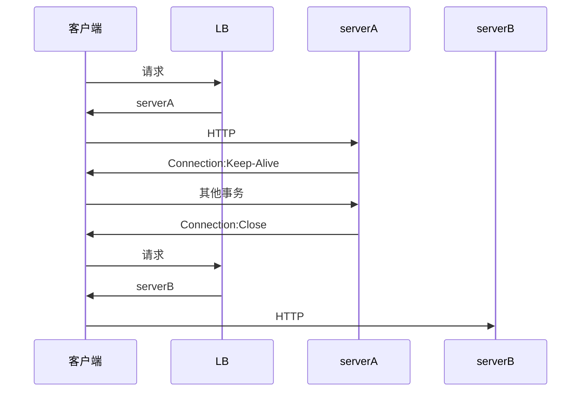
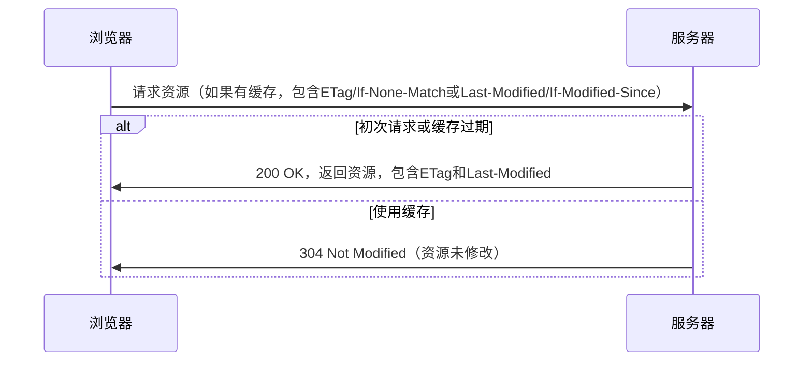
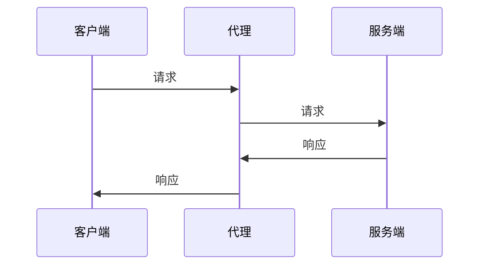
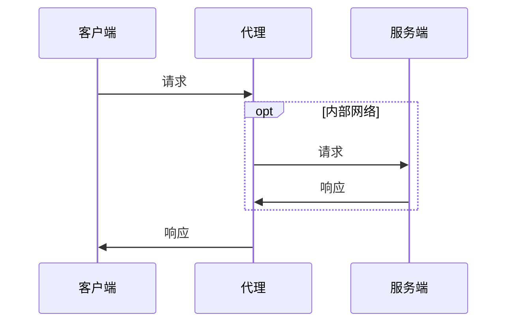
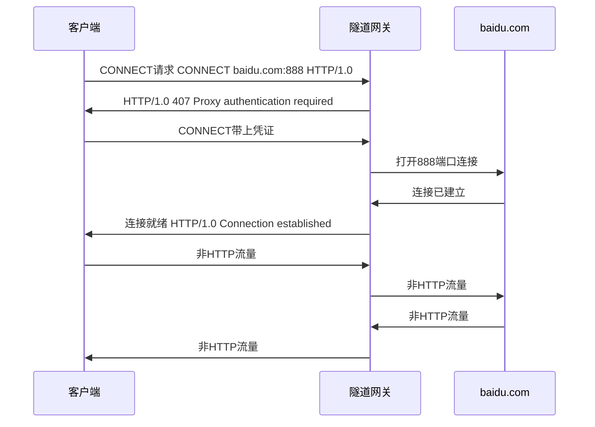
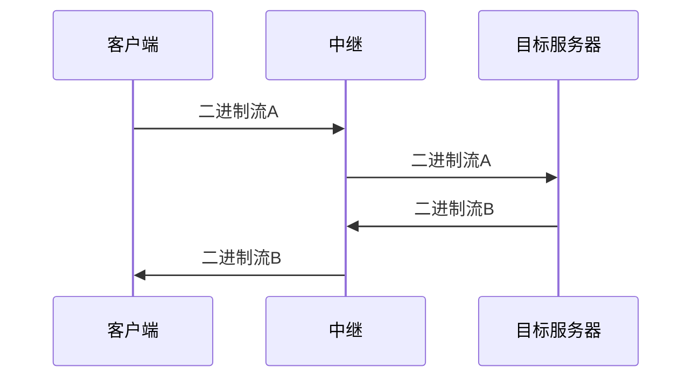
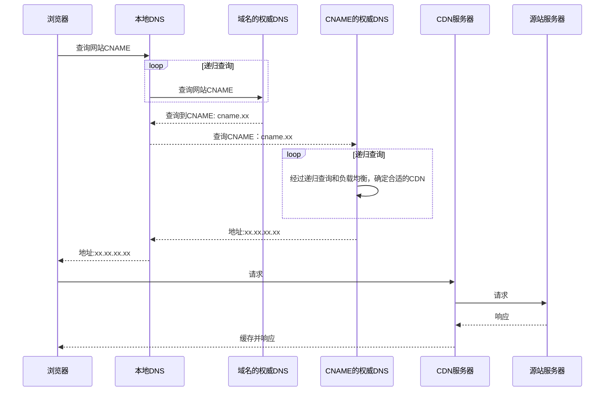

# HTTP协议

- 基于TCP/IP的高级协议
- 默认端口号:80
- 基于请求/响应模型的:一次请求对应一次响应
- 无状态的：每次请求之间相互独立，不能交互数据

## 基础概念

- URI


- 请求报文


- 响应报文


## HTTP方法

- GET

获取资源

- HEAD

与GET类似，但不返回报文的实体主体

- POST

主要用来传输数据

- PUT

上传文件

- PATCH

对资源进行部分修改

- DELETE

删除文件

- OPTIONS

查询指定的 URL 能够支持的方法

- CONNECT

要求在与代理服务器通信时建立隧道

- TRACE

服务器会将通信路径返回给客户端

## 状态码

分类  | 分类描述
--- | -----------------------
1** | 信息，服务器收到请求，需要请求者继续执行操作
2** | 成功，操作被成功接收并处理
3** | 重定向，需要进一步的操作以完成请求
4** | 客户端错误，请求包含语法错误或无法完成请求
5** | 服务器错误，服务器在处理请求的过程中发生了错误

### 1XX

100 Continue ：表明到目前为止都很正常，客户端可以继续发送请求或者忽略这个响应

### 2XX

- 200 OK
- 204 No Content ：请求已经成功处理，但是返回的响应报文不包含实体的主体部分。一般在只需要从客户端往服务器发送信息，而不需要返回数据时使用
- 206 Partial Content ：表示客户端进行了范围请求，响应报文包含由 Content-Range 指定范围的实体内容

### 3XX

- 301 Moved Permanently ：永久性重定向
- 302 Found ：临时性重定向
- 303 See Other ：和 302 有着相同的功能，但是 303 明确要求客户端应该采用 GET 方法获取资源
- 304 Not Modified ：如果请求报文首部包含一些条件，例如：If-Match，If-Modified-Since，If-None-Match，If-Range，If-Unmodified-Since，如果不满足条件，则服务器会返回 304 状态码
- 307 Temporary Redirect ：临时重定向，与 302 的含义类似，但是 307 要求浏览器不会把重定向请求的 POST 方法改成 GET 方法

### 4XX

- 400 Bad Request:语法错误
- 401 Unauthorized:需要认证
- 403 Forbidden:请求被拒绝
- 404 Not Found

### 5XX

- 500 Internal Server Error ：服务器正在执行请求时发生错误
- 503 Service Unavailable ：服务器暂时处于超负载或正在进行停机维护，现在无法处理请求

## Cookie

Cookie 是服务器发送到用户浏览器并保存在本地的一小块数据，它会在浏览器之后向同一服务器再次发起请求时被携带上，用于告知服务端两个请求是否来自同一客户端

用途：

- 会话状态管理
- 个性化设置
- 浏览器行为跟踪

### 创建过程

服务的响应头Set-Cookie头部：

```html
Set-Cookie: yummy_cookie=choco
Set-Cookie: tasty_cookie=strawberry
```

客户端之后对同一服务器发送请求时，都会在请求头Cookie头部带上这个Cookie

```html
Cookie: yummy_cookie=choco; tasty_cookie=strawberry
```

### 分类

- 会话期Cookie：浏览器关闭之后它会被自动删除，没有指定过期时间就是会话期Cookie
- 持久性 Cookie：指定过期时间（Expires）或有效期（max-age）之后就成为了持久性的 Cookie

```html
Set-Cookie: id=a3fWa; Expires=Wed, 21 Oct 2020 07:28:00 GMT;
```

### 作用域

Domain 标识Cookie在哪些域名下有效，如果不指定，默认是当前文档的主机

如果指定了Domain，则一般包括子域名，如baidu.com，包含map.baidu.com

### JS访问

JavaScript可以通过document.cookie来创建cookie或者访问非HttpOnly的Cookie

### HttpOnly

标记为 HttpOnly 的 Cookie 不能被 JavaScript 脚本调用

```html
Set-Cookie: id=a3fWa; Expires=Wed, 21 Oct 2020 07:28:00 GMT; Secure; HttpOnly
```

### Secure

标记为 Secure 的 Cookie 只能通过被 HTTPS 协议加密过的请求发送给服务端

### Session

Session是通过在服务端生成一个key，使用这个key为索引在服务器端存放用户信息，后将这个key作为cookie返回给客户端，让客户端使用这个key来操作

应该注意 Session ID 的安全性问题，不能让它被恶意攻击者轻易获取，那么就不能产生一个容易被猜到的 Session ID 值。此外，还需要经常重新生成 Session ID。在对安全性要求极高的场景下，还需要使用二重验证的方式

#### Cookie与Session

比较类别 | Session | Cookie
---- | ------- | ------
存储方式 | 服务端     | 客户端
大小限制 | 无       | 有
安全   | 较安全     | 较不安全

- cookie一般用于存出少量的不太敏感的数据，在不登录的情况下，完成服务器对客户端的身份识别

### cookie 压缩

gzip只能对body进行压缩 cookie位于头上 需要手动编程对http header 进行处理

### 浏览器禁用cookie

当浏览器无法使用Cookie，只能使用session，此外，session id也不能通过cookie来传递，而是需要通过URL传参的方式来传递，如wap时代的sid

### 注意事项

- Cookie的Name不能和属性值一样 比如Doamin MaxAge等待
- Name和Value不能设置成非ASCII字符
- 不同的浏览器都会对Cookie的大小以及数量进行限制 需要注意

## 连接管理

### 连接类型

#### 短连接

每进行一次 HTTP 通信就要新建一个 TCP 连接

#### 并行连接

通过连续发起多个不同连接 来解决串行HTTP请求的长时延

也并非并行连接就能更快 还需要考虑到带宽 服务器等因素

#### 长连接

- 减少了TCP连接建立的开销

从 HTTP/1.1 开始默认是长连接的，如果要断开连接，需要由客户端或者服务器端提出断开，使用 Connection : close，HTTP/2 里，连接关闭是通过另外的机制实现的，与 Connection 头部无关

加快VIP切换时的收敛速度：



在 HTTP/1.1 之前默认是短连接的，如果需要使用长连接，则使用 Connection : Keep-Alive

对于不认识Connection的代理服务器，会将Connection首部也一并转发，从而造成连接被挂住


```http
Keep-Alive: max=5, timeout=120 // 最多为5个事务保持连接状态 或最多保持120秒的空闲时间
```

#### 流水线

流水线是在同一条长连接上连续发出请求，而不用等待响应返回，这样可以减少延迟


要求服务端必须按客户端发送的请求顺序响应数据

### 连接关闭

HTTP的连接可以在任意时刻关闭，针对HTTP编程要处理这种情况

使用Content-Length 来提供接下去所传输的数据大小，从而让对方知悉传输情况

基于TCP的HTTP继承了TCP的关关闭功能，也就是可以关闭输入或者输出通道，当对方的输入通道关闭后，己方若继续发送数据，就会得到一个连接被重置的错误

良好的关闭实现应该是首先关闭己方的输出，然后等待对方的输出通道关闭，这样就可以安全地关闭

## 内容协商

### 服务端驱动

客户端设置Accept、Accept-Charset、Accept-Encoding、Accept-Language等首部，服务端根据这些首部返回特定资源

### 代理驱动

服务器返回 300 Multiple Choices 或者 406 Not Acceptable，客户端从中选出最合适的那个资源

### vary

一个客户端发送了一个包含 Accept-Language 首部字段的请求之后，源服务器返回的响应包含 Vary: Accept-Language 内容，缓存服务器对这个响应进行缓存之后，在客户端下一次访问同一个 URL 资源，并且 Accept-Language 与缓存中的对应的值相同时才会返回该缓存

## 内容编码

内容编码有：gzip、compress、deflate、identity

浏览器发送 Accept-Encoding 首部，其中包含有它所支持的压缩算法，以及各自的优先级。服务器则从中选择一种，使用该算法对响应的消息主体进行压缩，并且发送 Content-Encoding 首部来告知浏览器它选择了哪一种算法

## 范围请求

- Range

请求报文中添加 Range 首部字段指定请求的范围

```html
Range: bytes=0-1023
```

成功的话服务器返回的响应包含 206 Partial Content

请求的范围越界的情况下，服务器会返回 416 Requested Range Not Satisfiable 状态码

不支持范围请求的情况下，服务器会返回 200 OK 状态码

- Accept-Range

用于告知客户端是否能处理范围请求，可以处理使用 bytes，否则使用 none

### 分块传输

Chunked Transfer Encoding，可以把数据分割成多块，让浏览器逐步显示页面

### 多部分对象集合

一份报文主体内可含有多种类型的实体同时发送，每个部分之间用 boundary 字段定义的分隔符进行分隔

如

```html
Content-Type: multipart/form-data; boundary=AaB03x

--AaB03x
Content-Disposition: form-data; name="submit-name"

Larry
--AaB03x
Content-Disposition: form-data; name="files"; filename="file1.txt"
Content-Type: text/plain

... contents of file1.txt ...
--AaB03x--
```

## 缓存

实现方法：

- 代理服务器缓存
- 客户端缓存

### 缓存控制



#### 禁止对响应进行缓存

```html
Cache-Control: no-store
```

#### 强制确认缓存

只有当客户端确认缓存资源有效时，才能使用这个响应

```html
Cache-Control: no-cache
```

- must-revalidate和proxy-revalidate

must-revalidate表示在资源过期后，一定需要从服务器中进行获取 proxy-revalidate用于提示代理、CDN等设备资源过期后的缓存行为

#### 禁止修改

```http
Cache-Control: no-transform
```

禁止代理服务器修改HTTP响应头或者响应体

#### 私有缓存

只能单独给用户使用，一般用在浏览器

```html
Cache-Control: private
```

#### 公共缓存

可以被多个用户使用，一般存储在代理服务器中

```html
Cache-Control: public
```

#### 客户端缓存新鲜度限制

- max-stale: 提供一个秒为单位的数字 代表这段时间内缓存不能过期
- min-fresh: 后续跟随一个以秒为单位的数字，用于建议服务器能返回一个不少于该时间的缓存资源
- only-if-cached: 表示客户端要求不发送网络请求，只使用缓存来进行响应

#### HTML的HTTP-EQUIV

可以控制服务器解析这个标签 然后将这个标签里的添加到首部响应返回给客户端

### 缓存验证

#### If-None-Match

ETag 是资源的唯一标识

```http
If-None-Match: "82e22293907ce725faf67773957acd12"
```

如果服务器接收到ETage后，判断资源没有发生改变，会返回一个304

弱验证器：

```http
If-None-Match: W/"82e22293907ce725faf67773957acd12"
```

弱验证器当文件内容发生变化后，缓存也不会失效

#### If-Modified-Since

Last-Modified 首部字段也可以用于缓存验证，如果响应首部字段里含有这个信息，客户端可以在后续的请求中带上 If-Modified-Since 来验证缓存。服务器只在所请求的资源在给定的日期时间之后对内容进行过修改的情况下才会将资源返回，状态码为 200 OK。如果请求的资源从那时起未经修改，那么返回一个不带有实体主体的 304 Not Modified 响应报文


### 缓存过期

出现在响应报文，超过这个时间 缓存就被认为过期

```html
Cache-Control: max-age=31536000
```

Expires 首部字段也可以用于告知缓存服务器该资源什么时候会过期

```html
Expires: Wed, 04 Jul 2012 08:26:05 GMT
```

但Expires有如下问题：

1. 受限于客户端的时间
2. 无法缓存客户私有资源
3. 无法描述“不缓存”，如js文件引用后面要加个版本号

#### 试探性过期

对于没有提供max-age跟Expires的响应

- 许久不修改的 最近也认为不怎么修改
- 最近修改的 最近修改的可能性更大

### 浏览器缓存原则

- **首页**可以看做是框架 应该禁用缓存，以保证加载的资源都是最新的
- 还有一些场景下我们希望禁用浏览器缓存。比如轮训api上报数据数据
- 浏览器缓存很难彻底禁用，大家的做法是加版本号，随机数等方法。
- 只缓存200响应头的数据，像3XX这类跳转的页面不需要缓存。
- 对于js，css这类可以缓存很久的数据，可以通过加版本号的方式更新内容
- 不需要强一致性的数据，可以缓存几秒
- 异步加载的接口数据，可以使用ETag来校验。
- 在服务器添加Server头，有利于排查错误

## 通信数据转发

### 代理

目的：

- 缓存
- 负载均衡
- 网络访问控制
- 访问日志记录


#### 正向代理

用户可以察觉正向代理的存在



#### 反向代理

反向代理一般位于内部网络中，用户察觉不到



#### 客户端代理配置

- 手动配置代理服务器地址及端口
- [PAC](https://developer.mozilla.org/zh-CN/docs/Web/HTTP/Proxy_servers_and_tunneling/Proxy_Auto-Configuration_PAC_file) 自动代理配置 通过一段js脚本确定一个url要以怎样的方式使用什么代理访问
- WPAD 代理发现 自动发现PAC并进行下载然后为请求使用代理

#### 有关代理的一些问题

- 客户端向代理发送请求时 需要在HTTP请求消息里面包含完整的URI信息 这样代理服务器才知道要转发到哪里

```http
GET http://baidu.com HTTP/1.0
```

- 如果代理接收到的URI不完整 也可以通过Host确定

#### 报文追踪

- Via首部

```http
Via: [ <protocol-name> "/" ] <protocol-version> <host> [ ":" <port> ]
```


每经过一层代理，代理都可以向该字段加入自己的标识 在多层代理的情况下，通过检查这个字段有没有自己，可以检测环路，该字段与Server的区别在于Server是源服务器信息，代理不应修改

- TRACE


通过指定Max-Forwards头部 每经过一层代理该值就会减1 当为0时，及时当前服务器不是源服务器，也必须马上将结果返回给客户端

#### 认证

- Proxy-Authenticate 首部

#### 兼容性

为了保证代理的兼容性，代理对于不认识的首部，必须原样转发，并且首部的顺序，也不能随意修改

### 网关

网关服务器会将 HTTP 转化为其它协议进行通信，从而请求其它非 HTTP 服务器的服务

### 隧道

使用 SSL 等加密手段，在客户端和服务器之间建立一条安全的通信线路



### 中继

- 由于HTTP的连接管理，单纯的盲中继可能会出现连接管理上的问题



## 重定向原理

当服务端对客户端进行重定向时，会设置一个Location响应头，并将状态码设置为302

客户端（浏览器）接收到这样的响应之后，就会跳转到Location里面的网址

## HTTPS

### HTTP的问题

- 明文通信
- 无法确认通信方
- 无法验证报文完整性

### 原理

1. 客户端向服务端发送HTTPS请求
2. 服务端收到HTTPS请求返回公钥证书
3. 客户端收到服务端的公钥证书，验证是否有效（验证颁发机构、过期时间等等）
4. 如果有效，生成一个随机数用公钥加密，然后发送给服务端
5. 服务端使用私钥将该随机数解密，然后用该随机数作为密钥加密一串字符给客户端
6. 如果客户端解密这串字符成功，这串字符将作为接下来客户端与服务端通信的密钥

这个过程的关键在于密钥传递使用了非对称加密，数据传输采用了对称加密

所以这就保证了对称加密的密钥不会通过网络直接传输，之所以数据传输采用了对称加密，主要是因为非对称加密性能很低

#### SSL记录


#### 握手

在初始阶段会进行协商选择对称加密算法来进行加密会话密钥，同时为了防止中间人篡改选择的对称加密算法，客户端在服务端完成会话密钥的校验后，还需要发送所有握手报文的一个MAC，服务端再回送一个MAC

#### 挥手

基于SSL的加密不断单纯地发送一个FIN关闭底层TCP连接，这是因为可能会被中间人伪造一个FIN，从而破坏数据的完整性，而是需要通过SSL记录的类型字段来确定是否关闭

### 证书

通过使用 证书 来对通信方进行认证

数字证书认证机构（CA，Certificate Authority）是客户端与服务器双方都可信赖的第三方机构

服务器的运营人员向 CA 提出公开密钥的申请，CA 在判明提出申请者的身份之后，会对已申请的公开密钥做数字签名，然后分配这个已签名的公开密钥，并将该公开密钥放入公开密钥证书后绑定在一起

#### 证书信任链


TLS 证书都有签名部分，这个签名就是用签发者的私钥加密的, 客户端的 Trust store 里就有这个 CA 的公钥（在 CA 证书里），会使用证书指定的散列算法计算出证书的散列值，然后用这个公钥去尝试解开签名，解开的结果如果跟散列值一样，就说明这张叶子证书确实是这个 CA 签发的。

用 根证书的公钥 去 解密验证 上一层证书的合法性，再拿上一层证书的公钥去验证更上层证书的合法性；递归回溯。最后验证服务器端的证书是可信任的

### 完整性保护

SSL 提供报文摘要功能来进行完整性保护

CA将用户的个人身份跟公开密钥链接在一起 可以防抵赖

通过操作系统内置的证书 可以在不通过网络的情况下对证书进行认证

TLS1.3 只允许前向加密（PFS）的密钥交换算法，主要是为了防止黑客取得了服务端私钥，并且抓取了历史上的 TLS 密文，那么就可以用这个私钥和抓包文件，把这些 TLS 会话的对称密钥给还原出来，前向加密算法每次的私钥都不一样

### HTTPS的缺点

- 加解密有性能损失
- 证书授权需要高额费用

### nginx配置证书

```
 server {
     ....  
     ssl on;
     ssl_certificate fullchain.pem;
     ssl_certificate_key privkey.pem;
 }
```

## HTTP/2.0

### HTTP/1.x缺陷

- 使用多个连接提升性能
- 没有压缩请求与响应
- 不支持资源优先级

### 二进制分帧


只会有一个TCP连接，一个连接会有任意数量的双向数据流

一个数据流会有一个一个唯一的标识符，一个数据流可以承载一来一回双向信息

消息是请求消息或者响应消息

帧是最小的通信单位，不同数据流的帧可以交错发送，然后根据唯一标识符来重新组装


### 服务端推送

HTTP/2.0 在客户端请求一个资源时，服务端会把相关的资源一起发送给客户端


### 首部压缩

HTTP/2.0 要求客户端和服务器同时维护和更新一个包含之前见过的首部字段表，从而避免了重复传输


不仅如此，HTTP/2.0 也使用 [哈夫曼编码](/算法与数据结构/字符串.md#哈夫曼编码)对首部字段进行压缩

## HTTP3


- QUIC 协议

解决的问题：

1. 连接迁移：当网络环境发生变化，如果还使用原来的 TCP 连接，则会导致连接失败，QUIC 的连接不受四元组的影响，使用一个 64 位的随机数作为 Connection ID来表示连接
2. 零 RTT 建立连接
3. 队头阻塞：UDP接收没有顺序，中间丢包也不会影响其他资源的处理
4. 拥塞控制：相比TCP的拥塞控制，QUIC可以在客户端动态调整算法


## GET与POST

GET 用于获取资源，而 POST 用于传输实体主体。

### 参数

GET是通过URL携带参数的，而 POST 的参数存储在实体主体中

### 安全

GET语义来说是安全的，因为GET操作只是获取资源

而POST的语义是不安全的，因为POST是上传数据

### 幂等性

幂等方法不应该具有副作用，所有的安全方法也都是幂等的

在正确实现的条件下，GET，HEAD，PUT 和 DELETE 等方法都是幂等的

### 可缓存

一般来说GET和HEAD是可缓存的，PUT和DELETE不可缓存，POST在大多数情况下不可缓存

## 跨域问题

同源策略限制了从同一个源加载的文档或脚本如何与来自另一个源的资源进行交互，所以通常情况下一个源无法通过ajax与另外一个源进行交互


### 解决方案

- JSONP（缺陷很多）

服务端将返回数据封装成js函数调用并返回，客户端js通过动态加载script标签加载服务器的js数据，加载完成后执行封装的js函数获取数据

所以jsonp这种请求方式与ajax有着本质的不同

- 被调服务端设置响应头允许跨域

```java
response.setHeader("Access-Control-Allow-Origin","*");
```

- 后端请求转发

前端所在的服务端调用被调服务端，将结果返回给前端

- nginx反向代理

```
server {
    listen 80;
    server_name api.domain;
    location /api1 {
        proxy_pass http://outter_server;
    }
}
```

- 使用应用网关

使可以通过一个统一入口访问各个项目

## 传输链路优化

前端会通过一些诸如精灵图、文件合并、请求合并的方式方法来降低HTTP请求数 又或者是HTTP1.1引入的Keep-Alive机制 使用一条连接来处理请求 但这就会导致请求被阻塞的问题

HTTP2的出现很好地解决了这个问题 它将数据拆分为小端 并且使用id标识 在客户端进行组装，这样多个请求阻塞整条连接的情况出现的概率就比较小了

另外一种优化方式是通过压缩 但一旦压缩 并且只使用一个连接 那如何判断内容以及传输完毕？使用分块编码 最后以一个长度值为0的分块来表示资源结束

### 快速UDP网络连接

QUIC的可靠传输能力并不是由底层协议提供的，而是完全由自己来实现

QUIC的另一个设计目标是面向移动设备的专门支持，使用了一个标识符来处理由于移动网络断开重新连接的客户端识别问题

## DASH

基于HTTP的动态自适应流（英语：Dynamic Adaptive Streaming over HTTP，缩写DASH，也称MPEG-DASH）

将内容分解成一系列小型的基于HTTP的文件片段，每个片段包含很短长度的可播放内容，而内容总长度可能长达数小时。内容将被制成多种比特率的备选片段，以提供多种比特率的版本供选用。当内容被DASH客户端回放时，客户端将根据当前网络条件自动选择下载和播放哪一个备选方案

## CDN

>CDN加速意思就是在用户和我们的服务器之间加一个缓存机制,动态获取IP地址根据地理位置，让用户到最近的服务器访问


### 原理

1) 用户向浏览器提供要访问的域名；

2) **路由解析**：浏览器调用域名解析库对域名进行解析，由于CDN对域名解析过程进行了调整，所以解析函数库一般得到的是该域名对应的CNAME记录（CDN地址），为了得到实际IP地址，浏览器需要再次对获得的CNAME进行解析以得到实际的IP地址；在此过程中，使用的全局负载均衡DNS解析，如根据地理位置信息解析对应的IP地址，使得用户能就近访问；

3) 此次解析得到CDN缓存服务器的IP地址，浏览器在得到实际的IP地址以后，向缓存服务器发出访问请求

4) 缓存服务器根据浏览器提供的要访问的域名，通过Cache内部专用DNS解析得到此域名的实际IP地址，再由缓存服务器向此实际IP地址提交访问请求

5) 缓存服务器从实际IP地址得得到内容以后，一方面在本地进行保存，以备以后使用，二方面把获取的数据返回给客户端，完成数据服务过程

6) 客户端得到由缓存服务器返回的数据以后显示出来并完成整个浏览的数据请求过程

### 路由解析



### 内容分发

缓存节点中必须有用户想要请求的资源副本，那么这些节点资源时如何获取以及存储的？

- 主动分发：也被称为预热，分发由源站主动发起，将内容从源站或者其他资源库推送到用户边缘的各个CDN缓存节点上 这种分发不仅可以从源站分发到CDN节点 甚至能提前分发到用户浏览器 降低高峰时期压力
- 被动回源：CDN缓存节点发现自己没有该资源，就会实时从源站中获取

对于资源的管理，一般分为主动失效与被动失效：

- 被动失效：一段时间后资源过期，需要重新回源
- 主动失效：某些事件强行使资源失效

### CDN 动态加速


边缘计算的模式：数据的逻辑计算和存储的放在边缘的节点。定时从源数据同步数据，然后在边缘进行计算得到结果

### CDN应用

- 加速
- 协议升级 源站http 对外https...
- 访问控制 基础DDos防御
- 修改资源 功能注入

### CDN容灾

- CDN一挂 业务就会受到极大影响甚至停摆


#### 目标

- 终端CDN域名自动切换
- CDN域名之间隔离
- CDN监控
- 不同的CDN持续热备

#### 端侧实现

Web端实现：

传统的标签资源如css img等通过监听失败回调实现

而js脚本则需要统一使用动态加载的方式

Native端实现：

- 适配多种http框架
- 使用统一拦截

域名动态计算：

域名A -> 请求失败 -> 域名B -> 请求失败 -> 域名C

## PCDN

> 在CDN产品的基础上融合新一代P2P技术，充分利用边缘网络海量碎片化的计算、存储、网络等闲置资源

对于诸如热门视频之类的文件，开头部分从CDN上获取，后续的数据跟其他用户进行P2P互相传输


## RESTful

一套关于设计请求的规范，本质上谈不上规范，更多的是一种风格

- 资源：代表一个抽象实体
- 表征（表现层）：资源的表现形式
- 状态：在特定上下文下产生的信息
- 转移：状态发生了变化
- 超文本驱动：通过服务端返回的超文本来决定客户端行为

>URI代表一种资源、客户端与服务器，传递资源的某种表现层、客户端通过HTTP动词，对服务器资源进行操作

GET：      获取数据
POST：    添加数据
PUT：      更新数据
DELETE： 删除数据

### 常见错误

- URI包含动词
- URI包含版本

### 范例

请求方式    | URL                              | 含义
------- | -------------------------------- | -------------
GET：    | <http://www.example.com/users>   | 获取用户列表数据
POST：   | <http://www.example.com/users>   | 创建(添加)用户数据
GET：    | <http://www.example.com/users/1> | 获取用户ID为1的用户信息
PUT：    | <http://www.example.com/users/1> | 修改用户ID为1的用户信息
DELETE： | <http://www.example.com/users/1> | 删除用户ID为1的用户信息

### RESTful的系统

1. 服务端与客户端分离
2. 无状态
3. 可缓存
4. 分层系统
5. 统一接口
6. 按需代码

#### REST风格的好处

1. 降低服务接口的学习成本
2. 资源之间有天然的集合或者层次结构

#### RMM成熟度

0. The Swamp of Plain Old XML：完全不REST。另外，关于Plain Old XML这说法，SOA表示感觉有被冒犯到。
1. Resources：开始引入资源的概念。
2. HTTP Verbs：引入统一接口，映射到HTTP协议的方法上。
3. Hypermedia Controls：超媒体控制在本文里面的说法是“超文本驱动”

#### 不足

- 面向资源（也就是REST）更适合做CRUD，面向过程面向对象才能表达更加复杂的逻辑
- REST绑定HTTP 既是优点，同时也是缺点，不适合用于高性能的场景
- REST本身没有传输可靠性支持 需要自己做好幂等性处理
- REST缺乏对资源进行“部分”和“批量”的处理能力

