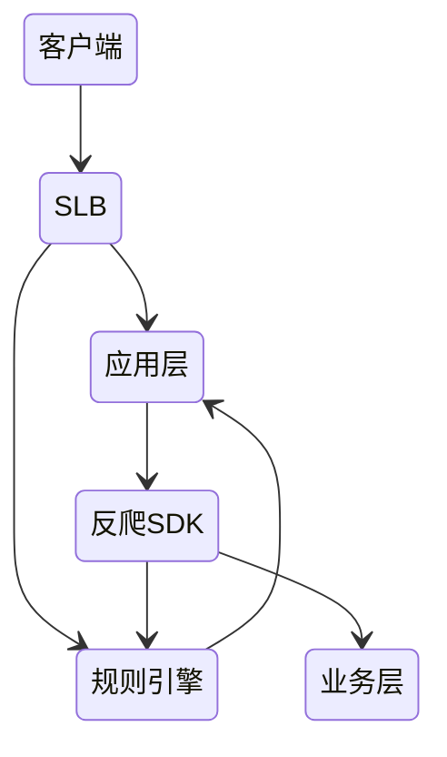

# 反爬虫系统工程

## 一、反爬的第一性原理（Principles First）

在讨论任何反爬技术之前，必须先明确其不可动摇的底层事实。

### 1. 反爬不是阻止访问，而是提高滥用成本

* 网络本身是开放系统
* HTTP/浏览器天生就是“可模拟”的
* 任何完全基于客户端的校验都不可避免被逆向

**结论：**

> 反爬的目标不是“禁止爬虫”，而是**让滥用行为在成本、规模或时间上变得不可接受**。

---

### 2. 反爬系统必须允许不准确

* 100% 准确的识别 = 100% 的误伤风险
* 0 误伤 = 0 防护效果

因此：

> **反爬系统本质上是一个“容错系统”，而非安全系统。**

---

### 3. 反爬的技术上限由非技术因素决定

反爬的真正边界来自：

* 用户体验
* 法律与合规风险
* 舆论与品牌影响
* 系统复杂度与运维成本

**核心原则：**

> 一切反爬技术，都必须服从于业务与社会系统的可承受范围。

---

## 二、反爬 = 不完全信息下的攻防博弈

反爬与爬虫之间，并非简单的“防守 / 破解”关系，而是一场**长期的动态博弈**。

### 1. 博弈参与方与目标

| 参与方 | 核心目标                |
| --- | ------------------- |
| 爬虫方 | 获取**可用、可信、可规模化**的数据 |
| 反爬方 | 保障数据价值、系统稳定与用户体验    |

---

### 2. 博弈的核心矛盾

* 信息不对称
* 成本不对称
* 时间不对称

双方都无法获得对方的完整信息，只能通过**统计特征、行为模式与结果反馈**不断调整策略。

---

### 3. 博弈的“可接受均衡态”

现实中的反爬系统追求的并非胜利，而是：

* 爬虫获取的数据 **不可完全信任**
* 爬虫规模 **难以扩大**
* 正常用户 **可感知成本最低**

> **这是一种“可接受的失控状态”，而非彻底控制。**

---

## 三、反爬系统的能力模型（从碎片到体系）

将所有反爬手段抽象为一棵能力树：

```
反爬系统能力树
├── 识别能力
│   ├── 网络层特征
│   ├── 协议 / 请求特征
│   ├── 浏览器与环境指纹
│   └── 业务行为模式
├── 对抗能力
│   ├── 限流与封禁
│   ├── 验证与挑战
│   ├── 数据投毒与随机化
│   └── 性能与路径干扰
├── 成本控制能力
│   ├── 误伤率管理
│   ├── 用户体验约束
│   └── 计算与运维成本
├── 治理能力
│   ├── 策略监控
│   ├── 熔断与回滚
│   ├── 快速下线
│   └── 策略演进
└── 法律与伦理边界
```

后文将围绕该模型展开。

---

## 四、识别能力：如何判断“它是不是爬虫”

### 1. 网络层识别

* IP / IP 段封锁
* WHOIS 判断公有云来源
* 异常端口、扫描行为

**本质：**

> 利用“基础设施差异”进行粗粒度筛选。

**代价：**

* NAT 误伤
* 企业出口流量误判

---

### 2. 应用层与协议特征

* HTTP Header 分布
* 协议一致性
* 非标准实现细节

**关键事实：**

> 请求可以伪造，但长期稳定伪造“分布特征”极其困难。

---

### 3. 浏览器与环境指纹

* Canvas 指纹
* DOM 结构指纹
* JS 执行特征

**本质：**

> 检测“环境一致性”，而非单一值。

---

### 4. 业务行为识别（最稳定的一层）

* 访问路径
* 操作节奏
* 行为序列

**结论：**

> **越靠近业务语义，越难被长期伪装。**

---

## 五、对抗能力：识别之后如何“处理”

### 1. 限流与接口定制

* 针对接口、IP、行为进行限流
* 必然伴随代理与分布式对抗

这是**成本博弈的第一层**。

---

### 2. 验证与挑战（验证码）

* 简单验证码 → OCR
* 复杂验证码 → 打码平台

**工程结论：**

> 验证码不是防爬方案，而是**成本调节器**。

---

### 3. 数据投毒与随机化

* 返回假数据
* 引入统计噪声

**关键思想：**

> 只要数据存在不可识别的不确定性，爬虫就无法安全用于生产。

---

### 4. 性能与路径干扰

* 拖慢渲染
* 非标准标签

**风险提示：**

* 极易影响真实用户
* 必须严格控制范围

---

## 六、反爬系统的工程化设计

### 1. 特征检测体系

* 在线检测：实时、高成本
* 离线检测：低成本、低实时
* 混合检测：工程最优解

其本质是**统计分布异常检测**。

---

### 2. Key / 签名机制

* 引入随机与混淆
* 保证可校验性

> 本质等同于“轻量级、短生命周期的身份绑定”。

---

### 3. 系统解耦与快速下线

反爬系统的核心工程原则：

> **反爬必须是“可随时撤回的能力”。**



---

### 4. 治理与熔断

* 误伤率监控
* 策略熔断
* 自动回滚

这是反爬系统**长期存活的关键**。

---

## 七、分布式爬虫与反爬的现实边界

* IP、环境、行为的分布式伪装
* 异构系统降低识别一致性

**现实结论：**

> 规模化爬虫无法彻底阻止，只能限制其“可用性”。

---

## 八、法律与伦理：反爬的顶层约束

### 1. 法律风险

* 侵权
* 破坏计算机系统
* 侵犯个人隐私

### 2. 伦理底线

* 不得牺牲正常用户体验
* 不得进行不可控攻击

> **技术能力 ≠ 技术正当性。**

## 关联内容（自动生成）

- [/计算机网络/网络安全/Web安全.md](/计算机网络/网络安全/Web安全.md) Web安全与反爬虫技术密切相关，都涉及识别和防范恶意访问行为，保护系统和数据安全
- [/计算机网络/网络安全/安全架构.md](/计算机网络/网络安全/安全架构.md) 反爬虫系统是安全架构的一部分，涉及访问控制、身份验证和威胁检测等安全架构概念
- [/计算机网络/网络安全/业务安全.md](/计算机网络/网络安全/业务安全.md) 反爬虫是业务安全的重要组成部分，用于保护业务数据和资源免受未经授权的抓取
- [/计算机网络/http/HTTP.md](/计算机网络/http/HTTP.md) 反爬虫技术基于HTTP协议实现，包括对HTTP头、请求模式等的检测和限制
- [/计算机网络/应用层.md](/计算机网络/应用层.md) 反爬虫技术主要在应用层实现，涉及对应用层协议和行为的分析与控制
- [/计算机网络/网络安全/网络安全.md](/计算机网络/网络安全/网络安全.md) 反爬虫是网络安全的一个具体应用领域，涉及网络层面的安全防护措施
- [/计算机网络/网络安全/渗透测试.md](/计算机网络/网络安全/渗透测试.md) 了解渗透测试方法有助于完善反爬虫系统，识别潜在的安全漏洞和绕过手段
- [/计算机网络/网络安全/安全治理.md](/计算机网络/网络安全/安全治理.md) 反爬虫系统的治理需要遵循安全治理原则，确保安全措施的合规性和有效性
