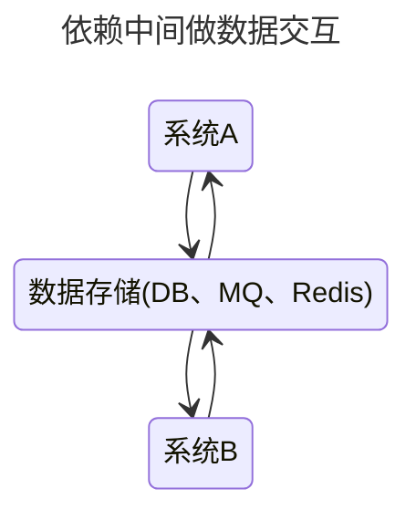
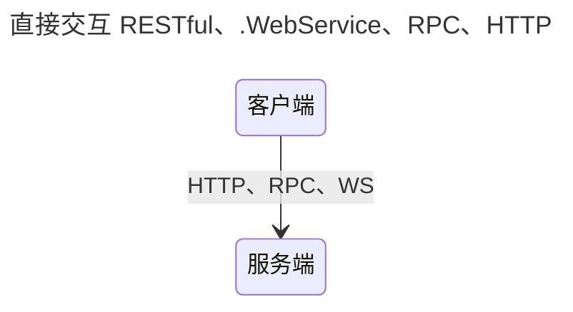

# rpc

RPC : Remote Procedure Call ,即远程过程调用。
是分布式系统常见的一-种通信方法,从跨进程到跨物理机已经有几十年历史。

## 从一个方法调用开始

```java
System.our.println("hello world");
```

在本机上，完成这么样的一次方法调用需要：

1. 传递方法参数：将字符串hello world的引用地址压栈
2. 确定方法版本：像在JVM上 这个过程使用invokexxx指令来完成
3. 执行被调方法：从栈中弹出Parameter的值或引用，以此为输入，执行Callee内部的逻辑
4. 返回执行结果：将Callee的执行结果压栈

为了完成这些过程，就需要通过内存来传递数据 如果两个方法不在同一个进程，要如何传递数据？

- 管道（Pipe）或者具名管道（Named Pipe）：通过管道在进程间传递少量的字符流或字节流。普通管道只用于有亲缘关系进程（由一个进程启动的另外一个进程）间的通信
  ```sh
  ps aux | grep tomcat
  ```
- 信号（Signal）:用于通知目标进程有某种事件发生
  ```sh
  kill -9 666
  ```
- 信号量（Semaphore）:相当于操作系统提供的一个特殊变量
- 消息队列（Message Queue）:POSIX标准中定义了消息队列用于进程间数据量较多的通讯
- 共享内存（Shared Memory）：是效率最高的进程间通讯形式
- 套接字接口（Socket）:当仅限于本机进程间通讯时，套接字接口是被优化过的，不会经过网络协议栈，不需要打包拆包、计算校验和、维护序号和应答等操作

## 通信的成本

通过网络进行分布式运算的8宗罪

```
The network is reliable —— 网络是可靠的。
Latency is zero —— 延迟是不存在的。
Bandwidth is infinite —— 带宽是无限的。
The network is secure —— 网络是安全的。
Topology doesn't change —— 拓扑结构是一成不变的。
There is one administrator —— 总会有一个管理员。
Transport cost is zero —— 不必考虑传输成本。
The network is homogeneous —— 网络是同质化的。
```

## RPC的三个基本问题

- 如何表示数据：序列化协议
- 如何传递数据：通信协议
- 如何确定方法：调用协议

跨进程交互形式: RESTful、 WebService、 HTTP、 基于DB做数据交换、基于MQ做数据交换,以及RPC。

### 通信协议

可扩展的RPC协议必备要素：

1. 协议头：版本、首部长度、消息ID
2. 协议头扩展字段
3. 协议体

### 序列化协议

- 任何一种序列化框架，核心思想就是设计一种序列化协议

RPC选择序列化协议需要考量的：

1. 安全 像某些JSON的实现三天两头爆出漏洞
2. 性能
3. 空间
4. 通用与兼容

Hessian 与 Protobuf 是综合这些考量较优的选择

#### Thrift

通过预先定义一个IDL：

```go
struct SearchClick
{
  1:string user_id,
  2:string search_term,
  3:i16 rank,
  4:string landing_url,
  // 5:i32 click_timestamp, deprecated 已废弃
  6:i64 click_long_timestamp,
  7:string ip_address
}
```

Thrift 里的 TBinaryProtocol 在顺序写入数据的过程中，不仅会写入数据的值（field-value），还会写入数据的编号（field-id）和类型（field-type）


有了编号，就可以实现向下兼容旧数据，同时部分字段也可以不用有值。

为了压榨存储空间，Thrift 使用两种方式：

- Delta Encoding：TCompactProtocol 就是一种“紧凑”的编码方式，这个协议在存储编号的时候，存储的不是编号的值，而是存储编号和上一个编号的差，同时使用更少的 bit 数来代表类型
- ZigZag 编码 +VQL 可变长数值表示：TCompactProtocol 对于所有的整数类型的值，都采用了可变长数值（VQL，Variable-length quantity）的表示方式，通过 1~N 个 byte 来表示整数

### 网络模型

多路IO复用、零拷贝是实现高性能的关键

## 交互形式





## 核心原理


## 另外一个角度

如果跳出程序方法调用的视角 不再以传递参数-调用方法-获取结果这样的思路思考 就会有焕然一新的视角

## 客户端负载均衡

- 从注册中心服务器端上获取服务注册信息列表，缓存到本地。后在本地实现轮训负载均衡策略

```java
// 自己实现一个随机负载均衡
List<ServiceInstance> list = discoveryClient.getInstances("producer");
Random random = new Random();
ServiceInstance serviceInstance = list.get(random.nextInt(list.size()));
```

```java
// Ribbon的负载均衡选择
@RestController
public class Controller {
    @Autowired
    LoadBalancerClient client;

    @RequestMapping("/user")
    public String user(){
        return new RestTemplate().getForObject(
                client.choose("user-service").getUri().toString()+"/user",String.class);
    }
}
```

### 负载均衡策略

简单的实现有随机策略，但有时需要根据压力的负载情况来选择压力最小的节点，从而实现压力的均衡，一种实现是监控节点的资源指标，压力越高，权重越小。

## SpringCloudFeign

feign通过调用方自己定义一个提供方的接口来进行RPC：

```java
// 调用方
@FeignClient("producer")
public interface HelloRemote {

    @RequestMapping("/hello")
    String hello(@RequestParam String name);
}
```
