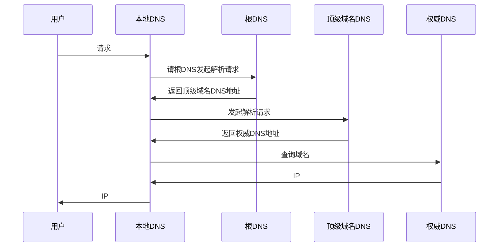
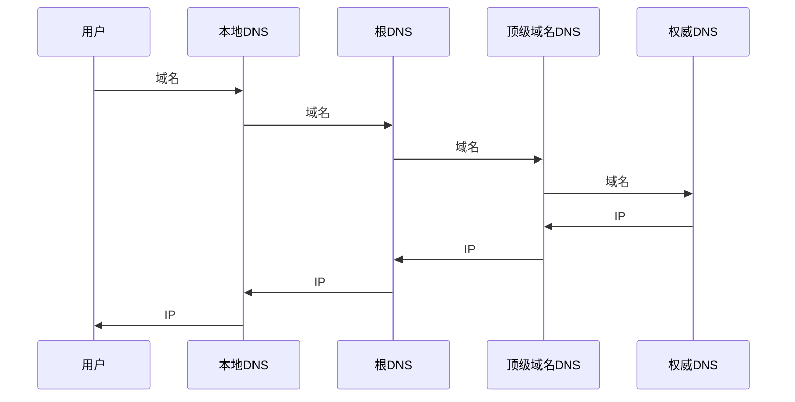

# 应用层

## 体系结构

- CS架构
- P2P架构

## 进程通信

两个端系统之间的通信，本质是两个进程之间的通信，进程通过使用操作系统提供的接口与另一个端系统上的进程进行通信，这个接口是**套接字**

套接字 =（IP，端口号）

应用程序能控制的套接字在运输层的可自定义性很低

## 运输服务

- TCP
- UDP

## 应用层协议

- HTTP FTP Telnet
- SMTP POP3 IMAP
- SIP RTP RTSP

## DNS

提供了主机名和 IP 地址之间相互转换的服务


- 权威域名服务器：指负责翻译特定域名的DNS服务器
- 根域名服务器：指固定的、无需查询的顶级域名（Top-Level Domain）服务器

DNS是一个超大型的[AP](/软件工程/架构/系统设计/分布式/分布式理论.md#CAP)缓存系统，所以一个域名解析绑定全部生效要很久

返回的结果时一个四元组(name,value,type,ttl)

ttl是缓存的失效时间

可以使用 UDP 或者 TCP 进行传输，使用的端口号都为 53。大多数情况下 DNS 使用 UDP 进行传输，这就要求域名解析器和域名服务器都必须自己处理超时和重传从而保证可靠性

只有当返回的响应超过512字节或者主域名服务器向辅助域名服务器传送变化的数据时采用TCP协议

### 迭代查询



本地DNS收到查询请求后，会按照“是否有www.xxx.com.cn的权威服务器”→“是否有xxx.com.cn的权威服务器”→“是否有com.cn的权威服务器”→“是否有cn的权威服务器”的顺序，依次查询自己的地址记录，如果一直没有找到 就会找到根域名服务器为止

最后它将会得到“cn的权威服务器”的地址记录，然后通过“cn的权威服务器”，得到“com.cn的权威服务器”的地址记录，以此类推，最后找到能够解释www.xxx.com.cn的权威服务器地址

### 递归查询



### 域名解析记录

- A记录(Address) 用来指定域名对应的IP地址
- NS记录用来制定一个可以获取权威DNS的主机名
- MX记录(Mail Exchange) 用来指定邮件服务器
- CNAME记录(Canonical Name) 别名解析就是为一个域名设置多个别名
- NS记录 为某个域名指定DNS解析服务器
- TXT记录 添加一段文字说明

### DNS报文


### DNS预取优化

```html
<!-- 加上这个标签 浏览器就会提前解析DNS 避免DNS解析带来的延迟问题 -->
<link rel="dns-prefetch" href="//domain.not-icyfenx.cn">  
```

### HTTPDNS

一种通过HTTPS协议开发的DNS查询服务，应用程序可以直接跳过操作系统主动查询

### 攻击DNS

得益于DNS的分布式，DNS拥有很高的健壮性

- DNS ddos
- DNS 污染：攻击者伪造上游DNS更新域名与IP映射缓存 此时用户就会被导引到不正确的目的地
- DNS 劫持：攻击域名解析服务器（DNS），或伪造域名解析服务器（DNS）的方法，把目标网站域名解析到错误的IP地址

## FTP

FTP 使用 TCP 进行连接，它需要两个连接来传送一个文件:

- 控制连接：客户端主动建立连接后，使用这个连接将客户端的命令传送给服务器，并传回服务器的应答
- 数据连接：用来传送一个文件数据

### 主动模式

客户端与服务器建立控制连接之后,由服务器主动发起一条从服务器到客户端的连接

### 被动模式

客户端与服务器建立控制连接之后,由客户端再发起一条从客户端到服务器的连接

### 通过代理连接FTP

- 使用 apache FTPClient

```java
FTPClient client = new FTPHTTPClient(config.getProxyHost(), config.getProxyPort());
// 当将 IPv4 与 NAT 一起使用时，它可能适用于一些罕见的配置。如果 FTP 服务器具有静态 PASV 地址（外部网络）并且客户端来自另一个内部网络。 在这种情况下，PASV 命令后的数据连接将失败，而 EPSV 将通过仅占用端口使客户端成功
client.setUseEPSVwithIPv4(true);
// connect and login...
```

## DHCP

Dynamic Host Configuration Protocol

### 工作过程


## 电子邮件协议

### SMTP

SMTP 只能发送 ASCII 码，而互联网邮件扩充 MIME 可以发送二进制文件。MIME 并没有改动或者取代 SMTP，而是增加邮件主体的结构，定义了非 ASCII 码的编码规则


SMTP服务器之间是点对点的，一般不会有中间转发者

### POP3

从服务器上读取了邮件，就把该邮件删除

### IMAP

客户端和服务器上的邮件保持同步

## 常用端口

应用       | 应用层协议  | 端口号     | 传输层协议   | 备注
-------- | ------ | ------- | ------- | ------------------
域名解析     | DNS    | 53      | UDP/TCP | 长度超过 512 字节时使用 TCP
动态主机配置协议 | DHCP   | 67/68   | UDP     |
简单网络管理协议 | SNMP   | 161/162 | UDP     |
文件传送协议   | FTP    | 20/21   | TCP     | 控制连接 21，数据连接 20
远程终端协议   | TELNET | 23      | TCP     |
超文本传送协议  | HTTP   | 80      | TCP     |
简单邮件传送协议 | SMTP   | 25      | TCP     |
邮件读取协议   | POP3   | 110     | TCP     |
网际报文存取协议 | IMAP   | 143     | TCP     |

## P2P

- 文件下载 BT为代表的协议
- 区块链

## 一个web页面请求过程

### DHCP配置主机信息

主机刚开始没有IP地址信息，首先通过DHCP来获取IP地址
主机生成一个DHCP UDP请求报文
该请求报文被放入一个具有广播地址的IP数据报中
后该IP数据报被封装在MAC帧中，这个帧的目的地址是一个广播地址
当DHCP服务器接收到这个广播帧后不断向上分解得到主机信息，并将相关信息放入报文中，发送给主机
交换机通过自学习，因此现在交换机就可以直接知道应该向哪个接口发送该帧
主机收到该帧之后，配置自己的IP地址，子网掩码等信息

### ARP解析MAC地址

主机需要跟网关路由器通信，但是DHCP 过程只知道网关路由器的 IP 地址
为了获取MAC地址，主机需要生成一个包含网关路由器地址的ARP查询报文，并将它广播出去
网关路由器接收到这个广播报文之后，向主机回送网关路由器自己的MAC地址

### DNS解析域名

此时，主机可以直接通过网关路由器发送一个DNS请求报文
路由器收到这个DNS查询报文的帧后，抽取出IP数据报，根据转发表决定应该转发给哪台路由器
路由器通过内部网关协议和外部网关协议来实现路由选择
这个DNS请求到达服务器之后，DNS进行查询，发送DNS回答报文，回送给主机

### HTTP请求页面

此时，主机就得到HTTP服务器的IP地址
会经过三次握手生成一个TCP套接字
TCP连接建立后，客户端生成一个HTTP请求报文，发送给服务器
服务器接收到之后，返回一个响应报文
客户端接收到响应之后，进行渲染，显示web页面
