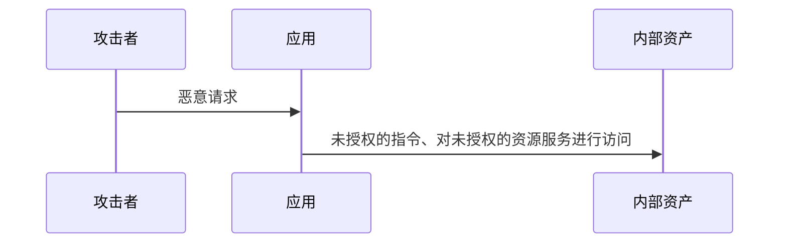
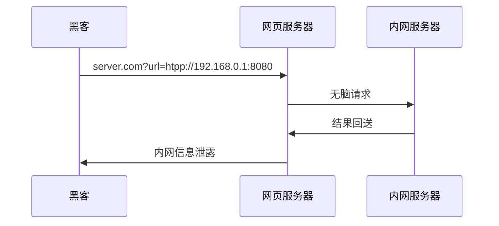
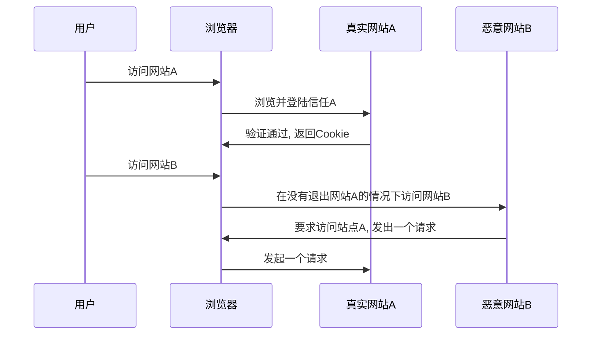

# Web安全

原则：
- 黑名单与白名单思想
- 最小权限原则
- 纵深防御
- 数据与代码分离
- 不可预测原则

## 浏览器安全

### 同源策略

> 同源策略限制了从同一个源加载的文档或脚本如何与来自另一个源的资源进行交互

URL                                               | 结果 | 原因
------------------------------------------------- | -- | ----------------------
<http://store.company.com/dir2/other.html>        | 成功 | 只有路径不同
<http://store.company.com/dir/inner/another.html> | 成功 | 只有路径不同
<https://store.company.com/secure.html>           | 失败 | 不同协议 ( https和http )
<http://store.company.com:81/dir/etc.html>        | 失败 | 不同端口 ( http:// 80是默认的)
<http://news.company.com/dir/other.html>          | 失败 | 不同域名 ( news和store )

同源策略一旦出现漏洞被绕过，将会出现严重的后果

### 浏览器沙箱

>沙箱设计的目的是为了让不可信的代码运行在一定的环境中，从而限制这些代码访问隔离区之外的资源。如果因为某种原因，确实需要访问隔离区外的资源，那么就必须通过的指定的通道，这些通道会进行严格的安全检查，来判断请求的合法性。通道会采取默认拒绝的策略，一般采用封装 API 的方式来实现

### 恶意网址拦截

大部分都是通过识别上传到云，浏览器厂商共享数据库，从而识别恶意网站

### 防盗链

>盗链是指服务提供商自己不提供服务的内容，通过技术手段绕过其它有利益的最终用户界面（如广告），直接在自己的网站上向最终用户提供其它服务提供商的服务内容，骗取最终用户的浏览和点击率。受益者不提供资源或提供很少的资源，而真正的服务提供商却得不到任何的收益

#### 实现原理

通过判断HTTP请求头referer（访问的来源）字段，服务端再根据该字段是否返回资源

```java
public void doFilter(ServletRequest request, ServletResponse response, FilterChain chain)
		throws IOException, ServletException {
	HttpServletRequest req = (HttpServletRequest) request;
	String referer = req.getHeader("Referer");
	if (StringUtils.isEmpty(referer)) {
		request.getRequestDispatcher("/imgs/error.png").forward(request, response);
		return;
	}
	String domain = getDomain(referer);
	if (!domain.equals(domainName)) {
		request.getRequestDispatcher("/imgs/error.png").forward(request, response);
		return;
	}
	chain.doFilter(request, response);
}
```

## 权限控制失效

1. 系统在实现过程中违背了“最小权限原则” 或 “默认拒绝原则”，在这种情况下用户可以获得一些特殊权限，而这些特殊权限原本只应该授权给特定的用户或角色
2. 通过修改 URL 地址、内部程序状态、HTML 页面，或者使用 Cyber 工具修改 API 请求的方式绕过访问控制
3. 通过提供唯一 ID 的方式预览或者修改其他账户信息及数据
4. 未经过访问控制地通过 POST、PUT 和 DELETE 方法访问 API
5. 通常意义上的提权，比如未登录状态下的用户操作，或者常规用户登录状态下的管理员操作
6. 元数据操纵，比如重放或者修改 JWT（JSON Web Token）访问控制令牌，或者通过操纵 Cookie 的方式进行提权
7. CORS 误配置，可以导致来自未认证源的 API 访问

### 如何预防

1. 除对公共资源的访问外，其他请求没有允许就默认拒绝
2. 建立统一的权限机制并在应用程序中强制执行
3. 特殊的业务规则限制应由领域模型强制执行
4. 禁用服务器目录列出并确保文件元数据（例如 .git）和备份文件不存在于 Web 根目录中
5. 记录访问控制失败的请求，供管路员进行审计
6. 对接口访问进行限流，以最大程度地减少自动攻击工具的危害
7. 注销后，服务器上的有 session 应失效。无状态 JWT 令牌应该是有效期应该是短暂的，以便最大限度地减少攻击者的机会窗口。对于寿命较长的 JWT，强烈建议遵循 OAuth 标准来撤销访问权限

### 意外的代理访问



- 应用本身的权限和用户可以操纵的输入流组件所属的权限不同；（条件 A）
- 攻击者并不能够直接发送请求到最终目标资产；（条件 B）
- 攻击者能够创建一个可以被转发的请求，这个请求可能为以下其中一个：
  - 指向了未授权访问的域名、端口号、IP 以及服务；（条件 C）
  - 指向了被授权访问的服务，但是请求内部包含了未授权的指令、资源等。（条件 D）

### SSRF

- 服务端请求伪造

为了解决跨域问题，可能会出现客户端提交一串url交由服务器请求转发后再返回给客户端



#### 漏洞利用

- 内网服务探测
- 文件读取 如本机的密码文件、日志

#### 防御

- 白名单
- 其他的服务器自身做好防护

### 路径穿越

应用程序对用户提供的文件路径或文件名进行处理时，没有充分验证或过滤用户提供的输入，从而导致攻击者可以利用特定的输入路径来访问应用程序之外的文件或目录

```py
def downloadFile(fileName):
    filePath = "/var/www/files/" + fileName
    if fileExists(filePath):
        return readFile(filePath)
    else:
        return "File not found"

fileContent = downloadFile("../../../../../etc/passwd")
print(fileContent)
```

### 敏感数据泄露

业务敏感数据泄露

技术敏感数据泄露：
  - 返回的异常泄露敏感信息
  - 上线前没有删干净的开发、测试文件 如 .git 文件夹，没有关闭调试开关
  - 应用逻辑设计问题，如用户登录返回的错误信息
  - 客户端获取了不必要的权限导致被利用

### 终端权限管控不合理

不合理的权限赋予、权限处理以及权限管理过程

1. 高权限运行应用：安装和运行组件的过程中，某些程序组件的运行环境设置的权限过高，导致低权限应用通过服务调用关系可以完成提权操作
2. 降权时出现异常

```py
def makeNewUserDir(username):
    ...
    try:
        raisePrivileges()
        os.mkdir('/home/' + username)
        lowerPrivileges()
    except OSError:
        return False
    ...
```

在做安全建设上，需要考虑以下几点：

1. 通过函数封装、用户隔离等方式最小权限运行代码
2. 对高权限代码给予额外的输入检测以及函数检查
3. 对复杂应用系统的配置文件进行安全审计

## 加密机制失效

典型的攻击场景：

1. 数据库加密：可以通过其内部加密函数实现数据加密存储，然而在数据读取过程中由于经过自动解密过程，SQL 注入这样的攻击就有可能获取到数据库中的明文
2. 数据明文传输
3. 加密强度不够
4. 弱 HASH ：HASH 算法的缺陷导致攻击者能够找到其他输入，并且生成同样的 HASH 输出
5. 签名验证不当：如只验证有效性，而没验证正确性

安全预防：

- 数据层面：对数据进行分类分级，识别出需要重点保护的数据类型，不存储不使用的敏感数据
- 存储层面：关闭可能包含敏感数据的缓存功能，确保敏感数据都在静态存储中都以加密形态
- 传输层面：数据加密传输
- 算法层面：使用安全、更新的算法
- 随机数层面：保证种子随机化

### 弱编码

对于字符编码的不恰当使用，导致的注入、解析时产生安全问题

### 数字证书

除了证书伪造带来的安全问题外，另外一个比较重要的点就是对证书信任链的验证，如果没有对信任链进行验证，伪造中间服务商进行签发证书，可以进行 DNS 污染或者中间人攻击

### 密码问题

1. 硬编码密钥
2. 随机值不随机
3. 加密算法本身不安全
4. 初始化向量可预测导致同样的明文产生同样的密文
5. 不安全的 Padding

HASH 碰撞与生日攻击：多对一的映射关系必然存在两个输入 M1 和 M2 能够满足 HASH(M1)=HASH(M2)。这种攻击预防只需要增加 HASH 的长度，提高攻击者的计算成本即可

### 随机数

统计学意义上的伪随机数：给定的一个样本集，每个元素出现的概率是大概相似的

密码学安全的伪随机数：随机、不可预测、均匀

真随机数：在上面两个条件的基础上，再加上随机样本不可重现

关于随机数的安全问题：

- 时间戳当随机数
- 使用了不安全的种子，使得种子可被猜测，进而导致随机数被猜测
- 随机种子取值范围过小，被爆破

## 跨站请求伪造（CSRF）

>跨站请求攻击，简单地说，是攻击者通过一些技术手段欺骗用户的浏览器去访问一个自己曾经认证过的网站并运行一些操作（如发邮件，发消息，甚至财产操作如转账和购买商品）

这种攻击一般发生在跨域场景下，过程中事实上并没有获取到用户的登录凭据，只是借用户之手发送了恶意的请求，可以采用的攻击方式有很多：图片 URL、超链接、表单提交等



### 防御

- 服务端添加同源策略
  - 可以解决跨域发起的攻击，但有些攻击仍可以在同域中发起，如通过 XSS
- 验证码
  - 发生csrf时，用户一般都不知道，当引入验证码的时候，则就是强制用户与应用交互
- 检查referer
  - 页面一般具有逻辑关系，如下单之前的页面一般是购物车，如果不符合条件，则是很可疑的
- token
  - 要实施一次csrf，攻击者需要构造出操作的请求数据，如果在这个过程中引入一个随机变量，URL就无法构造，更谈不上攻击了

### 接口幂等性设计

两个关键因素：

- 幂等令牌：通过什么方式来识别
- 确保唯一性：服务器端用什么机制去确保同一个请求一定不会被处理两次

需要考虑的：

- 幂等令牌什么时候产生，怎样产生
- 令牌有没有被误删的可能
- 保证唯一性的各个环节和实现，都要考虑竞争条件
- 对请求重试的处理
- 一个系统中需要多层幂等，当一条调用链的某个服务没有实现幂等，就存在着幂等漏洞

#### MVVC 多版本并发控制

通过一个版本号来达到避免冲突，但是会有一定的重试

#### 去重表

利用数据库的唯一索引特性，保证唯一的逻辑

#### 悲观锁

整个执行过程中锁定该订单对应的记录

#### token

数据提交前要向服务的申请 token，token 放到 redis 或内存，token 有效时间提交后后台校验 token，同时删除 token，token只有一次有效性

## 点击劫持


- flash劫持
- 图片覆盖攻击
  - 通过修改图片的style属性能让图片出现在页面任何位置
- 拖拽劫持
  - 通过隐藏控件，让用户在不知情的情况下拖拽网页数据到另外一个页面
- 触屏劫持

### 防御 

- 禁止本网站被位于本网站之外的iframe所嵌套
  - HTTP X-Frame-Options

## HTML5安全

### 新标签

- 新的标签出现导致之前的XSS防御失效
- iframe增加sandbox属性将大大提高安全性
- a标签的rel可以指定不发送referer
- canvas的应用

### 其他安全问题

- 跨域请求头
- window对象不受同源策略限制
- web storage

## 注入攻击

注入攻击的本质，是因为数据跟代码没有相分离，把用户输入的数据作为代码的一部分执行

### 跨站脚本攻击(XSS)

>XSS攻击通常指的是通过利用网页开发时留下的漏洞，通过巧妙的方法注入恶意指令代码到网页，使用户加载并执行攻击者恶意制造的网页程序

```js
userInput = "<script>alert(1)</script>"
function render(username) {
  return html`hello ${username}`
}
render(userInput)
```

#### XSS类型

- 反射型XSS
  - 需要构造一个恶意URL，诱导用户访问
- 存储型XSS
  - 数据存储在服务端，当数据被渲染到客户端的时候，恶意代码会被执行
- DOM based XSS
  - 恶意数据注入导致dom节点被改变

#### XSS payload

- 获取cookie
- 通过生成img节点发起get请求
- 构造from表单发起post请求
- 伪造页面进行钓鱼
- 浏览器及插件识别

#### 防御

- 使用http-only 禁止js读取cookie
- 对输入内容进行检查
- 对输出内容进行编码
- CSP 在服务端返回的 HTTP header 里面添加一个 Content-Security-Policy 选项，然后定义资源的白名单域名

### SQL注入

- 盲注
  - 通过在条件拼接条件来查看页面返回结果
- timeing attack
  - 通过在条件加上耗时函数，查看最终页面返回时间，来确定是否存在注入漏洞
  - 属于边信道攻击的一种

#### 数据库攻击技巧

- 读写文件
- 命令执行
- 字符集问题

#### 防御

- 预编译
- 检查数据类型
- 输入验证
- 安全编码函数
  - OWASP ESAPI

### 反序列化漏洞

在把数据转化成对象的过程中。在这个过程中，应用需要根据数据的内容，去调用特定的方法。而黑客正是利用这个逻辑，在数据中嵌入自定义的代码（比如执行某个系统命令）

#### 防御

- 黑名单 禁止反序列化某些类
- RASP检测 Runtime Application Self-Protection，实时程序自我保护 在关键函数的调用中，增加一道规则的检测

### 输入检测机制失效

不安全的输入检查：没有正确的过滤用户的输入

中间件的输入输出：应用的间组件没有对来自其他组件的输入数据进行正确的过滤，导致恶意输入数据可以在组件之间传播

不安全的映射：没有对应用程序要执行的外部文件进行足够的限制

编码及转义：系统没有对特殊字符做转义处理，导致可以通过注入特殊字符来绕过输入验证

编码及混淆：系统只对一些危险的字符串进行限制，却没有对这些字符对应的混淆编码进行拦截

#### 绕过 WAF

绕过的核心思想是运用 WAF 和服务端的协议解析差异，使得服务端能够解析攻击者发送的请求，而 WAF 无法解析所以跳过检测

### 其他注入攻击

- XML注入
  - 用户输入的数据改变了XML的结构导致通过 XML 执行恶意代码
- 代码函数
  - 使用了代码执行函数执行了包含用户输入的代码，如 eval 函数
- 命令注入
  - 使用用户输入的数据拼接去执行命令导致的问题
- CRLF注入
  - 有些使用CRLF换行符分割的地方，如果用户输入的数据包含CRLF，则会造成问题
  - log
  - HTTP header

## 不安全的设计

### 业务逻辑漏洞

原因：开发者对用户的行为做出了错误的假设、对用户输入的不充分验证

## 文件上传漏洞

- 用户上传的文件被web容器解释执行
- 上传的是跨域配置文件，导致同源策略失效
- 上传的文件是木马病毒被管理员下载执行
- 上传的图片含有木马与脚本，被某些浏览器执行

### 文件上传检查绕过

- 通过\0字符截断

### apache文件解析

- apache对不认识的文件类型的处理

### IIS文件解析

### nginx对php cgi的执行问题

### 安全的文件上传

- 上传目录设置为不可执行
- 白名单文件类型检查
  - 后缀名+文件头
- 文件存放加上随机数
- 单独的文件服务器

## Web框架安全

### 模板引擎与XSS

- 使用默认的设置

### CSRF

- 通过框架自动化添加token与token校验

### HTTP Headers

- 谨慎用户数据操作HTTP 头
- 通过web框架提供的统一接口来跳转页面

### 持久层

- 变量绑定与SQL注入

## 第三方依赖安全

对于项目应用的第三方依赖应该定时梳理，及时剔除无用依赖

当出现CVE漏洞时，一般都已有补丁发布，更新即可

但是某些情况下会面临无补丁可打的困境，此时可以通过前置防火墙检测拦截攻击流量

### DevSecOps

将安全性无缝集成到 DevOps 的每个阶段。它统一了开发活动、操作支持和安全检查。在 DevSecOps 中，对代码的任何更改都会触发安全检查，其中若存在易受攻击和不安全的组件，就会很快被发现及更改

#### 模糊测试

模糊测试中，会向目标软件或系统输入大量的随机、无效或异常的数据（即“模糊输入”），然后监视软件或系统的响应，以检测是否存在异常行为或崩溃从而可能发现潜在的漏洞

### 供应链攻击

利用了软件供应链中的信任关系，使得攻击者可以在软件开发过程中的某个环节植入恶意代码或后门

- 开发环节：攻击者可能通过入侵软件开发过程中的开发环境、版本控制系统或持续集成/持续部署工具，来篡改源代码、注入恶意代码或后门。
- 编译和构建环节：攻击者可能篡改软件编译或构建过程中的依赖项，例如第三方库、组件或插件，从而使得最终构建的软件包含恶意代码。
- 部署和分发环节：攻击者可能在软件的部署或分发过程中操纵软件包，例如在下载服务器、内容分发网络（CDN）或软件仓库中植入恶意代码。
- 更新和补丁环节：攻击者可能篡改软件更新或补丁的过程，以便在更新或补丁中植入恶意代码

## 应用层拒绝服务攻击

### DDOS

>是指处于不同位置的多个攻击者同时向一个或数个目标发动攻击，或者一个攻击者控制了位于不同位置的多台机器并利用这些机器对受害者同时实施攻击

- SYN flood

这是一种利用TCP协议缺陷，发送大量伪造的TCP连接请求，使被攻击方资源耗尽(CPU满负荷或内存不足)的攻击方式

### 应用层DDOS

#### CC攻击

- 主要针对消耗资源大的web页面发起大量请求

使用限制请求频率来防御，但本质还是需要通过做好性能优化与架构优化来对抗

- 也可以通过验证码来阻止大量的机器请求

#### 防御应用层DDOS

- 区分请求的是人还是机器
- IP请求频率限制

### 资源耗尽攻击

- slowloris攻击

以极低的速率发送数据，占用服务器资源

- server limit dos

往正常的客户端写入超长数据，导致客户端请求被服务器拒绝

- 正则

一些正则表达式的处理是非常耗费资源的

## web服务器配置安全

- 模块安全问题
- 运行身份问题

### jboss与tomcat

- 注意这些web容器的管理入口

### web服务器对同名参数的解析问题

### 安全原则

1. 最小权限原则
2. 通用化的报错设置，避免暴露过多报错信息
3. 修改默认账户信息

### HSTS

通过HTTP响应头中的Strict-Transport-Security字段来实现。当浏览器首次与支持HSTS的Web服务器建立安全连接时，服务器可以通过该响应头告知浏览器将来访问该站点时只使用HTTPS进行通信
