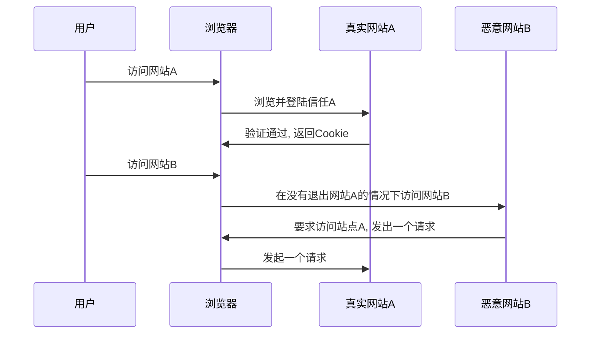
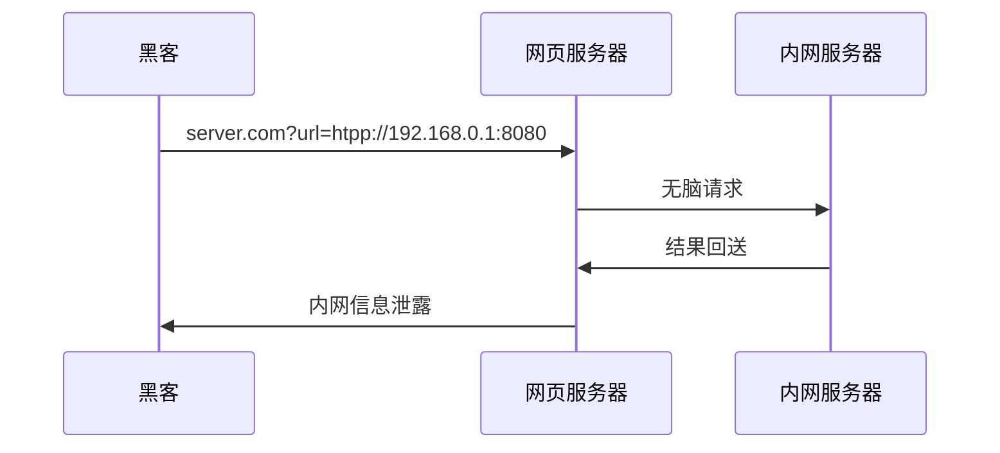

# Web安全

原则：
- 黑名单与白名单思想
- 最小权限原则
- 纵深防御
- 数据与代码分离
- 不可预测原则

## 浏览器安全

### 同源策略

> 同源策略限制了从同一个源加载的文档或脚本如何与来自另一个源的资源进行交互

URL                                               | 结果 | 原因
------------------------------------------------- | -- | ----------------------
<http://store.company.com/dir2/other.html>        | 成功 | 只有路径不同
<http://store.company.com/dir/inner/another.html> | 成功 | 只有路径不同
<https://store.company.com/secure.html>           | 失败 | 不同协议 ( https和http )
<http://store.company.com:81/dir/etc.html>        | 失败 | 不同端口 ( http:// 80是默认的)
<http://news.company.com/dir/other.html>          | 失败 | 不同域名 ( news和store )

同源策略一旦出现漏洞被绕过，将会出现严重的后果

### 浏览器沙箱

>沙箱设计的目的是为了让不可信的代码运行在一定的环境中，从而限制这些代码访问隔离区之外的资源。如果因为某种原因，确实需要访问隔离区外的资源，那么就必须通过的指定的通道，这些通道会进行严格的安全检查，来判断请求的合法性。通道会采取默认拒绝的策略，一般采用封装 API 的方式来实现

### 恶意网址拦截

大部分都是通过识别上传到云，浏览器厂商共享数据库，从而识别恶意网站

### 防盗链

>盗链是指服务提供商自己不提供服务的内容，通过技术手段绕过其它有利益的最终用户界面（如广告），直接在自己的网站上向最终用户提供其它服务提供商的服务内容，骗取最终用户的浏览和点击率。受益者不提供资源或提供很少的资源，而真正的服务提供商却得不到任何的收益

#### 实现原理

通过判断HTTP请求头referer（访问的来源）字段，服务端再根据该字段是否返回资源

```java
public void doFilter(ServletRequest request, ServletResponse response, FilterChain chain)
		throws IOException, ServletException {
	HttpServletRequest req = (HttpServletRequest) request;
	String referer = req.getHeader("Referer");
	if (StringUtils.isEmpty(referer)) {
		request.getRequestDispatcher("/imgs/error.png").forward(request, response);
		return;
	}
	String domain = getDomain(referer);
	if (!domain.equals(domainName)) {
		request.getRequestDispatcher("/imgs/error.png").forward(request, response);
		return;
	}
	chain.doFilter(request, response);
}
```

## 跨站脚本攻击(XSS)

>XSS攻击通常指的是通过利用网页开发时留下的漏洞，通过巧妙的方法注入恶意指令代码到网页，使用户加载并执行攻击者恶意制造的网页程序

### XSS类型

- 反射型XSS
  - 需要构造一个恶意URL，诱导用户访问
- 存储型XSS
  - 数据存储在服务端，当数据被渲染到客户端的时候，恶意代码会被执行
- DOM based XSS
  - 恶意数据注入导致dom节点被改变

### XSS payload

- 获取cookie
- 通过生成img节点发起get请求
- 构造from表单发起post请求
- 伪造页面进行钓鱼
- 浏览器及插件识别

### 防御

- 使用http-only 禁止js读取cookie
- 输入检查
- 输出检查
- CSP 在服务端返回的 HTTP header 里面添加一个 Content-Security-Policy 选项，然后定义资源的白名单域名

## 跨站请求伪造（CSRF）

>跨站请求攻击，简单地说，是攻击者通过一些技术手段欺骗用户的浏览器去访问一个自己曾经认证过的网站并运行一些操作（如发邮件，发消息，甚至财产操作如转账和购买商品）



### 防御

- 验证码
  - 发生csrf时，用户一般都不知道，当引入验证码的时候，则就是强制用户与应用交互
- 检查referer
  - 页面一般具有逻辑关系，如下单之前的页面一般是购物车，如果不符合条件，则是很可疑的
- token
  - 要实施一次csrf，攻击者需要构造出操作的请求数据，如果在这个过程中引入一个随机变量，URL就无法构造，更谈不上攻击了

### 接口幂等性设计

#### MVVC 多版本并发控制

通过一个版本号来达到避免冲突，但是会有一定的重试

#### 去重表

利用数据库的唯一索引特性，保证唯一的逻辑

#### 悲观锁

整个执行过程中锁定该订单对应的记录

#### token

数据提交前要向服务的申请 token，token 放到 redis 或内存，token 有效时间提交后后台校验 token，同时删除 token，token只有一次有效性

## SSRF

- 服务端请求伪造

为了解决跨域问题，可能会出现客户端提交一串url交由服务器请求转发后再返回给客户端



### 漏洞利用

- 内网服务探测
- 文件读取 如本机的密码文件、日志

### 防御

- 白名单
- 其他的服务器自身做好防护

## 点击劫持


- flash劫持
- 图片覆盖攻击
  - 通过修改图片的style属性能让图片出现在页面任何位置
- 拖拽劫持
  - 通过隐藏控件，让用户在不知情的情况下拖拽网页数据到另外一个页面
- 触屏劫持

### 防御 

- 禁止本网站被位于本网站之外的iframe所嵌套
  - HTTP X-Frame-Options

## HTML5安全

### 新标签

- 新的标签出现导致之前的XSS防御失效
- iframe增加sandbox属性将大大提高安全性
- a标签的rel可以指定不发送referer
- canvas的应用

### 其他安全问题

- 跨域请求头
- window对象不受同源策略限制
- web storage

## 注入攻击

注入攻击的本质，还是因为数据跟代码没有相分离，把用户输入的数据作为代码的一部分执行

### SQL注入

- 盲注
  - 通过在条件拼接条件来查看页面返回结果
- timeing attack
  - 通过在条件加上耗时函数，查看最终页面返回时间，来确定是否存在注入漏洞
  - 属于边信道攻击的一种

#### 数据库攻击技巧

- 读写文件
- 命令执行
- 字符集问题

#### 防御

- 预编译
- 检查数据类型
- 安全编码函数
  - OWASP ESAPI

### 反序列化漏洞

在把数据转化成对象的过程中。在这个过程中，应用需要根据数据的内容，去调用特定的方法。而黑客正是利用这个逻辑，在数据中嵌入自定义的代码（比如执行某个系统命令）

#### 防御

- 黑名单 禁止反序列化某些类
- RASP检测 Runtime Application Self-Protection，实时程序自我保护 在关键函数的调用中，增加一道规则的检测

### 其他注入攻击

- XML注入
  - 用户输入的数据改变了XML的结构
- 代码函数
  - 使用了代码执行函数执行了包含用户输入的代码
- CRLF注入
  - 有些使用CRLF换行符分割的地方，如果用户输入的数据包含CRLF，则会造成问题
  - log
  - HTTP header

## 文件上传漏洞

- 用户上传的文件被web容器解释执行
- 上传的是跨域配置文件，导致同源策略失效
- 上传的文件是木马病毒被管理员下载执行
- 上传的图片含有木马与脚本，被某些浏览器执行

### 文件上传检查绕过

- 通过\0字符截断

### apache文件解析

- apache对不认识的文件类型的处理

### IIS文件解析

### nginx对php cgi的执行问题

### 安全的文件上传

- 上传目录设置为不可执行
- 白名单文件类型检查
  - 后缀名+文件头
- 文件存放加上随机数
- 单独的文件服务器

## 信息泄露

- 返回的错误信息
- 上线前没有删干净的开发、测试文件 如 .git 文件夹

## Web框架安全

### 模板引擎与XSS

- 使用默认的设置

### CSRF

- 通过框架自动化添加token与token校验

### HTTP Headers

- 谨慎用户数据操作HTTP 头
- 通过web框架提供的统一接口来跳转页面

### 持久层

- 变量绑定与SQL注入

## 第三方依赖安全

对于项目应用的第三方依赖应该定时梳理，及时剔除无用依赖

当出现CVE漏洞时，一般都已有补丁发布，更新即可

但是某些情况下会面临无补丁可打的困境，此时可以通过前置防火墙检测拦截攻击流量

## 应用层拒绝服务攻击

### DDOS

>是指处于不同位置的多个攻击者同时向一个或数个目标发动攻击，或者一个攻击者控制了位于不同位置的多台机器并利用这些机器对受害者同时实施攻击

- SYN flood

这是一种利用TCP协议缺陷，发送大量伪造的TCP连接请求，使被攻击方资源耗尽(CPU满负荷或内存不足)的攻击方式

### 应用层DDOS

#### CC攻击

- 主要针对消耗资源大的web页面发起大量请求

使用限制请求频率来防御，但本质还是需要通过做好性能优化与架构优化来对抗

- 也可以通过验证码来阻止大量的机器请求

#### 防御应用层DDOS

- 区分请求的是人还是机器
- IP请求频率限制

### 资源耗尽攻击

- slowloris攻击

以极低的速率发送数据，占用服务器资源

- server limit dos

往正常的客户端写入超长数据，导致客户端请求被服务器拒绝

- 正则

一些正则表达式的处理是非常耗费资源的

## web服务器配置安全

- 模块安全问题
- 运行身份问题

### jboss与tomcat

- 注意这些web容器的管理入口

### web服务器对同名参数的解析问题

## 伪随机数问题

- 弱随机数
- 时间戳当随机数
- 随机数种子猜测
