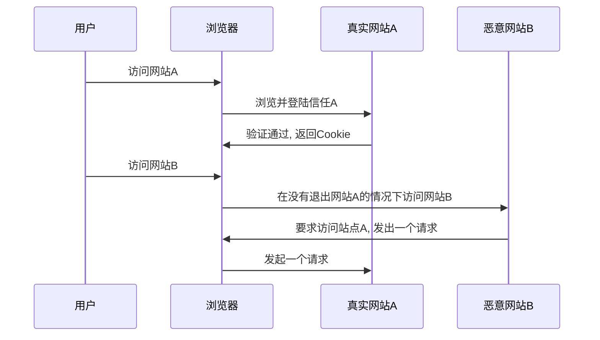

# 跨站请求伪造（CSRF）

>跨站请求攻击，简单地说，是攻击者通过一些技术手段欺骗用户的浏览器去访问一个自己曾经认证过的网站并运行一些操作（如发邮件，发消息，甚至财产操作如转账和购买商品）

## 防御

- 验证码
  - 发生csrf时，用户一般都不知道，当引入验证码的时候，则就是强制用户与应用交互
- 检查referer
  - 页面一般具有逻辑关系，如下单之前的页面一般是购物车，如果不符合条件，则是很可疑的
- token
  - 要实施一次csrf，攻击者需要构造出操作的请求数据，如果在这个过程中引入一个随机变量，URL就无法构造，更谈不上攻击了

## 接口幂等性设计

### MVVC 多版本并发控制

通过一个版本号来达到避免冲突，但是会有一定的重试

### 去重表

利用数据库的唯一索引特性，保证唯一的逻辑

### 悲观锁

整个执行过程中锁定该订单对应的记录

### token

数据提交前要向服务的申请 token，token 放到 redis 或内存，token 有效时间提交后后台校验 token，同时删除 token，token只有一次有效性