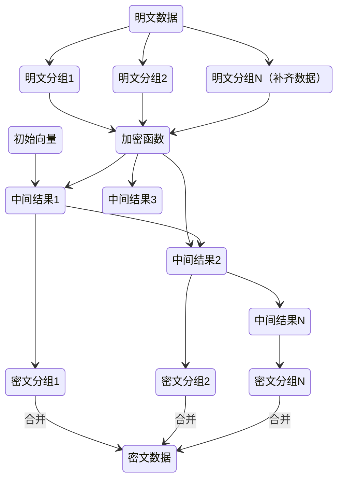

# 密码学

密码学最基础的分支：

- 单向散列函数
- 对称密码技术
- 非对称密码技术

现代密码学加密数据的安全性依赖于加密算法的质量和密钥的保密性，只有加密算法是公开的，安全性才能经受得住考验

密码学能做什么？
  - 机密性：如何使得某个数据自己能看懂，别人看不懂
  - 认证：如何确保数据的正确来源，如何保证通信实体的真实性
  - 完整性：如何确保数据在传输过程中没有被删改
  - 不可否认性：如何确保用户行为的不可否认性

## 基本概念

- 明文 ——要处理的数据
- 密文 ——处理后的数据
- 密钥 ——秘密参数
- 加密函数
- 解密函数

## 密码算法分类

- 根据用途
  - 加密算法
  - 杂凑函数
  - 数字签名
- 根据密钥 密码系统的安全性应该依赖于密钥的复杂性，而非算法的保密性
  - 对称
  - 非对称

## 密码分析学

### 密码体制的攻击

- 唯密文攻击：通过统计分析针对部分密文进行分析
- 已知明文攻击：已知密文与明文的匹配关系得到已知密文与未知明文的匹配关系
- 选择明文攻击：对于静态的加密方案 如果能让对方发送一串固定的数据，可以破解这个映射关系，在二战中就有一些情况故意散播虚假消息从而破解密码 但在现代的的加密方案，这行不通

无条件安全与计算安全

### 安全强度

加密算法的安全强度通常使用“位”（字节位）来表述，N 位的安全强度表示破解一个算法需要 2^N(2 的 N 次方) 次的运算

随着安全分析的进步，几乎所有密码学算法的安全强度都会衰减

安全强度（位）|NIST建议|BSI建议|ECRYPT-CSA建议
-|-|-|-
80|仅遗留系统可以使用，不建议用于新系统|不推荐|仅遗留系统可以使用，不建议用于新系统
112|仅可用于2030年之前|不推荐|不推荐
128|可以用于2030年之后|可以用于2020年之后|可以用于2028年之前
256|可以用于2030年之后|可以用于2020年之后|可以用于2068年之前

### 算法性能

使用的度量单位是每字节周期数（CPB，Cycles Per Byte），表示的是处理一个字节处理需要执行的微处理器的时钟周期数

每字节花费的时钟周期数越小，表示这个算法运算得越快，性能越好

影响计算性能的因素：

- 算法实现的内存使用影响
- 算法实现有没有使用优化的步骤，比如并行计算或者预运算
- 算法实现有没有使用硬件加速，比如使用 CPU 关于算法的扩展指令

## 对称加密

### 对称秘钥管理

对称密钥的长度是由对称密钥算法确定的，对称秘钥的强度取决于产生机制、分布是否均匀、是否不可预测

对称密钥来源于用户产生或者计算机产生，一种方式是通过password来进行生成，PBKDF2算法通过接受一个密码、一个salt、以及迭代次数和输出密钥长度作为输入，输出的是生成的密钥，使用弱的口令来保护强的密钥，然后使用强的密钥来保护私密数据，另外一种就是使用计算机生成的随机数来做密钥

一些对称密钥如 HTTPS 的端到端传输协议，密钥可以即用即弃，而另外一些环境，则需要对密钥做保存，密钥如何保存与分发的麻烦在于大量密钥的管理

kerberos 协议通过解决了集中认证的问题来解决两个可信实体之间密钥的协商。用户向KDC发出身份验证请求。如果验证成功，KDC会向用户颁发一个票据，该票据包含一个会话密钥。用户可以使用这个会话密钥来与所需要的服务进行通信的加解密

### 前向保密性

- 即使用来协商或者保护数据加密密钥的长期秘密泄漏，也不会导致数据加密密钥的泄漏

即口令+随机数 = 密钥 这个过程中，如果随机数完全丢失，就不能从口令推导出密钥

### 流密码

明文消息按字符或比特逐位加密，主要是基于硬件实现

每次加密都通过密钥生成一个密钥流，解密也是使用同一个密钥流，明文与同样长度的密钥流进行异或运算得到密文，密文与同样的密钥流进行异或运算得到明文

流密码的安全性主要取决于密钥序列的推导算法，而不用考虑数据分组带来的种种陷阱

- 密钥流产生器

参数为k的有限状态自动机

**二元序列的伪随机性**

#### 反馈移位寄存器

#### 非线性序列

#### A5流密码算法

用于蜂窝式移动电话系统语音和数字加密

#### 流加密攻击

有些加密算法是将流中的每个字节逐个进行异或

这导致只需要知道两个加密后的密文，便解密密文

### 分组密码

每个分组的加密都要用到上一分组的输出作为输入，第一个分组没有上一个分组，所以使用初始向量来进行，通过各个分组加密的时候进行链接，可以确保雪崩效应能够延续

在一个对称密钥的生命周期里，初始化向量不能重复，所以大部分情况下都是使用随机数作为初始化向量，但随机数的获取，有时候不是一个有效率的运算。

发件人和收件人使用其共同拥有的单个密钥 ,这种密钥既用于加密，也用于解密

常见的对称加密算法：DES、3DES、DESX、Blowfish、IDEA、RC4、RC5、RC6和AES

- 混淆原则
  - 敌手即使获得了密文和明文，也无法求出密钥的任何信息；即使获得了密文和明文的统计规律，也无法求出明文的新的信息
- 扩散原则
  - 明文中的每一位影响密文中的尽可能多的位

**优点**

只需记忆一个密钥，就可用于加密、解密； 与非对称加密方法相比，加密解密的计算量小，速度快，简单易用，适合于对海量数据进行加密处理

**缺点**

如果密钥交换不安全，密钥的安全性就会丧失

分组加密算法改变分组密文的顺序，也将改变解密后的明文顺序，这很有可能将导致数据传输过程中关键数据被伪造

#### SP网络

- 代换

#### Feistel密码

乘积密码指顺序地执行两个或多个基本密码系统，使得最后结果的密码强度高于每个基本密码系统产生的结果

#### DES

- 分组长度为64 bits (8 bytes)
- 密文分组长度也是64 bits。
- 密钥长度为64 bits，有8 bits奇偶校验，有效密钥长度为56 bits。

**安全性**

DES的密钥长度可能会对安全性产生威胁

- 3DES
  - 多重DES就是使用多个密钥利用DES对明文进行多次加密。使用多重DES可以增加密钥量，从而大大提高抵抗穷举密钥搜索攻击的能力

#### 工作模式

根据不同的数据格式和安全性要求, 以一个具体的分组密码算法为基础构造一个分组密码系统的方法

#### AES

- 明文分组可变，128、192、256比特
- 密钥长度可变，各自可独立指定为128、192、256比特。

ECB模式：

将明文分成固定长度的块，每个块都使用相同的密钥独立加密，各个块直接不会链接，如果使用相同的密钥加密相同的明文块，则得到的密文块也将相同。攻击者可以通过重复发送相同的密文块来模拟合法用户的身份，从而执行一些恶意操作，称为分组重放攻击。这种模式的好处在于易于实现，并且可以并行处理，也不需要维护状态，可以在任何时候加密或解密任何数据块

CBC模式：在加密前需要先对明文进行填充，并且每个块的加密都要使用前一个块的密文进行异或操作，所以需要一个公开的初始向量来加密第一个块。异或运算可以保证运算的时间与复杂度只跟数据的长度有关，而跟具体的数据内容无关。由于异或一次改变的是一位数据，通过构造明文分组或者密文分组，一次改变一位数据，然后把数据交给加密运算或者解密运算来处理，通过观察加密或者解密的结果来推断出明文。如果运算时间复杂度跟数据内容有关，很容易导致计时攻击，这是一种边信道攻击，通过观察运算时间来破解密码。例如Java的字符串默认的equals函数在遍历时发现不一致就直接返回了，这就为攻击带来了机会，安全的比较方式是java.security.MessageDigest#isEqual

利用解密端进行攻击：攻击者利用了填充过程中的漏洞。攻击者在向目标系统发送加密请求时，篡改其中的密文块，观察目标系统对密文块的处理方式，填充过程是可预测的，攻击者可以通过不断尝试篡改密文块并观察错误返回信息，为了避免这种攻击，要避免使用可预测的填充方式、避免消息被穿篡改、同时避免解密过程的错误暴露给客户端。

BEAST 攻击：通过构造大量的明文，观察加密结果，由于块加密模式中相同的明文会被加密成相同的密文块，从而推断出其中的密文内容

#### SM4

是一个分组密码算法，分组长度和密钥长度均为128比特。加密算法与密钥扩展算法都采用32轮非线性迭代结构

## 公钥密码

密钥依据性质划分，将其中的一个向外界公开，称为公钥；另一个则自己保留，称为私钥。公钥(Public key)常用于数据加密（用对方公钥加密）或签名验证（用对方公钥解密），私钥(Private key)常用于数据解密（发送方用接收方公钥加密）或数字签名（用自己私钥加密）

**优点**

难破解

**缺点**

加密速度慢

### RSA

- 密钥生成

选择两个大素数P，q。(例如:每个1024位)

计算n= Pq:，z=(p-1)(q- 1)。

随机选取e (其中e< n)，e与z没有公因数。(e,z互为质数”)

选取d.使得ed- 1能够被z完全整除。(换言之:ed mod z= 1)

- 加解密

#### PGP

这种也是基于非对称加密，但与SSL不同的时，私钥与公钥需要你自己以可信的方式保管与传输

### ElGamal

### 椭圆曲线密码

### 背包算法
### Rabin
#### D-H

## 哈希函数

将任意长的消息M映射为较短的、固定长度的一个值H(M)

### 单向散列函数

- 正向计算容易，逆向运算困难
- 运算结果均匀分布，构造碰撞困难
- 对于相同的单向散列函数， 给定数据的散列值是确定的，长度是固定的

雪崩效应（Avalanche Effect）是密码学算法一个常见的特点，指的是输入数据的微小变换，就会导致输出数据的巨大变化，这是单向散列函数所需要具备的。严格雪崩效应指的是如果输入数据的一位反转，输出数据的每一位都有 50% 的概率会发生变化

#### 消息验证码MAC

把消息以及秘钥输入消息验证函数，得到一个验证码，传输的时候带上这个验证码，接受方自己再计算一遍验证码，看是不是跟传递过来的一样，不一样则是消息被篡改了

最常见的是基于单向散列函数的消息验证码（Hash-based Message Authentication Code， HMAC）：

[RFC2104]：首先将密钥和消息分别通过一个固定的算法（如 MD5、SHA-1）生成两个摘要值，然后将这两个摘要值进行异或运算，再将运算结果再次通过哈希算法得到最终的 HMAC 值

HMAC 算法的安全强度，是由对称密钥的安全强度和两倍的散列值长度之间较小的那个数值决定的

HmacSHA256 和 HmacSHA384 是目前最流行的两个 HMAC 算法

#### 可认证的加密

- Authenticated Encryption

加密并验证：加密明文数据，计算明文数据的消息验证码，输出密文数据和验证码

加密后验证：加密明文数据，计算加密数据的消息验证码，输出密文数据和验证码，只要保证相同的明文不会输出相同的密文，消息验证码就不会相同

验证后加密：计算明文数据的消息验证码，加密明文数据和验证码，输出密文数据，SSL协议所采用的

带关联的数据加密(AEAD)：用来解决消息传递过程中公开信息的完整性，输入秘钥、明文、关联的公开信息得到密文信息及验证标签，接收方解密后判断验证标签是否正确来确保数据的完整性，带关联的认证加密算法能够进行自我验证

- AES/GCM
- ChaCha20/Poly1305
- AES/CCM

AEAD的潜在风险也在于初始向量重复导致的破解风险，为了解决这个问题，可以使用高位随机数，或者序列数，但是序列数强制要求两端接受及发送消息同步，这在实际应用中很难保证

### 安全条件

- 单向性
- 抗弱碰撞性
- 抗强碰撞性

### 生日攻击

随机取一个值，该值的hash值与某个特定x的hash值相同的概率为50时，应该要取多少个值

### 长度延展攻击

假设有两段数据，S 和 M，以及一个单向散列函数 h。如果我们要把这两段数据合并起来，并且还要计算合并后的散列值，h(S|M)，这就叫做单向散列函数的长度延展

由于压缩函数是接收一个数据分组和上一个压缩函数的运算结果再得到新的结果，那么知道了上一个压缩函数的运算结果，就能够计算下一个分组数据的压缩函数运算结果

这个攻击把原来的散列值作为压缩函数的一个输入，我们再按照数据补齐规范，去补齐原来数据到数据分组的整数倍，然后加入新的数据（M），就可以计算原数据和扩展数据的散列值，这样即使不知道 S，也能利用 S 计算出 S+M的散列值

只要使用了类似压缩函数和链接模式，都有长度延展攻击的风险

### SHA-1

- 算法的输入：小于264比特长的任意消息，分为512比特长的分组。
- 算法的输出：160比特长的消息摘要。

### SHA-256

- <https://blog.csdn.net/u011583927/article/details/80905740/>

## 数字签名

- 接收者能够核实发送者对文档的签名；
- 发送者事后不能否认对文档的签名；
- 不能伪造对文档的签名

### RSA签名

使用私钥签名，公钥进行验证

### ElGamal签名

### DSS签名

## 密钥协议

### Diffie-Hellman密钥交换协议

### Shamir秘密共享

## 国密算法

- 国密SM1 算法保密 想要使用需要通过特定的安全设备
- 国密SM2 算法公开 基于椭圆曲线问题设计的，属于国家标准，算法公开，加密强度和国际标准的 ECC 相当
- 国密SM4 算法公开 对称加密

## 随机数

真正的随机数通过收集硬件及环境信息来产生，但这会导致使用一次随机数的成本很高，为了降低这个成本，通过引入随机数发生器，也就是随机数种子，可以使用单向散列函数，传入一个私密的信息（种子） + 不会重复的信息（序列数）来得到一个随机数

两类常见的随机数算法：

- Hash-DRBG
- HMAC-DRBG