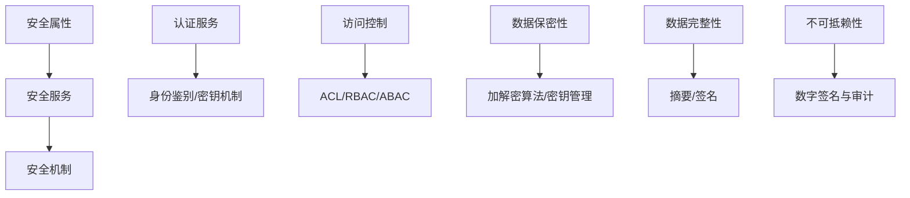
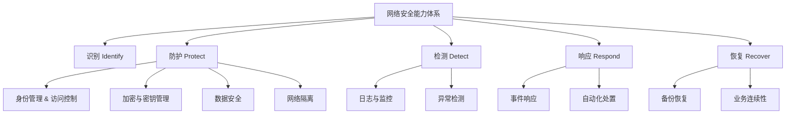

# 网络安全

### 概述（Overview）

网络安全是一套围绕 **信息、计算环境及网络空间** 的系统性保护体系，其核心使命是确保组织在复杂攻击面、数字化基础设施和动态业务场景中维持 **可信赖、可用、可持续的安全运行能力**。

本体系文档以高抽象度的方式总结网络安全的理论框架、能力体系、架构模型与未来趋势，旨在构建一套 **稳定、可迁移、跨技术栈适用的安全认知体系**。

---

## 本质（Essence）

网络安全的本质是：**在不可信环境中构建可信计算与可信交互能力**。
这一能力依赖于三个核心概念：

| 维度              | 本质含义                     |
| --------------- | ------------------------ |
| 信息（Information） | 世界的逻辑映射，是可被表达、处理、传播的知识形态 |
| 信任（Trust）       | 对身份、行为、状态的可验证性与可预测性      |
| 控制（Control）     | 管控系统行为使其处于组织预期的能力        |

因此所有安全技术、框架、流程均归结到：
**可信身份 + 可信通信 + 可信资源访问 + 可信运行环境 + 可信行为监控 + 可信恢复能力**。

---

## 模型（Model）

### 信息安全属性模型（CIA → CIAAN）

基于经典 CIA 模型（机密性、完整性、可用性），网络安全已扩展为更完整的 **CIAAN 模型**：

* **Confidentiality（机密性）**
* **Integrity（完整性）**
* **Availability（可用性）**
* **Authenticity（真实性）**
* **Non-repudiation（不可抵赖性）**

这些抽象属性构成所有安全机制的理论基石。

### 安全服务与安全机制模型

安全服务由安全机制提供支撑。两者关系如下：

安全属性 → 安全服务 → 安全机制 是 **安全体系稳定的三层抽象结构**。

### 安全威胁模型（STRI）

从底层抽象角度，网络安全威胁可归约为四大类：

* **泄漏（Disclosure）**
* **欺骗（Deception）**
* **破坏（Disruption）**
* **入侵（Intrusion）**

所有攻击均可映射到此四种基本威胁类型。

---

## 能力体系（Capability System）

基于上述本质与模型，我们可抽象出一个完整的网络安全能力树。

#### 网络安全能力树

该体系与 NIST CSF 对齐，但以更抽象的原则为主，更便于跨系统迁移和跨技术栈适配。

---

## 架构模型（Architecture Model）

网络安全架构基于 **分层防护（Defense in Depth）+ 信任最小化（Least Privilege）** 的原则构建。

#### 网络安全分层模型

| 层次   | 保护对象     | 核心能力             |
| ---- | -------- | ---------------- |
| 应用层  | 业务逻辑与数据  | API 认证、数据加密、输入验证 |
| 传输层  | 会话与传输通道  | TLS、会话密钥、端到端加密   |
| 网络层  | 包路由与传输路径 | 防火墙、IPSec、路由控制   |
| 端系统层 | 操作系统与进程  | 访问控制、进程隔离、补丁     |
| 物理层  | 设备、链路、机房 | 物理隔离、电磁防护、冗余     |

层次越低数据语义越弱，但覆盖面越广。
这是网络安全的重要架构定律之一。

---

## 类型体系（Taxonomy）

基于安全对象与威胁模型，可构建清晰的安全分类体系：

### 按保护对象分类

* 数据安全
* 服务安全
* 网络安全
* 平台与操作系统安全
* 应用安全
* 身份与访问管理（IAM）
* 物理与基础设施安全

### 按技术手段分类

* 加密（静态数据、传输数据、端到端）
* 数字签名与 PKI
* 访问控制（RBAC、ABAC）
* 认证协议（OAuth、MTLS、Kerberos）
* 隔离（VPC、微隔离、容器隔离）
* 监控与审计
* 风险评估与治理

### 按安全策略分类

* 主动防御（实时隔离、自动化响应）
* 被动防御（加固、检测）
* 纵深防御（多层次体系）
* 零信任（基于身份和上下文）

---

## 边界与生态（Boundary & Ecosystem）

网络安全生态由三个主要边界构成：

#### 技术边界

* 从基础设施到应用的纵向边界
* 从本地到云端的环境边界
* 从可信域到不可信域的安全边界

#### 组织边界

* 安全团队 vs 业务团队 vs 平台团队
* 职责划分与治理关系决定了安全实施方式

#### 流程边界

* 开发、测试、部署、运维、审计的生命周期边界

网络安全的核心挑战不在技术，而在 **跨边界协作、统一治理和一致执行**。

---

## 治理体系（Governance System）

治理体系确保安全策略 **可落地、可执行、可量化**。

#### 治理组成

* 策略管理（Policy）
* 风险管理（Risk Assessment）
* 合规体系（Compliance & Audit）
* 资产管理（Asset Inventory）
* 安全基线与标准（Baseline）
* 监控与指标（Observability）

治理是安全体系的 **制度性能力**，是长期稳定的安全能力基础。

---

## 零信任架构（Zero Trust Architecture）

零信任不是技术，而是一套 **基于身份、上下文和最小权限的系统性安全框架**。

### 零信任的本质

> 不再假设任何位置、设备或服务是可信的，信任必须被动态计算和持续验证。

### 零信任的核心原则

* **不依赖边界（Beyond Perimeter）**
* **基于服务身份而非网络位置**
* **默认不信任（Deny by Default）**
* **持续验证（Continuous Verification）**
* **集中式策略执行（Policy Enforcement Point）**
* **环境不可预测性（动态工作负载、云原生）**

### 边界模型对比

| 传统边界模式 | 零信任模式    | 核心需求   |
| ------ | -------- | ------ |
| 边界内可信  | 内部也不可信   | 通信需认证  |
| 基于IP身份 | 基于服务身份   | 去中心化资源 |
| 应用自带安全 | 基础设施内置安全 | 策略一致   |
| 弱可观测性  | 全局可观测性   | 度量可用   |
| 低频发布   | 高频变更     | 自动化流程  |

零信任架构使得安全从“网络中心化”向“服务中心化”演进，是云时代的主流安全范式。

---

## 演进趋势（Evolution）

网络安全的演进遵循四个方向：

### 从静态安全到动态安全

* 静态 ACL → 动态策略评估
* 固定部署 → 动态工作负载

### 从边界安全到零信任

* 物理边界 → 逻辑边界
* 网络身份 → 服务身份

### 从人为安全到自治安全

* 人工检测 → AI 风险发现
* 人工响应 → 自动化处置

### 从孤立系统到统一控制平面

* 分散安全能力 → 安全基础设施化
* 把安全能力变为平台服务（Security as a Platform）

---

## 选型方法论（Selection Framework）

网络安全选型需要遵循以下原则：

#### 优先级原则

1. **先建立身份体系（IAM）**
2. **再强化访问控制（Least Privilege）**
3. **再构建通信安全（MTLS）**
4. **最后优化监控与响应（SOC/EDR）**

#### 评价维度

| 维度    | 判断依据         |
| ----- | ------------ |
| 稳定性   | 是否基于成熟协议与模型  |
| 可扩展性  | 是否适应云原生与动态环境 |
| 可观测性  | 是否具备统一审计能力   |
| 自动化程度 | 是否支持自动响应     |
| 集成能力  | 是否能与基础设施深度融合 |

---

## 总结（Conclusion）

本高级文档从 **本质 → 模型 → 能力 → 架构 → 治理 → 演进 → 选型** 的系统视角重构了网络安全体系。
核心思想在于：

* 安全不是技术堆叠，而是 **信任构建工程**
* 安全能力必须体系化，而非局部优化
* 零信任是未来，但真正的核心是 **动态信任与持续验证**
* 安全建设的重点在治理、身份体系与统一策略执行

## 关联内容（自动生成）

- [/计算机网络/网络安全/安全性.md](/计算机网络/网络安全/安全性.md) 安全性文档从CIA原则出发阐述了安全的基本概念和框架，与网络安全文档中的安全属性模型(CIAAN)和安全治理体系相关内容密切相关
- [/计算机网络/网络安全/安全架构.md](/计算机网络/网络安全/安全架构.md) 安全架构文档详细阐述了安全框架的本质、访问控制模型和零信任架构，与网络安全文档中的架构模型和零信任部分形成互补和深化
- [/计算机网络/网络安全/认证与授权.md](/计算机网络/网络安全/认证与授权.md) 认证与授权是网络安全的核心组成，与网络安全文档中的身份管理、访问控制能力等内容紧密相关，共同构建完整身份安全体系
- [/计算机网络/网络安全/Web安全.md](/计算机网络/网络安全/Web安全.md) Web安全是网络安全的重要组成部分，与网络安全文档中的应用层安全、威胁模型等内容存在关联，共同构成完整的安全防护体系
- [/计算机网络/网络安全/业务安全.md](/计算机网络/网络安全/业务安全.md) 业务安全从对抗演化和业务场景建模角度构建安全体系，与网络安全文档中的能力体系和治理框架相互补充，共同构建完整的安全认知体系
- [/计算机网络/网络安全/密码学/密码学.md](/计算机网络/网络安全/密码学/密码学.md) 加密是网络安全的基础技术之一，密码学文档为网络安全文档中的加密与密钥管理能力提供了理论基础和技术细节
- [/计算机网络/网络安全/网络安全技术.md](/计算机网络/网络安全/网络安全技术.md) 网络安全技术文档详细描述了各种安全技术，与网络安全文档中的能力体系和架构模型形成技术实现与理论框架的对应关系
- [/操作系统/安全.md](/操作系统/安全.md) 操作系统安全与网络安全在访问控制、权限管理、隔离等方面有共通之处，两者结合可构建端到端的安全防护体系
- [/软件工程/架构/系统设计/网关.md](/软件工程/架构/系统设计/网关.md) 网关是网络安全的重要组件，承担着认证、鉴权、流量控制等安全职责，与网络安全文档中的分层防护和零信任架构密切相关
- [/数据技术/数据治理.md](/数据技术/数据治理.md) 数据治理中的安全合规、数据加密、访问控制等内容与网络安全的治理体系和数据安全防护密切相关，共同保障数据全生命周期安全
