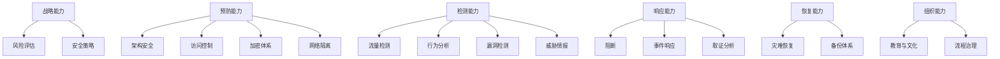
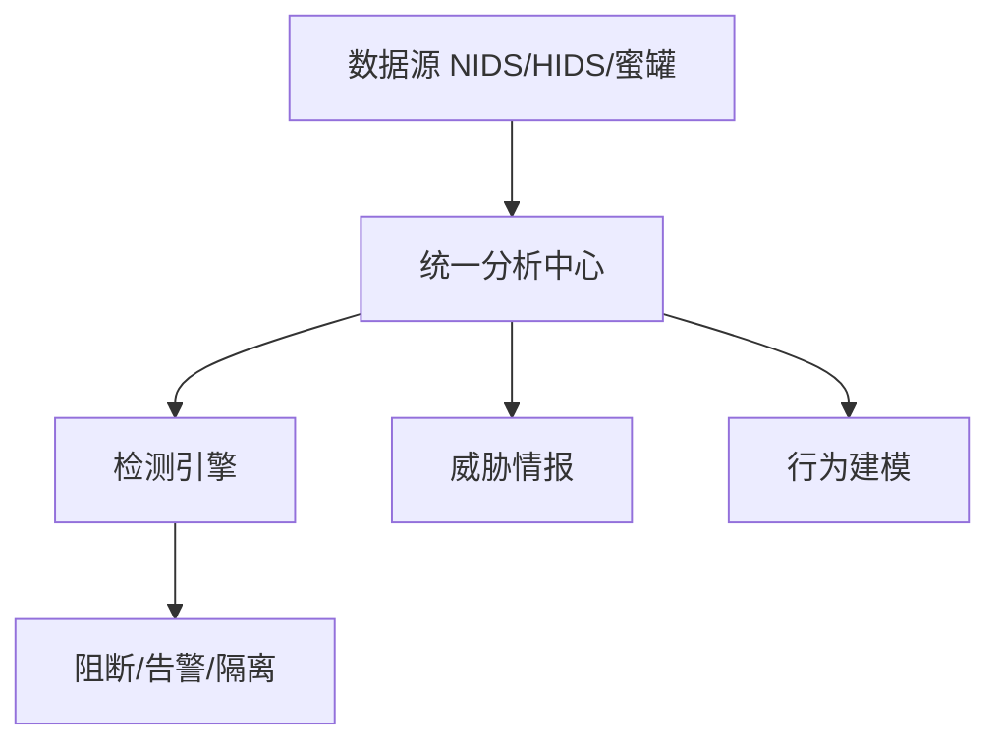

# 网络安全技术

## 概述（Overview）

网络安全技术是一门关乎 **系统稳态、信息可信性、运行可持续性** 的综合学科。其核心目标不在于堆叠技术点，而在于建立一套 **可演化的安全能力体系**，支撑组织在面对复杂、动态的威胁环境时，仍能维持稳定运行。

本升维文档以 *架构原理*、*安全模型*、*威胁机理*、*能力体系* 与 *治理哲学* 为核心，构建一个抽象度高、结构化、可推演的网络安全知识体系。

---

## 本质（Essence）

网络安全的本质：

* **对抗**：攻击者与防御者的信息、资源与策略不对称。
* **治理**：安全不是技术问题，而是系统性风险治理。
* **可信性构造**：通过模型、机制、策略构建 *可验证的正确行为边界*。
* **动态平衡**：安全永远是“不断被打破、持续被重建”的过程。
* **约束系统**：通过权限、策略、加密、验证等手段 *限制潜在破坏力*。
* **可恢复性**：完美防御不存在，关键是极小化损害并快速恢复。

因此，所有安全技术最终都服务于四个底层抽象目标：

1. **减少被攻击面（Reduce Attack Surface）**
2. **提升攻击发现能力（Enhance Detection Capability）**
3. **降低攻击成功率（Lower Exploit Success Probability）**
4. **降低攻击破坏力（Minimize Blast Radius）**

这些目标支撑我们重新看待各种模型、技术与体系。

---

## 安全模型体系（Security Model System）

网络安全领域的模型众多，本部分将所有模型抽象为 **安全生命周期模型** 的不同层次。

---

### 安全生命周期模型总览

所有模型可抽象为以下统一结构：

```
Assessment → Policy → Protection → Detection → Response → Recovery → Evolution
```

不同模型只是对这些环节的 *裁剪* 或 *重组*。

---

### 保护–检测–响应（PDR）模型

#### 本质

PDR 是最简单的网络安全动态模型，本质是 **前置防御 → 事中检测 → 事后响应** 的闭环。

#### 模型分解

| 要素         | 本质定义   | 能力含义            |
| ---------- | ------ | --------------- |
| Protection | 构建攻击门槛 | 防火墙、访问控制、加密、隔离  |
| Detection  | 识别攻击发生 | IDS、日志分析、流量分析   |
| Response   | 阻断与处理  | WAF 拦截、IPS、事件响应 |

#### 限制

* 仅覆盖事中与事后，不包含 *策略与风险根源* 的处理。

---

### P²DR模型（Adaptive Security Model）

在 PDR 之外加入 **Policy（策略）**，核心思想是：

> 所有安全措施必须以策略为中心，根据威胁动态自适应调整。

#### 结构图

（已从原图升维为抽象模型）

```
           +------------+
           |   Policy   |
           +------------+
              ↗  ↖  ↘
Protection ↔ Detection ↔ Response
```

#### 本质提升

* 从“被动防御”转变为“策略驱动的主动安全”
* 核心从技术 → **制度化治理**

---

### PDRR模型（Protection–Detection–Response–Recovery）

该模型把“恢复”独立出来，强调安全的 **韧性（Resilience）**。

#### 核心意义：

* 认为“防御失败是常态”，因此必须构建 **可恢复能力**。

#### 升维解释：

PDRR 是第一批把“安全 = 稳态恢复”引入主流模型的体系。

---

### APPDRR模型

将安全治理前置为：

```
Assessment → Policy → Protection → Detection → Reaction → Restoration
```

#### 模型价值：

* 覆盖了完整生命周期（从评估到恢复）
* 支撑组织级治理（Assessment + Policy）

---

### PADIMEE模型（全景安全模型）

该模型是所有模型中最全面的，将安全看成一个 **持续演化的组织工程**：

```
Policy → Assessment → Design → Implementation → Management/Monitor → Emergency Response → Education → …
```

#### 本质解读：

* **Policy / Assessment**：战略层
* **Design / Implementation**：工程层
* **Management / ER**：运营层
* **Education**：组织心理安全与文化层

真正反映了安全是 **制度 + 组织 + 技术的综合体系**。

---

## 安全能力体系（Capability System）

在上述模型基础上，可抽象出一个通用的安全能力树：



这是所有安全体系设计、建设与评估的统一能力基准。

---

## 核心安全技术分类体系（Taxonomy）

本节将你提供的技术内容抽象成若干稳定类别。

---

### 预防类技术（Protection Technologies）

#### 网络边界与隔离

* VPN 与隧道协议（本质：构建可信传输路径）
* 边界访问控制（ACL、NAT、Zero Trust）
* 内网监管技术（行为规范 + 资源控制）

#### 加密保护技术

* 链路加密（保护节点间传输）
* 端到端加密（保护通信语义）
* 存储加密（保护数据宿主环境）
* 完整性校验（防篡改）

#### 漏洞预防

* 源代码扫描
* 反汇编分析
* 环境错误注入

---

### 检测类技术（Detection Technologies）

#### 入侵检测体系

| 类型           | 目标       | 本质含义         |
| ------------ | -------- | ------------ |
| NIDS         | 网络流量攻击识别 | 基于数据平面的异常分析  |
| HIDS         | 主机行为分析   | 基于控制平面与系统状态  |
| 蜜罐（Honeypot） | 引诱攻击     | 攻击意图与技术的情报获取 |

#### 威胁情报

按抽象层级分类：

| 层级   | 作用         | 使用者   |
| ---- | ---------- | ----- |
| 战略情报 | 大势判断       | 高层    |
| 战术情报 | 攻击模型       | 安全团队  |
| 操作情报 | 可执行手段      | 安全运营  |
| 技术情报 | 工具/指令/基础设施 | 安全分析师 |

#### 行为/流量分析

* 大流量异常
* 攻击模式匹配
* 违规行为识别

---

### 响应类技术（Response Technologies）

* 事件分析与研判
* 封堵与隔离（IPS、WAF、EDR）
* 恢复（灾备系统、应急切换）
* 事后复盘与强化措施

---

## 安全预警体系（Security Early Warning）

预警的本质：

> 从“已发生”转向“即将发生”的主动性安全。

#### 抽象流程


#### 模型类别

* 基于攻击事件（Signature-based）
* 基于攻击过程（Stage-based）
* 基于流量模式（Traffic Anomaly-based）
* 宏观网络预警（Large-scale Behavior）

---

## 入侵检测与防御体系（IDPS Architecture Model）

统一模型：



本质：多源数据融合 + 模型驱动分析 + 自动响应。

---

## 灾难恢复体系（Recovery System）

恢复不仅是技术问题，而是 **系统韧性工程**。

#### 核心能力

* 数据备份（备份点的可靠性）
* 冷/温/热备切换
* 业务连续性计划（BCP）
* 故障隔离与最小化爆炸半径

#### 本质：

> 恢复能力是安全体系最能体现组织成熟度的部分。

---

## 治理体系（Governance System）

所有安全措施必须纳入组织治理结构：

* 风险管理（Risk-Based）
* 安全策略体系（Policy-based Governance）
* 合规与标准（ISO27001、等保、NIST）
* 流程管理（事件响应流程、变更流程）
* 安全文化（Security Awareness）

---

## 安全体系演进趋势（Evolution）

#### 趋势方向

* 从“边界安全” → “零信任架构”
* 从“静态规则” → “数据驱动与自适应安全”
* 从“检测为中心” → “威胁情报驱动”
* 从“恢复为末端” → “可恢复性优先设计（Design for Resilience）”
* 从“人工处置” → “自动化安全编排（SOAR）”
* 从“工具堆叠” → “能力体系化”

---

## 选型方法论（Selection Framework）

安全能力选型逻辑：

```
明确威胁模型
    ↓
明确资产与业务关键性
    ↓
确定能力缺口（预防/检测/响应/恢复）
    ↓
选择安全措施（模型 + 技术）
    ↓
以策略为中心统一治理
```

关键评估维度：

* 控制能力（能否有效减少风险）
* 可验证性（能否监控与评估能力）
* 可持续性（成本、维护、组织匹配度）
* 兼容性（与整体架构、流程的耦合度）

---

## 总结（Conclusion）

所有网络安全技术与模型看似复杂，但从架构原理来看，本质只源自以下四点：

1. **风险评估（Assessment）**：认识威胁
2. **策略治理（Policy）**：约束系统
3. **能力建设（Protection/Detection/Response）**：减少风险
4. **恢复与演化（Recovery/Education）**：构建韧性

## 关联内容（自动生成）

- [/计算机网络/网络安全/安全性.md](/计算机网络/网络安全/安全性.md) 安全性文档详细阐述了CIA安全基本原则、安全模型理论和安全控制框架，与网络安全技术文档中的安全本质和模型体系形成理论补充和深化
- [/计算机网络/网络安全/安全架构.md](/计算机网络/网络安全/安全架构.md) 安全架构文档从身份认证、访问控制等维度构建了安全框架的五层架构抽象，与网络安全技术文档中的安全能力体系和架构模型直接相关
- [/计算机网络/网络安全/认证与授权.md](/计算机网络/网络安全/认证与授权.md) 详细描述了认证与授权机制，包括SSO、OAuth2、JWT等具体实现技术，是网络安全技术文档中访问控制能力的具体实现方案
- [/计算机网络/网络安全/Web安全.md](/计算机网络/网络安全/Web安全.md) Web安全文档覆盖XSS、CSRF、SQL注入等具体安全漏洞和防护技术，是网络安全技术文档在应用层的具体体现和实践
- [/计算机网络/网络安全/业务安全.md](/计算机网络/网络安全/业务安全.md) 从业务对抗角度构建安全体系，与网络安全技术文档中的风险评估和治理体系相互补充，形成更完整的安全认知体系
- [/计算机网络/网络安全/网络安全隔离技术.md](/计算机网络/网络安全/网络安全隔离技术.md) 隔离技术是网络安全的重要组成部分，与网络安全技术文档中的网络边界和隔离技术部分形成直接呼应
- [/计算机网络/网络安全/密码学/密码学.md](/计算机网络/网络安全/密码学/密码学.md) 密码学是网络安全的基础技术之一，为网络安全技术文档中的加密保护技术提供了理论基础和技术细节
- [/计算机网络/网络安全/渗透测试.md](/计算机网络/网络安全/渗透测试.md) 渗透测试是安全验证的重要手段，与网络安全技术文档中的检测能力部分形成实践验证关系
- [/操作系统/安全.md](/操作系统/安全.md) 操作系统安全与网络安全在访问控制、权限管理、入侵检测等方面有共通之处，两者结合可构建端到端的安全防护体系
- [/软件工程/架构/系统设计/网关.md](/软件工程/架构/系统设计/网关.md) 网关承担着认证、鉴权、流量控制等安全职责，是网络安全技术文档中提到的防护体系的重要实现组件
- [/数据技术/数据治理.md](/数据技术/数据治理.md) 数据治理中的安全合规、数据加密等内容与网络安全的治理体系密切相关，共同保障数据全生命周期安全
- [/计算机网络/网络安全/信息收集.md](/计算机网络/网络安全/信息收集.md) 信息收集是渗透测试的重要环节，也是网络安全技术文档中提到的威胁情报和检测技术的重要数据来源
- [/软件工程/架构/架构.md](/软件工程/架构/架构.md) 架构设计中的零信任原则与网络安全技术文档中提到的零信任架构演进趋势直接相关
- [/软件工程/架构/系统设计/云原生.md](/软件工程/架构/系统设计/云原生.md) 云原生环境下的安全挑战与网络安全技术文档中的零信任架构、安全演进趋势密切相关
- [/软件工程/架构/系统设计/可用性.md](/软件工程/架构/系统设计/可用性.md) 可用性中的容灾和恢复能力与网络安全技术文档中的灾难恢复体系直接相关

