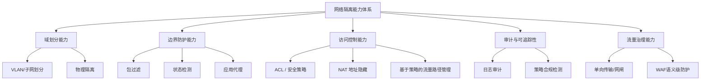
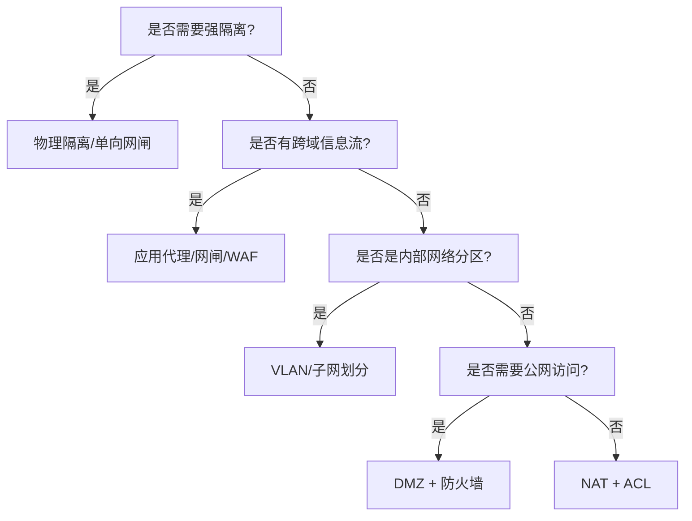

# 网络安全隔离技术

## 概述（Overview）

网络安全隔离技术是一类用于 **构建多安全域边界、控制域间交互、限制攻击面传播** 的核心安全能力。其目标不是简单的阻断，而是通过 **分区（Segmentation）→ 边界（Boundary）→ 控制（Control）→ 审计（Audit）→ 治理（Governance）** 的系统化方法，实现系统安全性、可控性与韧性。

本体系文档从 *原理层 → 架构层 → 能力层 → 实施层* 的层级组织网络隔离技术，揭示其本质、架构模式与演进趋势。

---

## 本质（Essence）

网络隔离的本质是 **控制不同信任级别的安全域之间的信息流动**。

它源自三个不变的基础原则：

#### 最小暴露面原则（Minimal Exposure Surface）

减少一个系统可被访问、可被探测、可被攻击的表面积。

#### 信任边界原则（Trust Boundary Principle）

信任不能跨域自动传递，跨域通信必须显式验证与控制。

#### 信息流约束原则（Information Flow Constraint）

核心安全目标是保证 **信息仅以被授权的方式流动**，而非阻断所有访问。

这些原则决定了所有隔离技术的本质设计逻辑，无论是物理隔离、NAT、防火墙还是应用代理。

---

## 模型（Model）

网络安全隔离体系可抽象为三层控制模型：

#### 物理层隔离

通过物理设备、线路、单向传输等方式建立最强边界。

#### 网络层隔离

通过 VLAN、路由策略、ACL、NAT、防火墙实现分区与访问控制。

#### 应用层隔离

通过代理、WAF、协议网闸、服务网格等实现细粒度语义级防护。

#### 治理与审计

通过策略体系、配置管理、访问审计形成可控的长期安全能力。

---

## 能力体系（Capability System）

网络安全隔离技术形成如下能力树：

能力体系反映了隔离技术不是单点能力，而是一个覆盖 **域 → 边界 → 控制 → 审计** 的系统。

---

## 架构模型（Architecture Model）

隔离技术在架构层可以归类为三大结构模式，每类都有不同的安全边界模型。

---

### 域隔离架构（Segmentation Architecture）

用于构建安全域，对系统进行安全分区。

| 架构          | 本质           | 优点         | 限制           |
| ----------- | ------------ | ---------- | ------------ |
| 集线器隔离       | 基于物理共享，无实际隔离 | 无          | 无隔离意义        |
| 交换机隔离（VLAN） | 二层逻辑分区       | 成本低，灵活     | 仍共享设备，隔离强度有限 |
| 路由器隔离       | 三层边界隔离       | 明确边界，安全性较高 | 需配合策略控制      |

---

### 防火墙体系架构（Firewall Architecture）

#### 包过滤（静态规则）

基于源/目标/端口的静态规则的二层〜三层过滤。
本质是 **无状态访问控制**。

#### 状态检测（Stateful Inspection）

基于连接状态的会话跟踪。
本质是 **将网络包提升到会话级安全模型**。

#### 应用代理（Application Proxy）

对应用协议进行语义级解析与转发。
本质是 **在信任域之间引入“安全中介层”**，包括 WAF 等高级代理。

---

### 典型防火墙隔离架构模式

#### 单防火墙结构

所有流量经过单点防护，适合小规模结构。

#### 堡垒主机架构（Bastion Host）

将访问控制收敛到特定安全节点，形成“唯一可信跳点”。

本质：**强制所有访问通过一个受控代理**。

#### 屏蔽主机架构（Screened Host）

路由器 + 防火墙组合，适合多层次边界。

#### 屏蔽子网架构（Screened Subnet）

创建 DMZ，将外部访问隔离在边界缓冲区。

本质：**通过引入中间安全域降低攻击对内部网络的直接威胁**。

---

## 类型体系（Taxonomy）

网络安全隔离技术可按照“隔离层级”与“隔离方式”分类：

---

### 按隔离层级分类

| 层级  | 技术                    | 本质          |
| --- | --------------------- | ----------- |
| 物理层 | 物理断开、单向隔离卡、光闸         | 无共享媒介       |
| 网络层 | VLAN、路由策略、ACL、NAT、防火墙 | 通过协议控制信息流   |
| 应用层 | 代理、WAF、网闸、服务网格        | 按应用语义进行访问裁决 |

---

### 按隔离方式分类

| 分类                    | 描述             |
| --------------------- | -------------- |
| 强隔离（Strong Isolation） | 物理隔离、单向传输、网闸   |
| 中隔离（Medium）           | 有状态防火墙、NAT、DMZ |
| 弱隔离（Weak）             | VLAN、ACL       |

---

## 边界与生态（Boundary & Ecosystem）

网络隔离的边界属于整个安全体系中至关重要的一环，与以下安全领域形成生态闭环：

* 身份与访问管理（IAM）
* 零信任架构（Zero-Trust）
* 终端安全（Endpoint Protection）
* 网络可观测性（Observability）
* 合规与审计体系（Compliance & Auditing）
* 云环境安全（Cloud Security）

现代隔离技术从单纯的“网络边界”逐渐过渡到 **身份边界+上下文边界+应用边界** 的综合模型。

---

## 治理体系（Governance System）

网络隔离是持续治理问题，而非一次性配置问题。其治理体系包括：

#### 策略治理

* 域划分原则
* 访问规则模型（ACL → 策略集 → 服务级 SLO）
* 最小权限原则

#### 配置治理

* 变更控制
* 策略评审
* 规则冲突检测

#### 风险治理

* 周期渗透测试
* DMZ 例行风险评估
* 隔离策略效果度量（如爆炸半径指标 Blast Radius）

#### 审计治理

* 流量日志
* NAT 记录
* 访问行为取证

---

## 演进趋势（Evolution）

网络隔离技术呈现从“边界安全”向“分布式信任控制”演进的趋势：

#### 趋势一：从静态规则 → 动态策略

基于上下文、身份、行为的策略决定。

#### 趋势二：从网络边界 → 应用边界

WAF、API Gateway、Service Mesh 成为“新防火墙”。

#### 趋势三：从物理隔离 → 零信任逻辑隔离

通过持续认证和策略判断实现更灵活的隔离。

#### 趋势四：从被动阻断 → 智能判决

行为分析、AI 检测、自动化威胁响应。

---

## 选型方法论（Selection Framework）

选择隔离技术需基于 **安全等级 + 架构模式 + 业务需求** 三因素。

---

### 决策框架

| 需求 / 特征     | 推荐技术                   |
| ----------- | ---------------------- |
| 最高强度隔离      | 物理隔离、单向网闸              |
| 跨域信息可控流转    | 应用级网闸、代理               |
| 公网访问 + 内部保护 | DMZ + 防火墙              |
| 内部系统分区      | VLAN / 子网划分            |
| 避免暴露内部 IP   | NAT                    |
| Web 服务语义级防护 | WAF                    |
| 云原生环境       | Service Mesh + 基于身份的策略 |

---

### 决策图

---

## 总结（Conclusion）

网络安全隔离技术的本质在于：
**构建安全域 → 定义边界 → 控制信息流 → 建立审计与治理体系**。

通过体系化、模型化的方法，可以将复杂的网络隔离技术转化为可管理、可演进、可治理的安全架构，使组织从“设备导向”转向“安全模型导向”。

## 关联内容（自动生成）

- [/计算机网络/网络安全/网络安全技术.md](/计算机网络/网络安全/网络安全技术.md) 网络安全技术文档涵盖了网络边界与隔离、威胁检测、响应技术等，与网络安全隔离技术形成完整的技术体系和能力架构补充
- [/计算机网络/网络安全/网络安全.md](/计算机网络/网络安全/网络安全.md) 网络安全文档从CIAAN模型、分层防护架构等角度阐述了网络安全的整体框架，与隔离技术的分层模型和零信任架构形成对应关系
- [/计算机网络/网络安全/安全性.md](/计算机网络/网络安全/安全性.md) 安全性文档详细阐述了CIA安全基本原则和各类安全控制框架，为网络安全隔离技术提供了基础理论支撑
- [/计算机网络/网络安全/安全架构.md](/计算机网络/网络安全/安全架构.md) 安全架构文档从身份认证、访问控制等维度构建了安全框架，与网络隔离技术的边界防护和访问控制能力相呼应
- [/计算机网络/网络安全/认证与授权.md](/计算机网络/网络安全/认证与授权.md) 认证与授权是实现网络隔离后内部访问控制的关键技术，与隔离技术共同构建完整的安全体系
- [/计算机网络/网络安全/业务安全.md](/计算机网络/网络安全/业务安全.md) 业务安全从对抗演化角度构建安全体系，与网络安全隔离技术中的边界防护和风险治理形成互补关系
- [/计算机网络/网络安全/Web安全.md](/计算机网络/网络安全/Web安全.md) Web安全是应用层面的安全防护，与网络层隔离技术形成纵深防御体系，共同保障系统安全
- [/计算机网络/网络安全/密码学/密码学.md](/计算机网络/网络安全/密码学/密码学.md) 密码学为网络隔离技术中的安全通信提供加密保障，是隔离环境中数据安全传输的基础技术
- [/操作系统/安全.md](/操作系统/安全.md) 操作系统安全与网络安全在访问控制、权限管理、隔离等方面有共通之处，两者结合可构建端到端的安全防护体系
- [/软件工程/架构/系统设计/网关.md](/软件工程/架构/系统设计/网关.md) 网关承担着认证、鉴权、流量控制等安全职责，是网络隔离架构中的重要安全组件
- [/计算机网络/网络安全/渗透测试.md](/计算机网络/网络安全/渗透测试.md) 渗透测试可验证网络隔离措施的有效性，是隔离技术实施后安全效果验证的重要手段
- [/计算机网络/网络安全/信息收集.md](/计算机网络/网络安全/信息收集.md) 信息收集是了解网络边界和安全措施的重要方法，有助于优化网络隔离策略
- [/计算机网络/网络安全/网络协议安全.md](/计算机网络/网络安全/网络协议安全.md) 网络协议安全与隔离技术密切相关，协议层面的安全问题可能绕过隔离措施
- [/软件工程/架构/架构.md](/软件工程/架构/架构.md) 架构设计中的零信任原则与网络安全隔离技术中的隔离架构理念相互关联，共同构成现代安全架构的基础
- [/软件工程/架构/系统设计/云原生.md](/软件工程/架构/系统设计/云原生.md) 云原生环境下的安全挑战与网络隔离技术在云环境的实现方式密切相关，如微隔离等技术
- [/软件工程/架构/系统设计/可用性.md](/软件工程/架构/系统设计/可用性.md) 可用性设计中的容灾多活与网络隔离技术在故障隔离、爆炸半径控制方面有共通之处
- [/数据技术/数据治理.md](/数据技术/数据治理.md) 数据治理中的安全合规、数据隔离等内容与网络安全隔离技术中的数据流动控制密切相关
- [/中间件/web中间件/Nginx.md](/中间件/web中间件/Nginx.md) Nginx等反向代理技术可实现应用层的访问控制和流量隔离，是应用层隔离的重要实现方式
- [/计算机网络/Linux虚拟化.md](/计算机网络/Linux虚拟化.md) Linux虚拟化技术中的网络隔离机制，如VLAN、网络命名空间等，与网络安全隔离技术在实现上有相通之处
- [/计算机网络/运输层.md](/计算机网络/运输层.md) 传输层协议的安全问题和防护措施与网络层隔离技术相互配合，共同构建端到端的安全保障
