# 认证与授权

## 认证

### HTTP 认证

如果需要认证，服务端会返回这样的信息：

```http
WWW-Authenticate: <认证方案> realm=<保护区域的描述信息>
Proxy-Authenticate: <认证方案> realm=<保护区域的描述信息>
```

客户端接收到后，需要遵循服务的指定的认证方案：

```http
Authorization: <认证方案> <凭证内容>
Proxy-Authorization: <认证方案> <凭证内容>
```

服务端进行认证，根据成功与否返回200或者403

对于凭证内容，默认是Base64编码，但还有其他的一些认证方案：

- Digest
- Bearer
- HOBA

### 表单认证

对于表单认证 并没有一个通用的标准 应该这些内容必须放到应用层面解决

WebAuthn：新的认证标准

### Java的实现

- JACC
- JASPIC
- EE Security

但实际上 活跃在Java安全领域的是两个私有标准 Shiro 和 Spring Security

### SSO

- 单点登录

单点登录是指当主体试图访问某一资源时，会被重定向到一个身份提供者，这个提供者负责鉴别主体，鉴别完成之后将通知服务提供者采取相应操作

大型互联网公司中，公司旗下可能会有多个子系统，每个登陆实现统一管理多个账户信息统一管理 SSO单点登陆认证授权系统


#### 单点登录网关

微服务架构中，使用一个统一的网关来鉴别主体，有效地减少重复编码。但是需要解决的一个问题是，随着服务间的调用，如何在服务间传递这个身份信息？使用HTTP头携带是个不错的办法

#### CAS

> CAS 是 Yale 大学发起的一个开源项目，旨在为 Web 应用系统提供一种可靠的单点登录方法


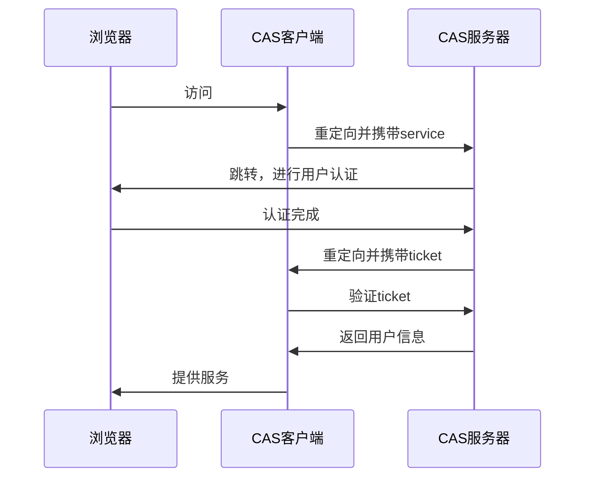

1. 访问服务：SSO客户端发送请求访问应用系统提供的服务资源。
2. 定向认证：SSO客户端会重定向用户请求到SSO服务器。
3. 用户认证：用户身份认证。
4. 发放票据：SSO服务器会产生一个随机的Service Ticket。
5. 验证票据：SSO服务器验证票据Service Ticket的合法性，验证通过后，允许客户端访问服务。
6. 传输用户信息：SSO服务器验证票据通过后，传输用户认证结果信息给客户端。

术语：

- Ticket Granting ticket (TGT) ：可以认为是CAS Server根据用户名密码生成的一张票，存在Server端
- Ticket-granting cookie (TGC) ：其实就是一个Cookie，存放用户身份信息，由Server发给Client端
- Service ticket (ST) ：由TGT生成的一次性票据，用于验证，只能用一次。相当于Server发给Client一张票，然后Client拿着这个票再来找Server验证，看看是不是Server签发的

#### OIDC

一个基于授权码流程的 OIDC 协议流程，跟 OAuth 2.0 中的授权码许可的流程几乎完全一致，唯一的区别就是多返回了一个 ID 令牌，用访问令牌获取 ID 令牌之外的信息

这个 ID 令牌的内容如下：

- iss：令牌的颁发者，其值就是身份认证服务（OP）的 URL
- sub：令牌的主题，其值是一个能够代表最终用户（EU）的全局唯一标识符
- aud：令牌的目标受众，其值是三方软件（RP）的 app_id
- exp：令牌的到期时间戳，所有的 ID 令牌都会有一个过期时间
- iat：颁发令牌的时间戳。

## 授权

>系统如何控制一个用户该看到哪些数据、能操作哪些功能

### DAC

Discretionary Access Control，自主访问控制,让客体的所有者来定义访问控制规则

Linux 中采用的就是 DAC，用户可以控制自己的文件能够被谁访问

### Role-BAC

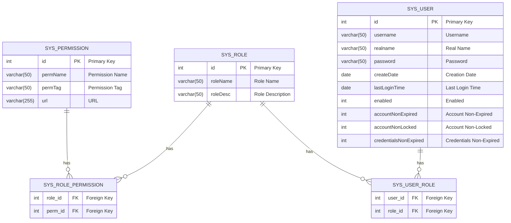

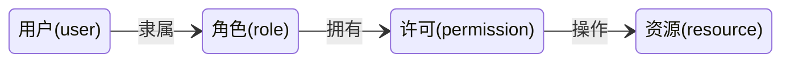

简化了配置操作 并且满足了最小特权原则

- RBAC-1模型可以描述角色继承关系
- RBAC02模型可以描述角色互斥

### Rule-BAC

针对请求本身制定的访问控制策略

适合在复杂场景下提供访问控制保护，因此，rule-BAC 相关的设备和技术在安全中最为常见。一个典型的例子就是防火墙

### MAC

Mandatory Access Control，强制访问控制

为了保证机密性，MAC 不允许低级别的主体读取高级别的客体、不允许高级别的主体写入低级别的客体；为了保证完整性，MAC 不允许高级别的主体读取低级别的客体，不允许低级别的主体写入高级别的客体

### OAuth2

> OAuth 2.0 授权的核心就是颁发访问令牌、使用访问令牌

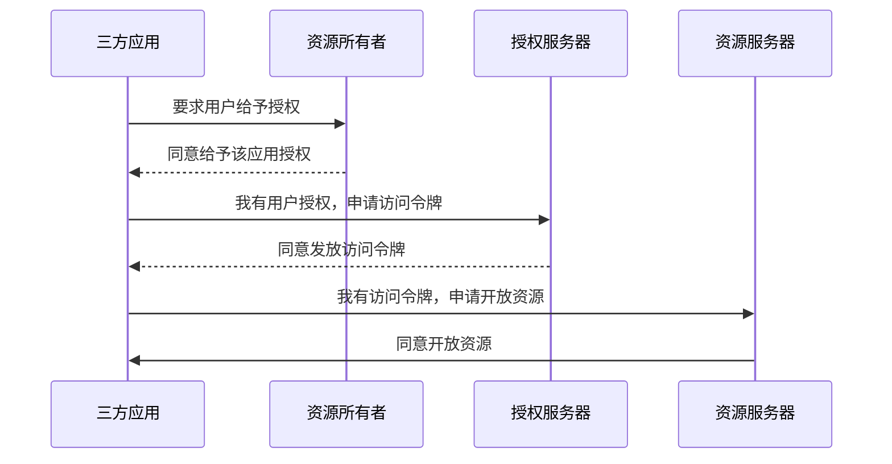

前置概念：

- appId：三方应用ID
- appSecret：三方应用密钥
- 授权码：用来获取accessToken
- scope：所需的数据的范围
- AccessToken：调用接口权限访问令牌
- 回调地址：授权成功，重定向地址
- openid：开放平台生产唯一的用户id

授权码想要换取令牌还得再加上appId与appKey

#### 授权服务工作流程

- 令牌的生成必须符合三个原则：唯一性、不连续性、不可猜性
- OAuth 2.0 规范建议授权码 code 值有效期为 10 分钟，并且一个授权码 code 只能被使用一次
- 一个访问令牌 access_token 表示某一个用户给某一个第三方软件进行授权
- 授权要有授权范围，不能让第三方软件获得比注册时权限范围还大的授权，也不能获得超出了用户授权的权限范围，始终确保最小权限安全原则

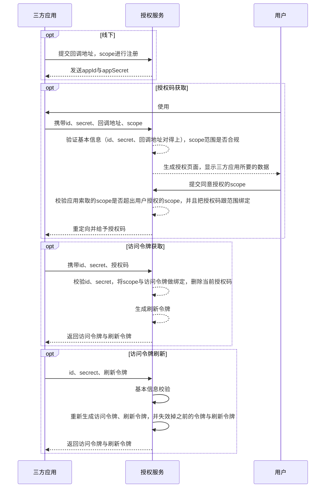

#### 授权码模式

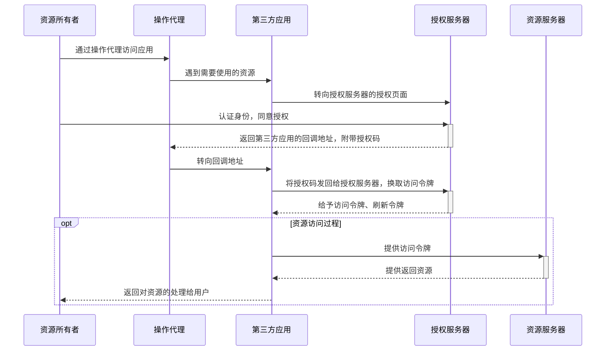

授权码一般是一次性，使用授权码再去获取令牌的原因在于为了避免直接将令牌暴露给操作代理带来的不安全性

这种模式考虑到了许多种情况，比如授权码泄露被人冒充、三方应用被人冒充等。 但是是在假设第三方应用有自己的服务器的基础上 而且授权过程也过分繁琐

#### 隐式授权

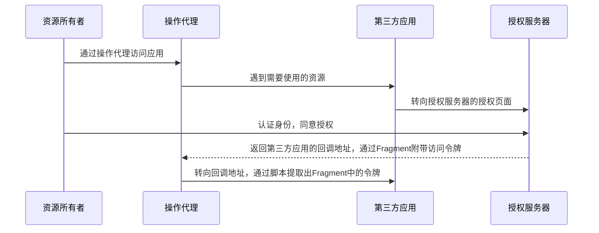

Fragment是不会跟随请求被发送到服务端的，只能在客户端通过Script脚本来读取。所以隐式授权巧妙地利用这个特性，尽最大努力地避免了令牌从操作代理到第三方服务之间的链路存在被攻击而泄漏出去的可能性

#### 密码模式

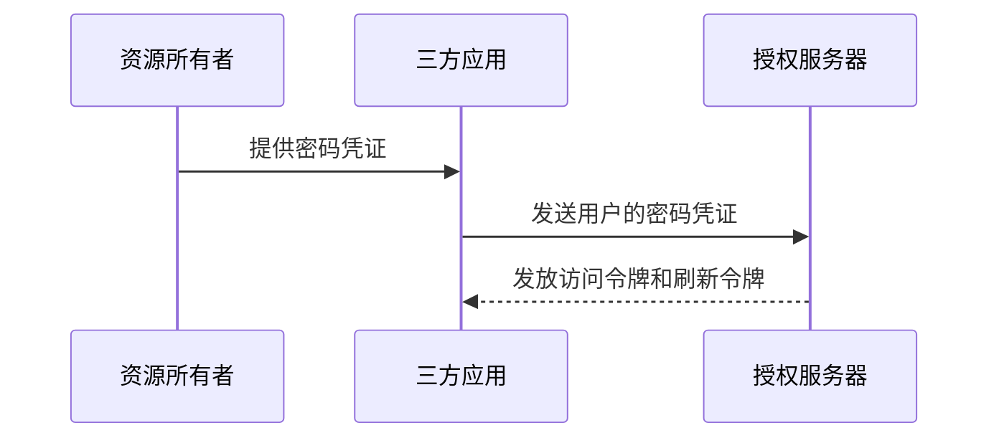

这种情况下需要把密码提供给第三方 要求第三方必须十分可信

#### 客户端模式

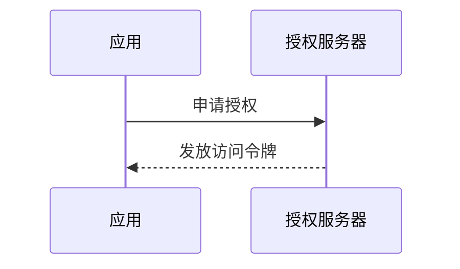

在获取一种不属于任何一个第三方用户的数据时，并不需要用户参与，此时便可以使用客户端凭据许可类型

#### PKCE协议

- 这种协议适用于没有服务器的移动端程序，是一种在失去 app_secret 保护的时候，防止授权码失窃的解决方案

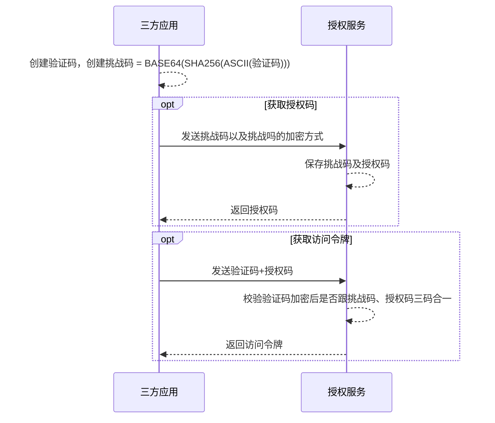

## 凭证

### 令牌

通过app id与 app secret 获取一个临时token，此token具有操作的权限

### Cookie-Session

通过在响应头设置这么样的一项：

```http
Set-Cookie: id=cxk; Expires=Wed, 21 Feb 2020 07:28:00 GMT; Secure; HttpOnly
```

后客户端每次请求都会将这个Cookie带上到请求头

```http
GET /index.html HTTP/2.0
Host: www.baidu.com
Cookie: id=cxk
```

但系统可以将这个Cookie以一个key看待，在服务端开辟一块内存，形成一个KV对，这就是Session

但 Cookie会有跨域问题， Sesssion 在集群环境下又会有问题

### JWT

> JSON Web Token（JWT）是一个开放的行业标准（RFC 7519），它定义了一种简介的、自包含的协议格式，用于 在通信双方传递json对象，传递的信息经过数字签名可以被验证和信任。JWT可以使用HMAC算法或使用RSA的公 钥/私钥对来签名，防止被篡改

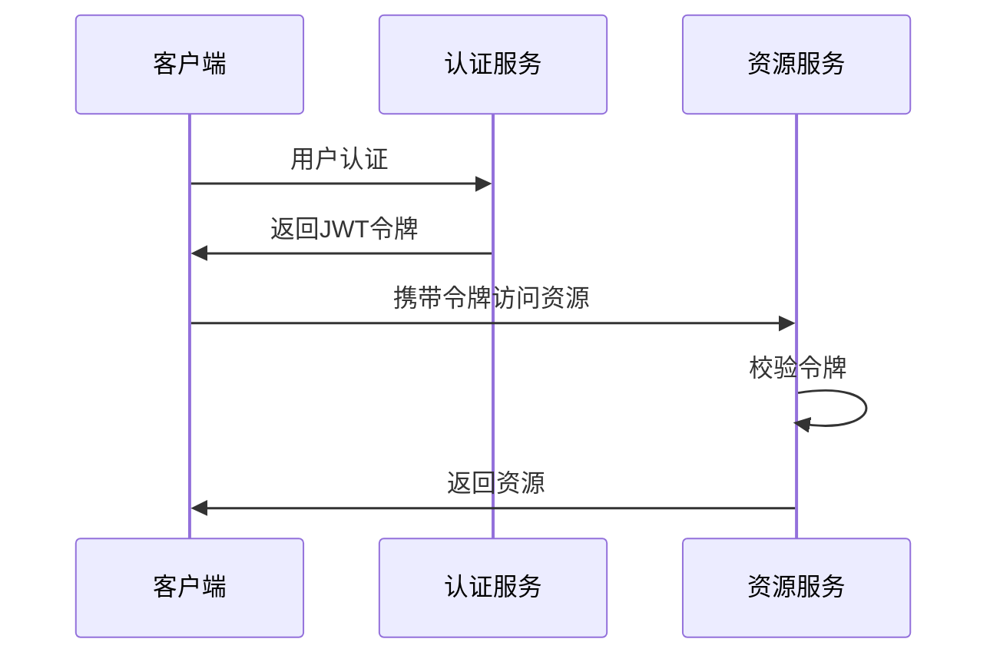

无状态，既是优点 也是缺点 虽然可以进行无状态服务节点水平扩展 但在某些业务场景下 实现某些功能还是优点困难

为了解决无状态带来难以让令牌失效的问题，有一些办法：

1. 引入统一秘钥管理，每个用户都有自己的秘钥，一旦想要失效令牌，就可以通过重新生成秘钥的方式来进行
2. 只考虑用户修改密码失效令牌的情况，则可以通过直接用用户的密码当秘钥

- 缺点：令牌长度较长，这就意味着传输会有问题，某些服务器对Header是有限制的

#### 组成

- 头部

```json
{"typ":"JWT","alg":"HS256"} // 经过base64加密后：eyJ0eXAiOiJKV1QiLCJhbGciOiJIUzI1NiJ9
```

- 载荷
  - 标准中注册的声明
  - 公共的声明
    - iss（Issuer）：签发人。
    - exp（Expiration Time）：令牌过期时间。
    - sub（Subject）：主题。
    - aud （Audience）：令牌受众。
    - nbf （Not Before）：令牌生效时间。
    - iat （Issued At）：令牌签发时间。
    - jti （JWT ID）：令牌编号
  - 私有的声明

```json
{"sub":"1234567890","name":"John Doe","admin":true} // eyJzdWIiOiIxMjM0NTY3ODkwIiwibmFtZSI6IkpvaG4gRG9lIiwiYWRtaW4iOnRydWV9
```

- 签证

```
header (base64后的)
payload (base64后的)
使用secret对header以及payload进行一个签名
```

>secret是保存在服务器端的，jwt的签发生成也是在服务器端的，secret就是用 来进行jwt的签发和jwt的验证，所以，它就是你服务端的私钥，在任何场景都不应该流露出去

### OpenID

## 保密

保密是有成本的，追求越高的安全等级，就要付出越多的工作量与算力消耗

### 客户端加密

客户端加密并非是为了传输安全 传输安全应该由诸如HTTPS等的机制来进行保障 更多地 客户端加密是为了避免明文传输到服务端后造成的安全问题

### 密码加密与存储

#### 加密

1. 客户端对自己的密码取摘要：

```js
const passwd = 123456
const client_hash = MD5(passwd)
```

2. 得到摘要后进行加盐：

```js
client_hash = MD5(client_hash + salt)
```

为了应对彩虹表类的暴力破解，摘要函数可以使用慢哈希函数 也就是执行时间可以调节的函数（比如Bcrypt）

3. 为了防止服务端被脱库，服务端再使用一个盐：

```java
String salt = randomSalt();
String serverHash = SHA256(client_hash + salt)
addToDB(serverHash, salt)
```

#### 验证

1. 客户端加密还是同上，进行加盐哈希

```js
client_hash = MD5(MD5(passwd) + salt)
```

2. 服务端接收到client_hash 后，对其加盐哈希，判断是否与存储的一致：

```java
compare(server_hash, SHA256(client_hash + server_salt))
```

#### Bcrypt

> bcrypt会使用一个加盐的流程以防御彩虹表攻击，同时bcrypt还是适应性函数，它可以借由增加迭代之次数来抵御日益增进的电脑运算能力透过暴力法破解


- 每次加密都会产生一个随机的salt跟密文进行哈希并拼接到最终的结果中
- 验证时需要salt加密文同时进行运算才能进行验证

## 开放平台设计

> 在互联网时代，把网站的服务封装成一系列计算机易识别的数据接口开放出去，供第三方开发者使用，这种行为就叫做Open API，提供开放API的平台本身就被称为开放平台

- 使用加签名方式，防止篡改数据
- 使用HTTPS加密传输
- 搭建OAuth2.0认证授权
- 使用令牌方式
- 搭建网关实现黑名单和白名单

### 参数传递安全

后端服务器传递参数，返回token给前端，前端通过token请求另外一台服务器

### 接口版本控制

- RPC接口：代码发包
- HTTP接口：Path、Header

使用网关分发不同版本请求

## 服务间的认证与授权

- 边界内信任

就如局域网内的通信，在边界内的服务通信，通常都被默认为安全的

- HTTP(S)身份认证

使用HTTP是不安全的，但是如果使用HTTPS则需要考虑证书的管理问题以及HTTPS无法被缓存等问题

- 证书
- 哈希
- API密钥
  - 通过服务端管理密钥来识别服务调用者以及对调用者进行管理
