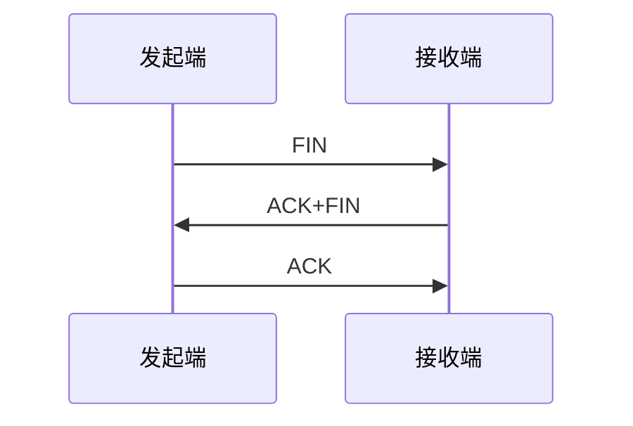
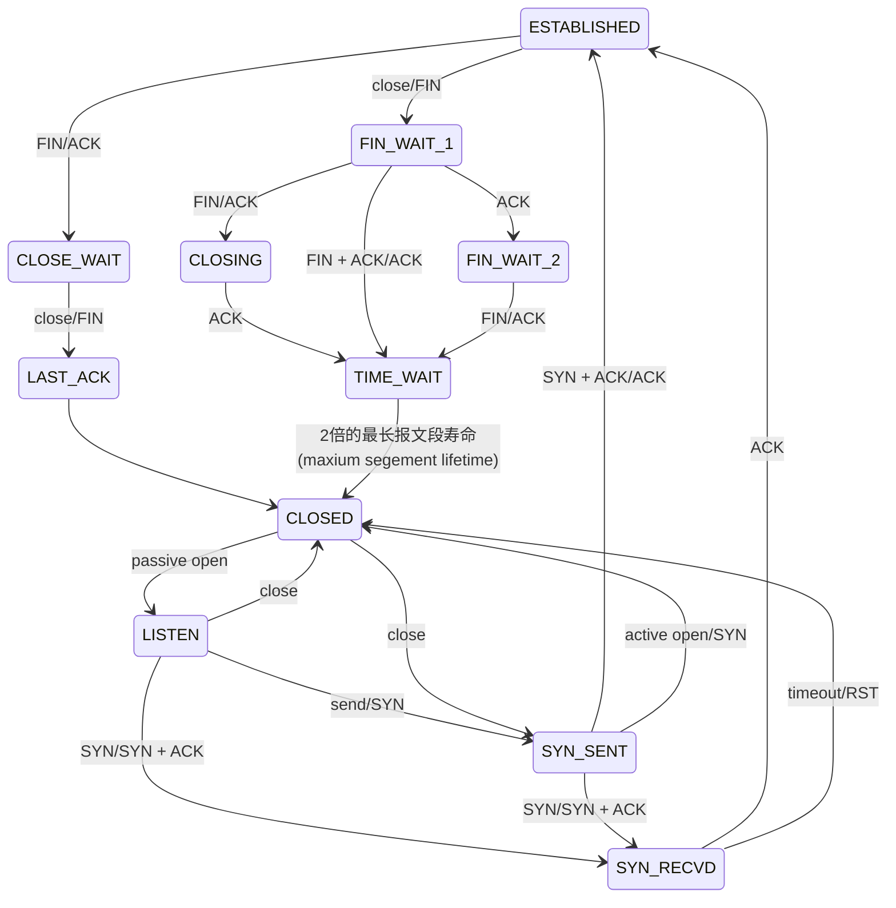

# 运输层

- 运输层的功能：为不同主机上的进程提供逻辑通信 

**运输层与网络层的关系**：网络层为运输层提供服务，运输层构建在网络层之上

## 运输层协议

- TCP
- UDP

运输层通过Socket端口来实现多路复用与多路分解

## UDP

- 对发送时间以及发送内容控制能力更强
- 无连接
- 无状态
- 分组首部小
- 支持一对一、一对多、多对一和多对多的交互通信

虽然 UDP 不提供可靠交付，但在某些情况下 UDP 确是一种最有效的工作方式（一般用于即时通信），比如： QQ 语音、 QQ 视频 、直播等等

### UDP首部


- 校验和：通过对数据部分的比特进行累加得到

## TCP

面向连接的，提供可靠交付，有流量控制，拥塞控制，提供全双工通信，面向字节流，每一条 TCP 连接只能是点对点的

### TCP首部


序号：对字节流进行编号，序号为 301，表示第一个字节的编号为 301，如果携带的数据长度为 100 字节，那么下一个报文段的序号应为 401

确认号：期望收到的下一个报文段的序号，例如 B 正确收到 A 发送来的一个报文段，序号为 501，携带的数据长度为 200 字节，因此 B 期望下一个报文段的序号为 701

数据偏移：也就是首部的长度

- RST/SYN/FIN 用于连接的建立与拆除
- URG 代表是上层紧急数据
- ACK 确认
- PSH 尽快交给应用层

窗口：窗口值作为接收方让发送方设置其发送窗口的依据

### RTT 估计

一个报文段从发送再到接收到确认所经过的时间称为往返时间 RTT

```java
均值RTT = 0.875 * 均值RTT + 0.125 * 样本RTT
```

这个估值可以被用来作为超时的参考，如果小于这个值，会造成不必要的重传

另外一种超时间隔的实现是当发生超时时，超时间隔取上次超时间隔的两倍，这是一种简单的拥塞控制，根链路层的指数回避很像

### 可靠数据传输

一个可靠的数据传输协议要素：检验和、序号、定时器、肯定与否定确认

#### 原理

使用基于停等操作的可靠传输协议效率不高，一个分组必须等到ACK后下一个分组才能开始传送


为提高效率，可使用流水线操作，流水线操作要求发送接收方具有缓存n个分组的能力，出现差错时，有两种方式来进行恢复，


分别是回退N步(GBN)


GBN通过累积确认的方式来确认已接收到的分组位置，以及重传已发送但还未确认的分组来进行错误恢复。


和选择重传(SR)，发送方仅重传怀疑接收方出错的分组，相比GBN重传大量分组，选择重传发送的分组较少


TCP使用以下方式保证可靠传输：

1. 应用数据被分割成 TCP 认为最适合发送的数据块。这个值被称为MTU, 由于以太网的帧大小为1500，所以一个典型值为1460
2. TCP 给发送的每一个包进行编号，接收方对数据包进行排序，把有序数据传送给应用层。
校验和： TCP 将保持它首部和数据的检验和。这是一个端到端的检验和，目的是检测数据在传输过程中的任何变化。如果收到段的检验和有差错，TCP 将丢弃这个报文段和不确认收到此报文段。
3. TCP 的接收端会丢弃重复的数据。
4. 流量控制： TCP 连接的每一方都有固定大小的缓冲空间，TCP的接收端只允许发送端发送接收端缓冲区能接纳的数据。当接收方来不及处理发送方的数据，能提示发送方降低发送的速率，防止包丢失。TCP 使用的流量控制协议是可变大小的滑动窗口协议。 （TCP 利用滑动窗口实现流量控制）
5. 拥塞控制： 当网络拥塞时，减少数据的发送。
6. ARQ协议： 也是为了实现可靠传输的，它的基本原理就是每发完一个分组就停止发送，等待对方确认。在收到确认后再发下一个分组。
7. 超时重传： 当 TCP 发出一个段后，它启动一个定时器，等待目的端确认收到这个报文段。如果不能及时收到一个确认，将重发这个报文段。

### ARQ协议

通过使用确认和超时这两个机制，在不可靠服务的基础上实现可靠的信息传输

#### 停止等待ARQ协议

每发完一个分组就停止发送，等待对方确认（回复ACK）。如果过了一段时间（超时时间后），还是没有收到 ACK 确认，说明没有发送成功，需要重新发送，直到收到确认后再发下一个分组

#### 连续ARQ协议

发送方维持一个发送窗口，凡位于发送窗口内的分组可以连续发送出去，而不需要等待对方确认

### 流量控制

- 滑动窗口


接收方通过在报文段中添加接口窗口字段来进行双方之间的速度匹配

接收方发送的确认报文中的win窗口字段可以用来控制发送方窗口大小，从而影响发送方的发送速率。将窗口字段设置为 0，则发送方不能发送数据，也就是背压机制

早期的win字段最大值也就说65535，后面在 TCP 扩展部分也就是 TCP Options 里面，增加一个 Window Scale 的字段，它表示原始 Window 值的左移位数，最高可以左移 14 位，左移一位等于原始win值乘以2的一次方

如果发送方一直没有收到 ACK，随着数据不断被发送，很快可用窗口就会被耗尽。在这种情况下，发送方也就不会继续发送数据了，这种发送端可用窗口为零的情况称为“零窗口”

为了防止零窗口造成的无法发送数据，需要设置一个零窗口定时器，时间一到就询问接收端窗口是否可用

### 拥塞控制

拥塞控制就是为了防止过多的数据注入到网络中，这样就可以使网络中的路由器或链路不致于过载

为了进行拥塞控制，TCP 发送方要维持一个 拥塞窗口(cwnd) 的状态变量。拥塞控制窗口的大小取决于网络的拥塞程度，并且动态变化

#### 原则

- 报文段丢失时发送方降低速率
- 未确认报文段确认到达时，发送方增加速率
- 带宽探测，尝试性发送数据，来判断拥塞程度

#### 慢启动

慢开始算法的思路是当主机开始发送数据时 较好的方法是先探测一下，即由小到大逐渐增大发送窗口


不断增加直到超时或者拥塞窗口增长到慢启动阈值，超时后将cwnd（拥塞窗口）/2

但这种方式似乎在连接前期会很慢，对于一些响应性需求极高的服务，可以通过部署一台距离用户物理空间较近的前端服务器，这台前端服务器通过一个较大的窗口连接后端服务器来降低延迟

#### 拥塞避免

让拥塞窗口cwnd缓慢增大，即每经过一个往返时间RTT就把发送放的cwnd加1个单位

同样，发生超时也会将cwnd/2


#### 快重传与快恢复

为了减少丢包重传所浪费的空耗时间

- 快重传：，一旦发送方收到 3 次重复确认（加上第一次确认就一共是 4 次），就不用等超时计时器了，直接重传这个报文
- 快恢复：在遇到拥塞点之后，通过快速重传，就不再进入慢启动，从减半的拥塞窗口开始，进行线性增长


### 公平性

UDP源有可能压制TCP流量

- 明确拥塞通知：由路由器在报文中插入当前路由器的拥塞情况

### 连接管理

#### 三次握手


- 客户端–发送带有 SYN 标志的数据包–一次握手–服务端
- 服务端–发送带有 SYN/ACK 标志的数据包–二次握手–客户端
- 客户端–发送带有带有 ACK 标志的数据包–三次握手–服务端

第一次握手：Client 什么都不能确认；Server 确认了对方发送正常，自己接收正常

第二次握手：Client 确认了：自己发送、接收正常，对方发送、接收正常；Server 确认了：对方发送正常，自己接收正常

第三次握手：Client 确认了：自己发送、接收正常，对方发送、接收正常；Server 确认了：自己发送、接收正常，对方发送、接收正常

所以三次握手就能确认双发收发功能都正常，缺一不可

[SYN泛洪攻击](/计算机网络/网络安全/网络协议安全.md#TCP)也就是攻击者发起第一次握手，然后后续操作不做了，服务端则需要预留相应的资源来为这个连接服务，在攻击的场景下，大量攻击过来，就会导致资源被耗尽死掉

为什么要回传SYN：

接收端传回发送端所发送的 SYN 是为了告诉发送端，我接收到的信息确实就是你所发送的信号了

同样 使用ACK服务端就能验证客户端

当出于某些原因，如端口没开放，此时服务端要拒绝掉客户的握手请求，可以通过回传RST状态来拒绝，也可以发送一个 ICMP 报文port unreachable 消息，这两种在应用层上来看就是连接被拒绝，另外一种是直接不理客户端，此时正常客户端重试一段时间后就会放弃

#### 四次挥手


- 客户端发起一个关闭连接的请求，服务器响应这个关闭请求
- 此时，客户端不能再向服务端发送数据，但是服务器可以发送数据给客户端，当服务器的数据传送完毕，向客户端发送一个关闭连接的请求
- 客户端接收到服务端的关闭请求后，再发送一个确认消息，等待2MSL（Linux默认是60秒，net.ipv4.tcp_fin_timeout参数）的时间，关闭
- 服务端接收到客户端的最后一个关闭请求后，关闭

TCP 里一个报文可以搭另一个报文的顺风车（Piggybacking），以提高 TCP 传输的运载效率。所以，TCP 挥手倒不是一定要四个报文



等待2MSL时间是为了让本连接持续时间内所产生的所有报文都从网络中消失，使得下一个新的连接不会出现旧的连接请求报文

### TCP状态转化



影响网络传输的因素：

- 网络带宽
- 传输距离造成的时延
- 拥塞控制

#### TIME_WAIT

存在这个状态的原因：

**1）可靠地实现TCP全双工连接的终止**

在进行关闭连接四次挥手协议时，最后的ACK是由主动关闭端发出的，如果这个最终的ACK丢失，服务器将重发最终的FIN，因此客户端必须维护状态信息允许它重发最终的ACK。如果不维持这个状态信息，那么客户端将响应RST分节，服务器将此分节解释成一个错误（在java中会抛出connection reset的SocketException)。

因而，要实现TCP全双工连接的正常终止，必须处理终止序列四个分节中任何一个分节的丢失情况，主动关闭的客户端必须维持状态信息进入TIME_WAIT状态。

**2）允许老的重复分节在网络中消逝**
TCP分节可能由于路由器异常而“迷途”，在迷途期间，TCP发送端可能因确认超时而重发这个分节，迷途的分节在路由器修复后也会被送到最终目的地，这个原来的迷途分节就称为lost duplicate。

在关闭一个TCP连接后，马上又重新建立起一个相同的IP地址和端口之间的TCP连接，后一个连接被称为前一个连接的化身（incarnation)，那么有可能出现这种情况，前一个连接的迷途重复分组在前一个连接终止后出现，从而被误解成从属于新的化身。

为了避免这个情况，TCP不允许处于TIME_WAIT状态的连接启动一个新的化身，因为TIME_WAIT状态持续2MSL，就可以保证当成功建立一个TCP连接的时候，来自连接先前化身的重复分组已经在网络中消逝。

当短时间内有大量的短连接打到服务器，然后又close 会造成系统中存在大量处于TIME_WAIT状态的TCP连接

除非请求量很大很快，否则没有处理的必要，如果短时间内发起大量短连接，很有可能造成源端口或者目的端口不够用（部分软件如FTP服务器会选择可以使用的端口范围），从而造成新建的连接失败，由于TCP连接是一个（源IP，源端口，目的IP，目的端口）的四元组，如果发起连接的速度大于连接消逝的速度，那最终不管是源端口，还是目的端口都会不够用

一个由于向FTP服务器发起了大量短连接导致新建的链接被莫名close的案例：

FTP服务器是一种用于文件传输的网络服务，它有两种工作模式：主动模式和被动模式。在主动模式下，FTP服务器主动向客户端发起数据传输的连接，而在被动模式下，FTP服务器等待客户端发起数据传输的连接。被动模式可以避免一些防火墙或路由器的限制，因此在公网上更常用。

我们遇到了一个由于向FTP服务器发起了大量短连接导致新建的链接被莫名close的问题。我们的场景是这样的：公安网中部分基础设施比较落后的城市，由于技术限制，还必须使用FTP服务器来摆渡数据。一个定时任务每次爬取数据后，会将数据发送到FTP服务器上，但每次发送都会新建一个FTP连接，这是导致问题的原因。

我们发现，一旦发送量比较多（比如每分钟发送1000个文件），新建的FTP链接虽然可以连接上FTP服务器，但在传输数据时却莫名其妙被FTP服务器断开了。FTP服务器没有给出任何错误信息，只是返回了一个“Connection closed by remote host”的消息。使用netstat命令发现，系统中存在大量连接FTP服务器的链接处于TIME_WAIT状态（如下图所示）。这些处于TIME_WAIT状态的链接占用了本地端口号，导致无法再开启新的链接。

我们查看了FTP服务器的配置文件，发现它使用了被动模式，在新启动一个链接用于传输数据时，会占用一个新的端口号。而默认配置下，vsftpd的被动模式可使用的端口范围只有1000个（从21100到22100）。这就意味着如果在短时间内有超过1000个链接请求传输数据，就会出现端口不足的情况。这些处于TIME_WAIT状态的链接导致服务器无法再开启新的链接传输数据，从而导致FTP控制链接正常，但上传或下载数据时却会被断掉。

为了解决这个问题，我们尝试了以下几种方法：

- 调高FTP服务器的端口范围。我们将vsftpd.conf文件中的pasv_min_port和pasv_max_port参数分别修改为20000和30000，增加了可用端口数。这样可以缓解端口不足的问题，但也会增加服务器的资源消耗和管理难度。
- 降低net.ipv4.tcp_max_tw_buckets这个参数的值。这个参数控制了系统中最多允许存在多少个处于TIME_WAIT状态的链接。我们将它从默认值180000降低到5000，使得系统能够更快地回收处于TIME_WAIT状态的链接。这样可以减少本地端口号的占用，但也会有安全风险或性能损失。
- 使用连接池，对连接进行复用。我们修改了定时任务的代码，使得它不再每次发送数据都新建一个FTP连接，而是使用一个连接池来管理和复用已有的连接。这样可以避免在短时间内产生大量的连接，也可以提高数据传输的效率。

经过测试，我们发现使用连接池是最好的方式，它既解决了问题，又没有带来其他负面影响。因此我们最终采用了使用连接池的方案，部署到了生产环境中。经过一段时间的观察，我们发现问题已经完全消失了，FTP服务器和客户端都能正常工作，数据传输也没有出现任何异常。

linux 处理TIME_WAIT链接过多：

/etc/sysctl.conf

```conf
net.ipv4.tcp_syncookies = 1 # 表示开启SYN Cookies。当出现SYN等待队列溢出时，启用cookies来处理，可防范少量SYN攻击，默认为0，表示关闭；
net.ipv4.tcp_tw_reuse = 1 # 表示开启重用。允许将TIME-WAIT sockets重新用于新的TCP连接，默认为0，表示关闭；
net.ipv4.tcp_tw_recycle = 1 # 表示开启TCP连接中TIME-WAIT sockets的快速回收，默认为0，表示关闭。
net.ipv4.tcp_fin_timeout = 60 # 修改系默认的 TIMEOUT 时间 默认60

net.ipv4.tcp_keepalive_time = 1200 # 表示当keepalive起用的时候，TCP发送keepalive消息的频度。缺省是2小时，改为20分钟。
net.ipv4.tcp_keepalive_probes = 9 # 在探测无响应的情况下，可以发送的最多连续探测次数
net.ipv4.tcp_keepalive_intvl = 75 # 在探测无响应的情况下，连续探测之间的最长间隔
net.ipv4.ip_local_port_range = 1024 65000 # 表示用于向外连接的端口范围。缺省情况下很小：32768到61000，改为1024到65000。
net.ipv4.tcp_max_syn_backlog = 8192 # 表示SYN队列的长度，默认为1024，加大队列长度为8192，可以容纳更多等待连接的网络连接数。
net.ipv4.tcp_max_tw_buckets = 5000 # 表示系统同时保持TIME_WAIT套接字的最大数量，如果超过这个数字，TIME_WAIT套接字将立刻被清除并打印警告信息。
# 这个参数在 https://www.kernel.org/doc/Documentation/networking/ip-sysctl.txt 中提示其实为了简单防止Dos攻击 所以在对外提供服务的情况下不应该人工缩小
# 默认为180000，改为5000。对于Apache、Nginx等服务器，上几行的参数可以很好地减少TIME_WAIT套接字数量，但是对于 Squid，效果却不大。此项参数可以控制TIME_WAIT套接字的最大数量，避免Squid服务器被大量的TIME_WAIT套接字拖死。
```

执行 /sbin/sysctl -p 让参数生效

#### 保活

- 默认 TCP 连接并不启用 Keep-alive，若要打开的话要显式地调用 setsockopt()，Java当中就是Socket.setKeepAlive方法
- TCP 心跳包的特点是，它的序列号是上一个包的序列号 -1，而心跳回复包的确认号是这个序列号 -1+1
