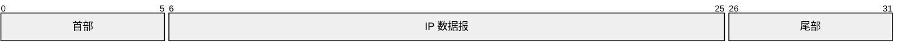

# 链路层

## 一、链路层存在的第一性原理

### 1.1 核心问题定义

链路层面对的根本问题可以抽象为三点：

1. **物理媒介不可靠**（有噪声、有差错）
2. **通信资源有限且可能共享**（带宽、信道）
3. **通信需要被系统识别和管理**（边界、地址、转发）

因此，链路层并不追求“绝对正确”，而是追求：

> **在单跳范围内，用最低复杂度，提供“足够好”的数据传递能力。**

这直接决定了链路层的设计哲学：

* 局部最优，而非全局最优
* 简单、快速、可硬件化
* 为上层提供“可用抽象”，而非最终保障

---

## 二、链路层能力模型（稳定认知框架）

从第一性原理出发，链路层的能力可以被抽象为一个稳定的能力树：

```
链路层能力模型
├── 成帧（Frame）
│   ├── 边界定义（定界）
│   ├── 透明传输
│
├── 差错控制
│   ├── 差错检测（Detection）
│   └── 差错纠正（Correction，少见）
│
├── 介质访问控制（MAC）
│   ├── 冲突避免 / 冲突处理
│   ├── 公平性
│   └── 吞吐量
│
├── 寻址与转发
│   ├── MAC 地址
│   └── 本地转发
│
├── 隔离与虚拟化
│   ├── 广播域控制
│   └── 逻辑网络划分
```

这个模型是理解后续所有协议与机制的"总地图"。

---

## 三、成帧：让连续比特流"结构化"

### 3.1 为什么必须成帧

物理层只负责比特流：

```
010101010111...
```

链路层的第一步，是**引入结构**：

> **帧 = 链路层的最小语义单元**

### 3.2 帧的核心要素

* **首部（Header）**：控制信息（地址、类型）
* **数据部分（Payload）**：来自上层
* **尾部（Trailer）**：完整性校验



### 3.3 透明传输的本质

**问题本质**：

* 如何区分"控制信息"与"数据内容"？

**解决思想**：

* 定界符 + 转义机制

透明传输的本质不是"转义字符"，而是：

> **控制信息与用户数据在语义上的隔离**

---

## 四、差错控制：局部纠错而非全局可靠

### 4.1 为什么链路层要做差错检测

* 物理噪声不可避免
* 错误如果不尽早发现，会被放大

### 4.2 为什么不用复杂算法

链路层通常由**硬件实现**：

* 速度优先
* 逻辑简单

因此：

* ❌ 不适合：复杂校验和、端到端确认
* ✅ 适合：位运算、流水线友好算法

### 4.3 典型检测方法

| 方法   | 本质    | 特点    |
| ---- | ----- | ----- |
| 奇偶校验 | 奇偶约束  | 能力弱   |
| 校验和  | 数值一致性 | 多用于高层 |
| CRC  | 多项式除法 | 工程最优  |

### 4.4 链路层可靠性的边界

> 链路层的可靠性是**"单跳、可选、非强制"**

这与运输层形成根本差异。

---

## 五、介质访问控制（MAC）：共享资源的协调艺术

### 5.1 MAC 问题的统一抽象

所有 MAC 协议，本质都在解决同一个问题：

```
多个节点
+ 共享信道
+ 无全局视角
→ 如何避免或处理冲突？
```

### 5.2 三类稳定的解决范式

#### 1️⃣ 静态切分（先分好再用）

| 协议  | 核心思想 | 代价   |
| --- | ---- | ---- |
| TDM | 按时间切 | 空闲浪费 |
| FDM | 按频率切 | 利用率低 |
| WDM | 光的频分 | 成本高  |

#### 2️⃣ 动态竞争（先用再说）

| 协议      | 思想   | 风险   |
| ------- | ---- | ---- |
| ALOHA   | 随机发送 | 冲突多  |
| CSMA    | 先听后说 | 仍会冲突 |
| CSMA/CD | 边说边听 | 物理限制 |

二进制指数退避体现的是一个**通用系统思想**：

> 冲突成本越高，退让越激进

#### 3️⃣ 协调轮转（显式秩序）

| 协议 | 思想   | 问题   |
| -- | ---- | ---- |
| 轮询 | 中心调度 | 单点故障 |
| 令牌 | 去中心  | 管理复杂 |

---

## 六、寻址与交换：从"共享"到"隔离"

### 6.1 MAC 地址的本质

* 链路层地址
* 48 位
* **标识的是"接口"，而非"主机"**

### 6.2 交换机的第一性原理

> **交换机 = 二层分布式缓存系统**

```
MAC 地址 → 端口
```

* 自学习
* 转发 / 过滤

### 6.3 广播、副作用与失效模式

* 交换机毒化：缓存被污染 → 退化为广播
* 广播风暴：局部行为 → 全网放大

这些问题的根源在于：

> **二层网络缺乏全局控制平面**

---

## 七、VLAN：逻辑隔离的工程解法

### 7.1 VLAN 解决的根本问题

* 广播域过大
* 组织结构与物理拓扑不一致

### 7.2 VLAN 的本质

> **VLAN = 广播域的逻辑切分**

* 不改变物理连接
* 改变"谁能看到谁"

### 7.3 VLAN 的边界

* 解决二层隔离
* ❌ 不能替代三层路由

---

## 八、链路虚拟化与数据中心网络

### 8.1 链路虚拟化

> 把"网络"抽象成"一条逻辑链路"

这是现代云网络的基础思想。

### 8.2 数据中心网络关注点

* 大规模
* 高并发
* 可演进

核心目标：

* 消灭大广播域
* 提供可预测性能

---

## 九、历史演进与不变思想

| 技术         | 是否仍主流 | 不变的思想  |
| ---------- | ----- | ------ |
| CSMA/CD    | 否     | 冲突代价递增 |
| Token Ring | 否     | 显式协调   |
| 交换式以太网     | 是     | 空间换时间  |
| VLAN       | 是     | 逻辑隔离   |

## 关联内容（自动生成）

- [/计算机网络/网络层.md](/计算机网络/网络层.md) 网络层与链路层是相邻的网络协议层，网络层依赖链路层提供的服务进行数据传输，两者在协议栈中紧密协作
- [/计算机网络/运输层.md](/计算机网络/运输层.md) 运输层与链路层在协议栈中分别负责端到端和点对点的数据传输，理解两层的差异有助于理解协议分层设计
- [/计算机网络/应用层.md](/计算机网络/应用层.md) 应用层是网络协议栈的最上层，与链路层形成完整的协议栈体系，数据在各层间封装和解封装
- [/计算机网络/计算机网络与因特网.md](/计算机网络/计算机网络与因特网.md) 作为计算机网络的总体概述，提供了理解链路层在整个网络体系中作用的宏观视角
- [/计算机网络/网络安全/网络安全.md](/计算机网络/网络安全/网络安全.md) 链路层安全是网络安全的重要组成部分，涉及MAC地址欺骗、VLAN跳跃等安全问题
- [/计算机网络/无线网络.md](/计算机网络/无线网络.md) 无线网络中的链路层有特殊考虑，如信道管理、移动性管理等，与有线网络的链路层实现有所不同
- [/计算机网络/网络编程.md](/计算机网络/网络编程.md) 网络编程涉及各层协议的实际应用，包括链路层的底层操作和控制
- [/计算机网络/Linux虚拟化.md](/计算机网络/Linux虚拟化.md) Linux网络虚拟化技术涉及链路层虚拟化，如虚拟网桥、VLAN等技术的实现