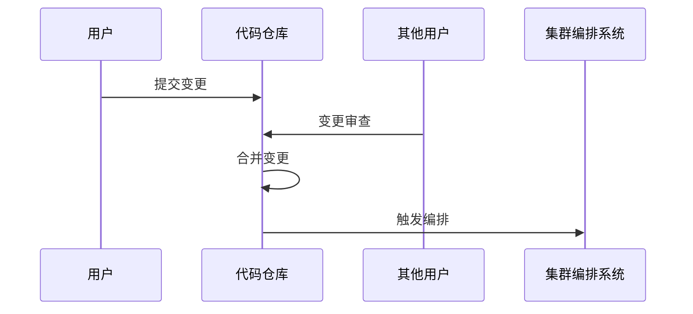

# DevOps

>DevOps（Development和Operations的组合词）是一种重视“软件开发人员（Dev）”和“IT运维技术人员（Ops）”之间沟通合作的文化、运动或惯例。透过自动化“软件交付”和“架构变更”的流程，来使得构建、测试、发布软件能够更加地快捷、频繁和可靠。

瀑布模式 -> 敏捷模式 -> DevOps模式

- 代码托管
- 虚拟化
- 持续集成、交付
- 无缺陷编程目标

DevOps 的价值：

1. 改善企业的软件交付过程，实现高质量和高效率的交付
2. 改善企业内部的工程师文化，激发活力与创造

## 价值流分析

关键要素：

1. 前置时间（Lead Time，简称 LT）。指一个需求从提出（典型的就是创建一个需求任务）的时间点开始，一直到最终上线交付给用户为止的时间周期。这部分时间直接体现了软件开发团队的交付速率，并且可以用来计算交付吞吐量。DevOps 的核心使命之一就是优化这段时长。
2. 增值活动时间和不增值活动时间（Value Added Time/Non-Value Added Time，简称 VAT/NVAT）。在精益思想中，最重要的就是消除浪费，也就是说最大化流程中那些增值活动的时长，降低不增值活动的时长。
3. 完成度和准确度（% Complete/Accurate，简称 %C/A）。这个指标用来表明工作的质量，也就是有多少工作因为质量不符合要求而被下游打回。

## 转型路径

企业实施 DevOps：

1. 自底向上路径：

DevOps 实践通常从企业中的小团队或部门开始，目的是解决团队内部及与上下游团队协作中的问题。由于团队规模较小，资源调动相对简单，因此能在局部取得初步效果。为了扩大影响，这些实践者需要逐步向高层汇报并赢得管理层的认可，最终推动 DevOps 在整个企业中横向扩展。

2. 自顶向下路径：
  
在这种模式下，企业高层基于对行业趋势的把握，通过行政命令推动 DevOps 转型。这种方式有明确的目标和资源支持，但容易出现“表面成功”的现象，即为了满足上级要求，团队可能会选择性地展示数据，未真正解决业务问题。因此，建立客观有效的度量标准至关重要。

无论选择哪种路径，管理层的支持都是关键。

## 业务敏捷

DevOps 最终的目标是促进交付能力的提升，以提升对业务的价值，但如果业务需求不明确，交付能力再高也难以提升整体业务价值

需求管理与优先级：

用户价值：

通过用户故事（代入用户场景描述需求）增强团队对需求价值的共识，使产品、研发和测试团队统一理解目标和用户价值

持续快速验证：

采用精益创业思想，通过最小可行产品（MVP）进行市场试验，获取真实反馈，从而持续迭代产品

## 软件开发的困难

- 复杂
- 不可见
- 可变
- 一致性：兼容

## 软件发展的三个阶段

- 软件依附于硬件
- 软件成为独立产品
- 网络化服务化

## 个体软件过程（PSP）

- 与软件质量（满足用户的期望）息息相关

### 典型的用户期望

- 正常工作
- 性能
- 非功能需求（安全、可靠）

### 质量策略

- 缺陷管理

### 基本流程

- 策划
- 设计
- 编码
- 单元测试
- 总结

### 基本原理

- 软件系统的质量由组成该系统的质量最差组件决定
- 软件质量与软件工程师息息相关
- 建立持续自我改进机制

### 过程度量

- 规模
  - 精确的规模度量在早期很难
- 时间
  - 良好的时间度量有助于工程师的能力
- 缺陷
- 日程

#### 为什么要度量

体现决策者对要实现目标的关切程度
高质量的开发是计划出来的

### 质量路径

- 测试提高质量
- 评审消除缺陷提高质量
- PSP

评审手段消除缺陷比测试消除效率更高

#### 有效的评审

- 评审检查表
  - 分析整理历史项目的缺陷，辅助开展评审
- 质量控制指标
  - 设计质量：设计的时间应该大于编码的时间
  - 设计评审质量:设计评审的时间应该大于设计时间的50%
  - 代码评审质量:代码评审时间应该大于编码时间的50%
  - 代码质量:代码的编译缺陷密度应当小于10个/千行
  - 程序质量:代码单元测试缺陷密度应当小于5个/千行
- 其他
  - 环境
    - 对阅读代码的辅助
  - 时机
    - 单元测试之前
  - 个人评审与小组评审相结合
  - 缺陷预防

## [敏捷软件开发](/软件工程/理论/敏捷软件开发.md)

- DevOps 是敏捷在开发端与运维端的延伸

## 精益思想

- 消除浪费
  - 不能增加价值的行为即为浪费
- 增强学习（项目内容）
- 尽量延迟决定
- 尽快发布，尽快交付
- 下放权力
- 内置完整性
- 全局优化

### 精益看板

加快价值流动是精益看板的核心，以拉动式生产为典型特征，约束制品数量为实践，灵活响应业务变化，快速交付价值

第一步：可视化流程；

梳理价值交付流程，通过对现有流程的建模，让流程变得可视化，看板是一种方式

第二步：定义清晰的规则；

在流程可视化之后，需要定义规则以减少沟通成本，确保团队对看板操作的理解一致

第三步：限制在制品数量；

看板的核心环节，重点是限制需求流入和需求流出节点的在制品数量。通过减少并行任务，暴露团队的潜在问题，逐步优化交付效率

第四步：管理工作流程；

通过管理工作流程确保看板顺畅运转，常见的管理流程包括每日站会、队列填充会议和发布规划会议。重点关注任务的状态，尤其是阻塞、优先级高或长期停留的任务，确保价值流动的顺畅

第五步：建立反馈和持续改进；

精益看板的最终目标是通过反馈持续优化流程、工具和规则。通过不断的反馈和改进，提升团队的效率和交付质量，确保看板方法适应业务和团队的实际需求

## DevOps成熟度模型

## 软件架构演化

### 单体架构

全部功能被集成在一起作为一个单一的单元

### 分层架构

- 关注点分离

每一层有特定的职责，上层只能直接访问下层

### 面向服务架构

- 关注点分离
- 延迟绑定（设计到运行）

消息总线与服务编排引擎

### 微服务架构

围绕**业务能力**构建的可独立开发部署的小型单元，使用远程调用进行通信

- 核心模式
  - 服务注册与发现
  - api网关
  - 熔断器

挑战：

- 对运维监控的挑战
- 发布更复杂，出现分布式问题
- 部署依赖性强
- 通信成本高

## XaaS

什么 即 服务

SaaS 中心化的软件的分发方式，通过网络使用软件
IaaS 虚拟化硬件资源给用户
PaaS 提供给开发者使用

### IT服务标准

- CMMI-SVC
- ITIL
- ISO20000
- ITSS

## 工具链

- 协同开发
  - 工作可视化。加强沟通
  - JIRA
  - KanBan
  - Rally
- 持续集成
  - jenkins
- 版本管理
  - git
  - svn
- 编译工具
  - ant
  - maven
  - gradle
  - msbuild
- 测试工具
  - junit
  - selenium（ui测试）
  - cucumber（自动化验收）
  - fitnesse（管理）
- 监控
  - nagios
  - zabbix

## 持续交付

## 团队拓扑

1. 业务流团队（Stream-aligned Team） 工作可能是一个产品或服务，也可能是一组特性、一个用户旅程或一个用户画像
2. 赋能团队（Enabling Team） 由特定技术领域或产品领域的专家组成，对于技术问题开展调研，尝试不同的方案，寻找最佳实践
3. 复杂子系统团队（Complicated-Subsystem Team） 业务逻辑十分复杂或者需要十分专业的领域知识，由该领域的专家组成一个固定的团队，来维护这个复杂的模块
4. 平台团队（Platform Team）负责解决底层问题，让业务流团队可以更专注于业务开发

### 团队交互模式

1. 协作（Collaboration）是指一个团队与另一个团队紧密合作
2. 服务（X-as-a-Service）是指使用或提供某种服务，而尽量减少协作
3. 促进（Facilitating）是指帮助其他团队清除障碍，赋能团队主要干的

## GitOps

DevOps 文化中的工程实践

- 代码化描述基础设施和应用的部署状态：对于应用的基础设置资源、应用配置和状态的维护，原则都是应是使用代码化的方式进行声明式描述
- 使用 Git 的语义来管理代码化后的配置代码：对环境的变更需要通过 Code Review，合规之后进行 Merge 到主版本，进而应用到线上环境， 而当线上环境出现问题时，再基于 Git 历史进行回退
- 具备将配置代码进行自动化部署的能力：当 Git 仓库中声明的期望状态发生变更时，可以立刻自动化应用到系统中，使其当前环境与 Git 仓库中 Iac 所描述的状态一致
- 应用状态偏离修正：应用状态一旦与 Git 仓库中期望状态不一致，应该立刻进行自动修复，即使手动修改了集群的编排策略，集群也会被自动恢复到 Git 仓库中清单所描述的状态

## FinOps

Finance + DevOps，FinOps 是一种文化实践，它为企业组织提供了一种管理云成本的理论和方法

