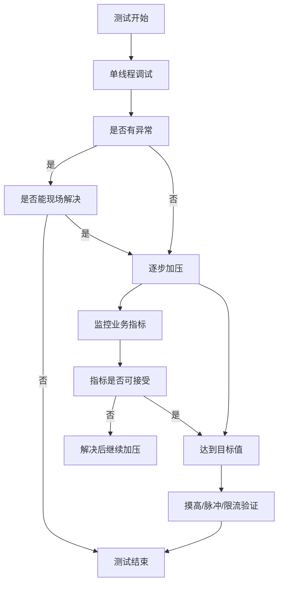

# 容量保障

- 容量规划：以尽可能小的成本确保系统当前和未来的容量充足
- 容量治理：解决已知的容量问题，预防未知的容量问题

## 量化指标

### SLA

- SLI 定义测量的具体指标，如 QPS、带宽等
- SLO 定义服务提供功能的期望状态，如 QPS 99 线≤100ms

### QPS/TPS

通常说的系统容量是否足够，一般就是指系统或服务能否在可接受的响应时间和成功率下支撑目标 QPS/TPS

### 用户体验

大多数用户体验是可以与系统指标或业务指标挂钩的，这些指标就可以作为目标的一部分

## 容量测试

### 范围

1. 关键路径上的核心服务
2. 有明显流量峰值特征的服务
3. 对响应时间敏感的服务
4. 占用资源大的服务
5. 历史上曾经发生过容量事故的服务、目前高峰期已经存在容量隐患的服务、新上线对容量情况未知的服务

### 重点链路

1. 同步链路：强依赖的，调用方需要等待被调用方执行完成，各服务的容量最容易互相影响
2. 异步链路：需要明确异步流量是从哪里过来的，量级有多大，高压期间否要做蓄洪，是否会由于消息重投而引起雪崩效应
3. 旁支业务链路：一个很不起眼的业务，在特定的场景下被反复调用后，会形成很高的终端延时
4. 高并发链路：需要做的比较多，参考[高性能](/软件工程/架构/系统设计/高并发.md)

### 线上测试

### 线下基线测试

将当前各服务的主干版本部署在基线环境上，并通过容量测试的方式获取容量指标记录备案，这些指标记录为基线指标

当有服务准备发布新版本时，就可以在基线环境上部署这个新版本，再执行同样的容量测试，将所获得的指标与基线指标进行对比，如果出现关键指标的异动，就需要介入排查，可以整合进[CI](/运维/持续集成.md)流水线

## 容量预测

## 云上的容量保障

- 弹性扩缩容，缩容是有风险的

前进的方向：减少应用冷启动时间（GraalVM），结合传统的容量规划手段，准实时的进行扩缩容

## 组织建设

- 中心化容量保障团队
- 全员容量保障意识

## 小规模的容量保障

1. 粗放式保障：择性价比高的“大头”去优先保障
2. 利用好云服务商的按使用收费机制
