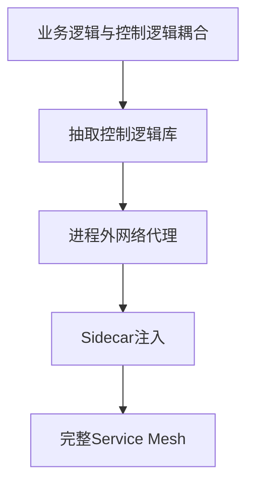
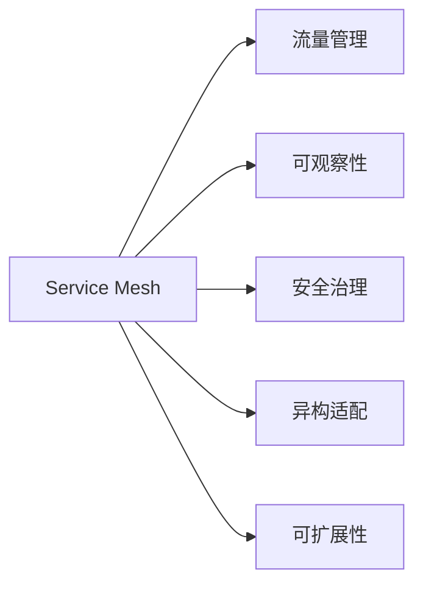
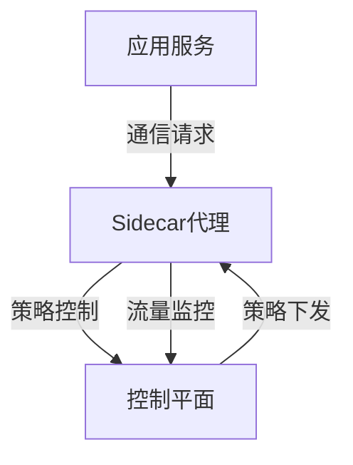

# Service Mesh

## 概述（Overview）

Service Mesh 是微服务架构的基础设施层，专注于服务间通信的管理与治理。它解决了传统微服务框架（如 Spring Cloud、Dubbo）存在的侵入性强、升级成本高、版本碎片化严重等问题，通过独立的网络代理实现服务间的透明通信、流量控制和可观察性。

Service Mesh 作为微服务演化的关键阶段，其目标是实现**业务逻辑与通信治理的完全解耦**，提供可靠、安全、可观测的服务通信平台，同时支持异构环境的统一治理。

---

## 本质（Essence）

### 核心定义

* **Service Mesh**：服务通信的基础设施层，由轻量级网络代理组成，部署在应用服务旁边（sidecar），对应用透明。
* **目标**：在分布式微服务环境下，实现服务间通信的可靠性、可控性、安全性和可观测性，而不干扰业务逻辑。

### 核心作用

| 维度   | 作用                      |
| ---- | ----------------------- |
| 解耦   | 业务逻辑与服务治理解耦，应用代码不依赖通信策略 |
| 可观察性 | 提供流量监控、指标采集、日志和追踪       |
| 流量控制 | 路由、负载均衡、故障注入、速率限制等      |
| 安全性  | 通信加密、认证与鉴权              |
| 异构支持 | 支持不同语言、框架和中间件的统一治理      |

### 发展动因

* 技术演化必经阶段：微服务框架侵入性、升级难、碎片化等痛点推动 Service Mesh 出现。
* 容器化和云原生环境的异构性，使通信治理需要基础设施化解决方案。

---

## 模型（Model）

### 分布式通信演化模型

### 数据平面（Data Plane）

* **职责**：

  * 处理入站/出站流量
  * 路由、负载均衡、健康检查
  * 安全认证与鉴权
  * 生成监控指标
* **实现方式**：

  * 基座模式：需要 SDK，部分侵入业务
  * 注入模式：Sidecar 容器透明注入
* **流量劫持技术**：

  * iptables 拦截流量
  * eBPF Socket 层转发
  * CNI 插件

### 控制平面（Control Plane）

* **职责**：

  * 下发策略和配置给数据平面
  * 可视化网络行为
  * 提供版本化配置管理接口（API/CLI）
* **与数据平面交互**：

  * xDS 协议（Listener、Route、Cluster 等资源）

---

## 能力体系（Capability System）

| 能力维度 | 功能描述                |
| ---- | ------------------- |
| 流量管理 | 路由控制、负载均衡、故障注入、流量镜像 |
| 可观察性 | 指标采集、日志、分布式追踪       |
| 安全治理 | TLS 加密、身份认证、访问控制    |
| 异构适配 | 多语言 SDK 支持、服务发现系统整合 |
| 可扩展性 | 插件化策略、控制平面 API 扩展   |

### 能力树示意

---

## 架构模型（Architecture Model）

### Service Mesh 架构层次

1. **应用层**：业务逻辑，完全不依赖通信策略
2. **数据平面**：Sidecar 代理，处理实际流量
3. **控制平面**：策略下发、配置管理、可视化
4. **平台适配层**：与 Kubernetes、服务注册系统等集成

---

## 类型体系（Taxonomy）

| 类型            | 特征                | 示例                |
| ------------- | ----------------- | ----------------- |
| Sidecar Proxy | 与应用部署在同一 Pod，透明代理 | Envoy             |
| 控制平面平台        | 配置管理与策略下发         | Istio             |
| SDK模式         | 业务程序集成轻量 SDK      | Linkerd1          |
| 网络劫持方式        | 流量拦截与转发方式         | iptables、eBPF、CNI |

---

## 边界与生态（Boundary & Ecosystem）

* **边界**：Service Mesh 仅负责服务通信，不涉及业务逻辑实现。
* **生态**：

  * Kubernetes：原生集成服务发现
  * Istio/Linkerd/Consul：成熟 Service Mesh 平台
  * Envoy：高性能 Sidecar 代理
  * 监控系统：Prometheus、Grafana、Jaeger
* **适用场景**：

  * 高度分布式微服务架构
  * 多语言异构环境
  * 需要统一治理与可观察性

---

## 治理体系（Governance System）

* **策略管理**：路由策略、熔断、限流
* **安全治理**：服务间认证、访问控制
* **版本与配置管理**：策略版本化、灰度发布
* **运维要求**：增加复杂度，需要平台化运维与自动化工具

---

## 演进趋势（Evolution）

* **微服务框架阶段**：Spring Cloud、Dubbo，侵入性高
* **轻量 SDK 阶段**：抽取控制逻辑到库
* **进程外代理阶段**：网络代理独立进程
* **Sidecar 注入阶段**：边车容器透明注入
* **完整 Service Mesh**：数据平面 + 控制平面，透明、可观测、可扩展

---

## 选型方法论（Selection Framework）

| 评估维度  | 参考标准                    |
| ----- | ----------------------- |
| 架构耦合  | 是否完全解耦业务与通信             |
| 平台兼容性 | Kubernetes、Docker 等环境支持 |
| 可观察性  | 日志、指标、追踪能力              |
| 安全治理  | TLS、认证、访问控制             |
| 社区活跃度 | 开源社区贡献、文档、生态            |
| 运维复杂度 | 对运维团队要求与工具支持            |

---

## 总结（Conclusion）

Service Mesh 是微服务架构的基础设施演进产物，核心目标是实现服务通信的透明治理。它通过数据平面（Sidecar）和控制平面（Policy/Config）解耦业务逻辑与通信逻辑，同时提供可观察性、安全治理与异构支持。虽然引入了运维复杂度，但在大规模分布式系统中，其治理能力、可扩展性和可靠性优势显著，是现代云原生架构不可或缺的一环。

## 关联内容（自动生成）

- [/软件工程/微服务/微服务.md](/软件工程/微服务/微服务.md) 微服务是Service Mesh的核心应用场景，文档详细介绍了微服务的架构、挑战及服务治理需求，与Service Mesh的出现背景和目标密切相关
- [/软件工程/架构/系统设计/分布式/分布式系统.md](/软件工程/架构/系统设计/分布式/分布式系统.md) Service Mesh是为解决分布式系统中服务通信复杂性而设计的基础设施，文档中的分布式中间件、一致性协议等内容与Service Mesh的定位和功能高度相关
- [/操作系统/容器化.md](/操作系统/容器化.md) 容器化技术是Service Mesh实现的基础，Sidecar模式依赖容器化环境，文档中的网络、安全、资源隔离等概念是理解Service Mesh部署和运行的关键
- [/软件工程/架构/系统设计/云原生.md](/软件工程/架构/系统设计/云原生.md) Service Mesh是云原生架构的重要组成部分，文档中的平台能力、服务网格、可观测性等内容与Service Mesh的核心概念和应用场景直接相关
- [/运维/K8s.md](/运维/K8s.md) Kubernetes是Service Mesh的主要部署平台，文档中的Pod、网络、服务发现等概念是理解Service Mesh在K8s环境中运行机制的基础
- [/软件工程/架构/系统设计/网关.md](/软件工程/架构/系统设计/网关.md) 网关与Service Mesh在流量治理方面有相似功能，文档中的API网关、流量控制等内容有助于理解Service Mesh与传统网关的异同和演进关系
- [/软件工程/架构/系统设计/分布式/分布式共识算法.md](/软件工程/架构/系统设计/分布式/分布式共识算法.md) Service Mesh控制平面需要处理分布式一致性问题，文档中的Raft、Paxos等算法是理解控制平面高可用和一致性保障的关键
- [/中间件/消息队列/消息队列.md](/中间件/消息队列/消息队列.md) 消息队列是分布式系统通信的另一种方式，文档中的异步通信、服务解耦等内容与Service Mesh在分布式通信治理方面有互补关系
- [/软件工程/架构/系统设计/分布式/分布式事务.md](/软件工程/架构/系统设计/分布式/分布式事务.md) Service Mesh在分布式环境中需要处理跨服务的事务协调，文档中的分布式事务模型与Service Mesh的流量控制和一致性保障密切相关
- [/软件工程/架构/系统设计/分布式/分布式一致性与协调机制.md](/软件工程/架构/系统设计/分布式/分布式一致性与协调机制.md) Service Mesh需要在分布式环境中保证配置和服务发现的一致性，文档中的协调机制是理解Service Mesh内部协调原理的基础
- [/软件工程/微服务/服务治理/服务治理.md](/软件工程/微服务/服务治理/服务治理.md) Service Mesh是服务治理的基础设施实现，文档中的服务注册发现、负载均衡、熔断等内容与Service Mesh提供的治理能力高度重合
- [/软件工程/微服务/服务治理/服务容错.md](/软件工程/微服务/服务治理/服务容错.md) Service Mesh提供服务间通信的容错能力，文档中的熔断、限流、降级等容错机制是Service Mesh核心治理能力的重要组成部分
- [/软件工程/架构/系统设计/高并发.md](/软件工程/架构/系统设计/高并发.md) Service Mesh在高并发场景下需要处理大量服务间通信，文档中的负载均衡、流量控制等内容与Service Mesh的性能优化密切相关
- [/软件工程/架构/系统设计/可用性.md](/软件工程/架构/系统设计/可用性.md) Service Mesh通过服务治理提升分布式系统的可用性，文档中的容错、降级、熔断等内容与Service Mesh保障系统可用性的机制相关
- [/软件工程/架构/系统设计/扩展性.md](/软件工程/架构/系统设计/扩展性.md) Service Mesh需要支持大规模微服务架构的扩展，文档中的扩展性设计原则与Service Mesh的架构设计有直接关系
- [/软件工程/架构/系统设计/缓存.md](/软件工程/架构/系统设计/缓存.md) Service Mesh中的代理可以提供缓存功能，文档中的分布式缓存策略与Service Mesh的性能优化和流量治理相关
- [/计算机网络/网络安全/安全架构.md](/计算机网络/网络安全/安全架构.md) Service Mesh提供服务间通信的安全保障，文档中的零信任、微服务认证授权等内容与Service Mesh的安全治理能力直接相关
- [/计算机网络/rpc.md](/计算机网络/rpc.md) Service Mesh处理服务间的远程调用，文档中的RPC协议、网络通信等内容是理解Service Mesh工作原理的基础
- [/中间件/数据库/分布式数据库.md](/中间件/数据库/分布式数据库.md) 分布式数据库与Service Mesh都面临分布式环境的挑战，文档中的分布式架构、一致性协议等内容有助于理解Service Mesh的设计原理
- [/软件工程/架构/架构.md](/软件工程/架构/架构.md) Service Mesh是现代软件架构演进的重要阶段，文档中的微服务、服务网格等内容直接涉及Service Mesh的架构定位和发展历程
