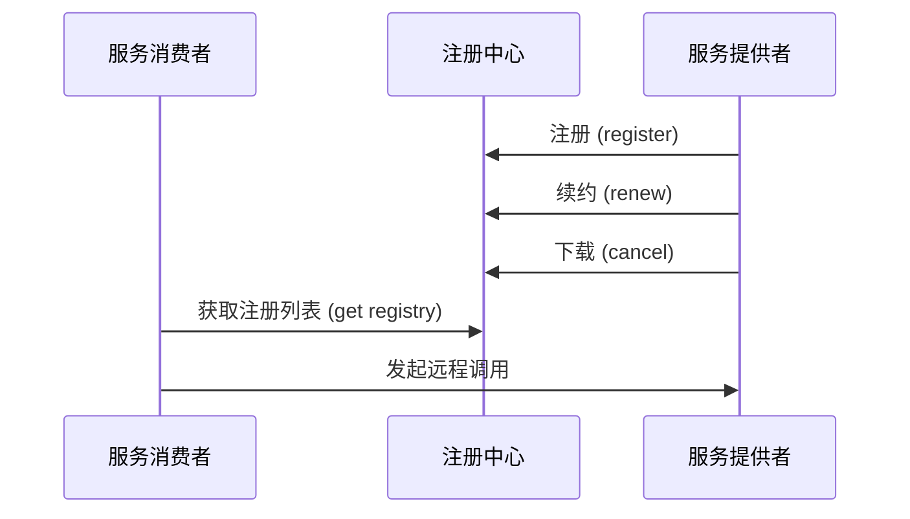
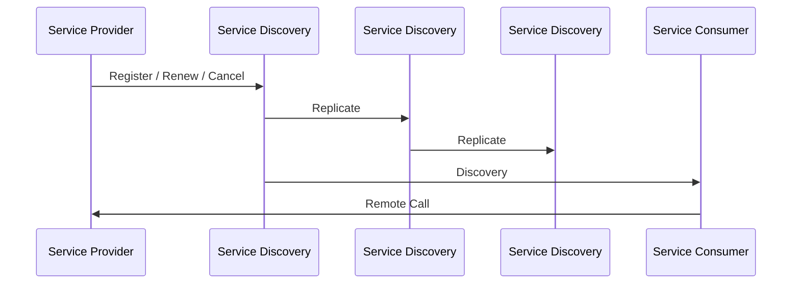
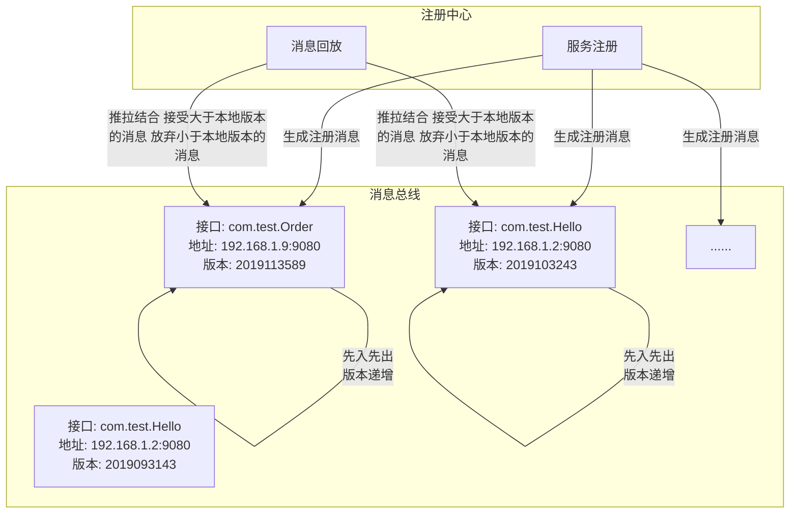
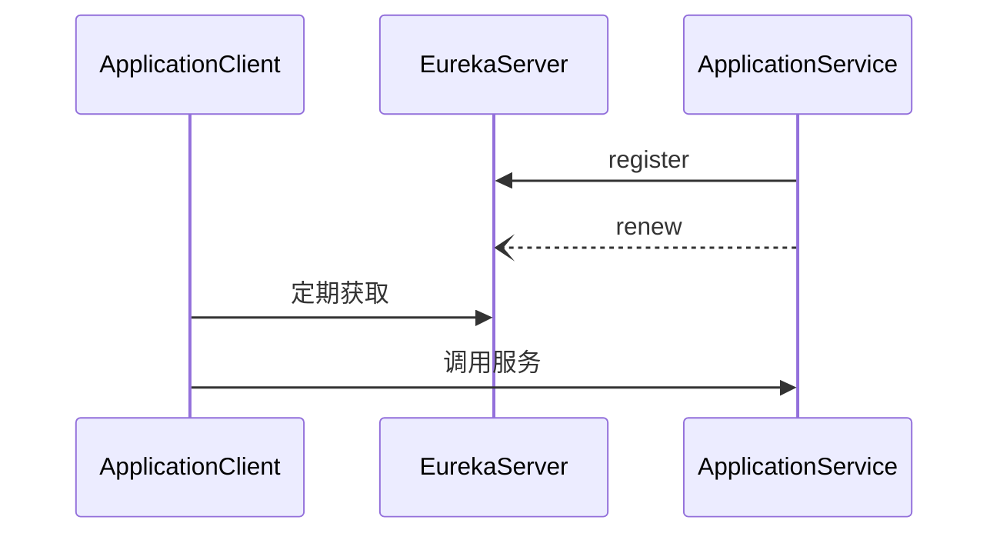
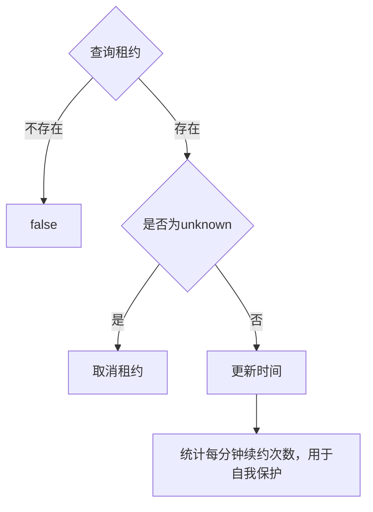

# 服务发现

>服务化的普及，令软件系统得以通过分布于网络中不同机器的互相协作来复用功能

最早的服务发现可以直接依赖DNS将一个全限定名翻译为一至多个IP地址或者SRV等其他类型的记录便可

但进入微服务时代后，服务宕机 上线下线变得更加频繁 DNS就力不从心了。

服务注册与发现的实现是随zk-eureka-nacos/consul这条线过来的

## 服务发现原理



### 自理式服务发现

- 自理式结构就是指每个微服务自己完成服务发现


好处在于可以处理多平台部署问题，弊端则是需要为每种编程语言提供一个SDK。

### 代理式服务发现


- 平台路由器 有单点故障风险和性能风险

### 服务发现共性设计

- 服务注册：服务通过某些形式将自己的坐标信息通知到服务注册中心
- 服务维护：服务发现框架必须能监控服务健康状况，及时剔除不健康的服务
- 服务发现：消费者可以通过框架将服务名转为具体的坐标

在真实系统中，服务发现中心是整个系统的基础架构 如果它一挂 整个系统就完全崩溃了 所以必须进行高可用支持



服务发现中心有以Eureka的AP注册中心 也有以Consul为代表的CP注册中心

当然也有AP CP随时转换的Nacos

AP在出现在系统出现网络分区也能继续对外提供服务 不会影响系统操作的正确性场景下 是十分有用的

## 服务注册中心的实现

- 在分布式KV存储中间件上开发自己的框架：zk，redis，etcd
- 基础设施实现：DNS
- 专用框架：Eureka Nacos等

### AP实现



### Eureka

> Eureka是Netflix开发的服务发现框架,Eureka包含两个组件： Eureka Server和Eureka Client.

各个节点启动后，会在Eureka Server中进行注册，这样Eureka Server中的服务注册表中将会存储所有可用服务节点的信息

在应用启动后，将会 向Eureka Server发送心跳,默认周期为30秒

保证**AP**，eureka在设计时优先保证可用性，每一个节点都是平等的，一部分节点挂掉不会影响到正常节点的工作，不会出现类似zk的选举leader的过程



启动：

1. 读取和 server 的交互配置信
2. 读取自身的配置信息，封装
3. 去 server 端拉取注册信息并缓存到本地
4. 服务注册
5. 启动 3 个定时任务

运行：

1. 定时发送心跳到server端，维持租约
2. 从server端拉取注册表信息，并更新本地缓存
3. 监控自身变化，有变动再去注册

销毁：

1. 把servery端自己的租约销毁掉

#### 服务注册

- 获取读锁
- 在注册表查找instance info
- 租约是否存在
  - 不存在：创建新租约
  - 存在：判断最后更新时间
    - 如果更新时间比较大，则更新时间戳
    - 设置上线时间

#### 服务续约

```yml
eureka:
  instance:
    lease-expiration-duration-in-seconds: 10 # 10秒即过期
    lease-renewal-interval-in-seconds: 5 # 5秒一次心跳
```

- 接收服务心跳



#### 失效剔除与自我保护

- 失效剔除

有些时候，我们的服务实例并不一定会正常下线，可能由于内存溢出、网络故障等原因使得服务不能正常工作，而服务注册中心并未收到“服务下线”的请求。为了从服务表中将这些无法提供服务的实例剔除，Eureka Server 在启动的时候会创建一个定时任多默认每隔一一段时间(默认为60秒)将当前清单中超时(默认为90秒)没有续约的服务除出去

- 自我保护

默认情况下,EurekaClient会定时向EurekaServer端发送心跳，如果EurekaServer在一定时间内没有收到EurekaClient发送的心跳，便会把该实例从注册服务列表中剔除（默认是90秒）,为了防止只是EurekaClient与EurekaServer之间的网络故障，在短时间内丢失大量的实例心跳，这时候EurekaServer会**开启自我保护机制，EurekaServer不会踢出这些服务**

在开发中，由于会重复重启服务实例，所以经常会出现以下警告：

```
EMERGENCY!EUREKA MAY BE INCORRECTLY CLAIMING INSTANCES ARE UP WHEN THEY'RE NOT.RENEWALS ARE LESSER THAN THRESHOLD AND HENCE THE INSTANCES ARE NOT BEGING EXPIRED JUST TO BE SAFE.
```

所以开发时需要关闭自我保护

```yml
eureka:
  server:
    enable-self-preservation: false # 关闭自我保护模式（缺省为打开）
    eviction-interval-timer-in-ms: 1000 # 扫描失效服务的间隔时间（缺省为60*1000ms）
```

#### 服务下线

- 是否有租约
  - 没有租约下线失败
  - 否则从注册表中移除
  - 设置下线时间
  - 添加下线记录

#### Eureka集群

Eureka 满足AP 牺牲了 C


### zookeeper

保证**CP**，即任何时刻对zookeeper的访问请求能得到一致性的数据结果，同时系统对网络分割具备容错性，但是它不能保证每次服务的可用性

### Nacos

- 服务发现和服务健康监测
- 动态配置服务
- 动态DNS服务
- 服务即其元数据管理

#### 概念

- 地域 物理的数据中心，资源创建成功后不能更换
- 可用区 同一地域内，电力和网络互相独立的物理区域
- 接入点 地域的某个服务的入口域名
- [命名空间](/软件工程/微服务/服务治理/配置中心.md#自定义namespace)
- 配置
- 配置管理 系统配置的编辑、存储、分发、变更管理、历史版本管理、变更审计等
- 配置项 一个具体的可配置的参数与其值域，通常以 param-key=param-value 的形式存在
- 配置集 一组相关或者不相关的配置项的集合
- 配置集ID
- 配置分组 
- 配置快照 Nacos 的客户端 SDK 会在本地生成配置的快照 类似于缓存
- 服务
- 服务名
- 服务注册中心
- 服务发现 对服务下的实例的地址和元数据进行探测
- 元信息 服务或者配置的描述信息
- 应用
- 服务分组
- 虚拟集群 同一个服务下的所有服务实例组成一个默认集群
- 实例
- 权重
- 健康检查
- 健康保护阈值 止因过多实例不健康导致流量全部流向健康实例


#### 架构


#### vs Zookeeper & Eureka

不同点:

- Zookeeper采用CP保证数据的一致性的问题
- Eureka采用ap的设计理念架构注册中心，完全去中心化思想
- Nacos.从1.0版本支持CP和AP混合模式集群，默认是采用Ap保证服务可用性，CP的形式底层集群raft协议保证数据的一致性的问题。

**最主要的是Eureka集群中的各个节点是对等的，而Nacos则有主从之分**
