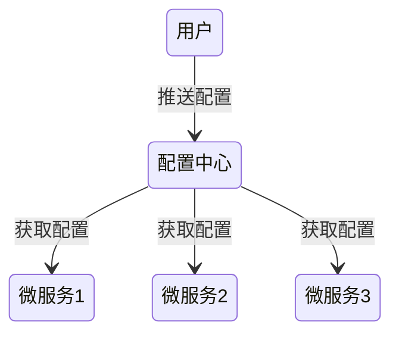
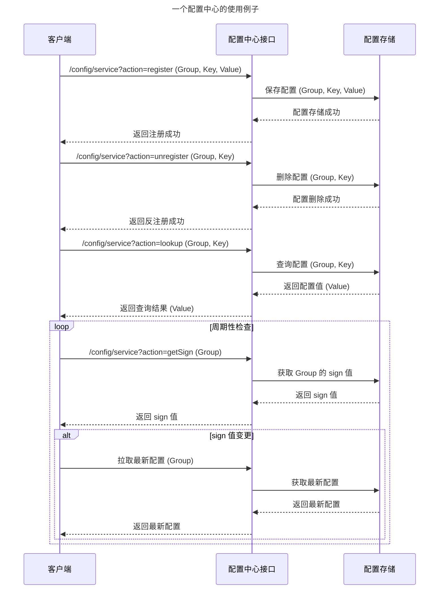

# 配置中心

> 在分布式系统中，由于服务数量巨多，为了方便服务配置文件统一管理，实时更新，所以需要分布式配置中心组件

## 配置管理场景

- 属性分发
- 动态开关
  - 金丝雀 降级 蓝绿部署

## 配置中心应该提供的功能

- 服务端与客户端支持
- 集中管理各环境的配置文件
- 修改之后可以快速生效
- 版本管理
- 并发查询
- 多语言支持

## 配置中心高可用

> 启动多个配置中心实例

- 对配置中心进行服务治理
- 配置中心本地缓存配置项

## 分布式配置中心

将配置文件信息注册到配置中心平台上，可以使用分布式配置中心实时更新配置文件信息，统一管理配置文件，不需要重新打包发布。

### 资源隔离

- 配置与业务逻辑隔离
- 服务与环境间的配置隔离

## SpringCloudConfig

在Spring Cloud中，有分布式配置中心组件spring cloud config ，它支持配置服务放在配置服务的内存中（即本地），也支持放在远程Git仓库 中。在spring cloud config 组件中，分两个角色，一是config server，二是config client

## Apollo

>Apollo（阿波罗）是携程框架部门研发的分布式配置中心，能够集中化管理应用不同环境、不同集群的配置，配置修改后能够实时推送到应用端，并且具备规范的权限、流程治理等特性，适用于微服务配置管理场景

## Nacos
