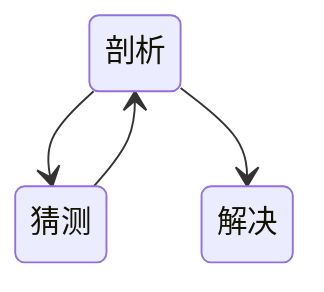

# 性能工程

> 通过分析业务逻辑和技术架构，创建性能模型，制定性能方案，准备应用环境，设计并实施性能部署监控，实现符合真实业务逻辑的压力，通过监控手段获取性能数据，分析性能数据，查找出性能瓶颈的根本原因并优化，最后通过环比生产环境的性能数据修正场景

## 性能指标

- 响应时间 某个请求从发出到接收到响应消耗的时间
- 吞吐量 系统在单位时间内可以处理的请求数量，通常使用QPS来衡量
- 并发用户数 系统能同时处理的并发用户请求数量
- 扩展性
- 资源使用效率
- ...

基准场景下的性能需求指标：

业务名称 | TPS | TPS方差 | 响应时间  | 响应时间方差 | 90%   | 95%   | 99%   | 成功率
---- | --- | ----- | ----- | ------ | ----- | ----- | ----- | ----
业务1  | 500 | 5%    | 100ms | 5%     | 150ms | 300ms | 500ms | 100%

对于性能来说，当平均值是一个比较优秀的值时，有可能会出现非常抖动的情况,标准方差是为了描述一条曲线的上下浮动范围有多大,而响应时间百分比是为了描述一条曲线的上下浮动范围有多大

容量场景下的性能需求指标：最重要的就是业务比例

业务名称|比例 | TPS | TPS方差 | 响应时间  | 响应时间方差 | 90%   | 95%   | 99%   | 成功率
---- | -|--- | ----- | ----- | ------ | ----- | ----- | ----- | ----
业务1  |50%| 500 | 5%    | 100ms | 5%     | 150ms | 300ms | 500ms | 100%

稳定性场景下的性能需求指标：要合理判断稳定性场景需要运行多长时间，同时也要合理判断稳定性场景应该用多大的压力执行

异常场景下的性能需求指标：针对系统的架构，先分析异常场景中的需求点，再设计相应的案例来覆盖

## 定律与数理基础

- 二八定律
- 阿姆达尔定律：优先加速占用时间最多的模块，性能优化的计划可以做出准确的效果预估和整个系统的性能预测
- 科特尔法则：长期的平均客户人数（N）等于客户抵达速度（X）乘以客户在这个系统中平均处理时间
- [概率论与数理统计](/通识/数学/概率论与数理统计.md)

### 点估计指标

- 平均值：容易受极端值影响
- 中位数：如果数据呈现一些特殊的分布，比如二向分布，中位数的表达会受很大的负面影响
- 四分位数：把所有数值由小到大排列，并分成四等份，处于三个分割点位置的数值就是四分位数
- 百分位数：以 Pk 表示第 k 个百分位数，不容易受极端值影响
- 方差/标准差：变量的离散程度，也就是该变量离其期望值的距离

### 分布模型

- 泊松分布：适合于描述单位时间内随机事件发生的次数的概率分布
- 二项分布：n 个独立的是 / 非试验中成功的次数的离散概率分布
- 正态分布：大多数我们碰到的未知数据都呈正态分布状

### 排队论

## 性能数据分析

目的：正不正常、趋势预测、问题排查

- 线性回归分析：通过拟合自变量与因变量之间最佳线性关系，来预测目标变量
- 分类
- 聚类
- 决策树

分析需要注意的：

1. 数据分析可以证实数据的相关性，但是还需要其他知识才能更准确地判断谁是因、谁是果
2. 数据的大小与趋势解读与业务强相关
3. 垃圾数据进垃圾数据出
4. 理解各个性能指标的关系

## 性能数据展示

难点：数据量大、数据复杂、背后问题复杂、牵扯模块多

在展示时，以不同视图体现不同重点，给足上下文信息

1. 表格：理解各个性能指标的关系
2. 线图：显示一段时间内这个变量的变化或趋势
3. PDF图、CDF图：一个变量的概率数据，较为特殊的线图
4. 面积图
5. 柱状图：用于比较不同类别的数量
6. 散点图：用于展示数据的分布情况
7. 饼图：需要显示比例数据或者百分比时
8. 树形图：对于显示类别和子类别之间的层次结构和比较值非常有用
9. 热力图：使用颜色反映数据的重要情况

## 性能分析

### 方法论

1. 从压力场景中获取 TPS 和响应时间曲线
2. 分析架构，看压力流量的路径
3. 分析各个链路节点，拆分响应时间，分析主要瓶颈
4. 全局监控所需要的性能数据
5. 定向监控分析：通过全局监控判断分析，知道哪个方向上有问题后，再去做定向的监控，辅助全局数据，得到性能问题的证据链
6. 根据证据链判断性能瓶颈点
7. 根据具体问题确定解决方案

## 性能优化

### 原则

- 优先从最大的性能瓶颈入手
- 确诊性能问题的根因，虑优化工作的投入产出比
- 考虑各种情况下的性能，不同的选择有不同的trade off，确定你要的性能指标

过早优化是万恶之源、不要进行头痛医头的表层优化，没有理解底层运行机制，任何优化方案都很难达到最好的优化效果

### 策略

- 时空权衡
- 预先和延后处理：preload、prefetch、写时复制
- 并行与异步
- 缓存/批量写
- 更合适的算法和数据结构
