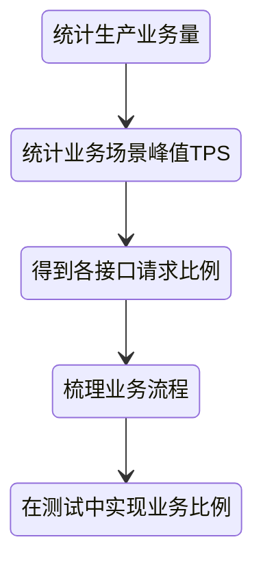
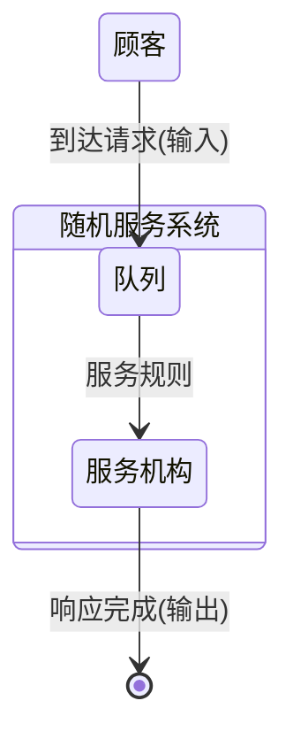
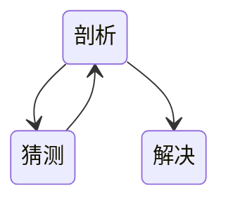

# 性能工程

> 性能工程是贯穿软件系统全生命周期的持续性工程活动，通过性能建模、测试、监控等手段，系统性发现与消除性能瓶颈，确保系统在目标负载下满足响应速度与吞吐量要求。

## 第一性原理

| 原理 | 内涵 |
|---|---|
| **资源约束原理** | 性能问题的本质是资源供需矛盾——CPU、内存、I/O、网络等资源在单位时间内提供的供给，永远小于或勉强等于需求 |
| **响应时间约束** | 用户对延迟的容忍存在生理上限 |
| **木桶原理** | 系统整体性能由最薄弱环节决定，先找短板，再优化 |
| **拐点原理** | 性能与负载的关系是非线性的——在临界点之前性能稳定增长，临界点之后急剧劣化 |

### 第一性推导

1. **性能是被设计出来的，不是被测试出来的** — 设计阶段就决定了是否能避免性能问题，而非上线后救火
2. **性能优化有明确的边界：瓶颈在哪里，优化就在哪里** — 测不准瓶颈，优化就是盲目的
3. **性能指标必须可度量，否则不可优化** — RT、吞吐量、资源利用率必须转化为可量化的目标
4. **性能是持续治理，不是一次性项目** — 业务演进、架构变化，性能问题会不断涌现

### 性能工程闭环

```
需求定义 → 建模分析 → 设计验证 → 测试度量 → 监控优化
    ↑                                          ↓
    └──────────────────────────────────────────┘
                    持续迭代
```

## 性能工程方法论

### 核心方法论框架

性能工程有三套互补的方法论，分别对应规划、定位、容量三个核心问题：

| 方法论 | 回答的问题 | 核心洞察 |
|--------|-----------|---------|
| **SEI六区域** | 如何规划一次完整的性能测试？ | 测试计划必须覆盖目标、用户、用例、环境、场景六个维度，缺一则失真 |
| **RBI瓶颈识别** | 如何快速定位性能瓶颈？ | 80%的瓶颈源于吞吐量受限，而非并发；瓶颈定位应从资源层入手，先排除硬件/网络问题，再深入代码层排查。 |
| **性能下降曲线** | 如何确定系统的容量边界？ | 性能随负载非线性变化，存在拐点；容量规划的本质是找到这个拐点并预留安全边界 |

**三者的关系**：SEI告诉"测什么"，RBI告诉"问题在哪"，性能曲线告诉"能承受多少"。三者顺序执行，构成完整的测试规划→执行→验收闭环。

### 两条关键原则

**原则一：性能问题本质上是资源供需匹配问题。** 无论系统多复杂，性能瓶颈的本质只有两种：供给不足（资源耗尽）或调度低效（资源未能充分利用）。
USE方法（利用率/饱和度/错误）正是这套原则的操作化表达：先看资源是否被充分使用（利用率），再看是否有任务在排队等待（饱和度），最后检查错误是否放大问题（错误）。
这套框架适用于CPU、内存、网络、磁盘、线程池、连接池一切资源。

**原则二：性能测试的核心是建模，而非测速。** 性能测试的本质不是用工具向系统施压，而是建立真实负载与系统响应的映射模型。测速只告诉"系统在X压力下挂了"，建模告诉"系统为什么在X压力下挂，以及如何预测Y压力下的表现"。

### 业务模型设计

核心目标：**以真实业务比例、调用链、负载特征为依据还原生产行为。**

#### 构建步骤


```mermaid
stateDiagram-v2
  统计生产业务量 --> 统计业务场景峰值TPS
  统计业务场景峰值TPS --> 得到各接口请求比例
  得到各接口请求比例 --> 梳理业务流程
  梳理业务流程 --> 在测试中实现业务比例
```

#### 建模原则

1. **以日志数据为依据**，从真实生产访问日志中抽取；
2. **以业务流程为驱动**，保持链路依赖一致；
3. **考虑时间分布特性**（如高峰/低谷周期性特征）；
4. **模拟外部系统依赖**，保持响应行为一致。

### 瓶颈定位的模式

RBI方法的核心是：**性能瓶颈定位应从确定问题的性质开始，而不是从检查代码开始。**

```
第一步：确定是"并发限制"还是"吞吐量限制"
    ↓
第二步：根据性质选择分析路径
    ↓
第三步：自上而下逐层检查（网络→硬件→数据库→应用→代码）
```

大量性能问题的根源在架构层（网络带宽、负载均衡、数据库连接池），而非代码层。先确定性质，可以节省大量无效排查。

### 容量管理的模式

性能下降曲线揭示了一个非线性规律：系统性能并非随负载线性下降，而是在某个临界点突然恶化。这决定了容量管理的核心模式：

**容量规划不是线性外推，而是拐点管理。**

实践中：扩容决策应以拐点为参照，安全边际 = 拐点容量 × 安全系数，监控的核心目标是提前发现是否逼近拐点，而非等待系统报警。

完整的容量治理闭环见 [容量保障](/软件工程/容量保障.md)。

### 反模式

#### 认知偏差

**把平均值当正常**：性能数据分布高度不对称，大量请求在10ms完成，少量请求耗时500ms+。平均值掩盖长尾，P99才是用户真实感知的"最坏情况"。

**把相关性当因果性**：两指标同时变化不代表因果。A指标和B指标同时上升，可能源于第三方因素如业务流量增加。定位瓶颈必须找到因果链，而非共变关系。

#### 测试实践

**测试环境与生产脱节**：测试环境的硬件、数据量级、网络拓扑与生产差异显著，导致测试结果无法预测生产表现。

**把测试当优化**：测试只能发现问题，不能解决问题。只测不优化是最常见的资源浪费。

#### 分析方法

**跳过瓶颈定位直接优化**：发现性能问题后直接从代码层寻找方案，忽略架构层问题。大量时间浪费在次要路径。

**忽略系统性视角**：只关注单组件指标，忽略组件间依赖和级联效应。数据库CPU低不代表无瓶颈，可能是连接池耗尽的外化。

#### 设计决策

**过早优化**：缺乏数据支撑下优化非热点代码。优化有成本，未在瓶颈路径上的优化是浪费。

**过度工程**：引入与性能收益不匹配的复杂性。如为日活1000系统设计微服务架构。

#### 核心偏差分类

| 类型 | 本质 | 后果 |
|------|------|------|
| **认知偏差** | 对数据含义的误解 | 用错误指标指导决策 |
| **实践偏差** | 测试过程不规范 | 结果无法反映真实状况 |
| **方法偏差** | 分析路径错误 | 治标不治本 |

**防范原则**：质疑假设、验证前提、追踪因果。

### 方法论选择决策树

| 场景 | 推荐方法论 |
|------|-----------|
| 性能测试规划阶段 | SEI六区域 |
| 性能问题定位阶段 | RBI + USE |
| 容量规划决策阶段 | 性能下降曲线 |
| 服务监控阶段 | RED + USE |

## 性能分析理论与数理基础

性能分析理论与数理基础为性能优化提供量化分析框架，将经验判断转化为可预测、可推导的系统性方法

### 经典法则

| 定律                       | 说明                                    |
| ------------------------ | ------------------------------------- |
| **二八定律**                 | 80% 的性能问题来源于 20% 的热点代码或场景             |
| **阿姆达尔定律** | 优先优化耗时最长的部分，整体性能提升最明显                 |
| **Little定律**  | L = λ × W，用于分析系统中平均请求数、到达速率和响应时间之间的关系 |

### 点估计指标

* **平均值（Mean）**：易受极值影响；
* **中位数（Median）**：对非对称分布稳定；
* **四分位数/百分位数**：描述数据分布形态；
* **方差/标准差**：描述波动性。

### 常见分布模型

| 分布类型     | 应用场景           |
| -------- | -------------- |
| **泊松分布** | 单位时间内随机事件的发生次数 |
| **二项分布** | 成功/失败试验的统计     |
| **正态分布** | 大多数性能采样数据的自然形态 |

### 排队论模型


```mermaid
stateDiagram-v2
  state 随机服务系统 {
    队列 --> 服务机构: 服务规则
  }
  顾客 --> 队列: 到达请求(输入)
  服务机构 --> [*]: 响应完成(输出)
```

应用场景：分析线程池、连接池、消息队列的等待与吞吐极限。

## 性能指标体系

性能指标反映了系统在不同负载下的可用性、可伸缩性和资源利用效率。常见核心指标如下：

| 指标                       | 含义                   | 说明          |
| ------------------------ | -------------------- | ----------- |
| RT（Response Time）响应时间    | 请求发出到收到响应的耗时         | 反映用户体验的直接指标 |
| TPS / QPS（Throughput）吞吐量 | 单位时间内系统处理的请求数        | 衡量系统整体处理能力  |
| 并发用户数                    | 系统可同时处理的用户请求数        | 衡量系统的并发承载能力 |
| 成功率 / 错误率                | 成功响应与错误响应的比例         | 用于衡量稳定性     |
| 资源利用率                    | CPU、内存、I/O、网络等资源使用效率 | 衡量系统负载均衡性   |
| 扩展性（Scalability）         | 随资源增加性能提升的能力         | 衡量架构弹性      |

> **RT 与吞吐量**成反比关系：当响应时间下降时，系统吞吐量通常会上升。

### 基准性能指标

在稳定、无干扰的环境下测得的单业务性能基线，基准性能指标为性能变化提供可度量的参照，使优化效果可对比、异常可检测、容量可推演：

| 业务名称 | TPS | TPS方差 | 响应时间  | 响应时间方差 | P90   | P95   | P99   | 成功率  |
| ---- | --- | ----- | ----- | ------ | ----- | ----- | ----- | ---- |
| 业务1  | 500 | 5%    | 100ms | 5%     | 150ms | 300ms | 500ms | 100% |

说明：

* **方差**描述系统抖动性，反映性能稳定度；
* **百分位指标**（P90/P95/P99）能更好地刻画长尾响应情况；
* **平均值不可靠**，应结合分布统计分析。

### 容量场景指标

用于模拟整体业务混合场景，强调比例关系，用以在真实业务混合比例下的最大承载能力，是容量规划的核心依据：

| 业务名称 | 比例  | TPS | TPS方差 | 响应时间  | 响应时间方差 | P90   | P95   | P99   | 成功率  |
| ---- | --- | --- | ----- | ----- | ------ | ----- | ----- | ----- | ---- |
| 业务1  | 50% | 500 | 5%    | 100ms | 5%     | 150ms | 300ms | 500ms | 100% |

> 容量测试的核心目标：**找出系统在稳定状态下可支撑的最大负载点**。

### 稳定性与异常场景指标

* **稳定性场景**：长时间运行，验证系统在持续负载下的资源消耗与内存泄漏情况；
* **异常场景**：模拟网络波动、节点宕机、磁盘满等异常条件下的恢复能力。

## 测试数据准备

测试数据是性能测试的"输入"，输入不真实，输出就失真

### 系统铺底数据

* 数量级与生产一致；
* 结构与数据分布符合实际；
* 确保测试前系统处于"正常运行状态"。

### 参数化数据

* 足够数量以避免重复；
* 模拟真实业务分布；
* 覆盖典型请求参数组合；
* 与监控系统打通以追踪请求链路。

## 性能数据分析与可视化

### 分析目标

* **判断性能是否正常**
* **预测趋势与拐点**
* **定位瓶颈并验证假设**

### 常用分析方法

* 线性回归（预测性能趋势）
* 聚类分析（识别异常模式）
* 决策树（推断影响因子）
* 时间序列分析（波动与周期性）

> **注意事项**
>
> 1. 数据分析只能证明相关性，不能直接证明因果性。
> 2. 性能数据解读必须结合业务上下文。
> 3. 保证数据采集质量，避免"垃圾进垃圾出"。
> 4. 理解各性能指标的逻辑关系（如 TPS、RT、并发数、CPU 使用率）。

### 可视化展示

见：[性能数据可视化](/软件工程/架构/Web前端/可视化.md#可视化)
应按层次展示：

* **系统层视图**：CPU、内存、I/O、网络；
* **服务层视图**：接口响应、QPS、错误率；
* **业务层视图**：交易量、延迟分布；
* **链路追踪视图**：请求路径与时间分布。

## 性能分析与调优方法论


```mermaid
stateDiagram-v2
  剖析 --> 猜测
  猜测 --> 剖析
  剖析 --> 解决
```


### 调优闭环

1. 获取压力曲线（TPS & RT）
2. 分析系统架构与链路路径
3. 分解响应时间，确定瓶颈点
4. 通过全局监控确认问题方向
5. 进行定向监控与证据链分析
6. 确定根因与优化方案
7. 验证优化效果并更新基线

> 优化顺序：**算法优化 → 缓存优化 → 并发模型优化 → 架构重构 → 资源扩展**

## 性能工程的持续演进

现代性能工程不应只在测试阶段出现，性能问题越早暴露越容易解决，所以应贯穿系统全生命周期：

| 阶段   | 性能工程活动          |
| ---- | --------------- |
| 需求阶段 | 定义性能目标与 SLA     |
| 设计阶段 | 架构容量规划、性能建模     |
| 开发阶段 | 代码级性能审查、单元压测    |
| 测试阶段 | 场景构建、全链路压测      |
| 运维阶段 | 性能监控、容量管理、预测性伸缩 |

> 性能工程的最终目标是：**让性能问题提前暴露、可度量、可追踪、可优化。**

## 关联内容（自动生成）

- [/软件工程/性能工程/性能优化.md](/软件工程/性能工程/性能优化.md) 性能优化是性能工程的重要组成部分，提供了具体的性能调优方法论和实践指导
- [/软件工程/软件设计/代码质量/软件测试/性能测试.md](/软件工程/软件设计/代码质量/软件测试/性能测试.md) 性能测试是性能工程的重要手段，用于验证系统在压力下的表现和性能边界
- [/软件工程/软件设计/代码质量/软件测试/全链路压测.md](/软件工程/软件设计/代码质量/软件测试/全链路压测.md) 全链路压测是性能工程在系统极限验证层面的核心方法
- [/软件工程/容量保障.md](/软件工程/容量保障.md) 容量保障与性能工程密切相关，涉及系统性能的测量、分析和优化
- [/软件工程/架构/系统设计/可观测性.md](/软件工程/架构/系统设计/可观测性.md) 可观测性体系与性能工程密切相关，通过监控、日志、追踪实现性能全面观测
- [/软件工程/架构/系统设计/高并发.md](/软件工程/架构/系统设计/高并发.md) 高并发系统设计与性能工程紧密相关
- [/软件工程/架构/系统设计/流量控制.md](/软件工程/架构/系统设计/流量控制.md) 流量控制与性能工程相关，流量控制策略影响系统性能
- [/软件工程/架构/系统设计/缓存.md](/软件工程/架构/系统设计/缓存.md) 缓存是性能优化的重要手段，性能工程验证缓存策略有效性
- [/软件工程/架构/系统设计/伸缩性.md](/软件工程/架构/系统设计/伸缩性.md) 性能与伸缩性密切相关，性能指标是衡量系统伸缩能力的重要标准
- [/软件工程/架构/系统设计/分布式/分布式系统.md](/软件工程/架构/系统设计/分布式/分布式系统.md) 分布式系统中的性能工程面临更多挑战
- [/中间件/数据库/数据库优化.md](/中间件/数据库/数据库优化.md) 数据库性能优化是性能工程的重要组成部分
- [/运维/SRE.md](/运维/SRE.md) SRE 的 SLI/SLO/错误预算体系是性能目标的量化框架