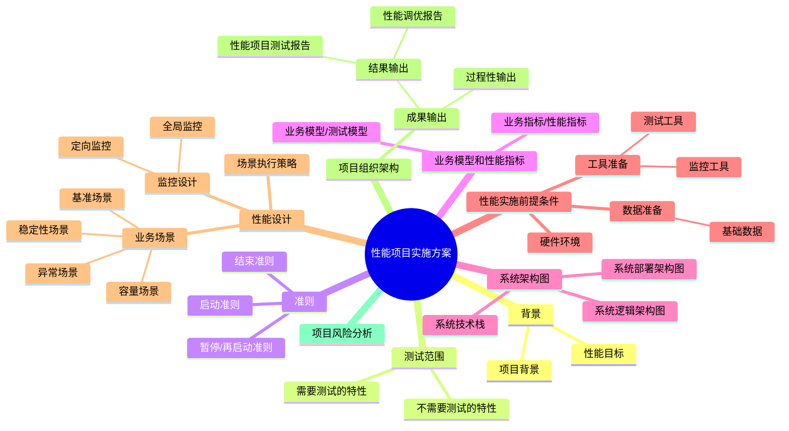
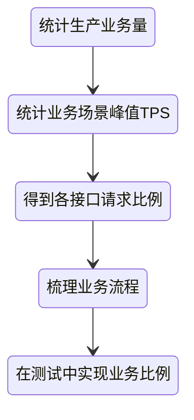
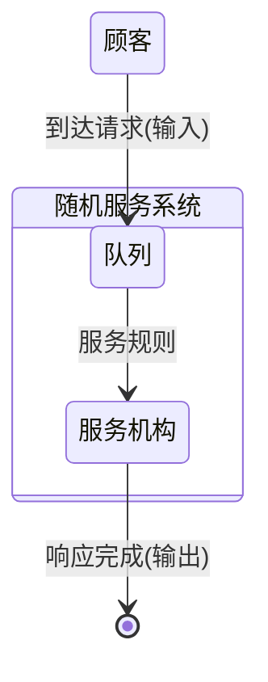

# 性能工程

> 性能工程（Performance Engineering）是贯穿软件系统生命周期的系统性工程活动。通过分析业务逻辑与技术架构，创建性能模型、制定性能方案、准备应用环境、设计与实施性能测试和监控，最终发现并优化性能瓶颈，确保系统在真实业务场景下具备足够的响应速度、处理能力与可扩展性。

---

## 一、性能指标体系

性能指标反映了系统在不同负载下的可用性、可伸缩性和资源利用效率。常见核心指标如下：

| 指标                       | 含义                   | 说明          |
| ------------------------ | -------------------- | ----------- |
| RT（Response Time）响应时间    | 请求发出到收到响应的耗时         | 反映用户体验的直接指标 |
| TPS / QPS（Throughput）吞吐量 | 单位时间内系统处理的请求数        | 衡量系统整体处理能力  |
| 并发用户数                    | 系统可同时处理的用户请求数        | 衡量系统的并发承载能力 |
| 成功率 / 错误率                | 成功响应与错误响应的比例         | 用于衡量稳定性     |
| 资源利用率                    | CPU、内存、I/O、网络等资源使用效率 | 衡量系统负载均衡性   |
| 扩展性（Scalability）         | 随资源增加性能提升的能力         | 衡量架构弹性      |

> **RT 与吞吐量**成反比关系：当响应时间下降时，系统吞吐量通常会上升。

---

### 1.1 基准性能指标（Benchmark）

在稳定、无干扰的环境下测得的单业务性能基线：

| 业务名称 | TPS | TPS方差 | 响应时间  | 响应时间方差 | P90   | P95   | P99   | 成功率  |
| ---- | --- | ----- | ----- | ------ | ----- | ----- | ----- | ---- |
| 业务1  | 500 | 5%    | 100ms | 5%     | 150ms | 300ms | 500ms | 100% |

说明：

* **方差**描述系统抖动性，反映性能稳定度；
* **百分位指标**（P90/P95/P99）能更好地刻画长尾响应情况；
* **平均值不可靠**，应结合分布统计分析。

---

### 1.2 容量场景指标（Capacity）

用于模拟整体业务混合场景，强调比例关系：

| 业务名称 | 比例  | TPS | TPS方差 | 响应时间  | 响应时间方差 | P90   | P95   | P99   | 成功率  |
| ---- | --- | --- | ----- | ----- | ------ | ----- | ----- | ----- | ---- |
| 业务1  | 50% | 500 | 5%    | 100ms | 5%     | 150ms | 300ms | 500ms | 100% |

> 容量测试的核心目标：**找出系统在稳定状态下可支撑的最大负载点**。

---

### 1.3 稳定性与异常场景指标

* **稳定性场景**：长时间运行，验证系统在持续负载下的资源消耗与内存泄漏情况；
* **异常场景**：模拟网络波动、节点宕机、磁盘满等异常条件下的恢复能力。

---

## 二、性能方案

性能方案是整个性能工程的“蓝图”，用于指导从准备到执行再到报告的全过程。

---

## 三、业务模型设计

性能测试的有效性取决于业务模型的真实性。
核心目标：**以真实业务比例、调用链、负载特征为依据还原生产行为。**

### 构建步骤

### 建模原则

1. **以日志数据为依据**，从真实生产访问日志中抽取；
2. **以业务流程为驱动**，保持链路依赖一致；
3. **考虑时间分布特性**（如高峰/低谷周期性特征）；
4. **模拟外部系统依赖**，保持响应行为一致。

---

## 四、性能分析理论与数理基础

### 4.1 经典定律

| 定律                       | 说明                                    |
| ------------------------ | ------------------------------------- |
| **二八定律**                 | 80% 的性能问题来源于 20% 的热点代码或场景             |
| **阿姆达尔定律（Amdahl’s Law）** | 优先优化耗时最长的部分，整体性能提升最明显                 |
| **科特尔法则（Little’s Law）**  | N = X × T，用于分析系统中平均请求数、到达速率和响应时间之间的关系 |

### 4.2 点估计指标

* **平均值（Mean）**：易受极值影响；
* **中位数（Median）**：对非对称分布稳定；
* **四分位数/百分位数**：描述数据分布形态；
* **方差/标准差**：描述波动性。

### 4.3 常见分布模型

| 分布类型     | 应用场景           |
| -------- | -------------- |
| **泊松分布** | 单位时间内随机事件的发生次数 |
| **二项分布** | 成功/失败试验的统计     |
| **正态分布** | 大多数性能采样数据的自然形态 |

### 4.4 排队论模型

应用场景：分析线程池、连接池、消息队列的等待与吞吐极限。

---

## 五、测试数据准备

### 5.1 系统铺底数据（基础数据）

* 数量级与生产一致；
* 结构与数据分布符合实际；
* 确保测试前系统处于“正常运行状态”。

### 5.2 参数化数据（动态请求数据）

* 足够数量以避免重复；
* 模拟真实业务分布；
* 覆盖典型请求参数组合；
* 与监控系统打通以追踪请求链路。

---

## 六、性能数据分析与可视化

### 分析目标

* **判断性能是否正常**
* **预测趋势与拐点**
* **定位瓶颈并验证假设**

### 常用分析方法

* 线性回归（预测性能趋势）
* 聚类分析（识别异常模式）
* 决策树（推断影响因子）
* 时间序列分析（波动与周期性）

> ⚠️ **注意事项**
>
> 1. 数据分析只能证明相关性，不能直接证明因果性。
> 2. 性能数据解读必须结合业务上下文。
> 3. 保证数据采集质量，避免“垃圾进垃圾出”。
> 4. 理解各性能指标的逻辑关系（如 TPS、RT、并发数、CPU 使用率）。

### 可视化展示

见：[性能数据可视化](/软件工程/架构/Web前端/可视化.md#可视化)
应按层次展示：

* **系统层视图**：CPU、内存、I/O、网络；
* **服务层视图**：接口响应、QPS、错误率；
* **业务层视图**：交易量、延迟分布；
* **链路追踪视图**：请求路径与时间分布。

---

## 七、性能分析与调优方法论

### 调优闭环

1. 获取压力曲线（TPS & RT）
2. 分析系统架构与链路路径
3. 分解响应时间，确定瓶颈点
4. 通过全局监控确认问题方向
5. 进行定向监控与证据链分析
6. 确定根因与优化方案
7. 验证优化效果并更新基线

> 优化顺序：**算法优化 → 缓存优化 → 并发模型优化 → 架构重构 → 资源扩展**

---

## 八、性能工程的持续演进

现代性能工程不应只在测试阶段出现，而应贯穿系统全生命周期：

| 阶段   | 性能工程活动          |
| ---- | --------------- |
| 需求阶段 | 定义性能目标与 SLA     |
| 设计阶段 | 架构容量规划、性能建模     |
| 开发阶段 | 代码级性能审查、单元压测    |
| 测试阶段 | 场景构建、全链路压测      |
| 运维阶段 | 性能监控、容量管理、预测性伸缩 |

> 性能工程的最终目标是：**让性能问题提前暴露、可度量、可追踪、可优化。**

## 关联内容（自动生成）

- [/软件工程/性能工程/性能优化.md](/软件工程/性能工程/性能优化.md) 性能优化是性能工程的重要组成部分，提供了具体的性能调优方法论和实践指导
- [/软件工程/软件设计/代码质量/软件测试/性能测试.md](/软件工程/软件设计/代码质量/软件测试/性能测试.md) 性能测试是性能工程的重要手段，用于验证系统在压力下的表现和性能边界
- [/计算机系统/程序结构和执行/优化程序性能.md](/计算机系统/程序结构和执行/优化程序性能.md) 程序性能优化从底层系统角度分析性能优化原理，与性能工程的系统性方法论相互补充
- [/操作系统/linux/Linux性能优化.md](/操作系统/linux/Linux性能优化.md) 系统层面的性能优化与性能工程在性能分析方法和优化思想上相通，提供了系统级性能调优视角
- [/编程语言/JAVA/JVM/自动内存管理/调优.md](/编程语言/JAVA/JVM/自动内存管理/调优.md) JVM性能调优是性能工程在运行时环境的具体实践，与性能建模、调优流程等方法论相互补充
- [/中间件/浏览器/前端性能优化.md](/中间件/浏览器/前端性能优化.md) 前端性能优化是性能工程在特定领域的实践，与系统性性能优化方法论在架构设计和度量体系方面相关
- [/中间件/数据库/数据库优化.md](/中间件/数据库/数据库优化.md) 数据库性能优化是性能工程的重要组成部分，涉及查询优化、索引优化等具体实践
- [/软件工程/架构/系统设计/可观测性.md](/软件工程/架构/系统设计/可观测性.md) 可观测性体系与性能工程密切相关，通过监控、日志、追踪等手段实现对系统性能的全面观测
- [/软件工程/架构/系统设计/高并发.md](/软件工程/架构/系统设计/高并发.md) 高并发系统设计与性能工程紧密相关，性能是高并发系统的重要指标和设计考量
- [/软件工程/架构/系统设计/流量控制.md](/软件工程/架构/系统设计/流量控制.md) 流量控制与性能工程相关，性能测试可验证系统在不同流量下的表现，流量控制策略影响系统性能
- [/软件工程/架构/系统设计/缓存.md](/软件工程/架构/系统设计/缓存.md) 缓存是性能优化的重要手段，性能工程通过测试验证缓存策略的有效性
- [/软件工程/容量保障.md](/软件工程/容量保障.md) 容量保障与性能工程密切相关，涉及系统性能的测量、分析和优化，是容量规划和治理的重要基础
- [/软件工程/架构/系统设计/前端监控.md](/软件工程/架构/系统设计/前端监控.md) 前端监控涵盖了客户端的性能指标，与性能工程的指标体系建设和性能分析密切相关
- [/软件工程/DevOps.md](/软件工程/DevOps.md) DevOps与性能工程的持续监控和优化理念相辅相成，将性能工程融入持续交付流程
- [/软件工程/研发效能.md](/软件工程/研发效能.md) 性能工程与研发效能紧密相连，关注系统性能对整体研发效率的影响
- [/软件工程/质量工程.md](/软件工程/质量工程.md) 性能是软件质量的重要属性之一，性能工程是质量工程的重要组成部分
- [/软件工程/架构/系统设计/网关.md](/软件工程/架构/系统设计/网关.md) 网关作为系统入口，在性能工程中承担着流量控制、性能监控等重要作用
- [/软件工程/架构/系统设计/伸缩性.md](/软件工程/架构/系统设计/伸缩性.md) 性能与伸缩性密切相关，性能指标是衡量系统伸缩能力的重要标准
- [/软件工程/架构/系统设计/混沌工程.md](/软件工程/架构/系统设计/混沌工程.md) 混沌工程通过引入扰动验证系统韧性，与性能工程的压力测试和稳定性验证相辅相成
- [/软件工程/架构/系统设计/分布式/分布式系统.md](/软件工程/架构/系统设计/分布式/分布式系统.md) 分布式系统中的性能工程面临更多挑战，如分布式追踪、跨节点性能分析等

