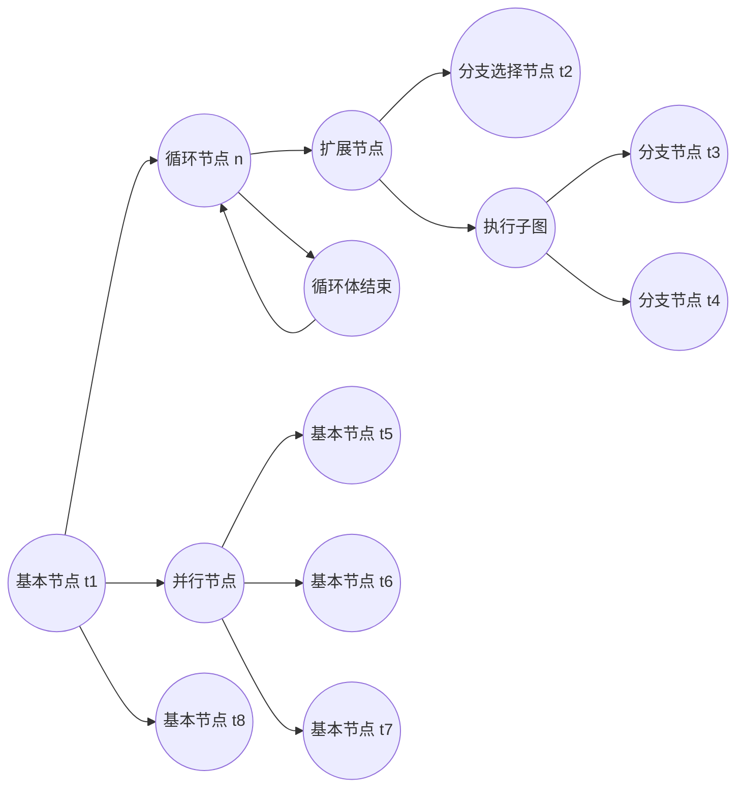
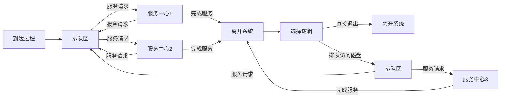
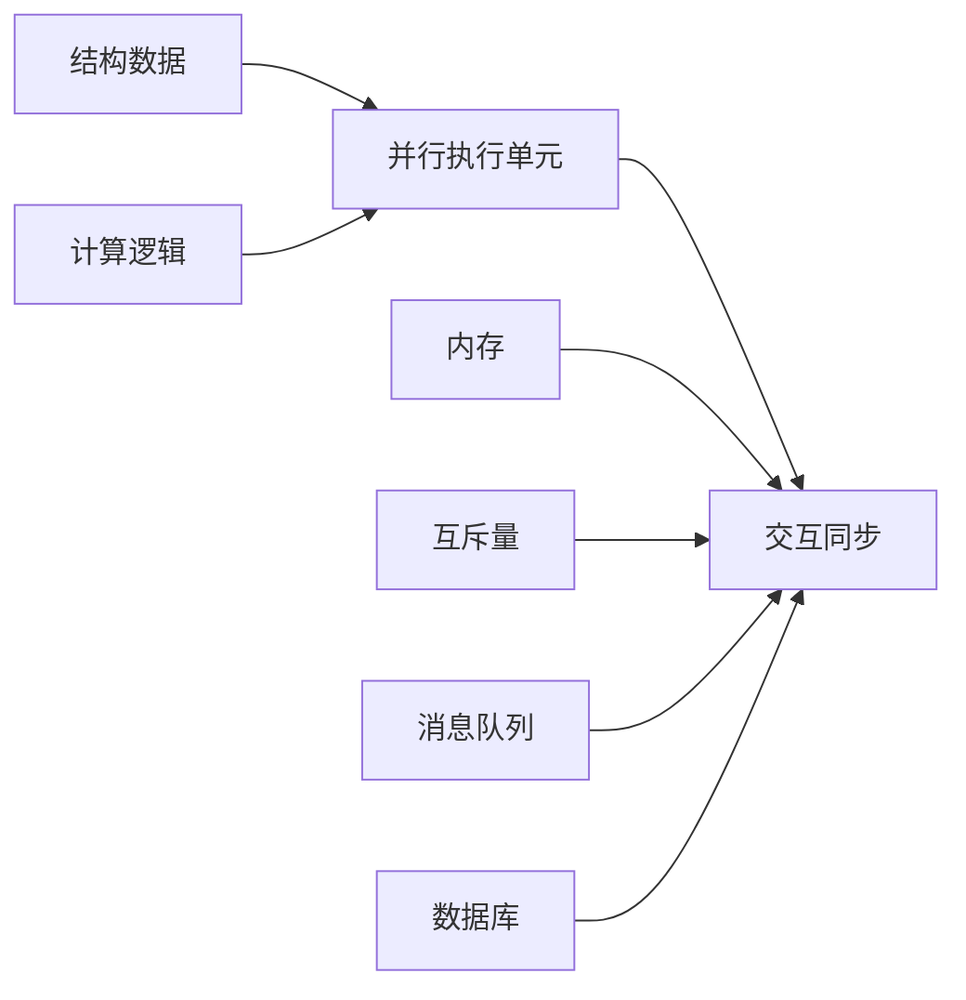

# 性能优化

## 性能建模

在软件设计阶段做好性能的评估分析，通过一定的方法提前识别出软件设计中潜在的性能瓶颈，并指导优化设计

软件执行模型：

基于 QNM 模型的系统执行模型：

## 并行计算

并行执行单元的粒度可大可小，像函数、routine（协程）、actor、线程、进程、作业等。根据处理的特定领域问题，选择合适的并行执行单元粒度，并选择或定制实现相应的并发调度框架

### 并行架构模式

触发的业务计算逻辑之间相互独立时，我们就可以通过创建多个并行执行单元，分别处理拆分后的不同子问题，并根据不同单元业务工作量的大小，建立与具体硬件线程的映射绑定关系

针对不能在系统运⾏前完成任务的拆分，而是需要动态创建任务，并借助任务队列来管理执⾏任务。这里的执⾏线程可以从队列中拉取任务，映射到硬件线程上执⾏

相同计算逻辑需要在不同的数据上进⾏运算

针对在遍历的过程中动态创建任务，然后对每个中间计算单元的运算结果逐步合并，计算得到最终的结果

⼀个计算单元的输出刚好是另外⼀个计算单元的输⼊，并且消息交互是单向确定性的；业务场景中还会源源不断接收到新的输⼊，需要使⽤相似的计算策略进行处理，设计的核⼼就是如何⾼效实现并发计算单元间的信息交互

同⼀个任务需要与多个任务进⾏消息交互；同⼀个消息需要多个任务进⾏处理。
