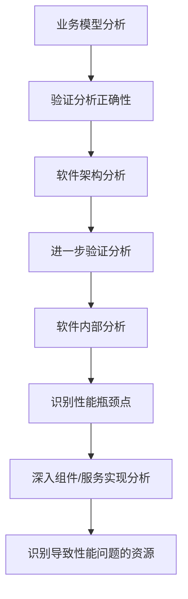
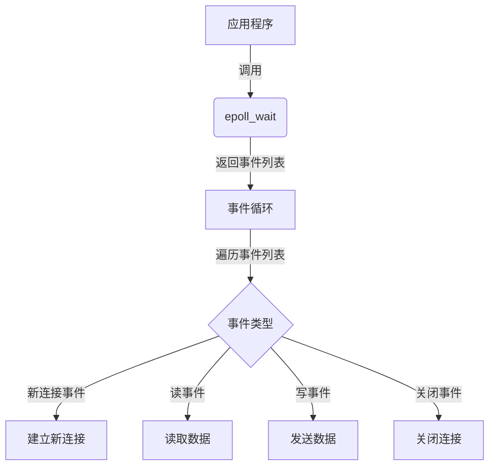
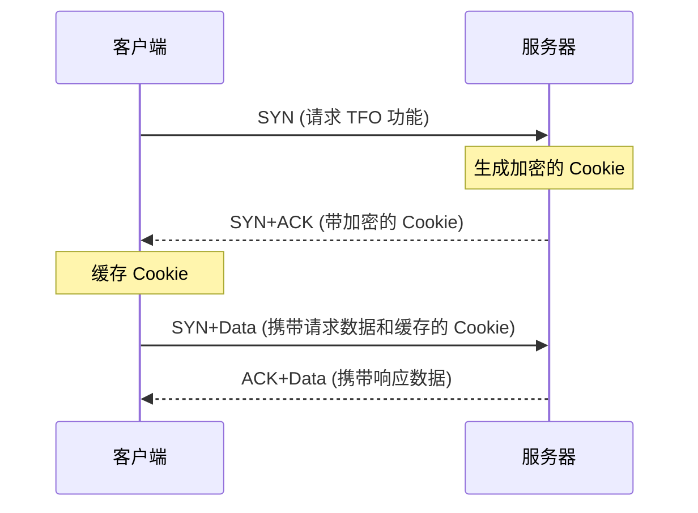

# 性能优化

## 性能建模

在软件设计阶段做好性能的评估分析，通过一定的方法提前识别出软件设计中潜在的性能瓶颈，并指导优化设计

软件执行模型：

基于 QNM 模型的系统执行模型：

## 并行计算

并行执行单元的粒度可大可小，像函数、routine（协程）、actor、线程、进程、作业等。根据处理的特定领域问题，选择合适的并行执行单元粒度，并选择或定制实现相应的并发调度框架

### 并行架构模式

触发的业务计算逻辑之间相互独立时，我们就可以通过创建多个并行执行单元，分别处理拆分后的不同子问题，并根据不同单元业务工作量的大小，建立与具体硬件线程的映射绑定关系

针对不能在系统运⾏前完成任务的拆分，而是需要动态创建任务，并借助任务队列来管理执⾏任务。这里的执⾏线程可以从队列中拉取任务，映射到硬件线程上执⾏

相同计算逻辑需要在不同的数据上进⾏运算

针对在遍历的过程中动态创建任务，然后对每个中间计算单元的运算结果逐步合并，计算得到最终的结果

⼀个计算单元的输出刚好是另外⼀个计算单元的输⼊，并且消息交互是单向确定性的；业务场景中还会源源不断接收到新的输⼊，需要使⽤相似的计算策略进行处理，设计的核⼼就是如何⾼效实现并发计算单元间的信息交互

同⼀个任务需要与多个任务进⾏消息交互；同⼀个消息需要多个任务进⾏处理。

## 性能模式

找到系统中频繁使用的典型场景，然后针对性地提供定制化方案来优化性能

这种模式会降低可靠性，处理失败时所造成的影响通常也会比较大，如果突然断电，会造成阶段计算结果丢失

针对资源拥塞的情况下，处理时延会增加，通过离散化业务的请求时间，从而避免系统中的单个软件服务和硬件服务出现拥塞的情况

通过空间换时间，将计算逻辑提前到编译期执行，来减少运行期的时间开销

做一件事情的时候，顺带把其他事情一并处理掉，就像一个接口返回多个业务场景需要的信息

把计算逻辑从关键路径搬移到非关键路径，从而降低实时处理侧的时延

把优先级比较低的代码块放到业务最后，在极端场景下，也可以通过直接丢弃不处理来保证系统性能不恶化

## 并发框架

- 线程池框架：需要划分好各个线程池，做好线程池的治理
- Akka：适合用在基于大量消息队列来进行通信且CPU密集型的计算上，Akka 的底层调度框架就可以将这些 Actor 子任务均匀地分布到多个 CPU 硬件核上，从而可以最大化地发挥 CPU 的性能
- Reactor：拥有背压机制且IO操作可以异步非阻塞

## 基准测试

### 性能场景

分类：

- 性能验证：针对当前的系统、当前的模型、当前的环境，验证一下版本是否有性能的变化
- 性能优化：针对当前的系统、当前的模型、当前的环境，做性能监控、性能分析和性能优化，并且要给出具体的结论
- 性能推算：针对的是未来的系统、未来的模型、未来的环境，做出严谨的业务增长模型分析，并在场景执行过程中进行性能监控、分析和优化，同时给出具体的结论

### 微基准测试

- 针对的是软件编码实现层面上的性能基线测试

挑战：

1. JIT的优化：需要使用充足的代码预热，避免JIT造成执行结果的偏差
2. 测量时间的精度：微尺度的计算机的时间是不准的，一种可行方式，就是迭代、累积运行多次后获取的测试时间间隔，然后再平均到每一次的运行时间上，这样就可以减少获取的时间间隔误差对测量结果的影响
3. 环境造成的结果波动：必须客观接受获取的测量结果存在波动的这种现象，通过多次测试，并剔除极端值，只选择置信区间内的测量结果进行分析

实施步骤：

1. 保证测试环境与真实产品环境一致
2. 合理选择被测方法，性能影响比较大的关键方法进行测试才更划算，同时执行时间越短的方法，越难测试
3. 编写微基准测试用例
4. 执行测试，得到数据，分析数据

#### JMH

在 JVM 上进行基准测试，很可能会受到JIT优化、电源管理、CPU 缓存、分支预测器、以、超线程技术等的影响，JMH 通过规避 JIT 的优化、多次测量稳定状态下的数据来减少测试误差

### 宏基准测试

- 获取软件系统级的性能基线水平，以此支撑系统基于性能去弹性扩展、部署运维等，或是指导系统设计层面的性能优化（性能测试）

挑战：

- 难以复制真实生产环境
- 同样，真实场景下的请求、数据也难以模拟

## 调优方法论

潜在的性能瓶颈点：

1. 串行资源受限：串行资源是有限的，随着业务请求量增加，当资源使用饱和后，会导致请求处理吞吐量到达峰值后就不能再提升了
2. 缓冲类资源消息溢出：如果缓冲区设置过小，当上游请求到达峰值时，可能会造成部分请求被阻塞或丢弃，影响到业务性能
3. 缓存命中率过低
4. 软件bug

1. 寻找到引起业务性能问题的业务触发点，并验证分析的正确性
2. 根据组件或服务的接口交互关系寻找触发性能问题的具体组件或服务
3. 进行软件内部分析，深入到组件/服务的实现层面，识别性能瓶颈点，并准确识别导致性能问题的软硬件资源

性能调优的步骤：

1. 系统性的性能优化分析诊断：通过自顶向下的分析方法，识别出导致性能劣化的可优化点，包括软件设计和实现等方面的优化点。
2. 分析调整性能调优目标值：针对识别出的性能优化点，分析修改后的性能提升收益，评估每个优化点的调优目标。
3. 按照成本收益逐步实施性能调优：根据优化点的优先级排序，逐步进行修改并验证优化效果。考虑性能收益大小、修改工作量和对软件质量的影响等因素。
4. 增加完善性能基线测试：在性能调优合入后，同步修改和完善性能基线测试，以确保对软件系统性能的监控和看护。

性能调优反模式：

1. 性能调优严重破坏了软件的质量
2. 盲目修改代码来尝试优化
3. 在业务的非性能瓶颈点上反复调优

## 基础设施优化

### CPU

由于 CPU 多级缓存架构的存在，缓存读取命中缓存能带来很大的性能提升，所以代码优化目标是提升 CPU 缓存的命中率

提升数据缓存命中率：

1. 空间局部性原理
2. CPU Cache Line

提升指令缓存命中率：

1. 分支预测

提升多核 CPU 下的缓存命中率：

1. 进程在不同CPU下切换导致的缓存缺失问题，将进程或者线程绑定到某一颗 CPU 上运行，可以解决这个问题

### 内存池

1. 不同内存分配器（TCMalloc、Ptmalloc2）适合不同的场景（分配单元大小、是否并发环境）
2. 栈上分配的内存相比堆内分配的内存，申请效率高，回收也容易

### IO

- 大文件交给异步 IO 和直接 IO 处理，小文件交给零拷贝处理：大文件使用异步 IO 允许在数据读取或写入的同时进行其他操作和直接 IO 绕过了操作系统的缓存机制可提高并发性能和数据传输效率，小文件使用零拷贝可减少内存拷贝次数。
- PageCache 技术减少磁盘的工作量：PageCache 缓存最近访问的文件数据，减少磁盘读取次数，提高访问速度。
- 零拷贝提高内存利用率：零拷贝避免了内核空间和用户空间之间的数据拷贝，节省内存空间，提高内存利用率。
- 直接 IO 减少 CPU 工作量：直接 IO 绕过操作系统缓存，减少数据拷贝，降低 CPU 的介入和工作量

## 网络优化

### epoll

网络报文到达后，内核就产生了读、写事件，epoll 函数使得进程可以高效地收集到这些事件，通过快速、及时、均等地执行所有事件，异步 Server 实现了高并发

### 握手优化

1. tcp_syn_retries：控制SYN重传次数。通过调整此参数，可以避免在网络状况较差的情况下过多地重传SYN报文，减少握手过程的延迟。
2. tcp_max_syn_backlog：调整SYN半连接队列的长度。根据netstat -s的统计结果，判断队列长度是否合适。通过调整此参数，可以防止SYN队列溢出，确保连接建立成功。
3. tcp_synack_retries：控制服务器回复SYN+ACK报文的重试次数。在网络稳定的情况下，适当减小此参数的值，可以减少不必要的重试，提高握手的效率。
4. tcp_syncookies：设置为1以启用SYN cookie功能。在遭受SYN洪泛攻击时，当SYN队列满后，启用syncookie可以确保连接成功建立，提高系统的抗攻击能力。
5. tcp_abort_on_overflow：通过向客户端发送RST报文通知连接建立失败，防止accept队列溢出。当accept队列溢出时，默认系统会丢弃ACK报文。调整此参数，可以在队列溢出时采取更明确的处理方式，提高系统的稳定性。
6. backlog参数和somaxconn系统参数：通过调整listen函数的backlog参数和系统的somaxconn参数，可以提高accept队列的上限。这对于处理大量连接请求时非常有用，确保能够容纳更多的连接并提高系统的扩展性和性能

使用TFO（TCP Fast Open ）减少一轮RTT

### 挥手优化

1. tcp_orphan_retries：允许在tcp_orphan_retries次数内重发FIN报文。该参数控制了主动方在处理丢包情况时的重传次数。通过适当调整此参数，可以减少因丢包而导致挥手过程延迟的情况，从而优化性能。
2.tcp_fin_timeout：定义了在FIN_WAIT2状态下，在tcp_fin_timeout秒内没有收到对方的FIN报文时，连接直接关闭。调整此参数可以控制在没有收到对方FIN报文时的等待时间，避免无效等待，提高挥手的效率。
3. tcp_max_orphans：定义了最大孤儿连接的数量。孤儿连接指的是关闭连接时对方没有收到FIN报文的连接。通过设置该参数，可以限制系统中孤儿连接的数量，防止资源被过多的孤儿连接占用。
4. tcp_max_tw_buckets：定义了最大TIME_WAIT状态的数量。TIME_WAIT状态是指在挥手过程中进入的状态，持续一段时间以确保网络中的延迟数据段被处理完毕。通过设置该参数，可以限制系统中TIME_WAIT状态的数量，避免占用过多的资源。
5. tcp_tw_reuse和tcp_timestamps：设置tcp_tw_reuse为1，并启用tcp_timestamps，可以将TIME_WAIT状态的端口复用于作为客户端的新连接。这样可以提高端口的利用率，避免TIME_WAIT状态占用过多的资源，但同时有数据错乱的风险

### 缓冲区优化

1. tcp_window_scaling：通过将tcp_window_scaling设置为1，在Linux下提升滑动窗口的上限。滑动窗口是控制TCP发送速度和接收方处理能力的重要参数。通过提高滑动窗口的上限，可以提高TCP的发送速度，同时兼顾接收方的处理能力，从而优化性能。
2. tcp_mem：内核缓冲区大小的调节参考依据。内核缓冲区决定了滑动窗口的上限。为了避免过大的缓冲区减少并发连接数，应将缓冲区的上限设置为带宽时延积。tcp_mem参数提供了缓冲区大小的参考范围。
3. Socket 的 SO_SNDBUF：发送缓冲区大小的调节功能。默认情况下，Linux会自动调节发送缓冲区的大小。通过适当调整SO_SNDBUF选项，可以对发送缓冲区大小进行手动设置，以满足带宽和时延积的要求。
4. tcp_moderate_rcvbuf：接收缓冲区大小的调节功能。通过将tcp_moderate_rcvbuf设置为1，开启接收缓冲区的自动调节功能。根据tcp_mem参数的设置，系统可以根据网络状况和带宽时延积的要求自动调整接收缓冲区的大小，以优化性能

### 拥塞控制优化

1. 连接建立成功后，拥塞控制算法就会发生作用，首先进入慢启动阶段。决定连接此时网速的是初始拥塞窗口，改它。通常，在带宽时延积较大的网络中，应当调高初始拥塞窗口
2. 可以通过 tcp_congestion_control 配置以 BBR 算法为代表的测量型拥塞控制算法

### TLS优化

1. 对称加密算法：选择安全性高且性能好的对称加密算法，如AES-GCM，该算法能够充分利用多核CPU的并行计算能力
2. 密钥协商算法：选择性能较好的密钥协商算法，如基于椭圆曲线的ECDH算法，尤其是X25519曲线。
3. 会话复用和缓存：通过长连接复用会话，减少密钥协商次数，并使用会话缓存和会话票据。
4. 升级到TLS1.3：提升握手速度（减少了一次RTT）和安全性，限制不安全算法，难以进行降级攻击

