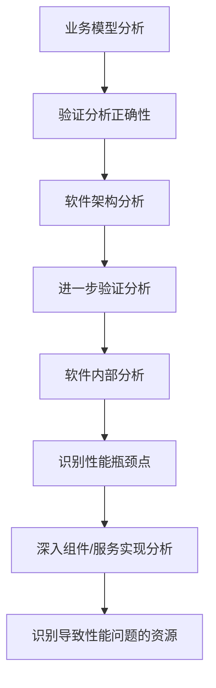

# 性能优化

## 性能建模

在软件设计阶段做好性能的评估分析，通过一定的方法提前识别出软件设计中潜在的性能瓶颈，并指导优化设计

软件执行模型：

基于 QNM 模型的系统执行模型：

## 并行计算

并行执行单元的粒度可大可小，像函数、routine（协程）、actor、线程、进程、作业等。根据处理的特定领域问题，选择合适的并行执行单元粒度，并选择或定制实现相应的并发调度框架

### 并行架构模式

触发的业务计算逻辑之间相互独立时，我们就可以通过创建多个并行执行单元，分别处理拆分后的不同子问题，并根据不同单元业务工作量的大小，建立与具体硬件线程的映射绑定关系

针对不能在系统运⾏前完成任务的拆分，而是需要动态创建任务，并借助任务队列来管理执⾏任务。这里的执⾏线程可以从队列中拉取任务，映射到硬件线程上执⾏

相同计算逻辑需要在不同的数据上进⾏运算

针对在遍历的过程中动态创建任务，然后对每个中间计算单元的运算结果逐步合并，计算得到最终的结果

⼀个计算单元的输出刚好是另外⼀个计算单元的输⼊，并且消息交互是单向确定性的；业务场景中还会源源不断接收到新的输⼊，需要使⽤相似的计算策略进行处理，设计的核⼼就是如何⾼效实现并发计算单元间的信息交互

同⼀个任务需要与多个任务进⾏消息交互；同⼀个消息需要多个任务进⾏处理。

## 性能模式

找到系统中频繁使用的典型场景，然后针对性地提供定制化方案来优化性能

这种模式会降低可靠性，处理失败时所造成的影响通常也会比较大，如果突然断电，会造成阶段计算结果丢失

针对资源拥塞的情况下，处理时延会增加，通过离散化业务的请求时间，从而避免系统中的单个软件服务和硬件服务出现拥塞的情况

通过空间换时间，将计算逻辑提前到编译期执行，来减少运行期的时间开销

做一件事情的时候，顺带把其他事情一并处理掉，就像一个接口返回多个业务场景需要的信息

把计算逻辑从关键路径搬移到非关键路径，从而降低实时处理侧的时延

把优先级比较低的代码块放到业务最后，在极端场景下，也可以通过直接丢弃不处理来保证系统性能不恶化

## 并发框架

- 线程池框架：需要划分好各个线程池，做好线程池的治理
- Akka：适合用在基于大量消息队列来进行通信且CPU密集型的计算上，Akka 的底层调度框架就可以将这些 Actor 子任务均匀地分布到多个 CPU 硬件核上，从而可以最大化地发挥 CPU 的性能
- Reactor：拥有背压机制且IO操作可以异步非阻塞

## 基准测试

### 微基准测试

- 针对的是软件编码实现层面上的性能基线测试

挑战：

1. JIT的优化：需要使用充足的代码预热，避免JIT造成执行结果的偏差
2. 测量时间的精度：微尺度的计算机的时间是不准的，一种可行方式，就是迭代、累积运行多次后获取的测试时间间隔，然后再平均到每一次的运行时间上，这样就可以减少获取的时间间隔误差对测量结果的影响
3. 环境造成的结果波动：必须客观接受获取的测量结果存在波动的这种现象，通过多次测试，并剔除极端值，只选择置信区间内的测量结果进行分析

实施步骤：

1. 保证测试环境与真实产品环境一致
2. 合理选择被测方法，性能影响比较大的关键方法进行测试才更划算，同时执行时间越短的方法，越难测试
3. 编写微基准测试用例
4. 执行测试，得到数据，分析数据

### 宏基准测试

- 获取软件系统级的性能基线水平，以此支撑系统基于性能去弹性扩展、部署运维等，或是指导系统设计层面的性能优化（性能测试）

挑战：

- 难以复制真实生产环境
- 同样，真实场景下的请求、数据也难以模拟

## 调优方法论

潜在的性能瓶颈点：

1. 串行资源受限：串行资源是有限的，随着业务请求量增加，当资源使用饱和后，会导致请求处理吞吐量到达峰值后就不能再提升了
2. 缓冲类资源消息溢出：如果缓冲区设置过小，当上游请求到达峰值时，可能会造成部分请求被阻塞或丢弃，影响到业务性能
3. 缓存命中率过低
4. 软件bug

1. 寻找到引起业务性能问题的业务触发点，并验证分析的正确性
2. 根据组件或服务的接口交互关系寻找触发性能问题的具体组件或服务
3. 进行软件内部分析，深入到组件/服务的实现层面，识别性能瓶颈点，并准确识别导致性能问题的软硬件资源

性能调优的步骤：

1. 系统性的性能优化分析诊断：通过自顶向下的分析方法，识别出导致性能劣化的可优化点，包括软件设计和实现等方面的优化点。
2. 分析调整性能调优目标值：针对识别出的性能优化点，分析修改后的性能提升收益，评估每个优化点的调优目标。
3. 按照成本收益逐步实施性能调优：根据优化点的优先级排序，逐步进行修改并验证优化效果。考虑性能收益大小、修改工作量和对软件质量的影响等因素。
4. 增加完善性能基线测试：在性能调优合入后，同步修改和完善性能基线测试，以确保对软件系统性能的监控和看护。

性能调优反模式：

1. 性能调优严重破坏了软件的质量
2. 盲目修改代码来尝试优化
3. 在业务的非性能瓶颈点上反复调优
