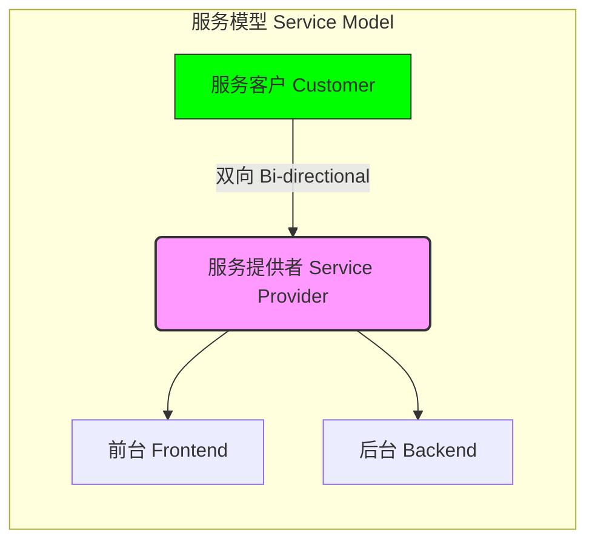
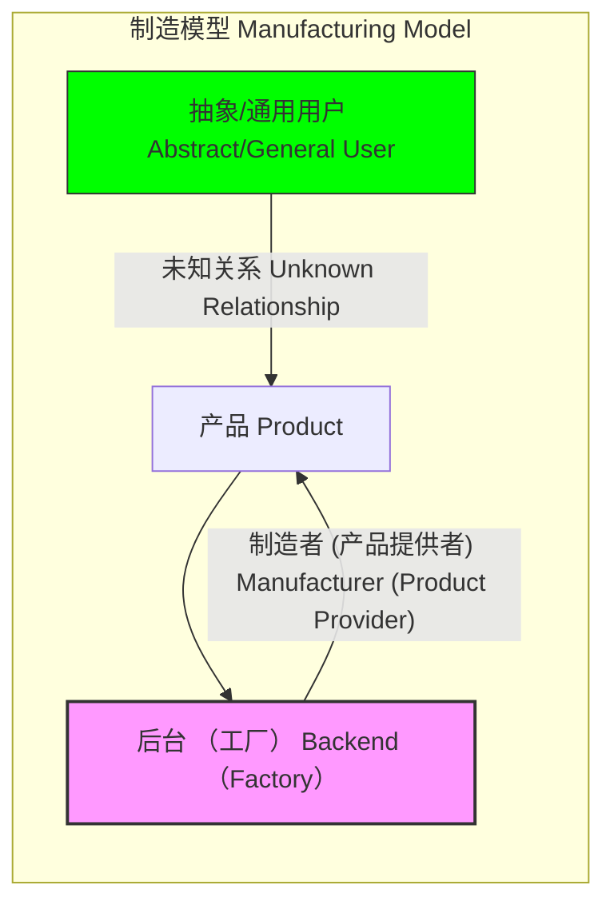
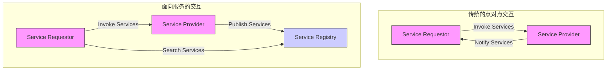

# 服务计算

## 服务

服务时为客户所执行的非持久的，无形的体验

### 服务模型与制造模型






单纯的制造持续减少，服务产业持续增长

## 服务系统

用以实现业务服务的IT软件系统
IT使能服务：业务服务由服务系统提供

### 问题

- 复杂
- 灵活
- 专业化与外包
- 计算环境演化
- IT专家与领域专家的沟通
- 价值与创新
- 服务系统家族

### 面向泛型

使用软件工程相关方法工具进行开发

- 复用

命令式（过程式）泛型
面向对象泛型

使用设计模式应对可以预料到的变化

#### 基于构件的泛型

\          | 基于构件                                       | 面向对象
-|-|-
抽象视角       | 构件是对客观世界的实体或者实体联合能提供的功能和服务的建模;仅仅关注实体的功能和服务 | 对象是对客观世界基本实体的抽象,强调对实体的对应及对实体的建模;涉及实体的静态属性特征
可复用程度和复用机制 | 以组合的方式实现复用                                 | 以继承的方式实现复用
粒度不同       | 大                                          | 小

构件:模块化的、可部署、可替换的软件系统组成部分，它封装了内部的具体实现并对外提供统一接口。

好处：

- 接口稳定，内部实现发生变化不会导致变化扩散

#### 面向服务的泛型

服务：自治、开放、自描述、与实现无关的网络构件

```

### 1. 服务生产阶段 (Service Production)

这个阶段是创建和提炼服务的核心，包括三个子步骤：

* **领域分析 (Domain Analysis)**
    * 与**遗留系统分析 (Legacy System Analysis)** 并行或关联。
* **领域设计 (Domain Design)**
    * 与**服务提炼和描述 (Service Refinement and Description)** 关联。
* **领域实现 (Domain Implementation)**

---

### 2. 服务描述管理 (Service Description Management)

经过服务生产阶段的产出，进入一个中间环节：

* **服务描述管理 (Service Description Management)**：负责对生产出的服务进行描述、编目和管理。

---

### 3. 应用组装阶段 (Application Assembly)

从**服务描述管理**流出的服务作为输入，进入**应用组装**阶段。应用组装被定义为**“基于标准语言的服务组合 (Service Combination Based on Standard Language)”**。这个阶段包含经典的开发流程步骤：

* **分析 (Analysis)**
* **设计 (Design)**
* **实现 (Implementation)**
* **测试 (Testing)**

---

### 4. 整体流程与循环 (Overall Flow and Loop)

1.  流程从**服务生产**开始，产出经**服务描述管理**。
2.  进入**应用组装**阶段，完成**分析、设计、实现、测试**。
3.  **应用组装**的成果和**服务生产**的开始都属于一个更大的**活动 (Activity)** 循环，图中有一条向上的箭头从**服务描述管理**指向**活动**，另一条箭头从**应用组装**的末端（测试之后）指回**活动**，从而形成一个持续的循环。

**总结来说，** 这是一个关于如何将领域知识转化为可管理的服务，并最终将这些服务组合成最终应用的软件工程或面向服务架构（SOA）的流程图。
```

## 服务组合

面向服务的应用逻辑,遵循面向服务的设计原则,采用服务和服务组合加以实现。

由于面向服务倾向于将服务打造为无关的企业资源, -一个服务可能被多个消费者程序所调用,它们能在不同的服务组合中组合同一个服务。

## 服务库存

服务库存，是在组织或组织的合理部分边界内一组独立标准化并治理的完备服务。

### 分层

- 应用服务层
- 业务服务层
- *编排服务层（非必须）*

### 演化

龙卷风模型

- 各个服务按需独立开发
- 依赖先前的服务进行开发
- 使用开发完成的服务进行组合，达到快速开发

## 服务生态系统

当服务库存按照面向服务的方式进行良好规划和设计、经过长时间演化、已经基本完备;该组织的服务系统均已合理地转向面向服务的实现,那么该组织内的服务生态系统就被构建起来。

垂直服务：可以被消费者直接调用，满足消费者需求
水平服务：需要组合多个服务才能提供服务

### 生命周期

- 分析
- 设计
- 开发
- 测试
- 部署
- 管理

### 服务层次

```

这个模型通常将系统功能划分为三个主要层次，从上到下分别是：

---

### 🏛️ **1. 业务流程层 (Business Process Layer)**

* **位于最顶层。**
* 它描述了**业务流程**和**流程逻辑**。图中的菱形和矩形组成的流程图，代表了端到端的业务流程，例如订单处理、客户服务等。
* 此层关注**如何通过组合服务来满足特定的业务需求**。它通常不包含实际的服务实现，而是定义了服务调用的顺序和逻辑。

---

### 🔗 **2. 服务接口层 (Service Interface Layer)**

* **位于中间层，是核心。**
* 这一层将底层的应用功能抽象化、封装成**可重用、松耦合的服务**，并对外提供清晰的接口。这是实现服务重用和互操作性的关键。
* 图中的三个椭圆形代表了不同类型的服务：
    * **编排服务层 (Orchestration Service Layer):** 位于服务层的顶部。它负责**组合和协调**下层的多个服务（通常是业务服务和应用服务）来完成一个复杂的任务或支持一个完整的业务流程。它是一个“业务流程”的服务化实现。
    * **业务服务层 (Business Service Layer):** 位于中间。它封装了核心的**业务逻辑**和**业务实体**。这些服务是可重用的，例如“客户管理服务”、“库存查询服务”等。
    * **应用服务层 (Application Service Layer):** 位于底部。它通常直接对应到底层的应用模块或系统功能。这些服务是对特定应用功能的**原子性**封装，例如“数据库写入操作”、“文件读写操作”等。

---

### 🖥️ **3. 应用层 (Application Layer)**

* **位于最底层。**
* 这一层是**实际的功能实现者**。图中的三个方块代表了不同的**应用系统**或**应用模块**（例如遗留系统、新的应用模块、第三方系统等）。
* 它包含了应用服务的**实现代码**和**数据存储**，是功能执行的物理载体。
* 图片中的中文注释 **“混合（应用）服务”** 可能指向了应用层提供的基础服务能力，它们是构建上层服务的基础。

---

### 🎯 **总结图示的作用**

这张图清晰地展示了 SOA 的**分层、抽象和重用**思想：

1.  **分层:** 将复杂的系统按职责划分为业务流程、服务接口和应用实现。
2.  **抽象:** 通过服务接口层将底层实现与上层业务流程解耦，使得业务流程只需关注服务的功能，而不必关心其具体实现技术。
3.  **重用:** 业务服务和应用服务被设计成可被多个上层业务流程**重复调用**，提高了开发效率和系统的灵活性。

---
如果您想了解更多关于**面向服务的架构 (SOA)** 或其中某一层（例如**编排服务**）的具体例子，我可以为您查找相关信息。
```

### 交付策略（开发方式）

- 自顶向下：分析优先
- 自底向上：按需交付，封装并集成遗留系统
- 敏捷策略

```

## ⚙️ 服务开发与管理流程描述

这个流程图展示了一个七个主要步骤的服务生命周期，以及一个贯穿始终的工作分析阶段。

---

### 1. 基础工作与分析阶段

* **第1步：工作（自顶向下分析）**
    * 这是一个贯穿整个流程的基础工作阶段，以**“自顶向下分析”**的方式进行。它为后续所有步骤提供了指导和基础。

### 2. 服务设计与开发阶段

* **第2步：进行面向服务分析**
    * 这是流程的起点。
    * 它与**“当前状态业务模型结合”**，确保服务分析与现有业务保持一致。

* **第3步：进行面向服务设计**
    * 基于第2步的分析结果，进行服务的具体设计。
    * 这一步也会与**“当前状态业务模型结合”**。

* **第4步：开发服务**
    * 根据设计文档，进行服务的实际编码和实现。

* **第5步：测试服务操作**
    * 开发完成后，对服务的各项操作进行全面的测试，确保功能和性能符合要求。

### 3. 服务部署与回顾阶段

* **第6步：部署服务**
    * 测试通过后，将服务投入运行环境。

* **第7步：回顾业务（及流程）服务**
    * 这是流程的收尾阶段，对已部署的服务及其所涉及的业务流程进行回顾和评估。
    * 这一步也需要与**“当前状态业务模型结合”**，以评估服务对业务的影响。

---

### 4. 迭代与反馈机制

* **迭代机制（虚线箭头）：**
    * 从**第7步（回顾）**有一个虚线箭头指回**第3步（进行面向服务设计）**，并伴有文字说明：**“需要时进行迭代（不变服务契约）”**。
    * 这表示在回顾服务后，如果发现需要改进，可以在**不改变原有服务契约**的前提下，回到设计阶段进行修改和迭代优化，然后重新走第4步到第7步的流程。

---
```

## 面向服务的计算

快速、低成本。在异构环境中分布式应用的灵活组合

## 面向对象 vs 面向服务

特点        | 面向对象的计算                                            | 面向服务的计算
--------- | -------------------------------------------------- | ---------------------------------------------------------------------------------------------
方法论       | 通过定义紧耦合的类来进行应用开发应用架构为基于继承关系的层次式架构从构造函数一通过类或模型到系统设计 | 通过定义松耦合的服务来进行应用开发,并将服务组装成可执行的应用从系统模型到服务模块,从服务抽象定义到服务实现绑定通过搜索获得可用的服务实现
抽象和协作层次   | 往往由一个团队来负责应用的开发,并负责整个生命周期开发者必须了解应用领域知识和编程          | 开发任务由三个独立方承担:应用程序开发者,服务提供方和服务代理。其中,应用程序开发者需要了解应用逻辑,但不需要了解具体的服务是如何实现的。服务提供者需要编程能力,但不必了解使用服务的应用
代合共享和复用   | 代码复用通过类成员的继承和库函数加以实现。其中库函数在编译时引入,且往往是平台相关的         | 代码在服务层次复用。 服务使用标准的结构,并发布在Internet库中。服务是平台无关的，且能够被查找并远程调用。服务代理支持系统的服务共享
动态绑定和重新组合 | 在运行时将名称和方法进行关联。方法必须在应用部署前链接到可执行的代码                 | 在运行时将服务调用和服务进行绑定。可以在应用部署后,再进行服务选定。这一特色使得应用可以在运行时重组
重组        | 躲在设计时决定导入的组件                                       | 可以动态改变应用系统中服务的组合关系,以及服务定义与服务实现之间的绑定关系,即实现动态地添加、修改、删除各个服务节点
组件通讯和接口   | 与平台和语言有关,例如C++程序难以直接和Java程序通信                      | 与平台和语言无关。组件间通过标准协议通信，如XML，WSDL和SOAP
系统维护      | 用户需要时常升级软件,且在执行升级时,应用必须停止                          | 通过互联网升级系统,因为服务多运行在远程服务器上,用户通过互联网进行访问。维护对用户透明
可靠性       | 在设计时决定可靠性的方法                                       | 对于服务提供者,每个服务相对简单，更加可靠。对于应用程序存在多个满足同一-需求的服务可用过将故障服务的节，点断开并重新绑定到备选服务节点上，获得不间断的应用系统
软件拥有      | 软件作为产品销售,为用户所拥有                                    | 软件存在并执行于独立的服务提供商的设备上,用户按照每次对服务使用付费,而不是按照软件产品付费
耦合        | 提倡重用和松耦合,但是预先定义的类依赖导致更多的对象紧密绑定                     | 服务的松耦合由功能和服务合约给定
粒度        | 为支持不同规模的任务,支持细粒度接口( API)                           | 鼓励粗粒度的接口( 服务描述) ,通讯消息中包含尽可能多的任务相关信息
作用域       | 对象作用域更小，更有针对性(往往基于一个软件系统)                          | 服务作用域显著不同(往往基于一个服务生态系统)
前瞻性       | 鼓励处理逻辑与数据的绑定从而产生对象                                 | 鼓励创建活动无关的、由消息驱动的服务
状态性       | 数据和逻辑的绑定,导致带状态的对象                                  | 服务尽可能保持无状态性
组合        | 在支持对象组合的同时也支持对象的继承,从而导致紧耦合                         | 支持松散耦合服务的组合

## 面向服务的架构SOA

- 面向服务的企业
- 使用服务对应用封装

### SOA三角操作模型



### 分层

```
这是一张展示**“全业务视图”**到**“IT灵活性”**之间转换或映射关系的架构图，它将整个系统分为了三个主要的层次，并且展示了它们之间的关系和转换过程。

---

### 🗺️ 架构层次描述

整个图主要由三个标有中文标签的方框或区域构成，它们分别代表了不同的层次：

#### 1. 业务层 (业务层)
* **位置：** 位于图的左上方。
* **内容：** 这是一个名为 **"Full Business View" (全业务视图)** 的模块，它列出了企业中的一些核心业务功能或领域。
* **具体模块包括：**
    * Search (搜索)
    * Payment (支付)
    * Distribution (分发/配送)
    * Processing (处理)
    * Manufacturing (制造)
    * Enterprise Performance Management (企业绩效管理)
* **箭头指向：** 一个箭头从**业务层**指向了右侧的**过程层**，表明业务需求是驱动过程优化的源头。

#### 2. 过程层 (过程层)
* **位置：** 位于图的中间。
* **内容：** 这是一个名为 **"Process Optimization" (过程优化)** 的区域，其中包含一个 **"Case Study Payment Processing Services" (案例研究：支付处理服务)** 的内部图。
* **结构特点：** 内部图展示了多个 **"Customer" (客户)** 实体，以及它们之间复杂的、流程性的交互（用带箭头的线条和圆圈表示），这通常代表了业务流程图或服务交互模型。
* **作用：** 它是连接业务需求和底层IT实现的关键环节，负责将业务功能转化为可执行、可优化的流程。

#### 3. 中间件和编程层 (中间件和编程层)
* **位置：** 位于图的右下方。
* **内容：** 这是一个名为 **"IT Flexibility" (IT 灵活性)** 的区域，其内部核心是一个圆形的架构图，通常代表 **SOA Infrastructure (SOA 基础设施)** 和 **Governance (治理)** 的概念。
* **结构特点：** 核心圆圈内有三个主要活动或组件：
    * Model (建模)
    * Assemble (组装)
    * Develop (或可能是其他词，被手遮挡，但根据上下文，与建模和组装相关，可能指开发或部署)
    * 这表明这是一个服务导向架构（SOA）或类似的中间件/平台架构，用于实现流程层定义的服务。
* **箭头指向：**
    * 一个箭头从**过程层**指向了**中间件和编程层**，表明优化的流程需要通过IT基础设施来实现。
    * 一个箭头从**中间件和编程层**指向**业务层**，形成一个闭环，这暗示着IT的实现（灵活性）能够反过来支持和驱动业务层面的发展和创新。

---

### 🔄 总结关系

这张图的核心思想是展示了企业如何通过**过程优化**将**高层级的业务需求**（业务层）转化为**具体的、灵活的IT服务实现**（中间件和编程层），从而形成一个**业务驱动IT，IT反哺业务**的闭环架构视图。

* **业务层 $\rightarrow$ 过程层：** 定义“做什么”和“为什么做”。
* **过程层 $\rightarrow$ 中间件和编程层：** 定义“如何做”（流程实现）。
* **中间件和编程层 $\rightarrow$ 业务层：** 提供灵活的IT能力来支持业务的快速变化和创新。

```

- 操作型系统层：只为一个目的服务一类特定用户
- 服务组件层：提供用以实现服务层中所定义服务的代码容器
- 服务层：服务层将SOA三角操作模型，扩展为综合的逻辑层次,以支持服务注册、服务分解、服务发现、服务绑定、接口聚合和生命周期管理。
- 业务过程层：以组合和分解的方式处理业务逻辑

**编排**


```

## 🖼️ 图表描述与架构分析

这张图展示了一个**中央协调者（Central Coordinator）**模式下的服务调用流程。

### 1. **核心实体**

* **👤 用户/调用方（左侧火柴人）:** 表示发起请求或需要调用服务的主体。
    * **动作:** 发起“服务调用”（服务调用）指向最上层的**复合服务**。
* **🌐 复合服务（中心协调者） (Complex Service / Central Coordinator):** 位于顶层的大圆圈，是整个架构的核心，负责处理用户的请求并协调底层服务。
    * **关键功能:**
        * **流程规划（流程规划）:** 这是复合服务的核心职责，它定义了如何以及按什么顺序调用底层的**服务1**到**服务n**来完成一个复杂的业务功能。
* **📦 底层原子服务（服务1, 服务2, ... 服务n） (Atomic Services):** 位于底部的圆圈，代表独立的、细粒度的基础服务。
    * **特点:** 它们是提供特定、单一功能的组件，例如查询库存、处理支付等。

### 2. **调用流程**

1.  **用户请求:** 用户发起一个“服务调用”到**复合服务（中心协调者）**。
2.  **流程编排:** **复合服务**接收请求后，根据其内部的“流程规划”，决定按顺序（或并行）调用哪些底层服务。图中的方块代表了流程规划中的各个步骤，每个步骤对应一个对底层服务的调用。
3.  **原子服务调用:** **复合服务**向底层的**服务1**、**服务2**和**服务n**发送“服务调用”请求。
4.  **结果返回:** 底层服务执行其功能并将结果返回给**复合服务**。
5.  **最终响应:** **复合服务**将收集到的所有结果进行整合、处理，最终形成一个统一的响应返回给用户/调用方。

### 3. **架构意义**

* **封装性:** **复合服务**将复杂的业务逻辑（流程规划）封装起来，对用户隐藏了底层原子服务的细节。用户只需要调用一个接口（复合服务）即可。
* **解耦性:** 底层的原子服务可以保持独立，专注于自己的功能。业务流程的变化主要集中在**复合服务**的“流程规划”中，提高了系统的灵活性和可维护性。
* **协调性:** 这种模式是一种典型的**集中式服务编排（Orchestration）**模式，由一个中心服务（复合服务）充当领导者，指挥和控制整个业务流程。

```

**编导**

```

### 🗺️ 图示核心要素描述

* **服务（服务1, 服务2, 服务3, 服务4, 服务n）：** 图中的圆形代表不同的服务实例或组件。在微服务（Microservices）的背景下，每个圆形可能是一个独立部署、独立运行的业务功能单元。
* **脚本（脚本）：** 每个服务下面都有一个文件图标，标记为“脚本”。这通常代表了实现该服务业务逻辑的代码或配置文件。
* **服务调用（-服务调用-）：** 带有箭头的直线表示服务之间的调用关系。箭头指向被调用的服务。
    * 例如，**服务1** 调用了 **服务2** 和 **服务3**。
    * **服务3** 调用了 **服务2**。
    * **服务n** 调用了 **服务4**。
    * **服务1** 似乎也直接调用了 **服务4**。

### 🔄 关系与结构分析

1.  **网状/分散式调用：** 图中的调用关系是复杂的、多对多的，而不是简单的线性或层级结构。这正是微服务架构的特点，服务之间通过网络进行通信和协作。
2.  **依赖关系：**
    * **服务2** 被 **服务1** 和 **服务3** 调用，说明它是为这两个服务提供公共能力的。
    * **服务4** 被 **服务1** 和 **服务n** 调用。
    * **服务1** 依赖于 **服务2** 和 **服务3** 的正常运行。
3.  **潜在问题：** 这种复杂的网状调用关系虽然灵活，但也可能带来挑战，例如：
    * **链路追踪困难：** 难以追踪一个请求从起始服务到最终完成所经过的所有服务。
    * **级联故障：** 如果一个底层服务（如服务2）发生故障，可能会导致所有依赖它的服务（如服务1和服务3）也受到影响（即**雪崩效应**）。
    * **服务治理需求：** 需要引入服务注册与发现、负载均衡、熔断、限流等服务治理机制来保证系统的稳定性和可靠性。

---

**总结：**

这是一张描绘**微服务或分布式系统**中**服务间调用和依赖关系**的示意图，展示了不同业务功能单元如何通过“服务调用”相互协作，共同完成业务流程。

```

- 消费者层：通过业务服务快速构建用户接口来满足消费者需求

## web service

- xml：定义数据，信息交换
- xml schema：定义数据结构
- soap：平台无关消息传送
- wsdl：平台技术无关服务描述
- ws-bpel/ws-cdl:脚本
- uddi，wsil：服务发布与查找

### 抽象模型

```

## 🖼️ 图表结构描述

这张图展示了一个典型的**服务组件**（Service Component）的内部结构及其与外部消息的交互过程。它主要由三个核心部分组成：**输入处理**、**核心逻辑**和**输出处理**。

### 1. 📬 输入消息处理 (服务提供者角色-输入)

* **外部输入:** 箭头和信封图标表示**传入消息**（Inbound Messages）。
* **消息处理逻辑 (左侧):** 一组蓝色的堆叠块，标记为 "**message processing logic**"（消息处理逻辑）。
    * **作用:** 接收外部消息，执行必要的预处理步骤，例如：
        * 解密/验证安全令牌
        * 解包/反序列化消息格式（例如从 SOAP/JSON 转换为内部数据结构）
        * 路由和日志记录

### 2. 🧠 核心服务逻辑

* **核心逻辑:** 中间最大的蓝色圆角矩形，标记为 "**core service logic**"（核心服务逻辑）。
    * **作用:** 这是服务执行其**主要业务功能**的地方。它包含了实现服务契约所定义的操作的代码。
    * **职责:** 执行商业规则、数据访问、状态管理等。

### 3. 📤 输出消息处理和服务契约 (服务提供者角色-输出)

* **消息处理逻辑 (右侧):** 另一组蓝色的堆叠块，同样标记为 "**message processing logic**"（消息处理逻辑）。
* **服务契约 (service contract):** 围绕右侧消息处理逻辑的黄色环形区域。
    * **作用:** 它是一个**正式的接口**，定义了服务能够执行的操作、消息结构和数据类型。它是服务消费者和服务提供者之间的**正式协议**。
* **外部输出:** 箭头和信封图标表示**传出消息**（Outbound Messages）。
    * **右侧消息处理逻辑的作用:** 将核心逻辑的结果转换为外部所需的格式，执行必要的后处理步骤，例如：
        * 序列化结果为 SOAP/JSON
        * 应用加密/数字签名
        * 处理错误和异常

---

## ⚙️ 角色转换和服务流

这张图描述了 Web 服务在处理请求和响应时的**两个关键角色**：

1.  **服务消费者 (Service Consumer):** 在服务组件的**外部**，发送请求并接收响应。
2.  **服务提供者 (Service Provider):** 图中的**整个服务组件**，接收请求并发送响应。

**消息流概述:**

1.  **请求进入 (服务提供者接收):** 外部请求消息 $\rightarrow$ 左侧消息处理逻辑 $\rightarrow$ 核心服务逻辑。
2.  **响应发出 (服务提供者发送):** 核心服务逻辑 $\rightarrow$ 右侧消息处理逻辑（遵循服务契约） $\rightarrow$ 外部响应消息。

简而言之，消息处理逻辑充当了**适配器**（Adapter）或**外观**（Facade）的角色，将外部消息格式与内部核心业务逻辑解耦，确保核心逻辑只关注业务本身，而将消息格式、安全、传输等**服务基础设施关切**（Service Infrastructure Concerns）交给消息处理层。

```

### SOAP

提供了单向、不带状态的消息交互范式
一个定义了消息传输的数据抽象接口

```bash
// 抽象结构：SOAP 消息 (SOAP Message)

Structure SOAP_Message {
    // 强制部分：SOAP 信封 (SOAP Envelope) - 声明这是 SOAP 消息
    Mandatory Section SOAP_Envelope {
        
        // 可选部分：头部 (Header) - 包含应用相关的控制数据
        Optional Section Header {
            // 可以在此处定义任何数量的应用特定的控制信息
            Application_Control_Data[]
        }
        
        // 强制部分：主体 (Body) - 消息容器，包含要处理的实际数据
        Mandatory Section Body {
            // 实际消息内容/操作请求/操作响应
            Message_Container
            
            // 可选部分：故障 (Fault) - 如果消息处理过程中发生错误，用于返回错误信息
            Optional Section Fault {
                // 用于返回错误信息的结构 (如：faultcode, faultstring, detail)
                Error_Message_Details
            }
        }
    }
}

// 示例：SOAP Body 中可能包含的操作请求/响应
Structure Message_Container {
    // 例如：一个方法调用/请求 (Request)
    // 或者：一个方法调用的结果/响应 (Response)
    Operation_Name
    Parameters_Or_Results[]
}

// 示例：SOAP Fault 结构
Structure Error_Message_Details {
    Fault_Code       // 错误代码
    Fault_String     // 可读的错误描述
    Detail           // 特定于应用的错误信息
}
```

### WSDL

提供了一种基于XML的标准接口定义语言/服务能力定义语言,用以在服务的提供者/调用者/服务注册之间,交换必要的有关Web Service的信息

## 面向服务的分析

需要构建哪些服务，每个服务需要封装哪些逻辑

- 定义流程自动化需求
- 识别现有自动化系统

### 业务服务

- 以任务为核心
- 以实体为核心

### 服务建模

## 面向服务设计

从服务候选中派生出具体的服务设计，装配到实际业务流程

- 以实体为核心
- 应用服务
- 以任务为核心

## 服务开发

特定平台及语言：

- 开发定制服务
- 包装遗留系统
- 构建应用系统

## 服务设计

### 标准化服务合约

- 技术性
- 非技术性

版本问题：服务合约的演化
技术依赖

### 标准化服务策略

### 服务耦合

- 逻辑-合约耦合
  - 先设计合约，再设计底层方案逻辑
- 合约-逻辑耦合
  - 根据实际设计生产合约，是一种反模式
- 合约-技术耦合
- 合约-实现耦合
- 合约-功能耦合
  - 服务没有可复用性
- 消费者-合约耦合
  - 接口粒度

### 服务抽象

为了获得信息隐藏的正确平衡点

- 抽象度量：合约内容
  - 详细合约
  - 简明合约
  - 优化合约

### 服务可复用性

- 计划的可复用
- 针对的可复用
- 完全可复用

无关服务与周围环境之间保持中立或者无关
服务越是无关，复用潜能越大

服务可复用性原则倾向于降低服务粒度

### 服务自治

当前服务不依赖于其他因素

- 运行时自治
- 设计时自治
  - 服务拥有者对服务修改的自由度

风险：

- 错误判断了服务的范围，导致修改困难
- 对遗留系统的封装，修改困难
- 过度设计

### 服务无状态性

- 使用状态库保存状态
- 使用消息保存状态

代价：
性能代价
设计代价

### 服务可发现性

### 服务可组合性

