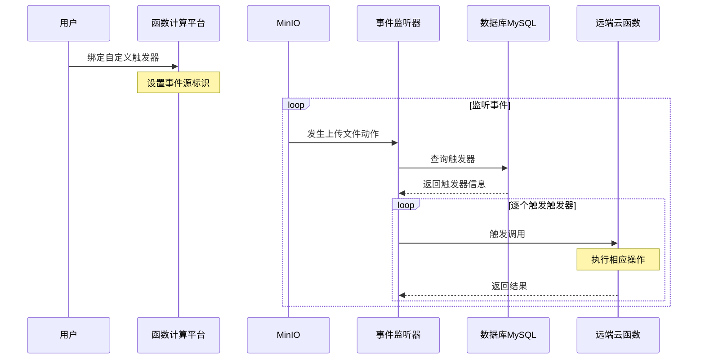

# Serverless

- 对服务器的关心少一点

狭义 Serverless（最常见）= Serverless computing 架构 = FaaS 架构 = Trigger（事件驱动）+ FaaS（函数即服务）+ BaaS（后端即服务，持久化或第三方服务）= FaaS + BaaS

广义 Serverless = 服务端免运维 = 具备 Serverless 特性的云服务

## FaaS

预热冷启动：利用构建好的缓存镜像，直接跳过冷启动的下载函数代码步骤，从镜像启动容器

### 分层

- 容器：操作系统
  - 运行时：语言技术栈支持
    - 函数代码

分层的好处在于容器可以被预热，并且缓存，资源可以统筹优化

当一段时间内没有用户请求时，则会销毁函数实例，这样子可以达到缩容为 0

### 进程模型

- 用完即毁型：函数实例准备好后，执行完函数就直接结束，是天然的 Stateless
- 常驻进程型：函数实例准备好后，执行完函数不结束，而是返回继续等待下一次函数被调用，是天然的 Stateful

### 触发器

触发器类型：单向集成触发器、双向集成触发器和代理集成触发器。它们的区别在于事件源和事件的规则存储在哪里，以及从哪里触发

### 数据编排

前端的一个数据请求过来，函数触发器触发我们的函数服务；我们的函数启动后，调用后端提供的元数据接口，并将返回的元数据加工成前端需要的数据格式

### 服务编排

和数据编排很像，主要区别是对云服务商提供的各种服务进行组合和加工

## BaaS

- 不用运维的微服务

## 私有Serverless

- Knative
