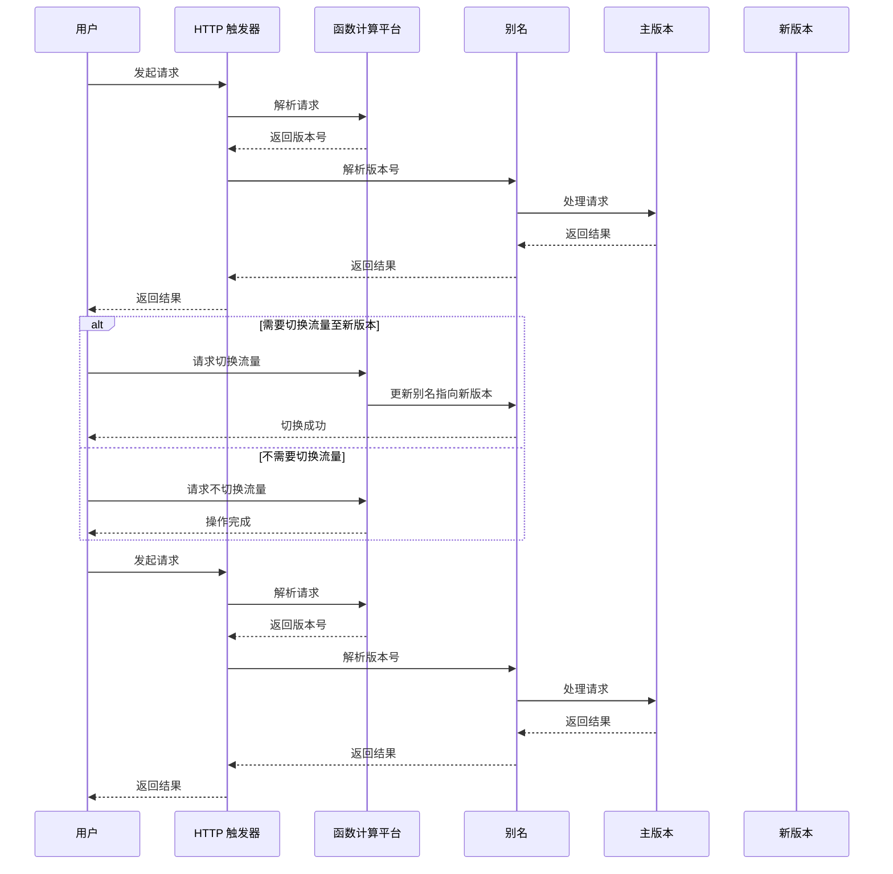
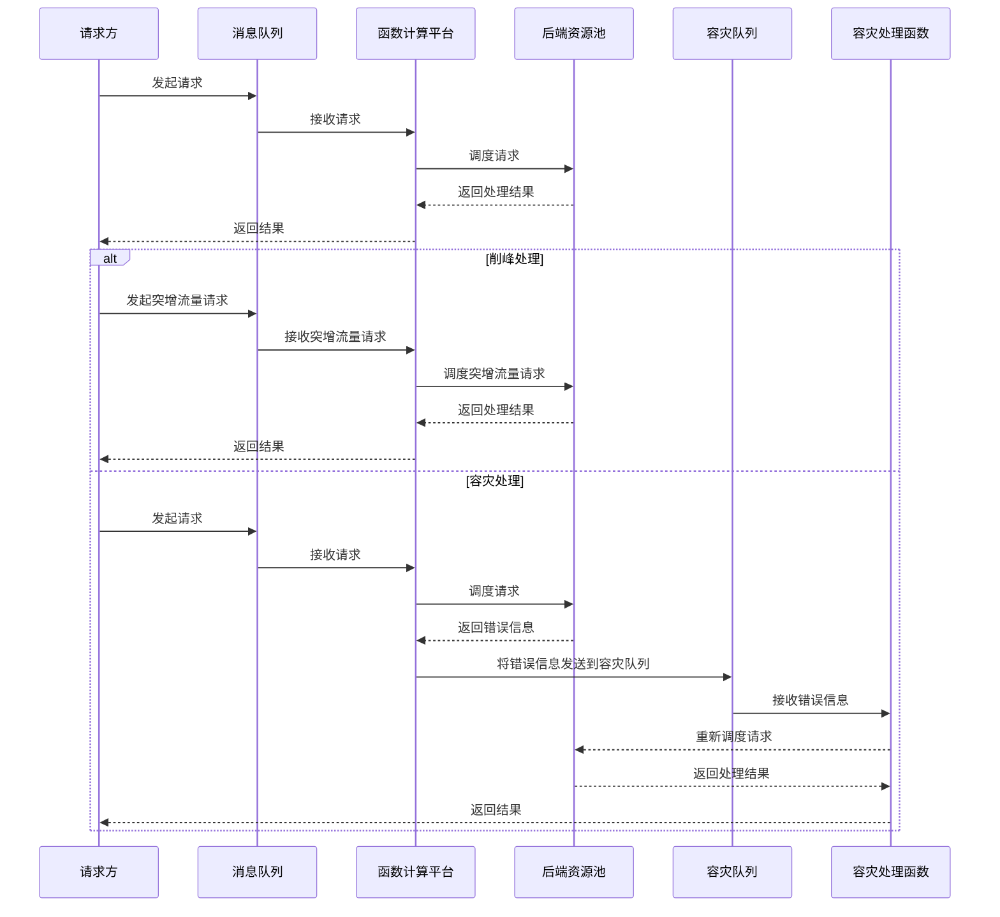
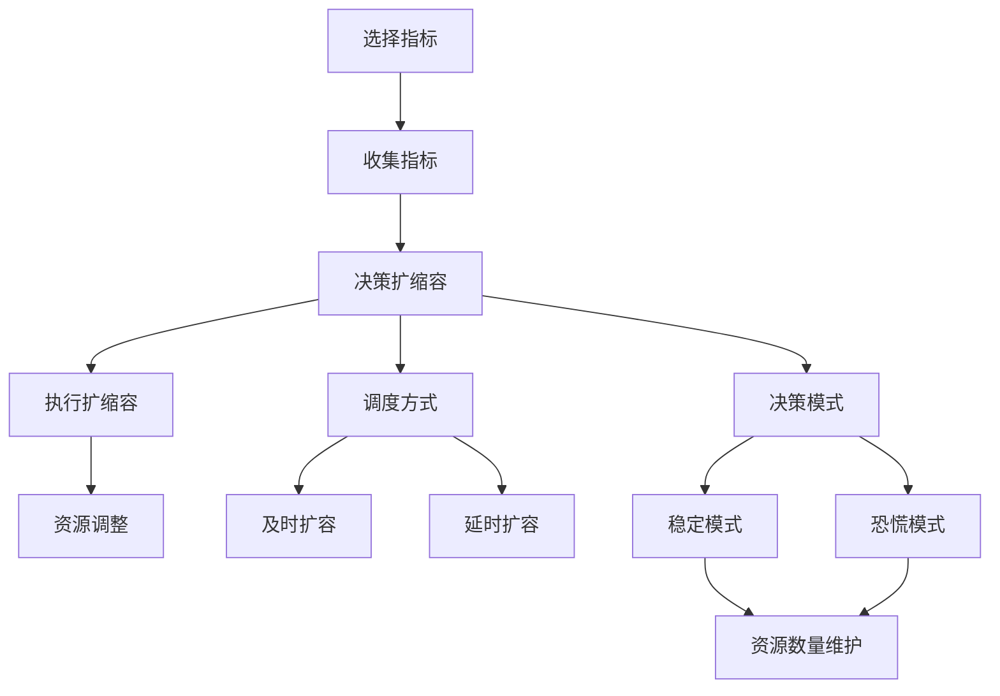

# Serverless

- 对服务器的关心少一点

狭义 Serverless（最常见）= Serverless computing 架构 = FaaS 架构 = Trigger（事件驱动）+ FaaS（函数即服务）+ BaaS（后端即服务，持久化或第三方服务）= FaaS + BaaS

广义 Serverless = 服务端免运维 = 具备 Serverless 特性的云服务

## FaaS

### 分层

- 容器：操作系统
  - 运行时：语言技术栈支持
    - 函数代码

分层的好处在于容器可以被预热，并且缓存，资源可以统筹优化，公共服务能力可以被提取

当一段时间内没有用户请求时，则会销毁函数实例，这样子可以达到缩容为 0

运行时主要做三件事：

- 获取请求信息
- 关联用户代码
- 调用用户代码处理请求。

### 冷启动

预热冷启动：利用构建好的缓存镜像，直接跳过冷启动的下载函数代码步骤，从镜像启动容器

平台侧的优化：

- 镜像加速手段优化资源调度和容器创建
- 包的缓存、极致的压缩和内置化通用依赖
- 利用代理模式的方法进行 VPC网络加速
- 通过函数实例的预测算法，提前加载接下来会被调用的函数

用户侧的优化：

- 合理控制代码包大小
- 选择性能较高的运行时
- 预留实例和定时预热
- 合理利用本地缓存

### 灰度发布

### 削峰容灾

### 进程模型

- 用完即毁型：函数实例准备好后，执行完函数就直接结束，是天然的 Stateless
- 常驻进程型：函数实例准备好后，执行完函数不结束，而是返回继续等待下一次函数被调用，是天然的 Stateful

### 触发器

触发器类型：单向集成触发器、双向集成触发器和代理集成触发器。它们的区别在于事件源和事件的规则存储在哪里，以及从哪里触发

### 扩缩容

云厂商容器调度服务通常有两种调度形态，一种是基于节点 Node 调度的方式，一种是基于容器实例的方式

### 流量转发

异步下的流量转发主要通过事件 / 消息队列的方式来缓冲一步，然后通过异步处理模块，按照同步请求的请求机制来处理

### 数据编排

前端的一个数据请求过来，函数触发器触发我们的函数服务；我们的函数启动后，调用后端提供的元数据接口，并将返回的元数据加工成前端需要的数据格式

### 服务编排

和数据编排很像，主要区别是对云服务商提供的各种服务进行组合和加工。这些步骤通常通过 JSON 或者 YAML 的格式定义好函数之间的协作关系存在，通过顺序、分支、并行的方式来协调一个或多个分布式任务，这些任务不仅包括函数，还可以是服务和应用的形式，并且还能使用平台提供的状态跟踪、日志记录和异常重试逻辑

- 长流程场景
- 事务型业务流程
- 并发型业务流程
- 需要状态全链路监测的场景

### 数据存储

控制面：

- 函数元数据：关系型数据库
- 函数代码：对象存储、镜像存储

数据面：

- 报表数据：MPP数据库
- 服务状态：KV数据库

## BaaS

FaaS 提供业务逻辑层的处理，BaaS 提供基础服务层的能力，让有状态的数据、过程消息等存储在 BaaS 化的服务中，BaaS 弥补了 FaaS 的无状态，数据库、消息队列都可以 BaaS 化，可以拥有自己的生命周期，使用完即销毁

- 不用运维的微服务

## 私有Serverless

- Knative

## 平台设计

### 函数管理

- 需要集成函数的创建、配置、部署发布、测试、删除、上下线功能，并且支持底层资源规格的选取
- 需要提供多种函数语言的开发，适配不同操作系统镜像

### 平台管控

- 用户隔离
- 鉴权验证
- 用户角色和权限管理

### 资源控制

- 需要支持计量计费及对资源的使用限制

### 用户角色和权限管理

- CLI 命令
- WebIDE

### 高可用

### 可观测