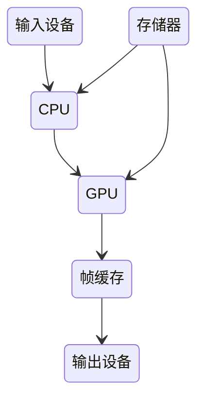
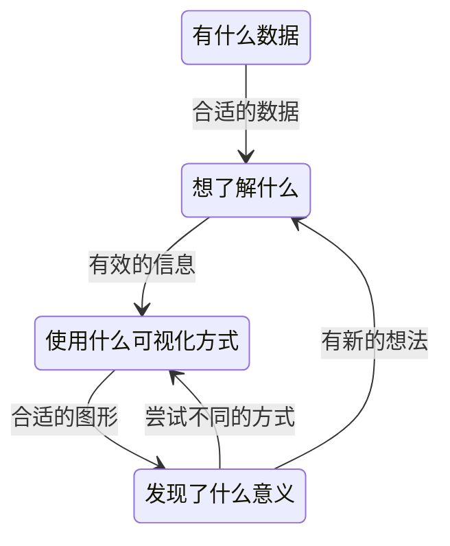

# 可视化

> 将数据组织成易于为人所理解和认知的结构，然后用图形的方式形象地呈现出来的理论、方法和技术

Web 开发的前端主要还是关注内容和样式，图形的渲染和绘制是由浏览器底层来完成的，而可视化前端则可能要深入底层渲染层，去真正地控制图形的绘制和细节的呈现

## 图形基础

### 通用图形系统

数据经过 CPU 处理，成为具有特定结构的几何信息。然后，这些信息会被送到 GPU 中进行处理。在 GPU 中要经过两个步骤生成光栅信息。这些光栅信息会输出到帧缓存中，最后渲染到屏幕上



- 光栅：几乎所有的现代图形系统都是基于光栅来绘制图形的，光栅就是指构成图像的像素阵列
- 帧缓存：一个像素对应图像上的一个点，它通常保存图像上的某个具体位置的颜色等信息

### HTML+CSS

可以实现一些简单的柱状图、饼图，但据与图形的对应关系不直观，同时由于浏览器对HTML以及CSS的渲染机制，会导致渲染开销比较大

### SVG

声明式绘图系统，只不过是将 HTML 标签替换成 SVG 标签，运用了一些 SVG 支持的特殊属性，HTML+CSS有的缺点它也有，但SVG 则弥补了HTML+CSS不规则图形绘制方面的不足，让不规则图形的绘制变得更简单了

创建SVG 元素要使用 document.createElementNS 方法：

```js
document.createElementNS('http://www.w3.org/2000/svg', 'circle')
```

```html
<!-- 画个黑边的黄圈 -->
<svg xmlns="http://www.w3.org/2000/svg" version="1.1">
  <circle cx="100" cy="50" r="40" stroke="black"
  stroke-width="2" fill="orange" />
</svg>
```

同时由于是html标签，添加事件相比canvas更方便，可以直接使用dom操作，同时SVG绘制的是矢量图形，这点也比canvas更有优势


### Canvas

指令式绘图系统，能够直接操作绘图上下文，比HTML和SVG快,简单易操作和高效的渲染能力是它的优势，但是它的缺点是不能方便地控制它内部的图形元素

```html
<canvas width="512" height="512"></canvas>
```
```css
canvas {
  width: 256px;
  height: 256px;
}
```
```js
// 获取上下文
const canvas = document.querySelector('canvas');
const context = canvas.getContext('2d');

// 绘制一个正方形
const rectSize = [100, 100];
context.fillStyle = 'black';
context.beginPath();
context.rect(0.5 * canvas.width, 0.5 * canvas.height, ...rectSize);
context.fill();
```

#### WebGL

在要绘制的图形数量非常多、对较大图像的细节做像素处理、绘制3D物体，相比Canvas2D有较大的性能优势

WebGL 绘制一个图形的过程，一般需要用到两段着色器，一段叫顶点着色器（Vertex Shader）负责处理图形的顶点信息，另一段叫片元着色器（Fragment Shader）负责处理图形的像素信息，WebGL 可以并行地对整个三角形的所有像素点同时运行片元着色器

```js

const canvas = document.getElementById('canvas-gl');
const gl = canvas.getContext('webgl');

// 顶点着色器
const vertex = `
  attribute vec2 position;

  void main() {
    gl_PointSize = 1.0;
    gl_Position = vec4(position, 1.0, 1.0);
  }
`;

// 片元着色器
const fragment = `
  precision mediump float;

  void main()
  {
    gl_FragColor = vec4(1.0, 0.0, 0.0, 1.0);
  }    
`;

// 将着色器代码分别创建成 shader 对象
const vertexShader = gl.createShader(gl.VERTEX_SHADER);
gl.shaderSource(vertexShader, vertex);
gl.compileShader(vertexShader);

const fragmentShader = gl.createShader(gl.FRAGMENT_SHADER);
gl.shaderSource(fragmentShader, fragment);
gl.compileShader(fragmentShader);

// 一些配置
const program = gl.createProgram();
gl.attachShader(program, vertexShader);
gl.attachShader(program, fragmentShader);
gl.linkProgram(program);
gl.useProgram(program);

// 定义三角形的三个顶点
const points = new Float32Array([
  -1, -1,
  0, 1,
  1, -1,
]);

// 定义好的数据写入 WebGL 的缓冲区
const bufferId = gl.createBuffer();
gl.bindBuffer(gl.ARRAY_BUFFER, bufferId);
gl.bufferData(gl.ARRAY_BUFFER, points, gl.STATIC_DRAW);


const vPosition = gl.getAttribLocation(program, 'position'); //获取顶点着色器中的position变量的地址
gl.vertexAttribPointer(vPosition, 2, gl.FLOAT, false, 0, 0); //给变量设置长度和类型
gl.enableVertexAttribArray(vPosition); //激活这个变量

// 清除画布然后绘画
gl.clear(gl.COLOR_BUFFER_BIT);
gl.drawArrays(gl.TRIANGLES, 0, points.length / 2);
```

## 数学

### 向量和坐标系

- HTML 采用的是窗口坐标系，以参考对象（最接近图形元素的 position 非 static 的元素），左上角为坐标原点，x 轴向右，y 轴向下，坐标值对应像素值
- SVG 采用的是视区盒子（viewBox）坐标系，以 svg 根元素左上角为坐标原点，x 轴向右，y 轴向下
- Canvas 采用的坐标，默认以画布左上角为坐标原点，右下角坐标值为 Canvas 的画布宽高值
- WebGL 的坐标系，是一个三维坐标系。它默认以画布正中间为坐标原点，x 轴朝右，y 轴朝上，z 轴朝外

坐标系变换：在canvas中可以通过transfrom改变原点来变换坐标系，不仅可以简化顶点的计算、同时也能优化计算量

可以用二维向量来表示一个平面上的点和线段：

- 点：(x,y)
- 线段：(0,0) ~ (x,y)

向量运算：

- 相加：v1(x1,y1) + v2(x2,y2) = 在平面上得到一个新的点（x1 + x2, y1 + y2），一条新的线段[(0, 0), (x1 + x2, y1 + y2)]，以及一段折线：[(0, 0), (x1, y1) , (x1 + x2, y1 + y2)]

个向量包含有长度和方向信息：

- 长度可以用向量的 x、y 的平方和的平方根来表示
- 方向可以用与 x 轴的夹角来表示

如果我们希望以点 (x0, y0) 为起点，沿着某个方向画一段长度为 length 的线段：

$$v_1^→ = length * v^→ (cos(与x轴夹角),sin(与x轴夹角))$$

### 向量乘法

点乘：几何含义是 a 向量乘以 b 向量在 a 向量上的投影分量。物理含义相当于 a 力作用于物体，产生 b 位移所做的功


叉乘：几何意义就是向量 a、b 组成的平行四边形的面积，物理意义就是 a 和 b 的力矩


### 描述曲线

#### 参数方程

通过公式描述出曲线的各个点，最后再连接各个点

- 圆

$$
x = x_0 + rcos(θ)\\
y = y_0 + rsin(θ)\\
$$

```js

const TAU_SEGMENTS = 60;
const TAU = Math.PI * 2;
function arc(x0, y0, radius, startAng = 0, endAng = Math.PI * 2) {
  const ang = Math.min(TAU, endAng - startAng);
  const ret = ang === TAU ? [] : [[x0, y0]];
  const segments = Math.round(TAU_SEGMENTS * ang / TAU);
  for(let i = 0; i <= segments; i++) {
    const x = x0 + radius * Math.cos(startAng + ang * i / segments);
    const y = y0 + radius * Math.sin(startAng + ang * i / segments);
    ret.push([x, y]);
  }
  return ret;
}

// 圆心为[100,100]半径为100的圆
const points = arc(100, 100, 100);

for(let i = 1; i < points.length; i++) {
  context.beginPath();
	context.moveTo(points[i-1][0], points[i-1][1]);
	context.lineTo(points[i][0], points[i][1]);
	context.stroke();
	context.closePath();  
}

```

- 圆锥曲线

圆是特殊的椭圆

$$
椭圆\\
x = x_0 + rcos(θ)\\
y = y_0 + rsin(θ)\\
抛物线\\
x = x_0 + 2pt^2\\
y = y_0 + 2pt^2
$$

```js
const LINE_SEGMENTS = 60;
function parabola(x0, y0, p, min, max) {
  const ret = [];
  for(let i = 0; i <= LINE_SEGMENTS; i++) {
    const s = i / 60;
    const t = min * (1 - s) + max * s;
    const x = x0 + 2 * p * t ** 2;
    const y = y0 + 2 * p * t;
    ret.push([x, y]);
  }
  return ret;
}
```

- 贝塞尔曲线

通过起点、终点和少量控制点，就能定义参数方程来生成复杂的平滑曲线，所以它通常被用来构建数据信息之间连接线


$$B_t = {(1 - t)}^3 + 3{(1-t)}^2tP_1 + 3{(1-t)}^2p_2 + t^3P_3$$

p0 p1 p2 p3 是向量，t是参数


控制点越多，曲线能够模拟出更多不同的形状，也能更精确地控制细节

### 多边形描述处理

WebGL 填充多边形的第一步，就是将多边形分割成多个三角形，叫做三角剖分，针对 3D 模型，WebGL 在绘制的时候，也需要使用三角剖分，而 3D 的三角剖分又被称为网格化，3D 渲染的时候，我们一般使用的模型数据都是已经经过三角剖分以后的顶点数据


一些库：

- Earcut
- Tess2.js
- cdt2d

判断鼠标是否在多边形内：

先简化为判断三角形内

当点 u 在三角形 a、b、c 内时，因为 u1到 a、u2到 b、u3到 c 的小角旋转方向是相同的（这里都为顺时针），所以 u1 X a、u2 X b、u3 X c 要么同正，要么同负。当点 v 在三角形外时，v1到 a 方向是顺时针，v2到 b 方向是逆时针，v3到 c 方向又是顺时针，所以它们叉乘的结果符号并不相同

加上

判定点恰好在三角形某条边上的情况

判断多边形，要先对多边形做三角剖分，判断该点是否在其中一个三角形内部

### 仿射变换

- 仿射变换前是直线段的，仿射变换后依然是直线段
- 对两条直线段 a 和 b 应用同样的仿射变换，变换前后线段长度比例保持不变

向量的平移、旋转、缩放：

$$
平移\\
x = x_0 + x_1\\
y = y_0 + y_1\\
旋转\\
x = x_0cosθ - y_0sinθ\\
y = x_0cosθ + y_0sinθ\\
缩放\\
x = s_xx_0\\
Y = s_yy_0\\
$$

旋转和缩放都可以写成矩阵与向量相乘的形式。这种能写成矩阵与向量相乘形式的变换，就叫做线性变换：

- 线性变换不改变坐标原点（因为如果 x0、y0等于零，那么 x、y 肯定等于 0）
- 线性变换可以叠加，多个线性变换的叠加结果就是将线性变换的矩阵依次相乘，再与原始向量相乘

通用的线性变换公式，一个原始向量 P0经过 M1、M2、…Mn 次的线性变换之后得到最终的坐标 P：

$$P = M_1 * M_2  * ... M_n * P_0$$

仿射变换的一般表达式，线性变换 + 平移：

$$P = M * P_0 + P_1$$

## 视觉

### 颜色表示

- RGB和RGBA：在对比两个 RGB 颜色的时候，只能通过对比它们在 RGB 立方体中的相对距离，来判断它们的颜色差异
- HSL和HSV：可以均匀地修改每组颜色的亮度和饱和度，但这样修改之后，有的颜色看起来和其他的颜色差距明显，有的颜色还是没那么明显
- CIE Lab 和 CIE Lch：用 L 表示亮度，a 和 b 表示颜色对立度，Lch是将坐标从立方体的直角坐标系变换为圆柱体的极坐标系
- Cubehelix 色盘：原理就是在 RGB 的立方中构建一段螺旋线，让色相随着亮度增加螺旋变换


当希望连续变化的数据能够呈现连续的颜色变换时，就很难用预先指定的有限的颜色来表达，就需要使用其他的方式，结合数据变量来动态生成颜色值

### 图案生成

1. 重复图案：使用 CSS 的 background-image 属性,利用 backgroud-repeat
2. 分形

$$
Z_{n+1} = {Z(_n)}^2+C
$$

3. 随机：使用随机数生成器来生成颜色

### 滤镜

1. 灰度化：将图片的每个像素点的 R、G、B 通道的值进行加权平均转换

$$
V = aR + bG + cB\\
R' = G' = B' = V\\
(a + b + c) = 1
$$

2. 像素矩阵

一个 4*5 颜色矩阵，让它的第一行决定红色通道，第二行决定绿色通道，第三行决定蓝色通道，第四行决定 Alpha 通道：

如果要改变一个像素的颜色效果，只需要将该矩阵与像素的颜色向量相乘：


3. 高斯模糊

按照高斯分布的权重，对当前像素点及其周围像素点的颜色按照高斯分布的权重加权平均


二维高斯公式

$$
G(x,y) = {\frac{1}{2πσ^2}e}^{-(x^2+y^2)/2σ^2}
$$


4. 边缘模糊：在遍历像素点的时候，同时计算当前像素点到图片中心点的距离，然后根据距离设置透明度
5. 叠加：通过对两张图片进行像素叠加

### 极坐标绘图

有些曲线只能用极坐标来表示，但最终渲染的时候，还是需要转换成图形系统默认支持的直角坐标才可以进行绘制

```js
// 直角坐标影射为极坐标
function toPolar(x, y) {
  const r = Math.hypot(x, y);
  const θ= Math.atan2(y, x);
  return [r, θ];
}

// 极坐标映射为直角坐标
function fromPolar(r, θ) {
  const x = r * cos(θ);
  const y = r * sin(θ);
  return [x, y];
}
```

将极坐标系延 z 轴扩展，可以得到圆柱坐标系


直角坐标系转圆柱坐标系：

$$
ρ = \sqrt{x^2+y^2}\\
φ = arctan(\frac{y}{x})\\
z=z
$$

圆角坐标系转直角坐标系：

$$
x = ρ cos(φ)\\
y = ρ sin(φ)\\
z=z
$$

### 程序化纹理生成

```c
// 离散随机二维噪点
float random (vec2 st) {
    return fract(sin(dot(st.xy,
        vec2(12.9898,78.233)))*
        43758.5453123);
}
```

如果对离散的随机点进行插值，可以让每个点之间的值连续过渡。因此，我们用 smoothstep 或者用平滑的三次样条来插值，就可以形成一条连续平滑的随机曲线：

1. 一维噪声函数


2. 二维噪声函数：对平面画布上方形区域的四个顶点，分别从 x、y 方向进行两次插值


梯度噪声：梯度不均匀最直观的表现就是，二维噪声图像有明显的“块状”特点，不够平滑，梯度噪声是对随机的二维向量来插值，而不是一维的随机数

Simplex Noise：是对三角网格进行插值

### 动画

#### 固定帧动画

为每一帧准备一张图片，循环播放图片

#### 增量动画

在每帧给元素的相关属性增加一定的量，不好精确控制动画细节

```js
requestAnimationFrame(function update() {
    block.style.transform = `rotate(${rotation++}deg)`;
    requestAnimationFrame(update);
});
```

#### 时序动画

用时间和动画函数来描述的动画

```js
// 时间函数
function update() {
  startTime = startTime == null ? Date.now() : startTime;
  const p = (Date.now() - startTime) / T;
  const angle = startAngle + p * 360;
  block.style.transform = `rotate(${angle}deg)`;
  requestAnimationFrame(update);
}
update();
```

```js
p = p ** 2; // 匀加速
p = p * (2 - p); // 匀减速
const left = start * (1 - p) + end * p;
```

初速度为 0 的匀加速运动，运动的总时间为 T，总位移为 S，在 t 时刻的位移和加速度：

$$
α = \frac{2S}{T^2}\\
S_t = \frac{1}{2}αt^2 = S{(\frac{t}{T})}^2 = Sp^2
$$

匀减速:

$$
α = -\frac{2S}{T^2}\\
S_t = \frac{2S}{T}t- S{(\frac{t}{T})}^2 = Sp(2-p)
$$

贝塞尔曲线缓动：把 Px 作为时间参数 p，把 Py 作为 p 的映射


### 3D物体绘制

3D 绘图的标准模型一共有四个矩阵：投影矩阵、视图矩阵（ViewMatrix）、模型矩阵（ModelMatrix）、法向量矩阵（NormalMatrix），前三个矩阵用来计算最终显示的几何体的顶点位置，第四个矩阵用来实现光照等效果

- 立方体：个立方体有 8 个顶点，这 8 个顶点能组成 6 个面。在 WebGL 中，我们就需要用 12 个三角形来绘制它
- 圆柱体：可以用割圆的方式对圆进行简单的三角剖分，然后把圆柱的侧面用上下两个圆上的顶点进行三角剖分


法向量表示每个顶点所在的面的法线方向，可以通过法向量来计算光照、阴影、进行边缘检测等

假设在一个平面内，有向量 a 和 b，n 是它们的法向量，那我们可以得到公式：n = a X b


根据物体漫反射模型，光照强度等于光线与法向量夹角的余弦


#### 透视投影

- 正投影，又叫做平行投影。正投影是将物体投影到一个长方体的空间（又称为视景体），并且无论相机与物体距离多远，投影的大小都不变
- 透视投影，离相机近的物体大，离相机远的物体小


#### 仿射变换

对于三维的仿射变换来说，平移和缩放都只是增加一个 z 分量，这和二维放射变换没有什么不同

欧拉角：

描述三维物体在空间中取向的标准数学模型，对于在三维空间里的一个参考系，任何坐标系的取向，都可以用三个欧拉角来表示


使用欧拉角来操作几何体的方向，虽然很简单，但会有一个叫做万向节锁的缺陷：在特定的欧拉角情况下，姿态调整的自由度丢失，即本来有 x、y、z 三个自由度，但某个轴被固定后，只剩下两个自由度了

四元数：可以用单位四元数来描述 3D 旋转。所谓单位四元数，就是其中的参数满足 

$$x^2+y^2+z^2+w^2=1$$

#### 模拟光照

- 环境光（Ambient Light）
- 平行光（Directional Light）
- 点光源（Positional Light）
- 聚光灯（Spot Light）

环境光：

因为它在空间中均匀分布，所以在任何位置上环境光的颜色都相同。其次，它与物体的材质有关。如果物体的 RGB 通道反射率不同的话，那么它在相同的环境光下就会呈现出不同的颜色

物体在环境光中呈现的颜色，环境光的颜色为 L，材质对光的反射率为 R：

$$
C = LR = \begin{matrix}
  L_r \times R_r\\
  L_g \times R_g\\
  L_b \times R_b\\
\end{matrix}
$$

平行光漫反射：

有向光的漫反射在各个方向上的反射光均匀分布，反射强度与光的射入方向与法线的夹角的余弦成正比


平行光镜面反射：

镜面反射需要同时考虑光的入射方向以及相机也就是观察者所在的方向


1. 求出反射光线的方向向量
2. 根据相机位置计算视线与反射光线夹角的余弦
3. 使用系数和指数函数设置镜面反射强度。指数越大，镜面越聚焦，高光的光斑范围就越小

点光源：

点光源不仅有方向属性，还有位置属性。因此计算点光源的光照，要先根据光源位置和物体表面相对位置来确定方向，然后再和平行光一样，计算光的方向和物体表面法向的夹角，点光源的光照强度会随着空间的距离增加而衰减。所以，为了实现更逼真的效果，必须要把光线衰减程度也考虑进去

A、B、C 为常量，它们的取值会根据实际的需要随时变化，z 是当前位置到点光源的距离

$$
P = Az^2 + Bz + C\\
d = \frac{d_0}{P}
$$

聚光灯：

与点光源相比，聚光灯增加了方向以及角度范围，只有在这个范围内，光线才能照到


Phong 反射模型：多个光照的计算结果相加，就能得到光照下几何体的最终颜色

#### 法线贴图

法线贴图是用一张图片来存储表面的法线数据。这张图片叫做法线纹理，它上面的每个像素对应一个坐标点的法线数据，要想使用法线纹理的数据，我们还需要构建 TBN 矩阵。这个矩阵通过向量、矩阵乘法将法线数据转换到世界坐标中

构建 TBN 矩阵有两个方法：

1. 根据几何体顶点数据来计算切线（Tangent）、副切线（Bitangent），然后结合法向量一起构建
2. 使用偏导数来计算，这样我们就不用预先在顶点中计算 Tangent 和 Bitangent

## 性能

影响 Canvas 和 SVG 渲染性能的因素：绘制图形的数量跟绘制图形的大小

1. 优化 canvas 指令：减少每次绘画需要执行的指令
2. 缓存：将图形缓存下来，保存到离屏的 Canvas（offscreen Canvas）中，然后在绘制的时候作为图像来渲染
3. 分层渲染：用两个 Canvas 叠在一起，将不变的元素绘制在一个 Canvas 中，变化的元素绘制在另一个 Canvas 中
4. 局部重绘：不需要清空 Canvas 的全局区域，而是根据运动的元素的范围来清空部分区域
5. 多线程：浏览器支持的 Canvas 可以在 WebWorker 中以单独的线程来渲染，可以避免阻塞主线程

WebGL 的性能并不直接与渲染元素的数量相关，而是取决于 WebGL 的渲染次数、着色器执行的次数、着色器运算的复杂度

1. 对于需要重复绘制的图形，使用批量绘制，叫做多实例绘制
2. 开启透明度与反锯齿都带来性能开销

## 数据

### 可视化处理

1. 从原始数据中过滤出有用的信息
2. 强化数据的展现形式让用户更好地感知
3. 将信息的特征具象化，用图形表达



做可视化项目的第一步，就是要先了解自己掌握的数据，而不同的数据要了解的内容不同

当确定了想要表达的信息之后，如果数据中有，就直接可以直接拿来用，如果没有，则需要自己加工处理的

把握住最希望被用户关注到的那些内容，然后用直观的、有趣的以及更加印象深刻的方式来进行表达，给数据增加直观性和趣味性，也能够让朴实的数据立刻生动起来

可视化数据之后，我们需要从中挖掘出一些有价值的信息，包括但不限于数据信息的规律（增加、减少、离群值等），以及数据信息的异常（明显差异、规律改变）等，这才是可视化的价值

多元数据的可视化：以用散点图表示变量的相关性。对于超过二维的数据，我们可以扩展散点图，调整颜色、大小、透明度等等手段表达额外的信息。除了散点图之外，我们还可以用晴雨表、平行坐标图、热力图、三维直方图、气泡图等等图表，来表示多维数据的相关性

### 可视化设计

学会了解人们是怎样看数据的，然后将数据呈现得符合人们的思维和理解习惯

1. 建立视觉层次，信息有主次之分，我们要把重要的信息突出显示，减少次要信息对比，以及干扰信息的存在感
2. 用合适的图表来直观地表达信息
3. 重视数据之间的比较，使用一些图形属性，比如更改图形颜色、形状等等，来强调数据之间的差异

原则：

1. 简单清晰：可视化真正的价值是准确地表达信息内容
2. 视觉一致性：使用互补色还是同色系方案，想要突出数据项之间的差异，那么采用对比色方案；如果你想要让人长时间关注，尤其是一些复杂的大型图表，那么采用同色系方案
3. 信息聚焦：可以将相关的多元变量聚合在一张图表上，用来更聚焦地表达多元信息，但要确定我们需要的信息是否需要这些多元变量，并且它们彼此是有相关性的，否则只会是干扰
4. 高可访问性：无障碍原则，配色上要考虑到视觉障碍人士

### 可视化类型

1. **关系**：
  - 数据之间的关系简单可以用表格来呈现，把有关系的数据放在一起，能更好地分析数据之间潜在的可能关联

2. **分布**：
   - 数据可视化可以通过直方图、密度图或箱线图等方式展示数据的分布情况，帮助用户理解数据的集中程度、分散程度和分布形态。一些比较少见的 PDF（概率密度函数） 图、CDF（累积分布函数） 图等，可以更好地突出数据分布的形态。


3. **时间相关**：
   - 时间序列图、时间轴等可视化方式可以展示数据随时间变化的趋势和周期性，帮助用户分析时间相关的数据模式和趋势。

4. **局部/整体**：
   - 数据可视化可以通过缩放和局部放大的交互功能，同时展示数据的整体趋势和局部细节，帮助用户全面理解数据。

5. **偏差**：
   - 偏差图、水平线图等可视化方式可以展示数据相对于基准值或平均值的偏差情况，帮助用户发现数据异常或变化趋势。

6. **相关性**：
   - 散点图、热力图等可视化方式可以展示不同变量之间的相关性，帮助用户理解变量之间的关系和影响。

6. **排名**：
   - 条形图、饼图等可视化方式可以展示数据的排名情况，帮助用户了解数据的重要性和优先级。

7. **量级**：
   - 对数轴图、面积图等可视化方式可以展示数据的量级关系，帮助用户比较不同数据之间的大小差异。

8. **地图**：
   - 地图可视化可以展示地理位置数据的分布和变化情况，帮助用户理解地域之间的差异和分布规律。

9.  **流动**：
   - 流程图、动态图等可视化方式可以展示数据流动的过程和路径，帮助用户追踪和分析数据流动的动态变化。

## 地理信息可视化

### 墨卡托投影

也叫做等圆柱投影。它的实现思路就是把地球从南北两极往外扩，先变成一个圆柱体，再将世界地图看作是贴在圆柱侧面的曲面，经纬度作为 x、y 坐标


GeoJSON的格式：

```json

{
    "type":"FeatureCollection", 
    "features": [
        {
          "type":"Feature",
          "geometry":{
              "type":"Polygon",
              "coordinates":
              [
                  [[117.42218831167838,31.68971206252246],
                  [118.8025942451759,31.685801564127132],
                  [118.79961418869482,30.633841626314336],
                  [117.41920825519742,30.637752124709664],
                  [117.42218831167838,31.68971206252246]]
              ]
          },
          "properties":{"Id":0}
        }
    ]
}
```

它定义了一个地图上的多边形区域，坐标是由四个包含了经纬度的点组成的（代码中一共是五个点，但是首尾两个点是重合的）

TopoJSON 格式就是 GeoJSON 格式经过压缩之后得到的，它通过对坐标建立索引来减少冗余
