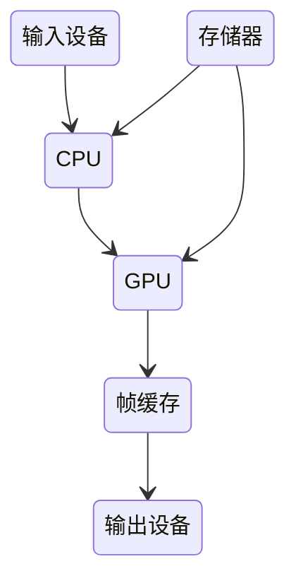

# 可视化

> 将数据组织成易于为人所理解和认知的结构，然后用图形的方式形象地呈现出来的理论、方法和技术

Web 开发的前端主要还是关注内容和样式，图形的渲染和绘制是由浏览器底层来完成的，而可视化前端则可能要深入底层渲染层，去真正地控制图形的绘制和细节的呈现

## 图形基础

### 通用图形系统

数据经过 CPU 处理，成为具有特定结构的几何信息。然后，这些信息会被送到 GPU 中进行处理。在 GPU 中要经过两个步骤生成光栅信息。这些光栅信息会输出到帧缓存中，最后渲染到屏幕上



- 光栅：几乎所有的现代图形系统都是基于光栅来绘制图形的，光栅就是指构成图像的像素阵列
- 帧缓存：一个像素对应图像上的一个点，它通常保存图像上的某个具体位置的颜色等信息

### HTML+CSS

可以实现一些简单的柱状图、饼图，但据与图形的对应关系不直观，同时由于浏览器对HTML以及CSS的渲染机制，会导致渲染开销比较大

### SVG

声明式绘图系统，只不过是将 HTML 标签替换成 SVG 标签，运用了一些 SVG 支持的特殊属性，HTML+CSS有的缺点它也有，但SVG 则弥补了HTML+CSS不规则图形绘制方面的不足，让不规则图形的绘制变得更简单了

创建SVG 元素要使用 document.createElementNS 方法：

```js
document.createElementNS('http://www.w3.org/2000/svg', 'circle')
```

```html
<!-- 画个黑边的黄圈 -->
<svg xmlns="http://www.w3.org/2000/svg" version="1.1">
  <circle cx="100" cy="50" r="40" stroke="black"
  stroke-width="2" fill="orange" />
</svg>
```

同时由于是html标签，添加事件相比canvas更方便，可以直接使用dom操作，同时SVG绘制的是矢量图形，这点也比canvas更有优势


### Canvas

指令式绘图系统，能够直接操作绘图上下文，比HTML和SVG快,简单易操作和高效的渲染能力是它的优势，但是它的缺点是不能方便地控制它内部的图形元素

```html
<canvas width="512" height="512"></canvas>
```
```css
canvas {
  width: 256px;
  height: 256px;
}
```
```js
// 获取上下文
const canvas = document.querySelector('canvas');
const context = canvas.getContext('2d');

// 绘制一个正方形
const rectSize = [100, 100];
context.fillStyle = 'black';
context.beginPath();
context.rect(0.5 * canvas.width, 0.5 * canvas.height, ...rectSize);
context.fill();
```

#### WebGL

在要绘制的图形数量非常多、对较大图像的细节做像素处理、绘制3D物体，相比Canvas2D有较大的性能优势

WebGL 绘制一个图形的过程，一般需要用到两段着色器，一段叫顶点着色器（Vertex Shader）负责处理图形的顶点信息，另一段叫片元着色器（Fragment Shader）负责处理图形的像素信息，WebGL 可以并行地对整个三角形的所有像素点同时运行片元着色器

```js

const canvas = document.getElementById('canvas-gl');
const gl = canvas.getContext('webgl');

// 顶点着色器
const vertex = `
  attribute vec2 position;

  void main() {
    gl_PointSize = 1.0;
    gl_Position = vec4(position, 1.0, 1.0);
  }
`;

// 片元着色器
const fragment = `
  precision mediump float;

  void main()
  {
    gl_FragColor = vec4(1.0, 0.0, 0.0, 1.0);
  }    
`;

// 将着色器代码分别创建成 shader 对象
const vertexShader = gl.createShader(gl.VERTEX_SHADER);
gl.shaderSource(vertexShader, vertex);
gl.compileShader(vertexShader);

const fragmentShader = gl.createShader(gl.FRAGMENT_SHADER);
gl.shaderSource(fragmentShader, fragment);
gl.compileShader(fragmentShader);

// 一些配置
const program = gl.createProgram();
gl.attachShader(program, vertexShader);
gl.attachShader(program, fragmentShader);
gl.linkProgram(program);
gl.useProgram(program);

// 定义三角形的三个顶点
const points = new Float32Array([
  -1, -1,
  0, 1,
  1, -1,
]);

// 定义好的数据写入 WebGL 的缓冲区
const bufferId = gl.createBuffer();
gl.bindBuffer(gl.ARRAY_BUFFER, bufferId);
gl.bufferData(gl.ARRAY_BUFFER, points, gl.STATIC_DRAW);


const vPosition = gl.getAttribLocation(program, 'position'); //获取顶点着色器中的position变量的地址
gl.vertexAttribPointer(vPosition, 2, gl.FLOAT, false, 0, 0); //给变量设置长度和类型
gl.enableVertexAttribArray(vPosition); //激活这个变量

// 清除画布然后绘画
gl.clear(gl.COLOR_BUFFER_BIT);
gl.drawArrays(gl.TRIANGLES, 0, points.length / 2);
```

## 数学

### 向量和坐标系

- HTML 采用的是窗口坐标系，以参考对象（最接近图形元素的 position 非 static 的元素），左上角为坐标原点，x 轴向右，y 轴向下，坐标值对应像素值
- SVG 采用的是视区盒子（viewBox）坐标系，以 svg 根元素左上角为坐标原点，x 轴向右，y 轴向下
- Canvas 采用的坐标，默认以画布左上角为坐标原点，右下角坐标值为 Canvas 的画布宽高值
- WebGL 的坐标系，是一个三维坐标系。它默认以画布正中间为坐标原点，x 轴朝右，y 轴朝上，z 轴朝外

坐标系变换：在canvas中可以通过transfrom改变原点来变换坐标系，不仅可以简化顶点的计算、同时也能优化计算量

可以用二维向量来表示一个平面上的点和线段：

- 点：(x,y)
- 线段：(0,0) ~ (x,y)

向量运算：

- 相加：v1(x1,y1) + v2(x2,y2) = 在平面上得到一个新的点（x1 + x2, y1 + y2），一条新的线段[(0, 0), (x1 + x2, y1 + y2)]，以及一段折线：[(0, 0), (x1, y1) , (x1 + x2, y1 + y2)]

个向量包含有长度和方向信息：

- 长度可以用向量的 x、y 的平方和的平方根来表示
- 方向可以用与 x 轴的夹角来表示

如果我们希望以点 (x0, y0) 为起点，沿着某个方向画一段长度为 length 的线段：

$$v_1^→ = length * v^→ (cos(与x轴夹角),sin(与x轴夹角))$$

