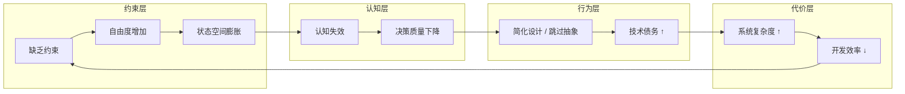

# 技术债务

> 技术债务是局部最优决策在时间维度上对全局最优结构的持续侵蚀。

## 概述

技术债务的核心定义：

> 系统在不确定环境中，为追求短期目标而偏离最优结构，并在时间维度上累积的复杂性成本。

金融债务的类比价值在于：债务需要利息（持续成本）、需要偿还（重构代价）、需要管理（治理策略）。

## 本质

从第一性原理出发，技术债务由几个基本要素构成：

- **有限资源约束**：时间、人力、认知都是有限的
- **不完全信息下的决策**：需求不稳定，未来不可知
- **系统复杂性的不可逆增长（熵增）**：耦合、状态、依赖只会累积，不会自动消散
- **时间累积效应（复利）**：债务的利息会随时间增长

这共同决定了技术债务的本质：

> **"局部最优决策"在时间累积后对"全局最优结构"的侵蚀**

任何工程系统都同时受到两种力量的作用：

- **短期交付压力**，驱动局部最优
- **长期演化能力**，要求全局最优

技术债务产生的根因不是"偷懒"，而是在不确定性环境下，系统性地偏向了局部最优。这种偏向会带来结构性后果：模块边界被打破，抽象层次被污染，依赖方向失控，状态复杂度上升。

### 不可避免性

从第一性原理看，技术债务的"管理"而非"消除"是工程现实：

- **权衡不可避免**：未来不可预测，成本有限，系统持续演化——做任何决策都会产生权衡
- **债务不可完全消除**：权衡的代价会以某种形式在系统中累积
- **失控才是问题**：债务本身不是灾难，失控的债务（不可见、不可定位、不可偿还）才是

**关键洞察**：

> 没有治理体系的债务，等于没有演化能力的系统。

一个没有债务也不需要治理的系统，要么是玩具，要么是僵死的。

## 工程哲学

### 债务不是问题，失控才是

健康的债务状态：债务是显性的、可度量的、可偿还的。
危险的债务状态：债务被掩盖、不可定位、影响全局。

两者的区别不在于债务的多少，而在于系统对债务的**感知能力**和**响应能力**。

### 好的系统允许局部不优

这是技术债务哲学中最反直觉的洞察：

> 用局部不完美，换取整体可演化性。

接受冗余以降低耦合，接受中间层以隔离变化，接受性能损失以换取结构清晰——这些都是主动选择的"债务"，但它们服务于系统的长期健康。

局部最优与全局最优之间，存在根本性的张力。工程师的判断力，在于识别何时应该为全局牺牲局部。

### 重构不是行为，而是能力

当系统始终处于可重构状态，才代表着重构能力。

这依赖清晰的边界、可替换的模块、可验证的行为。当这三者具备时，重构随时可以发生，成本可控。当这三者缺失时，即使有重构的意愿，也无从下手。

重构能力是系统健康的结果，而不是系统健康的原因。

### 约束优于自由

技术债务的根源之一是"无约束的灵活性"。

> 限制选择空间，降低错误概率。

明确的架构规则、单向依赖、禁止跨层访问——这些约束看似限制了自由，实则是在保护系统的演化空间。自由度越高，状态空间越大，债务产生的概率越高。约束是系统对抗熵增的主动防御。

## 底层机制

### 失控循环：债务增强回路

技术债务的积累本质是一个**自我强化的增强回路（Reinforcing Loop）**，可以从两个视角统一描述：



**回路机制**：

| 阶段 | 核心 | 后果 |
|------|------|------|
| 约束层 | 缺乏约束 | 自由度失控，状态膨胀 |
| 认知层 | 认知过载 | 决策质量下降 |
| 行为层 | 走捷径 | 债务累积 |
| 代价层 | 效率损失 | 交付压力进一步 ↑ |

**关键特征**：

- 无外力干预时，回路持续恶化，直到系统失去演化能力
- 每个阶段都是下一阶段的触发器，也是上一阶段的结果

**打破回路的杠杆点**：

- 约束层（最有效）：重建架构规则、边界、协议
- 认知层（次有效）：提升代码可读性、降低理解成本
- 行为层（见效快但不可持续）：强制重构
- 代价层（被动应对）：增加人力、延长工期

### 抽象失效

技术债务最核心的结构问题是**抽象失效（Abstraction Leakage）**：

> 抽象层不再隔离复杂性，而是传播复杂性。

健康的抽象是"压缩复杂度"——上层不需要知道底层细节。而当抽象失效时，上层开始依赖底层细节，业务逻辑与技术细节耦合，跨层调用成为常态。此时抽象不再是屏障，而变成了放大器：每一层的复杂度都向上传递，最终在系统顶层叠加。

### 时间维度的非线性成本

技术债务的关键特征是成本的非线性增长：

```
维护成本 ∝ 系统耦合度 × 状态复杂度²
```

原因在于依赖网络是图结构而非线性结构。修改一个节点，影响会沿依赖边传播；耦合度越高，传播范围越广；状态越复杂，每次传播引发的副作用越难预测。

这解释了为什么"稍后再改"往往演变为"永远无法改"——债务的利息不是算术级数，而是几何级数。

### 约束退化

系统的架构边界、规则、协议是抵抗熵增的主动防御。但这些约束随时被打破，且无惩罚机制——**约束退化（Constraint Degradation）** 使熵增从被动变成主动。

```
规则确立 → 短期内严格遵守
   ↓
交付压力 / 走捷径的诱惑
   ↓
规则被打破 → "例外"出现
   ↓
例外成为常态 → 规则名存实亡
   ↓
新规则确立（更低标准）
```

每一次"例外"都降低了下一次打破规则的心理成本。当约束被系统性地突破，债务不再是意外，而是被默认允许的常态。

### 认知断链

代码无法承载设计意图，跨代际知识传递失真——**认知断链（Cognitive Disconnection）** 使债务从"知道的"变成"不知道的"。

```
设计时：清晰的意图、隐式的约束
   ↓
实现时：部分意图被编码，部分约束被遗忘
   ↓
维护时：代码存在，意图消散
   ↓
修改时：不知晓的约束被破坏，债务产生
```

人员流动、跨团队协作、时间推移都会加速认知断链。当设计意图无法从代码中读出时，每一次维护都在制造新的债务。

## 总结

### 核心洞察

失控循环与约束退化是技术债务治理的两大杠杆：

- **失控循环**：缺乏约束 → 认知过载 → 走捷径 → 债务累积 → 效率下降 → 进一步缺乏约束
- **约束退化**：规则被打破 → 例外成为常态 → 标准降低 → 债务被默认允许

打破失控循环的杠杆点在于**约束层**（最有效），次之是**认知层**，行为层见效快但不持久，代价层是被动应对。

### 认知层次

| 层次 | 认知 | 转化条件 |
|------|------|---------|
| 开始 | 债务 = 烂代码，需要避免 | 关注代码洁癖 |
| 然后 | 债务 = 工程权衡，需要管理 | 经历交付压力下的取舍 |
| 最终 | 债务 = 系统演进的时间成本，需要治理体系 | 建立可见性 → 可度量 → 可偿还的闭环 |

### 最终结论

> 技术债务不可消除，但可以被**设计**（主动选择）、**约束**（限制增长）、**管理**（偿还策略）。
>
> 真正的工程能力，不是避免债务，而是在债务存在的情况下仍能持续演化系统。

## 关联内容（自动生成）

- [/软件工程/软件设计/代码质量/代码重构.md](/软件工程/软件设计/代码质量/代码重构.md) 重构是偿还技术债务的核心手段，通过改善代码内部结构而不改变外部行为来降低系统复杂度
- [/软件工程/架构/架构重构.md](/软件工程/架构/架构重构.md) 架构层面的重构涉及系统整体结构的调整，是应对大规模技术债务的战略手段
- [/软件工程/软件设计/软件开发本质.md](/软件工程/软件设计/软件开发本质.md) 从软件开发本质视角探讨技术债务的不可避免性，以及如何将债务作为演进节奏的治理工具
- [/软件工程/架构/架构思维.md](/软件工程/架构/架构思维.md) 架构思维强调在局部最优与全局最优之间做权衡，与技术债务的核心矛盾直接相关
- [/软件工程/架构/演进式架构.md](/软件工程/架构/演进式架构.md) 演进式架构提供了一套在债务存在的情况下仍能持续演化系统的方法论
- [/软件工程/领域驱动设计.md](/软件工程/领域驱动设计.md) DDD 通过领域建模和边界划分来控制复杂度，是预防技术债务产生的重要方法
- [/软件工程/软件设计/代码质量/整洁代码.md](/软件工程/软件设计/代码质量/整洁代码.md) 整洁代码实践从代码层面减少债务积累，保持代码的可读性和可维护性
- [/软件工程/架构/系统设计/可用性.md](/软件工程/架构/系统设计/可用性.md) 高可用系统设计中的容错、降级等策略与技术债务治理中的风险控制理念相通
- [/软件工程/研发效能.md](/软件工程/研发效能.md) 研发效能关注如何在保证质量的前提下提升交付速度，与技术债务的权衡决策密切相关
- [/软件工程/架构/架构治理.md](/软件工程/架构/架构治理.md) 架构治理提供了一套系统性的方法来管理和控制技术债务的积累与偿还
- [/软件工程/架构模式/分层架构.md](/软件工程/架构模式/分层架构.md) 分层架构的约束规则（单向依赖、禁止跨层访问）是抵抗约束退化的基础，是重构能力的前提
