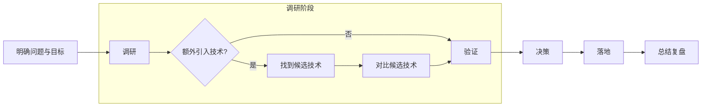

# 技术选型（Technical Decision Making）

> 技术选型不仅是解决技术问题，更是一种战略性决策活动。  
> 它关乎业务目标、团队能力、系统演进与组织协同。

---

## 一、定义与认知

- **狭义**：为了解决特定技术问题，在多个可行方案中作出选择。  
- **广义**：一种技术决策过程，需在性能、成本、风险、演进等维度取得平衡。  
- **目标**：通过理性决策，使系统在可控复杂度下获得最大业务价值。

---

## 二、常见误区

- ❌ **不尊重业务需求**：脱离实际场景的“技术崇拜”。  
- ❌ **随波逐流**：跟风热门技术而缺乏独立评估。  
- ❌ **面向简历编程**：以自我技能为中心而非业务目标。  
- ❌ **过度考虑**：陷入理论完美，错失交付时机。  
- ❌ **主观化判断**：把个人经验当作普遍真理。

---

## 三、选型流程

### 1. 明确问题与目标

- 当前遇到了什么问题？  
- 期望达成什么目标？  
- 技术选型的评判标准是什么？（性能、稳定性、成本、可维护性）

---

### 2. 技术调研

> **如无必要，勿增实体。**

- 判断：是否真的需要新技术？  
- 候选技术来源：
  - 团队内部经验分享  
  - 技术社区、搜索引擎  
  - ThoughtWorks 技术雷达、开源中国、InfoQ 等  

**拓展技术视野路径：**
- 定期浏览技术趋势报告  
- 在实践中小规模验证新技术  

---

### 3. 技术对比与评估

#### 技术因素

> “是否满足业务才是首要标准。”

- 官方活跃度：发布周期、提交记录、README 完整度、issue 响应率  
- 社区活跃度：搜索热度、第三方生态、Star 数（仅作参考）  
- 可维护性与可运维能力  
- 学习曲线与团队熟悉程度  
- 性能与安全性（补丁频率与严重程度）

**线上使用开源组件注意事项：**
- 深入研究与充分测试  
- 灰度上线，持续观察  
- 制定应急方案（数据备份 / 回滚路径）

#### 非技术因素

- 市场验证度：是否被大规模成功采纳  
- 招人难度与人才生态  
- license 法律风险  
- 团队利益与战略平衡  
- 技术炒作周期（Hype Cycle）  

#### 评估方法

- 因素加减法  
- SWOT 分析（Strength / Weakness / Opportunity / Threat）

---

### 4. 验证与试点

- 小型原型（PoC）验证  
- 关键性能与可维护性测试  
- 评估迁移成本与可回退性  

---

### 5. 决策与落地

- 召开技术评审会议，邀请相关方共同决策  
- 以小规模试水形式逐步上线  
- 建立反馈与监控机制  

---

### 6. 总结与复盘

- 记录选型过程、权衡与决策结果  
- 沉淀为组织级知识资产（ADR / Wiki）  
- 对失败选型进行分析，提炼经验教训  

---

## 四、影响维度

### 1. 技术选型与项目类型

| 项目类型 | 推荐策略 |
|-----------|-----------|
| 短生命周期 | 追求快速落地、低成本、可替换性 |
| 长生命周期 | 优先稳定成熟、社区活跃、LTS版本 |
| 核心项目 | 严控风险，确保技术支撑与长期维护 |
| 边缘项目 | 可用于尝试新技术或验证性实验 |
| 新项目 | 注重灵活性与创新空间 |
| 老项目 | 强调与现有体系融合 |
| 探索型项目 | 既要快速，也要可维护 |
| 守成型项目 | 稳定优先，避免激进变动 |

---

### 2. 技术选型与团队能力

| 团队特征 | 对应策略 |
|-----------|-----------|
| 技术强 | 可尝试未来趋势，适度激进 |
| 技术薄弱 | 聚焦稳定，强化规约与标准化 |
| 小团队 | 简单优先，避免引入复杂依赖 |
| 大团队 | 按问题域细分，建立自治技术选型机制 |

---

### 3. 技术选型与组织架构

> “系统架构往往是组织架构的反映。” —— 康威定律  

- 团队边界影响技术栈边界  
- 选型需匹配团队协作模型与交付节奏  
- 跨团队统一选型应有治理机制与评审制度  

---

## 五、版本与演进策略

- 使用 BOM（Bill of Materials）统一版本管理  
- 优先使用正式版与 LTS 版本  
- 关注软件间兼容关系  
- 对最新版本保持“观望 + 小步升级”策略  
- 新旧版本不兼容时，应优先跟进新版  
- 建立版本升级节奏与风险评估机制  

---

## 六、失败与补救

- 构建抽象层，逐步以新实现替换旧技术  
- 通过接口封装减少外部依赖影响  
- 对失败案例进行复盘：判断是选型错误还是使用方式问题  

---

## 七、对开源项目的二次开发

> “能不改源码，就不要改源码。”

- 通过外部封装方式扩展功能，而非直接修改项目核心代码  
- 若必须修改核心代码，应同时评估升级可维护性  
- 若一个开源项目需大量改动才能使用，说明它并不适合当前业务场景  

---

## 八、总结

- 技术选型是架构治理的关键环节，决定了系统的演进方向。  
- 决策不仅关乎技术优劣，更关乎业务匹配、组织能力与长期成本。  
- 最佳的选型往往不是“最先进”的，而是“最适合当前阶段”的。  

---

> “每一次技术选型，都是一次组织与系统对外部复杂性的回应。”
