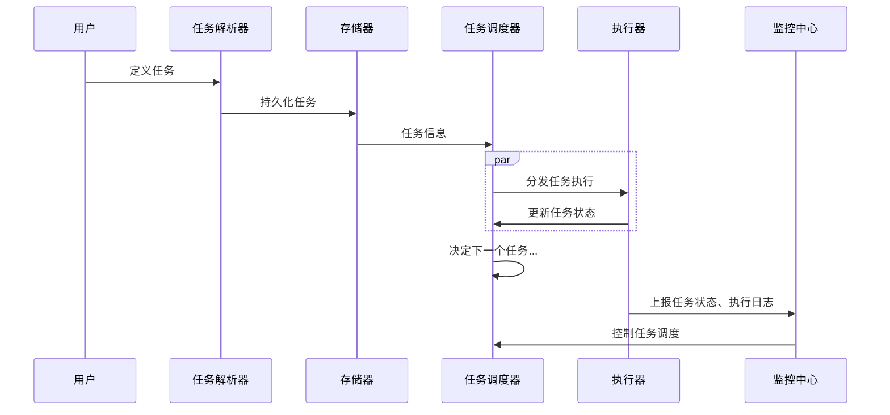
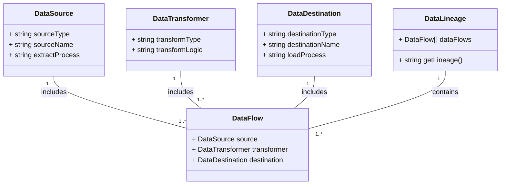

# 数据架构

## 数据存储

### [数据库](/中间件/数据库/数据库.md)

### [数据仓库](/数据技术/数据仓库.md)

### 数据湖

一个集中式存储库，允许以任意规模存储所有结构化和非结构化数据

常见的实现形式为表格式，只负责依照某种格式存储到存储系统中，再由独立的查询引擎实现读取数据查询

### 湖仓一体

业界主流有两种做法：

1. 将数据仓库构建在数据湖之上
2. 数据仓库与数据湖独立，二者通过消息通道进行数据同步

### [分布式存储](/软件工程/架构/系统设计/分布式/分布式数据.md)

### 区块链

## 数据集成

将来自不同数据源的数据整合到一个统一的数据存储中，以便于数据分析、业务报告和决策支持。一般为 ETL 或者 ELT

### 批量数据抽取

- 增量抽取：只抽取源系统中发生变化的数据，常用的方法包括使用增量更新标志或游标等
- 全量抽取：在某些情况下需要确保数据的完整性和一致性的做法

### 流式数据抽取

- 实时数据源订阅接入
- 窗口化的抽取

### 批量数据转换

- 清洗数据：去除重复数据、处理缺失值、解决数据不一致性等，以确保数据质量
- 格式转换：将数据从源系统的格式转换为目标系统的格式，如日期格式转换、文本编码转换等
- 字段映射：将源系统中的字段映射到目标系统中的字段，包括字段重命名、字段类型转换等
- 计算衍生字段：根据现有字段计算新的字段，如计算总和、平均值、百分比等
- 数据合并：将来自多个数据源的数据进行合并或连接，以获得更完整的数据视图

### 流式数据转换

- 除了有常规批处理的操作外
- 最重要的是基于窗口的计算，如滑动窗口、固定窗口、会话窗口等

### 批量数据加载

### 流式数据加载

### 错误处理

最重要的错误处理可能就是需要保证抽取过程的数据一致性，一种方式是引入事务机制保证原子性落库，另外一种则是引入死信队列，用来保存出错的数据

## 数据计算

### [批处理](/数据技术/数据处理.md#批处理)

### [流处理](/数据技术/数据处理.md#流处理)

### 流批一体

1. 计算一体：同一套计算逻辑可以同时应用于流处理与批处理两种模式，且在最终结果上一致。
2. 存储一体：流处理与批处理过程中全程数据存储在同一介质，即不管采用何种处理模式，数据的流转及存储都在同一介质中完成

## 数据应用

### 任务调度

任务调度通常用于调度ETL（Extract, Transform, Load）作业、数据处理作业、数据分析作业等

调度类型：

- 定时调度
- 事件触发调度触发等。
- 依赖关系调度
- 动态调度：根据系统负载、资源可用性等动态调整任务的执行时间

### 数据建模

- ER建模
- 维度建模
- 数据流建模

### BI

通过收集、分析和呈现数据来提供商业洞察的技术和工具

通常包括以下功能：

1. 数据可视化： 将数据转化为图表、仪表盘、报表等形式，以便用户直观地理解数据。
2. 数据分析： 提供各种分析功能，包括查询、筛选、排序、聚合等，以便用户对数据进行深入的分析和探索。
3. 报告和仪表盘： 支持定制化报告和仪表盘的生成，以满足不同用户和业务部门的需求。
4. 数据挖掘： 使用数据挖掘算法和模型来发现数据中的隐藏模式、关联和趋势，从而提供更深入的洞察和预测。
5. 实时监控和警报： 提供实时监控功能，监测业务指标的变化和异常情况，并及时发出警报

### 报表

报表与 BI 的区别在于 BI 更加灵活，且 BI 覆盖更广泛的功能。同时 BI 能够支持实时数据的查询和分析

### [数据分析](/数据技术/数据分析.md)

#### [数据可视化](/数据技术/数据分析.md#数据可视化)

### [机器学习](/数据技术/机器学习.md)

## 数据治理与安全

### 数据资产管理

对组织内部的数据资产进行管理，包括数据集、数据表、数据文件等。提供数据目录功能，帮助用户了解和查找组织中可用的数据资产

### 质量管理

在数据生命周期的各个阶段，通过一系列的策略、流程和工具，确保数据的准确性、一致性、完整性、可靠性和及时性的过程

#### 规范化与标准化

- 命名规范
- 数据格式规范
- 统一的单位
- 数据值域约束
- 数据字典

### 元数据管理

- 数据发现和数据理解： 元数据提供了对数据内容和结构的描述，帮助用户理解数据的含义、来源和用途。通过元数据，用户可以快速发现并理解可用数据资源，提高数据的可发现性和可用性。
- 数据集成和数据血缘追踪： 元数据记录了数据之间的关系和依赖，包括数据源、数据流程、数据转换等信息。这些信息可以帮助用户了解数据的血缘关系，追踪数据的来源和流向，支持数据集成和数据治理

分类：

- 技术元数据：描述数据的物理特性和技术属性，例如数据表结构、字段类型、索引信息等，用于支持数据存储、数据管理和数据处理的技术需求。
- 业务元数据：描述数据的业务含义和业务规则，例如数据所有者、数据用途、业务规则等，用于帮助用户理解数据的含义、用途和价值，支持业务决策和业务创新。
- 操作元数据：描述数据的操作历史和操作行为，例如数据提取、转换、加载（ETL）过程、数据访问记录等，用于追踪和监控数据的操作流程和数据处理过程，支持数据治理和数据质量管理。
- 管理元数据：描述数据的管理信息和管理策略，例如数据分类、数据权限、数据保留期限等，用于管理数据资源的分配、使用和维护，支持数据治理和数据安全管理

### 数据血缘

数据血缘包括数据源、数据转换器、数据目的地和数据流程，它们之间的关系是数据源提供原始数据，经过数据转换器处理后，将数据传递到数据目的地进行存储或进一步处理。数据流程记录了数据在整个流程中的来源、流向和变换过程，而数据血缘则由多个数据流程组成

### [安全与隐私]((/计算机网络/网络安全/安全性.md))

#### 数据权限

- 访问权限
- 操作权限
- 范围权限
- 行级权限
- 字段权限
