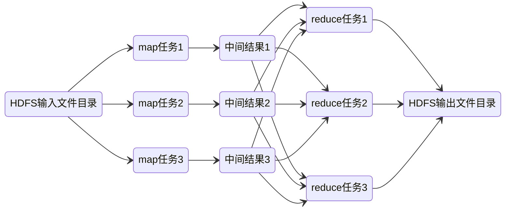

# 数据系统

- 在线系统：服务等待客户的请求或指令到达。每收到一个，服务会试图尽快处理它，并发回一个响应
- 批处理系统：大量的输入数据，跑一个作业（job）来处理它，并生成一些输出数据
- 流处理系统：像批处理系统一样，流处理消费输入并产生输出（并不需要响应请求）。但是，流式作业在事件发生后不久就会对事件进行操作

## 基石

### 可靠性

造成错误的原因叫做故障（fault），预料并应对故障的系统特性可称为容错（fault-tolerant）或者弹性（resilient）。

故障（fault）不同于失效（failure），故障定义的是系统偏离正常状态，失效则是整个系统不能对用户提供服务

硬件的故障、软件错误、人为失误都会导致故障或者失效

### [可伸缩性](/软件工程/架构/系统设计/伸缩性.md)

可伸缩性（Scalability） 是用来描述系统应对负载增长能力的术语

负载可以用一些称为 负载参数（load parameters） 的数字来描述,如每秒请求数、读写请求比率等等。

为了描述性能，单个请求的响应参数是没有太多参考参考价值的，需要通过一个可测量的数值分布来描述：

为了明确大多数用户的指标，中位数是最有价值的，而99%，95%则是用来描述异常的刺突。

为了应对负载，可以进行垂直扩展或者水平扩展。没有一种银弹可以解决所有的应对负载需求，一个良好适配应用的可扩展架构，是围绕着假设（assumption）建立的，这就是所谓负载参数。

### 可维护性

- 可操作性：降低运维复杂度。
- 简单性：通过封装降低复杂度。
- [可演化性](/软件工程/架构/演进式架构.md)：简单易懂的系统通常比复杂系统更容易修改。

### 数据模型

不同的数据模型是为不同的应用场景而设计的。选择适合应用程序的数据模型非常重要。

应用层有各种领域概念，存储层则有JSON、XML或关系模型，数据库层则有以内存或字节来表示JSON、XML等，最底层使用电流或者脉冲来表示字节。

关系模型已经持续称霸了大约25~30年，2010年新起的NoSQL文档模型在最近一段时间内也慢慢与关系模型配合使用，随着时间的推移，关系数据库和文档数据库似乎变得越来越相似。

由于应用的数据最终都被转换成关系模型，应用代码跟数据库之间就需要一个转换中间层，由于现在大部分使用了OO编程语言，二者之间转换还是挺吃力的，即出现阻抗不匹配。

当前的文档模型和上世纪70年代的层次模型很像，一对多很容易支持，但多对多就抓瞎了，文档模型会不会重蹈层次模型的覆辙。

文档模型拥有较关系模型强的架构灵活性，因为我们对数据的解释是发生在我们的代码之中，这意味着一旦数据模型发生改变，修改代码就好了。

同时文档模型拥有数据局部性优势，但这只对同时需要同一文档里的大部分数据时下的场景有效。

### 查询语言

相较于命令式查询，声明式查询更适合并行。

对于声明式查询语言来说，在编写查询语句时，不需要指定执行细节：查询优化程序会自动选择预测效率最高的策略

- [css选择器](/DSL/CSS/选择器.md)
- [SQL](/DSL/SQL.md)

介于命令式与声明式之间的有如MapReduce的map及reduce操作，[函数式编程](/编程语言/编程范式/函数式编程.md)其实也是介于二者之间，其通过较高层级的抽象实现，底层运行时可以有效地利用并行性来优化

图状数据模型查询语言

- Cypher
- SPARQL
- Datalog

### 存储与查询

许多数据库在内部使用了日志（log），也就是一个 仅追加（append-only） 的数据文件

为了解决对一个值多次写入造成的空间浪费，日志被分成多个固定大小段，当新启动一个段写入时，可以对段进行合并压缩减少磁盘空间占用

日志结构需要考虑的问题：

- 格式：二进制效率更高
- 删除记录：需要在日志中体现某个key被删除，这样就压缩合并就能不处理这个key
- 崩溃恢复：本质上就是重新读取重新生成索引，为了加快速度，可以考虑将索引快照持久化
- 并发：一写多读

这种方式对于写入的性能非常好，但读取性能很差，于是引入了索引。

#### 索引

索引是数据库维护的一个主数据的附加结构，根据这个附加结构可以提升查询速度，但会对写入速度造成影响。

##### 哈希索引

这种索引要求全部的索引要能放入内存，这会导致许多问题，同时哈希索引也无法进行范围查找。

##### SSTables

- 排序字符串表

它要求key是有序的，并且每个段中每个key只能出现一次，查找key时，可以在稀疏索引中通过排序查找里快速找到

为了实现SSTables，需要在内存中维护一个可排序的数据结构，每次写入时都会写到内存表，再由系统周期性刷到磁盘，为避免崩溃导致内存的数据还没刷到磁盘丢失，再维护一个日志文件，每进行一个操作就写到日志，以供恢复时使用

需要查找时，就对段逐个倒叙查找，直到找到

##### LSM树

以上功能就是LSM树(log-structured merge tree)

##### B树

#### 事务处理与分析处理

为了避免进行事务分析对在线事务的影响，通过采用同步数据到数据仓库的方式来解决这个需求，将数据存入仓库的过程称为“抽取-转换-加载（ETL）”

对于部分的查询只需要用到少部分列，但一个事实表可能用来成百上千个列，这个时候引入列存储来提升性能，相对来说一个列的重复数据会较多，可以执行列压缩

#### 物化视图加快查询

- 将一些常用的COUNT MAX MIN等聚合值计算出来缓存 加快查询速度

### 编码与演化

新旧版本的代码，以及新旧数据格式可能会在系统中同时共处。系统想要继续顺利运行，就需要保持双向兼容性：

- 向后兼容：​新代码可以读旧数据
- 向前兼容：旧代码可以读新数据

数据的使用形式：

- 在内存中，数据保存在对象，结构体，列表，数组，哈希表，树等中
- 在传输中，数据通过XML或者JSON等进行编码

相较于XML和JSON，二进制编码Thirft/Protocol Buffers/Avro更加节省空间。

为了保证软件演化过程的向前向后兼容，对每个字段，通过一个唯一标签来标志，只要字段不被删除，新的代码肯定可以处理老数据，但反过来，只有添加的每个字段是可选的或者有默认值，才能向前兼容。

数据类型也对演化过程有影响，如果老数据是32位的，新数据是64位的，升级可以无缝迁移，但向前兼容时就会有问题。

使用读模式跟写模式解决差异：

同时如果数据流经过旧代码，那么部分数据很有可能丢失：

#### 数据流模式

- 基于数据库：数据不仅在进程之间流动 同时也在过去与未来之间流动
- 基于服务：各个服务之间流动 RPC请求需要向后兼容 RPC响应需要向前兼容
- 基于消息流：通过异步消息队列或者分布式Actor框架进行流动

## 批处理系统

- 输入数据是有界且不可变的
- 除了输出 其他操作都没有副作用

### UNIX的管道

### MapReduce

输出的结果：

- 搜索索引
- 键值对

### 分布式批处理需要解决的问题

1. 如何将输入数据分区
2. 容错：任务可能随时会失败

## 流处理

### [消息系统](/中间件/消息队列/消息队列.md)

消息系统与传统的数据库有着本质的区别：数据临时与永久之分

分区日志消息系统：结合了传统消息系统与数据库：既是流，又能存

### 流与数据库

- 数据库的变更通过流与系统异构存储保持同步
- 变更数据捕获（CDC）：初始快照 + 后续变更操作
- 事件溯源：回放所有日志得到数据的最终状态

本质上就是[状态复制机](/软件工程/架构/系统设计/分布式/分布式数据.md#复制)的实现

本质上数据库的日志就是流，数据库里的数据就是当前流重放的快照

### 流处理

- 复杂事件处理（CEP）：存储一个搜索模式，在流数据流经时判断是否符合这样的模式
- 流分析：对一定窗口期内的数据进行计算、分析
- 通过流来进行RPC

#### 时间问题

流处理依赖于本地时间戳，时钟是不可靠的，同时考虑消息堆积、软件错误等问题，基于时间戳的流分析可能不准

#### 窗口类型

1. 轮转窗口：固定长度，相互之间没有重叠且紧邻 [1,3] [4,6]
2. 跳跃窗口：固定长度，允许之间重叠以进行平滑过度 [1,3] [2,4]
3. 滑动窗口
4. 会话窗口：没有固定时间，将同一用户的事件组合在一起

### 容错

- 微批处理：将流切成固定大小的块，如果这个块发生错误，则丢弃这个块的所有输出
- 校验点：定期生成检查点，如果流处理发生错误，就回到上一个检查点重新跑

这需要消费端保证幂等性，否则为了容错会输出不止一次导致副作用
