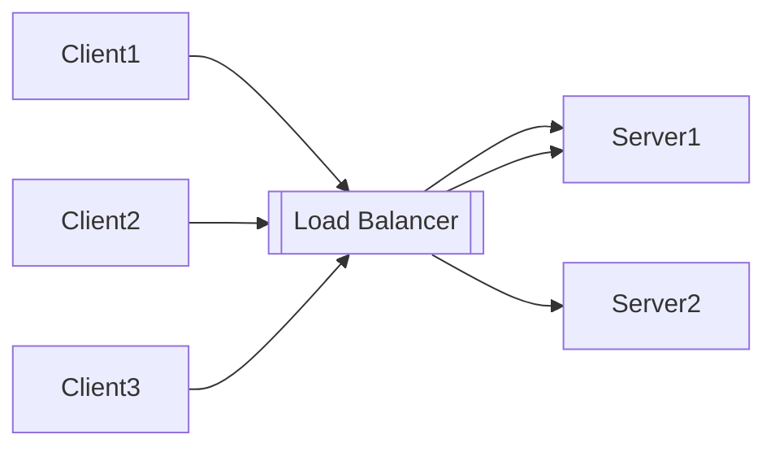
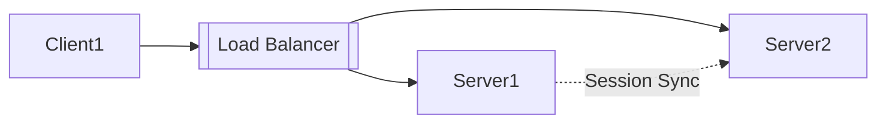
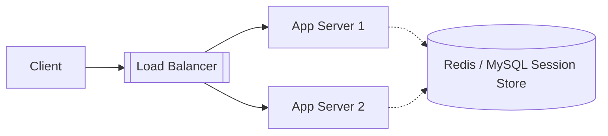

# 伸缩性（Scalability）

> 伸缩性描述了系统在应对负载变化时，通过调整资源（硬件或软件）来维持性能与稳定性的能力。
> 一个具备良好伸缩性的系统，能够“按需增长、按需缩减”，在性能、成本与复杂度之间达到平衡。

---

## 一、伸缩性的核心概念

### 1.1 定义与衡量

* **高伸缩性**：系统能在增加计算、存储或网络资源时，近似线性地提升吞吐能力。
* **伸缩性差**：系统性能增长缓慢或成本高昂，扩容效率低下。
* **衡量指标**：

  * **吞吐量提升比**（Scaling Efficiency）
  * **响应时间变化曲线**
  * **扩容成本与收益比**

### 1.2 伸缩类型

| 类型                           | 描述         | 示例                                |
| ---------------------------- | ---------- | --------------------------------- |
| **垂直伸缩（Vertical Scaling）**   | 提升单节点性能    | 增加 CPU、内存、磁盘性能                    |
| **水平伸缩（Horizontal Scaling）** | 增加节点数量     | 扩展服务实例、副本或分片                      |
| **弹性伸缩（Elastic Scaling）**    | 根据负载自动调整规模 | Kubernetes HPA、Auto Scaling Group |

---

## 二、热点问题（Hotspot）

> 热点是伸缩性问题中最常见的瓶颈来源。
> 热点会引发链式反应，从局部压力到系统崩溃。

### 2.1 热点链路

```
行为热点 → 链路热点 → 数据热点 → 热点压力 → 瓶颈限制 → 系统崩溃
```

### 2.2 热点类型

* **行为热点**：某一类用户行为（如秒杀、签到）集中触发。
* **链路热点**：同一条调用链（如下单链路）频繁被请求。
* **数据热点**：某个 Key 或 ID 被大量并发访问（如同一商品）。

---

## 三、热点治理策略

### 3.1 热点预测

* 基于历史 PV/UV 数据进行建模，提前识别高风险点；
* 可结合 **舆情监控、运营活动计划、搜索热度** 等进行预测。

### 3.2 热点发现

* **实时监控日志**：统计接口 QPS、延迟、错误率；
* **聚合分析**：对调用链数据聚合，计算访问集中度；
* **事件触发**：当阈值超标时发布热点数据事件。

### 3.3 热点预案

* 缓存预热：提前加载可能成为热点的数据；
* 动态扩容：热点发现后对相关服务、缓存实例扩容；
* 限流保护：设置动态阈值，防止局部流量冲垮全局；
* 非热点降级：优先保证热点服务资源。

### 3.4 热点逻辑优化

* 异步化：高并发情况下，将写操作或非关键逻辑改为异步；
* 消息通知：利用消息队列削峰填谷；
* 局部降级：在热点冲击下暂停非核心功能。

### 3.5 热点分散策略

* **分库分表 / Key 拆分**：将热点 Key 分布到多个物理节点；
* **Hash 映射**：对 Key 做随机扰动；
* **多层缓存**：本地缓存 + 分布式缓存 + 数据库；
* **全链路压测**：验证分散策略的有效性与极限阈值。

---

## 四、无状态应用（Stateless Application）

> 无状态是伸缩性的基础前提。
> 每个实例都能独立处理请求，不依赖于本地状态。

### 4.1 特点

* 请求无上下文依赖；
* 可随时水平扩容或缩容；
* 故障节点替换简单。

### 4.2 实现手段

* **Serverless 架构**：按需运行、自动伸缩；
* **Kubernetes HPA（Horizontal Pod Autoscaler）**：基于 CPU/MEM/自定义指标自动扩缩；
* **Istio + Knative**：实现细粒度流量控制与事件驱动伸缩。

### 4.3 负载均衡

详见：[负载均衡](/软件工程/架构/系统设计/高并发.md#负载均衡)

负载均衡提供：

* **高可用性**：节点故障自动转移；
* **弹性伸缩**：动态增加/移除节点；
* **会话路由策略**：支持随机、轮询、最少连接等算法。

---

## 五、有状态应用（Stateful Application）

> 有状态应用的伸缩复杂度更高，需要同时考虑数据一致性与可用性。

### 5.1 常见策略

#### 共享数据架构

* **结构化数据**：使用数据库（如 MySQL、PostgreSQL）；
* **非结构化数据**：使用对象存储或搜索引擎；
* 注意：共享资源会形成单点瓶颈，需考虑读写分离或分区。

#### Share-Nothing 架构

* 每个节点独立持有数据副本；
* 无共享资源，扩容简单；
* 面临一致性与副本同步的挑战。

### 5.2 Session 管理模式

#### Sticky Session（会话绑定）

优点：实现简单
缺点：单节点宕机会话丢失、负载不均



#### Session Replication（会话同步）

优点：容灾性强
缺点：内存消耗大、同步开销高



#### Session Server（会话集中存储）

优点：应用无状态化、伸缩灵活
缺点：依赖外部系统、增加一次网络访问
可使用 Redis、Memcached、MySQL 等存储。



---

## 六、消息解耦与异步伸缩

> 消息队列不仅用于系统解耦，也是一种“时间维度上的伸缩手段”。

### 6.1 解耦价值

* 生产者与消费者独立伸缩；
* 异步处理高峰流量；
* 提供可靠重试、顺序保证等特性。

### 6.2 常见应用场景

* 订单、支付等高峰业务；
* 日志、埋点等非实时任务；
* 广播式通知（发布-订阅模型）。

### 6.3 实现组件

Kafka / RabbitMQ / RocketMQ / Pulsar 等。

---

## 七、伸缩性设计的系统思维

1. **分层伸缩**：前端层、服务层、数据层各自独立伸缩；
2. **弹性自动化**：基于指标自动扩缩容（CPU、QPS、延迟）；
3. **监控与回溯**：必须有实时可观测性；
4. **成本优化**：避免“为峰值买单”，追求“弹性成本”；
5. **灰度验证**：伸缩策略需通过压测与灰度实验验证。

---

## 八、总结

| 类别    | 伸缩策略       | 优点       | 缺点     |
| ----- | ---------- | -------- | ------ |
| 无状态应用 | 动态扩缩、负载均衡  | 弹性强、架构简单 | 状态需外部化 |
| 有状态应用 | 分片、复制、共享存储 | 一致性可控    | 扩容复杂   |
| 热点治理  | 分散、限流、异步化  | 提升稳定性    | 调优成本高  |
| 消息解耦  | 异步削峰、独立伸缩  | 减少耦合     | 延迟增加   |
