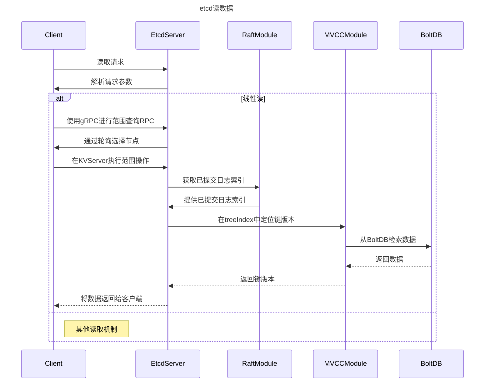

# etcd




etcd写数据：

1. 客户端发起请求： 客户端通过负载均衡算法选择一个etcd节点，发起gRPC调用。
2. Quota模块检查配额： 写请求首先经过配额（Quota）模块。如果当前数据库大小加上请求的键值大小超过了配额，会产生空间不足告警，拒绝写入，使集群变为只读状态。调整配额、取消告警、检查压缩配置等可以解决这个问题。
3. KVServer模块向Raft提交提案： 请求通过API层转发到KVServer模块的put方法，然后构建提案消息提交给Raft模块。
4. Raft模块广播提案： Leader收到提案后，广播给集群各个节点，同时将提案内容持久化到WAL（Write Ahead Log）日志文件，保证集群一致性和可恢复性。
5. Raft模块通知etcdserver模块已提交提案： 当大多数节点都持久化了此提案后，Raft模块通过通道告知etcdserver模块提案已被确认。
6. Apply模块执行提案内容： etcdserver模块从通道获取提案内容，添加到FIFO调度队列，并通过Apply模块按顺序异步执行提案内容。
7. MVCC模块执行put命令： Apply模块判断提案是否执行过，执行后进入MVCC模块。MVCC模块维护内存索引和boltdb，执行put命令并将信息保存到BoltDB。
8. BoltDB持久化数据： BoltDB会将数据持久化到磁盘，但未提交事务。etcd通过合并多个写事务请求并定时提交事务来提高性能，同时保持数据一致性。
9. Bucket Buffer保持一致性： 为保证数据一致性，etcd引入了Bucket Buffer机制，将未提交的事务数据暂存在Buffer中，在读取时优先从Buffer读取数据，然后再从BoltDB读取，以提升性能并保持数据一致性。

## 租约机制

client 和 etcd server 之间存在一个约定，内容是 etcd server 保证在约定的有效期内（TTL），不会删除关联到此 Lease 上的 key-value

若未在有效期内续租，那么 etcd server 就会删除 Lease 和其关联的 key-value

etcd 租约关联的 key 不仅会保存在内存中，而且在 MVCC 模块持久化时，也会将 lease 与 KV 关联

ttl 是 lease 的一个属性，如果 ttl 相同，就可以复用同一个 lease，这样可以有效减少更新 ttl 时，需要操作的数据数量

etcd 会根据 ttl 维护一个最小堆，每次轮询都会判断堆顶元素是否过期，过期就加入待淘汰列表，通知其他节点删除数据

## MVCC机制

etcd 使用 keyIndex 保存一个 key 的多个版本号

```go
type keyIndex struct {
   key         []byte
   modified    revision //最后一次修改key时的etcd版本号,比如我们案例中的刚写入hello为world1时的，版本号为2
   generations []generation //generation保存了一个key若干代版本号信息，每代中包含对key的多次修改的版本号列表
}
```

在查询更新时，是根据 key + revision 的方式，去找到对应的 value

## watch机制

etcd 利用 HTTP2 的流式推送，推送 key 的变更，通过将 watcher 划分为 synced/unsynced/victim 三类，将问题进行了分解，并通过多个后台异步循环 goroutine 负责不同场景下 key 变更的事件推送

同时在寻找 key 对应有哪些 watcher 时，其还通过区间树来加速查询

## 事务机制

etcd 可以支持对 key 的 CAS, 比较的对象支持 key 的 mod_revision、create_revision、version、value 值

## 压缩机制

压缩的本质是回收历史版本

- 周期性压缩：etcd 会异步的获取、记录过去一段时间的版本号，对不在这些版本号的数据进行压缩
- 版本号压缩：etcd 会定时获取当前 server 的最大版本号，减去用户想保留的历史版本数，对不再这些版本号的数据进行压缩

etcd 所要做的，就是真正删除掉已被标记删除的数据，同时根据版本号去删除数据
